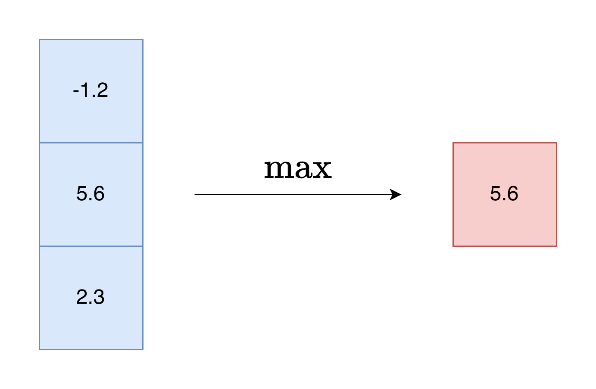
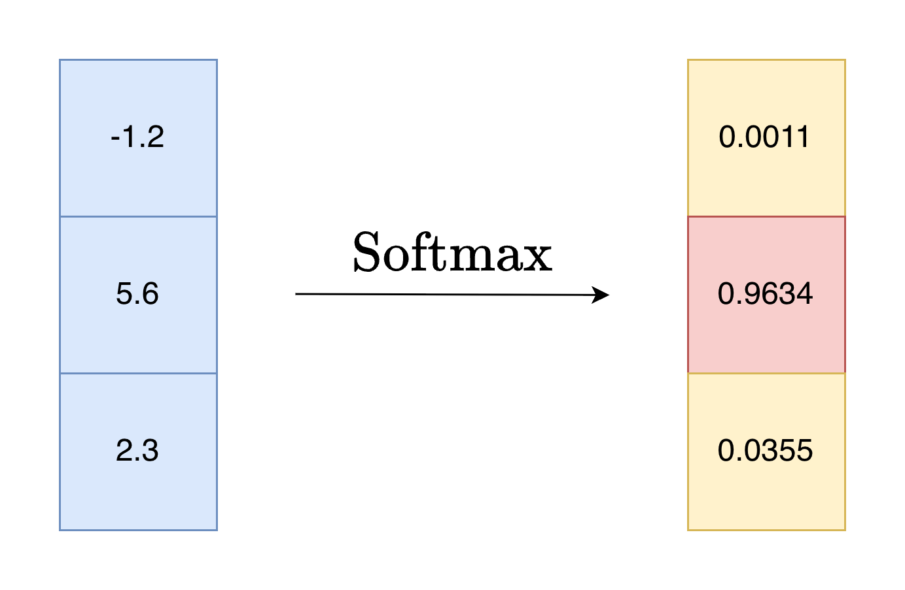

## 1. Softmax 函数

### 1.1 介绍
Softmax 是一种机器学习中常用的归一化函数。我们可以从它的名字来理解其含义。Softmax 和普通的 max 函数不同，它更加“软”，max 函数给出一组数据中唯一的最大值，而 Softmax 则会将向量归一化，归一化后的向量就可以视作一组**概率分布**，具有实际意义。Softmax 中的指数的性质使输入中越大的数值对应越大的概率，并拉开差距，让最大值显得更加突出。





### 1.2 定义
Softmax 函数的公式如下：

$$
\begin{aligned}
&\text{Softmax} : \mathbb{R}^n \to \mathbb{R}^n \\
&\text{Softmax}(\vec{x})_j = \frac{e^{x_j}}{\sum_i e^{x_i}}
\end{aligned}
$$

### 1.3 与 Sigmoid 函数的关系
我们都知道 $\text{Sigmoid}(x) = \frac{1}{1 + e^{-x}}$，实际上 Sigmoid 函数可以看作是二元版本的 Softmax：

$$
\text{Sigmoid}(x) = \text{Softmax}\left(\begin{bmatrix} x \\ 1 \end{bmatrix}\right)_1
$$

正确性可自行验证。反过来，Softmax 函数可以看作是扩展版本的 Sigmoid。

**二元 logistic 回归**用到了 Sigmoid 函数，相应地，**多元 logistic 回归**用到了 Softmax 函数。Softmax 函数在多分类任务中很重要。

### 1.4 计算
由于 Softmax 函数包含指数运算，因此分子和分母的数值可能很大，降低了数值稳定性。为了解决这个问题，可以将分子和分母同时除以 $e^D$，其中 $D$ 可以是 $\max(\vec{x})$。

$$
\text{Softmax}(\vec{x})_j = \frac{e^{x_j - D}}{\sum_i e^{x_i - D}}
$$

* 在 PyTorch 中，可以用 `torch.softmax` 计算 Softmax 函数。
* 机器学习中也经常用到对数的 Softmax 函数，可以使用 `torch.log_softmax` 来计算。

### 1.5 梯度
Softmax 函数的梯度为：

$$
\nabla\text{Softmax}(\vec{x}) = \text{diag}(\text{Softmax}(\vec{x})) - \text{Softmax}(\vec{x}) \cdot \text{Softmax}^T (\vec{x})
$$

**推导过程：**
由于 $\sum_k e^{x_k}$ 是分母，记为 $\text{de}$：

$$
\begin{aligned}
\frac{\partial \text{Softmax}(\vec{x})_j}{\partial x_i} 
&= \frac{\frac{\partial e^{x_j}}{\partial x_i}}{\text{de}} - \frac{e^{x_i}}{\text{de}} \cdot \frac{e^{x_j}}{\text{de}} \\
&= \frac{e^{x_i}[i = j]}{\text{de}} - \text{Softmax}(\vec{x})_i \cdot \text{Softmax}(\vec{x})_j 
\end{aligned}
$$

即可得原式（其中 $[i=j]$ 为克罗内克函数，当 $i=j$ 时为 1，否则为 0）。

## 2. 信息熵

### 2.1 公式
要理解交叉熵，首先需要理解信息熵。信息熵，也叫香农熵，其公式如下：

$$
\begin{aligned}
I(x_i) &= - \log_b P(x_i) \\
H(X) &= \sum_i P(x_i) I(x_i) =  - \sum_i  P(x_i) \log_b P(x_i)
\end{aligned}
$$

其中：
* $P(x_i)$ 是事件 $x_i$ 发生的概率；
* $I(x_i)$ 称作事件 $x_i$ 的信息量；
* 底数 $b$ 常取 $b=2$。

### 2.2 理解
信息熵可以通过多个角度理解：

1. **平均编码长度**：信息熵是任何编码的平均编码长度的理论极限。任何二进制编码的平均编码长度都至少为 $H(X)$。当我们用长度 $\log_2 \frac{1}{P(x_i)}$ 的编码来表示事件 $x_i$ 时，就可以取得这个极限。例如，$H(\frac{1}{2}, \frac{1}{4}, \frac{1}{4}) = 1.5$，当我们取三种事件的编码为 `(0, 10, 11)` 时，平均编码长度恰为 $\frac{1}{2} \times 1 + \frac{1}{4} \times 2 + \frac{1}{4} \times 2 = 1.5$。（此处可以联系**哈夫曼编码**理解）
2. **衡量不确定性**：信息熵越大，不确定性越大。$H(0, 1) = 0$，这个概率分布是确定的，不包含任何信息。当所有事件概率均匀分布时，信息熵最大 $H(\frac{1}{n}, \frac{1}{n}, ..., \frac{1}{n})$，因为此时不确定性最大。

## 3. 交叉熵

### 3.1 定义与理解
当我们观察真实分布 $P$，预测得到了一个可能错误的分布 $Q$，我们根据 $Q$ 来估计每一个事件的编码长度 $-\log_2 Q(x_i)$，此时的平均编码长度就是：

$$
H(P||Q) = - \sum_i P(x_i) \log_2 Q(x_i)
$$

这个编码长度一定满足 $H(P||Q) \ge H(P)$。当我们的预测与真实分布 $P$ 完全一致时，这个 $H(P||Q)$ 才能取得最小值。

### 3.2 应用
在机器学习中，交叉熵常用来作为损失函数，因为它满足当我们的输出与期望越接近，则 $H(P||Q)$ 越小。我们只需要求 $H(P||Q)$ 的梯度，就可以优化我们的模型。

### 3.3 梯度
为方便计算，此处取自然对数 $e$ 或者是 $\ln$（而非 $2$）为底。

$$
\begin{aligned}
\frac{\partial H(\vec{p}||\vec{q})}{\partial q_i} &= - \frac{\partial \sum_j p_j \log q_j}{\partial q_i} \\
&= - \frac{p_i}{q_i}
\end{aligned}
$$

则：

$$
\nabla H(\vec{p}||\vec{q}) = - \vec{p} \oslash \vec{q}
$$

其中 Hadamard division “$\oslash$” 表示对应元素相除。

## 4. 交叉熵损失函数

使用交叉熵函数需要满足 $\vec{q}$ 是一个概率分布，也就是 $\sum_i q_i = 1$。我们的机器学习模型的输出并不一定满足这一点，这时候就可以结合我们前面提到的 Softmax 函数进行归一化。结合二者，得出交叉熵损失函数 $L(\vec{x}, \vec{y})$。

$$
\begin{aligned}
L(\vec{x}) &= - \sum_i y_i \log \text{Softmax}(\vec{x})_i \\
&= \sum_i y_i (\text{LSE}(\vec{x}) - x_i) \\
&= \text{LSE}(\vec{x}) \left(\sum_i y_i\right) - \sum_i x_i y_i \\
&= \text{LSE}(\vec{x}) - \vec{x} \cdot \vec{y}
\end{aligned}
$$

其中 $\text{LSE}(\vec{x}) = \log \left(\sum_i e^{x_i}\right)$。这个函数叫做 **LogSumExp** 函数，比起直接计算指数和再求对数，很多框架提供了优化的 LSE 函数，拥有更快的速度、更高的数值稳定性等，如 PyTorch 提供的 `torch.logsumexp`。

### 4.1 梯度
计算 LSE 的梯度，发现刚好就是 Softmax 函数：

$$
\nabla \text{LSE}(\vec{x}) = \text{Softmax}(\vec{x})
$$

有了这个，再来计算交叉损失函数的梯度就很简单了：

$$
\begin{aligned}
\nabla L(\vec{x}) &= \nabla\text{LSE}(\vec{x}) - \vec{y} \\
&= \text{Softmax}(\vec{x}) - \vec{y}
\end{aligned}
$$

### 4.2 计算
在 PyTorch 中，可以使用 `torch.nn.functional.cross_entropy` 或 `torch.nn.CrossEntropyLoss` 来计算。

除了和我们的 $L$ 函数一致，用预测值 $\vec{x}$ 和期望分布 $\vec{y}$ 作为输入，也支持使用值为 $[0, C)$ 的整数标签（One-hot 索引）作为 $\vec{y}$ 的输入。

### 4.3 验证
可以用 PyTorch 来验证我们的计算是否正确：

```python
import torch
import torch.nn.functional as F

# 定义输入和目标
# 纠正注：原代码注释为 3个样本 5个类别，这里变更为 3个类别（单样本维度）
x = torch.randn(3, dtype=torch.float64, requires_grad=True)  
y = torch.randn(3, dtype=torch.float64).softmax(dim=0)  # 确保和为 1

loss = F.cross_entropy(x, y)
loss.backward()

print(x.grad)
print(x.softmax(dim=0) - y)
```

**运行结果：**

```txt
tensor([-0.0677, -0.3029,  0.3706], dtype=torch.float64)
tensor([-0.0677, -0.3029,  0.3706], dtype=torch.float64,
       grad_fn=<SubBackward0>)
```

## 5. 参考链接

- [知乎：Softmax 和交叉熵损失函数的梯度推导](https://zhuanlan.zhihu.com/p/105722023)