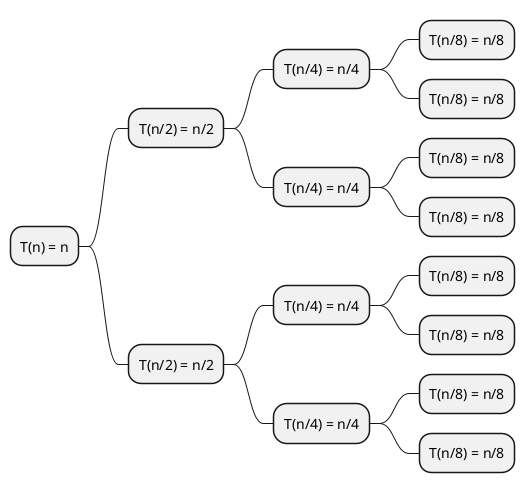
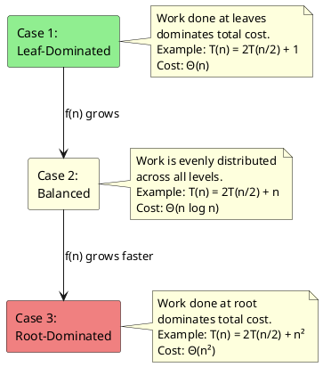
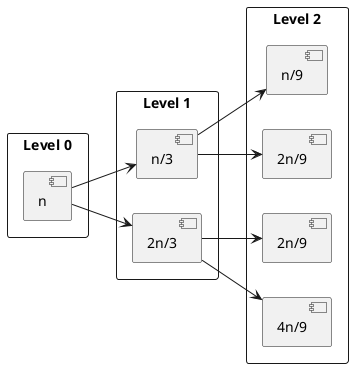

We often encounter divide-and-conquer algorithms. When analyzing their time complexity, we may face recurrences of the form:

$$
T(n) = aT\left(\frac{n}{b}\right) + f(n)
$$

The **Master Theorem** gives us a powerful tool to solve these recurrences mechanically. But rather than memorizing the formula, let's build intuition from the ground up.

## A Concrete Example

Let's start with the classic **Merge Sort** algorithm:
1. **Divide**: Split an array of $n$ elements into two halves ($\frac{n}{2}$ each)
2. **Conquer**: Recursively sort each half
3. **Combine**: Merge the two sorted halves in $O(n)$ time
The recurrence is:

$$
T(n) = 2T\left(\frac{n}{2}\right) + n
$$

with base case $T(1) = \Theta(1)$.

### Build The Recursion Tree By Hand

Let's expand this recurrence manually to see the pattern:

- Level 0: $T(n) = n + 2T\left(\frac{n}{2}\right)$
- Level 1: $2T\left(\frac{n}{2}\right) = 2\left[\frac{n}{2} + 2T\left(\frac{n}{4}\right)\right] = n + 4T\left(\frac{n}{4}\right)$
- Level 2: $4T\left(\frac{n}{4}\right) = 4\left[\frac{n}{4} + 2T\left(\frac{n}{8}\right)\right] = n + 8T\left(\frac{n}{8}\right)$

Continuing this pattern:

$$
T(n) = n + n + n + \cdots + 2^k T\left(\frac{n}{2^k}\right)
$$

The recursion stops when $\frac{n}{2^k} = 1$, i.e., $k = \log_2 n$.
At that level, we have $2^{\log_2 n} = n$ subproblems, each with cost $\Theta(1)$.

Total cost per level:

- Level 0: $n$
- Level 1: $2 \cdot \frac{n}{2} = n$
- Level 2: $4 \cdot \frac{n}{4} = n$
- ...
- Level $i$: $2^i \cdot \frac{n}{2^i} = n$
- ...
- Level $\log_2 n$: $n \cdot 1 = n$ (base case)

Total cost:

$$
T(n) = \underbrace{n + n + \cdots + n}_{\log_2 n + 1 \text{ levels}} = n(\log_2 n + 1) = \Theta(n \log n)
$$

This is the familiar complexity of merge sort!

## Generalizing the Pattern

Now let's generalize. Consider the recurrence:

$$
T(n) = aT\left(\frac{n}{b}\right) + f(n)
$$

where:
- $a \geq 1$ is the number of subproblems
- $b > 1$ is the factor by which problem size decreases
- $f(n)$ is the cost of dividing and combining

Building the Recursion Tree:

- Level 0: $f(n)$
- Level 1: $a \cdot f\left(\frac{n}{b}\right)$
- Level 2: $a^2 \cdot f\left(\frac{n}{b^2}\right)$
- Level $i$: $a^i \cdot f\left(\frac{n}{b^i}\right)$

The tree has depth $\log_b n$, and at the leaves we have $a^{\log_b n}$ subproblems of size $\Theta(1)$.

And $a^{\log_b n} = (b^{\log_b a})^{\log_b n} = b^{\log_b a \cdot \log_b n} = n^{\log_b a}$.

The total cost is:

$$
T(n) = \sum_{i=0}^{\log_b n - 1} a^i f\left(\frac{n}{b^i}\right) + \Theta(n^{\log_b a})
$$

The behavior depends on how $f(n)$ compares to $n^{\log_b a}$.

## The Master Theorem

**Master Theorem** Let $T(n) = aT(n/b) + f(n)$ where $a \geq 1$, $b > 1$, and $f(n)$ is asymptotically positive. Let $c = \log_b a$.

**Case 1:** If $f(n) = O(n^{c - \epsilon})$ for some $\epsilon > 0$, then $T(n) = \Theta(n^c) = \Theta(n^{\log_b a})$

**Case 2:** If $f(n) = \Theta(n^c)$, then $T(n) = \Theta(n^c \log n) = \Theta(n^{\log_b a} \log n)$

**Case 3:** If $f(n) = \Omega(n^{c + \epsilon})$ for some $\epsilon > 0$, and $af(n/b) \leq kf(n)$ for some $k < 1$ and sufficiently large $n$ (regularity condition), then $T(n) = \Theta(f(n))$

## Understanding the Cases

### Case 1: Leaf Dominated

Example: $T(n) = 4T(n/2) + n$

Here $a = 4$, $b = 2$, so $c = \log_2 4 = 2$.

We have $f(n) = n = O(n^{2 - \epsilon})$ for $\epsilon = 1$.

Verification by expansion:

$$
\begin{aligned}
T(n) &= n + 4 \cdot \frac{n}{2} + 16 \cdot \frac{n}{4} + \cdots + 4^{\log_2 n} \cdot \Theta(1) \\
&= n + 2n + 4n + \cdots + n^2 \cdot \Theta(1) \\
&= n(1 + 2 + 4 + \cdots + 2^{\log_2 n - 1}) + \Theta(n^2) \\
&= n \cdot \Theta(n) + \Theta(n^2) = \Theta(n^2)
\end{aligned}
$$

The leaves contribute $\Theta(n^2)$, which dominates the $\Theta(n)$ work at the root.

### Case 2: Balanced

Example: $T(n) = 4T(n/2) + n^2$

Here $c = 2$ and $f(n) = n^2 = \Theta(n^2)$.

Verification by expansion:

Level $i$ contributes: $4^i \cdot \left(\frac{n}{2^i}\right)^2 = 4^i \cdot \frac{n^2}{4^i} = n^2$

There are $\log_2 n$ levels, each contributing $n^2$.

$$
T(n) = \underbrace{n^2 + n^2 + \cdots + n^2}_{\log_2 n \text{ levels}} = \Theta(n^2 \log n)
$$

### Case 3: Root Dominated

Example: $T(n) = 4T(n/2) + n^3$
Here $c = 2$ and $f(n) = n^3 = \Omega(n^{2 + \epsilon})$ for $\epsilon = 1$.

Check regularity condition:

$$
af(n/b) = 4 \cdot \left(\frac{n}{2}\right)^3 = 4 \cdot \frac{n^3}{8} = \frac{n^3}{2} = \frac{1}{2}f(n)
$$

So $k = \frac{1}{2} < 1$, satisfying the condition.

Verification:
- Level 0: $n^3$
- Level 1: $4 \cdot (n/2)^3 = n^3/2$
- Level 2: $16 \cdot (n/4)^3 = n^3/4$

Total:

$$
T(n) = n^3 + \frac{n^3}{2} + \frac{n^3}{4} + \cdots = n^3 \sum_{i=0}^{\infty} \frac{1}{2^i} = 2n^3 = \Theta(n^3)
$$

The geometric series converges, so the root cost dominates.

## The Akra-Bazzi Method

The Master Theorem has limitations. It doesn't cover:

- Non-constant $a$ or $b$
- $f(n)$ with logarithmic factors
- Subtractions in the recurrence

### The Akra-Bazzi Theorem

Akra-Bazzi Theorem: Let $T(x)$ satisfy:

$$
T(x) = g(x) + \sum_{i=1}^{k} a_i T(b_i x + h_i(x))
$$

for $x \geq x_0$, where:

- $a_i > 0$ and $0 < b_i < 1$ are constants
- $|h_i(x)| = O(x / \log^2 x)$ (small perturbation)
- $g(x)$ is polynomially bounded

Let $p$ be the unique real number satisfying:

$$
\sum_{i=1}^{k} a_i b_i^p = 1
$$

Then:

$$
T(x) = \Theta\left(x^p \left(1 + \int_{1}^{x} \frac{g(u)}{u^{p+1}} du\right)\right)
$$

### Example: Strassen's Algorithm

Strassen's matrix multiplication:

$$
T(n) = 7T(n/2) + \Theta(n^2)
$$

By Master Theorem (Case 1): $c = \log_2 7 \approx 2.81$, $f(n) = O(n^{2.81 - 0.81})$.

$$
T(n) = \Theta(n^{\log_2 7}) \approx \Theta(n^{2.81})
$$

This beats the naive $O(n^3)$!

### Example: When Master Theorem Doesn't Apply

Consider:

$$
T(n) = 2T(n/2) + \frac{n}{\log n}
$$

Here $f(n) = n/\log n = o(n)$ but not $O(n^{1-\epsilon})$ for any $\epsilon > 0$.

Using Akra-Bazzi: $a_1 = 2$, $b_1 = 1/2$, so $2 \cdot (1/2)^p = 1$, giving $p = 1$.

$$
\int_{1}^{n} \frac{u/\log u}{u^2} du = \int_{1}^{n} \frac{1}{u \log u} du = \log\log n
$$
Therefore:

$$
T(n) = \Theta\left(n \left(1 + \log\log n\right)\right) = \Theta(n \log\log n)
$$

## Variations and Extensions

### Ceiling and Floor Functions
The Master Theorem applies to:

$$
T(n) = aT(\lceil n/b \rceil) + f(n)
$$

$$
T(n) = aT(\lfloor n/b \rfloor) + f(n)
$$

The asymptotic bounds remain unchanged because the ceiling/floor introduces only $O(1)$ perturbations.

### The Substitution Method (Verification)

Always verify your Master Theorem result using substitution.

Example: Verify $T(n) = 2T(n/2) + n = \Theta(n \log n)$.

Upper bound guess: $T(n) \leq cn \log n$

$$
\begin{aligned}
T(n) &= 2T(n/2) + n \leq 2 \cdot c \cdot \frac{n}{2} \cdot \log\frac{n}{2} + n \\
&= cn(\log n - 1) + n = cn \log n - cn + n \\
&\leq cn \log n \text{ for } c \geq 1
\end{aligned}
$$

Lower bound: Similar argument with $T(n) \geq cn \log n$.

### The Iteration Method

For complex recurrences, unrolling is often illuminating:

$$
T(n) = T(n/3) + T(2n/3) + n
$$

This splits unevenly, but the recursion tree has depth $\log_{3/2} n$, and each level sums to $n$.

At each level, the sum is $n$. The longest path is $n \to 2n/3 \to 4n/9 \to \cdots$ with depth $\log_{3/2} n$.

$$
T(n) = \Theta(n \log n)
$$

## Common Pitfalls

### The Gap Between Cases

**Does not apply:** $T(n) = 2T(n/2) + n \log n$

Here $f(n) = n \log n$ is not polynomially larger or smaller than $n^1$.

**Solution:** Use the recursion tree or Akra-Bazzi:

$$
T(n) = \Theta(n \log^2 n)
$$

### Forgetting the Regularity Condition

Case 3 requires $af(n/b) \leq kf(n)$ for $k < 1$.

**Example where Case 3 fails:**

$$
T(n) = 2T(n/2) + n(2 + \cos n)
$$

Here $f(n) = \Omega(n^{1+\epsilon})$ sometimes, but oscillates. The regularity condition fails because $\cos n$ doesn't allow a uniform $k < 1$.

### Non-constant $a$ or $b$

**Does not apply:** $T(n) = T(n/2) + T(n/4) + n$

The Master Theorem requires constant $a$ and $b$. Use Akra-Bazzi instead.

## Further Reading

- [Cormen, Leiserson, Rivest, Stein: *Introduction to Algorithms*, 3rd Edition, Chapter 4](https://www.cs.mcgill.ca/~akroit/math/compsci/Cormen%20Introduction%20to%20Algorithms.pdf)
- [Mohamad A. Akra and Louay Bazzi: "On the Solution of Linear Recurrence Equations" (1998)](https://api.semanticscholar.org/CorpusID:7110614)
- [Tom Leighton: *Notes on Better Master Theorems for Divide-and-Conquer Recurrences*](https://courses.csail.mit.edu/6.046/spring04/handouts/akrabazzi.pdf)