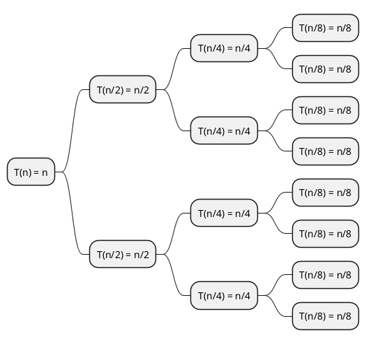
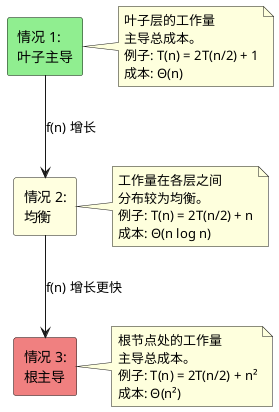
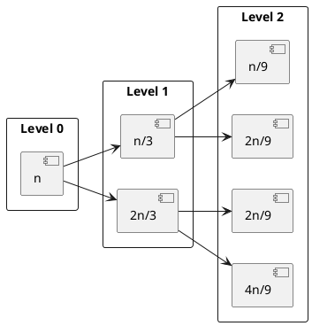

在分析分治算法的时间复杂度时，我们常常会碰到如下形式的递推式：

$$
T(n) = aT\left(\frac{n}{b}\right) + f(n)
$$

**主定理（Master Theorem）** 为我们提供了一个强大的工具，可以机械化地求解这类递推式。不过，与其死记公式，不如从头建立起直觉。

## 一个具体例子

我们先从经典的 **归并排序（Merge Sort）** 开始：
1. **分解（Divide）**：把一个包含 $n$ 个元素的数组分成两半（每半都是 $\frac{n}{2}$）
2. **解决（Conquer）**：递归地排序左右两半
3. **合并（Combine）**：用 $O(n)$ 的时间将两个有序数组合并
递推式为：

$$
T(n) = 2T\left(\frac{n}{2}\right) + n
$$

其基本情形为 $T(1) = \Theta(1)$。

### 手动展开递归树

我们手动展开这个递推式，观察其中的规律：

- 第 0 层：$T(n) = n + 2T\left(\frac{n}{2}\right)$
- 第 1 层：$2T\left(\frac{n}{2}\right) = 2\left[\frac{n}{2} + 2T\left(\frac{n}{4}\right)\right] = n + 4T\left(\frac{n}{4}\right)$
- 第 2 层：$4T\left(\frac{n}{4}\right) = 4\left[\frac{n}{4} + 2T\left(\frac{n}{8}\right)\right] = n + 8T\left(\frac{n}{8}\right)$

继续这样展开下去：

$$
T(n) = n + n + n + \cdots + 2^k T\left(\frac{n}{2^k}\right)
$$

当 $\frac{n}{2^k} = 1$ 时，递归停止，也就是 $k = \log_2 n$。
在这一层，我们有 $2^{\log_2 n} = n$ 个子问题，每个子问题的代价都是 $\Theta(1)$。

每一层的总代价：

- 第 0 层：$n$
- 第 1 层：$2 \cdot \frac{n}{2} = n$
- 第 2 层：$4 \cdot \frac{n}{4} = n$
- ...
- 第 $i$ 层：$2^i \cdot \frac{n}{2^i} = n$
- ...
- 第 $\log_2 n$ 层：$n \cdot 1 = n$（基本情形）

总成本为：

$$
T(n) = \underbrace{n + n + \cdots + n}_{\log_2 n + 1 \text{ 层}} = n(\log_2 n + 1) = \Theta(n \log n)
$$

这就是我们熟悉的归并排序复杂度。

## 推广这个规律

现在我们把它推广。考虑如下递推式：

$$
T(n) = aT\left(\frac{n}{b}\right) + f(n)
$$

其中：
- $a \geq 1$ 表示子问题的个数
- $b > 1$ 表示问题规模缩小的倍数
- $f(n)$ 表示分解与合并的代价

构造递归树：

- 第 0 层：$f(n)$
- 第 1 层：$a \cdot f\left(\frac{n}{b}\right)$
- 第 2 层：$a^2 \cdot f\left(\frac{n}{b^2}\right)$
- 第 $i$ 层：$a^i \cdot f\left(\frac{n}{b^i}\right)$

这棵树的深度是 $\log_b n$，在叶子层我们有 $a^{\log_b n}$ 个规模为 $\Theta(1)$ 的子问题。

而且：$a^{\log_b n} = (b^{\log_b a})^{\log_b n} = b^{\log_b a \cdot \log_b n} = n^{\log_b a}$。

总成本为：

$$
T(n) = \sum_{i=0}^{\log_b n - 1} a^i f\left(\frac{n}{b^i}\right) + \Theta(n^{\log_b a})
$$

$T(n)$ 的渐近行为取决于 $f(n)$ 与 $n^{\log_b a}$ 的比较关系。

## 主定理

**主定理（Master Theorem）**：设 $T(n) = aT(n/b) + f(n)$，其中 $a \geq 1$，$b > 1$，并且 $f(n)$ 渐近为正。令 $c = \log_b a$。

**情况 1：** 如果 $f(n) = O(n^{c - \epsilon})$，其中某个 $\epsilon > 0$，那么 $T(n) = \Theta(n^c) = \Theta(n^{\log_b a})$

**情况 2：** 如果 $f(n) = \Theta(n^c)$，那么 $T(n) = \Theta(n^c \log n) = \Theta(n^{\log_b a} \log n)$

**情况 3：** 如果 $f(n) = \Omega(n^{c + \epsilon})$，其中某个 $\epsilon > 0$，并且对充分大的 $n$ 有 $af(n/b) \leq kf(n)$，其中 $k < 1$（正规性条件），那么 $T(n) = \Theta(f(n))$

## 理解这三种情况

### 情况 1：叶子主导

例子：$T(n) = 4T(n/2) + n$

这里 $a = 4$，$b = 2$，因此 $c = \log_2 4 = 2$。

我们有 $f(n) = n = O(n^{2 - \epsilon})$，其中 $\epsilon = 1$。

展开验证：

$$
\begin{aligned}
T(n) &= n + 4 \cdot \frac{n}{2} + 16 \cdot \frac{n}{4} + \cdots + 4^{\log_2 n} \cdot \Theta(1) \\
&= n + 2n + 4n + \cdots + n^2 \cdot \Theta(1) \\
&= n(1 + 2 + 4 + \cdots + 2^{\log_2 n - 1}) + \Theta(n^2) \\
&= n \cdot \Theta(n) + \Theta(n^2) = \Theta(n^2)
\end{aligned}
$$

叶子层贡献了 $\Theta(n^2)$，它压过了根节点处的 $\Theta(n)$ 工作量。

### 情况 2：均衡

例子：$T(n) = 4T(n/2) + n^2$

这里 $c = 2$，并且 $f(n) = n^2 = \Theta(n^2)$。

展开验证：

第 $i$ 层的贡献为：$4^i \cdot \left(\frac{n}{2^i}\right)^2 = 4^i \cdot \frac{n^2}{4^i} = n^2$

一共有 $\log_2 n$ 层，每层都贡献 $n^2$。

$$
T(n) = \underbrace{n^2 + n^2 + \cdots + n^2}_{\log_2 n \text{ 层}} = \Theta(n^2 \log n)
$$

### 情况 3：根主导

例子：$T(n) = 4T(n/2) + n^3$
这里 $c = 2$，并且 $f(n) = n^3 = \Omega(n^{2 + \epsilon})$，其中 $\epsilon = 1$。

检查正规性条件：

$$
af(n/b) = 4 \cdot \left(\frac{n}{2}\right)^3 = 4 \cdot \frac{n^3}{8} = \frac{n^3}{2} = \frac{1}{2}f(n)
$$

因此 $k = \frac{1}{2} < 1$，满足条件。

验证：
- 第 0 层：$n^3$
- 第 1 层：$4 \cdot (n/2)^3 = n^3/2$
- 第 2 层：$16 \cdot (n/4)^3 = n^3/4$

总和：

$$
T(n) = n^3 + \frac{n^3}{2} + \frac{n^3}{4} + \cdots = n^3 \sum_{i=0}^{\infty} \frac{1}{2^i} = 2n^3 = \Theta(n^3)
$$

因为这是一个收敛的几何级数，所以根节点的成本占主导。

## Akra-Bazzi 方法

主定理是有局限的。它不能用于以下情况：

- 非常数的 $a$ 或 $b$
- 带对数因子的 $f(n)$
- 递推式中存在减法

### Akra-Bazzi 定理

Akra-Bazzi 定理：设 $T(x)$ 满足：

$$
T(x) = g(x) + \sum_{i=1}^{k} a_i T(b_i x + h_i(x))
$$

对于 $x \geq x_0$，其中：

- $a_i > 0$ 且 $0 < b_i < 1$ 是常数
- $|h_i(x)| = O(x / \log^2 x)$（小扰动项）
- $g(x)$ 是多项式有界的

令 $p$ 是满足下式的唯一实数：

$$
\sum_{i=1}^{k} a_i b_i^p = 1
$$

那么：

$$
T(x) = \Theta\left(x^p \left(1 + \int_{1}^{x} \frac{g(u)}{u^{p+1}} du\right)\right)
$$

### 例子：Strassen 算法

Strassen 矩阵乘法的递推式为：

$$
T(n) = 7T(n/2) + \Theta(n^2)
$$

根据主定理（情况 1）：$c = \log_2 7 \approx 2.81$，并且 $f(n) = O(n^{2.81 - 0.81})$。

$$
T(n) = \Theta(n^{\log_2 7}) \approx \Theta(n^{2.81})
$$

这比朴素的 $O(n^3)$ 更快！

### 例子：主定理不适用时

考虑：

$$
T(n) = 2T(n/2) + \frac{n}{\log n}
$$

这里 $f(n) = n/\log n = o(n)$，但对任意 $\epsilon > 0$，它都不是 $O(n^{1-\epsilon})$。

使用 Akra-Bazzi：$a_1 = 2$，$b_1 = 1/2$，因此 $2 \cdot (1/2)^p = 1$，解得 $p = 1$。

$$
\int_{1}^{n} \frac{u/\log u}{u^2} du = \int_{1}^{n} \frac{1}{u \log u} du = \log\log n
$$
因此：

$$
T(n) = \Theta\left(n \left(1 + \log\log n\right)\right) = \Theta(n \log\log n)
$$

## 变体与扩展

### 上取整与下取整
主定理同样适用于：

$$
T(n) = aT(\lceil n/b \rceil) + f(n)
$$

$$
T(n) = aT(\lfloor n/b \rfloor) + f(n)
$$

渐近界不会改变，因为上取整 / 下取整只会引入 $O(1)$ 的扰动。

### 代入法验证

请务必用代入法验证你的主定理结论。

例子：验证 $T(n) = 2T(n/2) + n = \Theta(n \log n)$。

上界猜测：$T(n) \leq cn \log n$

$$
\begin{aligned}
T(n) &= 2T(n/2) + n \leq 2 \cdot c \cdot \frac{n}{2} \cdot \log\frac{n}{2} + n \\
&= cn(\log n - 1) + n = cn \log n - cn + n \\
&\leq cn \log n \text{，当 } c \geq 1
\end{aligned}
$$

下界同理，可以证明 $T(n) \geq cn \log n$。

### 迭代法

对于复杂的递推式，手动展开往往非常有启发性：

$$
T(n) = T(n/3) + T(2n/3) + n
$$

虽然它是不均匀划分，但递归树的深度是 $\log_{3/2} n$，而每一层的和都是 $n$。

每一层的总和都是 $n$。最长路径为 $n \to 2n/3 \to 4n/9 \to \cdots$，其深度是 $\log_{3/2} n$。

$$
T(n) = \Theta(n \log n)
$$

## 常见陷阱

### 两种情况之间的“空隙”

**不适用：** $T(n) = 2T(n/2) + n \log n$

这里的 $f(n) = n \log n$ 既不比 $n^1$ 多一个多项式量级，也不比它少一个多项式量级。

**解决办法：** 使用递归树或 Akra-Bazzi：

$$
T(n) = \Theta(n \log^2 n)
$$

### 忘记正规性条件

情况 3 要求 $af(n/b) \leq kf(n)$，其中 $k < 1$。

**一个情况 3 失效的例子：**

$$
T(n) = 2T(n/2) + n(2 + \cos n)
$$

这里的 $f(n) = \Omega(n^{1+\epsilon})$ 在某些时候成立，但它会振荡。由于 $\cos n$ 的存在，我们无法找到一个统一的 $k < 1$，因此正规性条件失效。

### 非常数的 $a$ 或 $b$

**不适用：** $T(n) = T(n/2) + T(n/4) + n$

主定理要求 $a$ 和 $b$ 都是常数，此时应使用 Akra-Bazzi。

## 延伸阅读

- [Cormen, Leiserson, Rivest, Stein: *Introduction to Algorithms*, 3rd Edition, Chapter 4](https://www.cs.mcgill.ca/~akroit/math/compsci/Cormen%20Introduction%20to%20Algorithms.pdf)
- [Mohamad A. Akra and Louay Bazzi: "On the Solution of Linear Recurrence Equations" (1998)](https://api.semanticscholar.org/CorpusID:7110614)
- [Tom Leighton: *Notes on Better Master Theorems for Divide-and-Conquer Recurrences*](https://courses.csail.mit.edu/6.046/spring04/handouts/akrabazzi.pdf)
