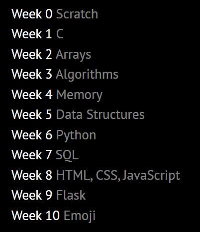
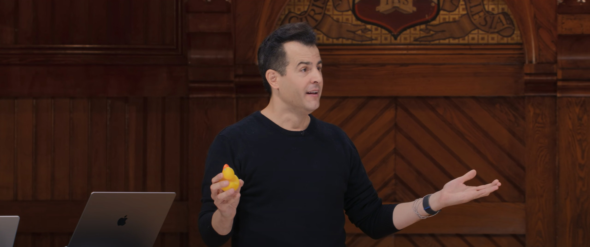
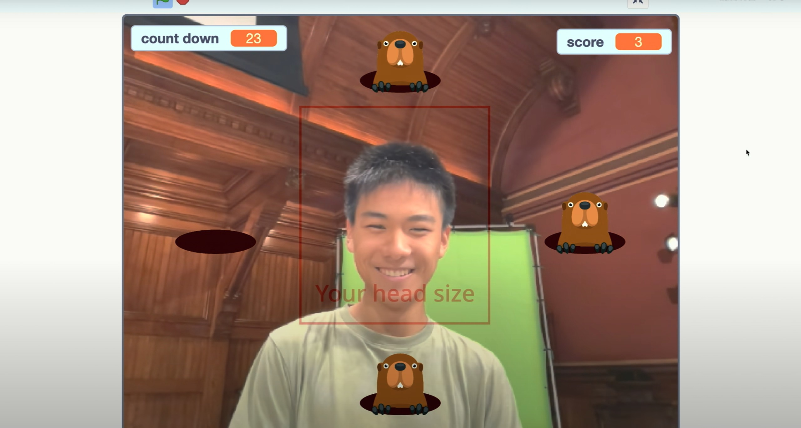
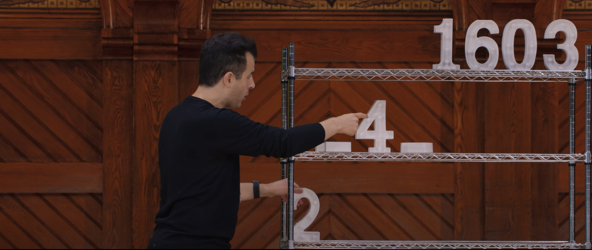
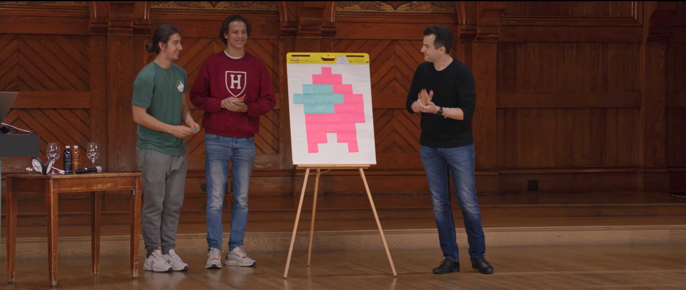
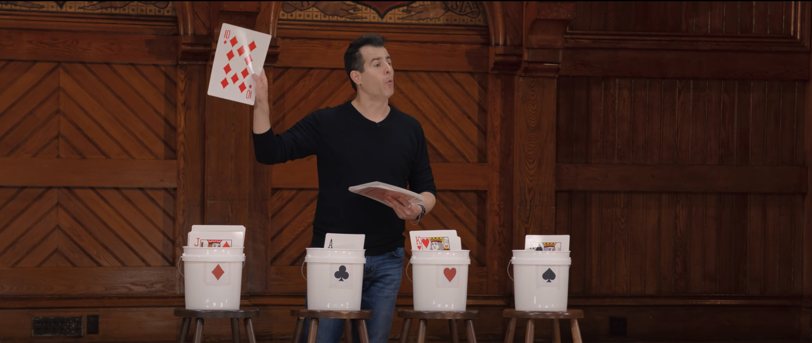
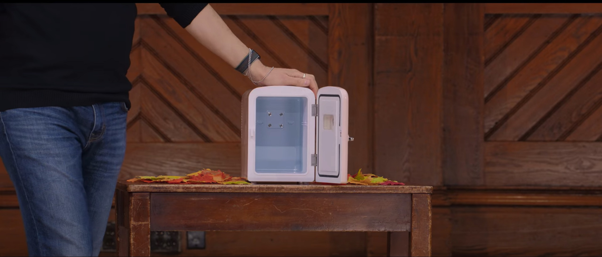
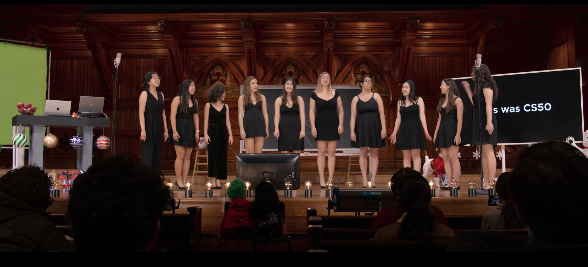

## 推荐

[CS50](https://cs50.harvard.edu/x/2023/)真的是非常好的一门计算机入门课程，由哈佛大学David J. Malan教授主讲，面向0基础的计算机科学学习者。

难能可贵的是，这门课并不因为简单就牺牲专业性。这并不是一门水课，从算法、数据结构到html、css、js，再到web开发框架flask，如果要通过每周的课程就学会显然是不可能的，还需要大量的课后练习，每一个 Lecture 都配套相应的作业，有些作业难度不低。

不过，这门课程很多内容都只是一个入门的引导，而不是一个完整的教程，但是正如David教授所说的那样，他不是要教你一种编程语言，他要教你 **计算机科学** ，让你能够学会任何一门编程语言，让你有能力追逐最新的技术潮流。

## 学习心得

CS50 这门课程主要面向入门学习者和转码人，而我并不是零基础的学习者，这门课的大部分话题我都已经接触过了，但我依然收获颇丰：

1. 看无字幕的 Lecture 视频练习了英语听力。
2. 通过生动的演示和实操让我对知识有了更深入的掌握。
3. 获得了很多乐趣，David 教授是一个能把课上得比看电影还有意思的教授。
4. 让我意识到国内外 CS 教育仍有差距，以后将会更多地学习国外大学的公开课。

非常羡慕Harvard这样的世界名校提供的资源，这门课有丰富的教具，还有很多在线工具：[CS50的答疑AI](https://cs50.ai/)、[CS50的在线开发环境“cs50.dev“](https://cs50.dev/)、单元测试工具check50、码风检查工具style50。希望国内的大学有朝一日也能在教学上与之媲美吧。

## 图片预览

