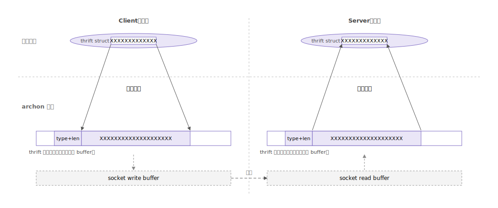
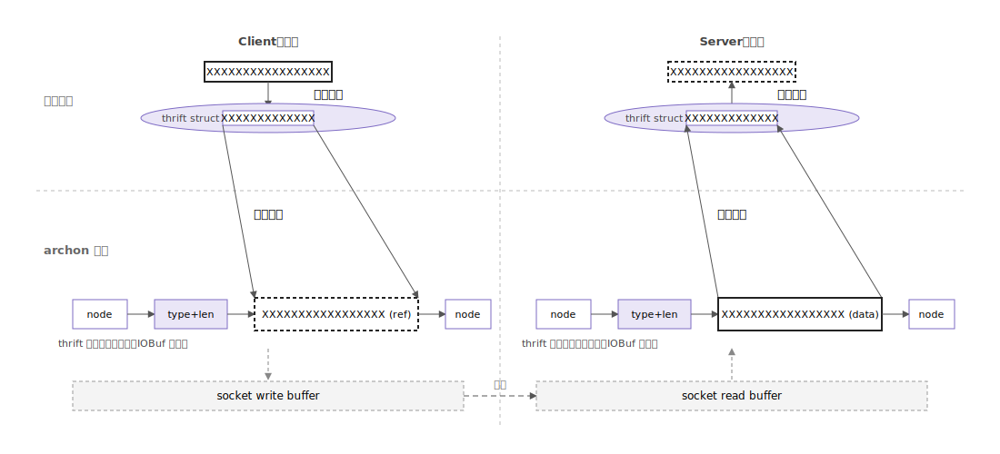

2 月那会儿，我同时拿到了字节和另一家百亿私募的实习 Offer。尽管另一家给得更多（1000/day），我还是选了字节，其实没有什么特别的理由，就是如果又去量化私募的话，基本上发展的方向就定了，而我还对互联网行业感兴趣，想试试，宇宙厂就是最好的选择，后来发现节子的人才密度确实也很高，成长斜率也很大。

我加入了data-arch 团队，team 主要负责“推荐系统架构与服务治理”。这篇文章整理一下我在字节的 takeaways。

## 什么是“推荐系统架构与服务治理”

我主要负责字节内部广泛使用的高性能 RPC 和服务治理框架 Archon 的开发与维护。

### 推荐系统

所谓“推荐系统”，以抖音/TikTok 为例，简单来说就是为全球用户，从一个不断变化、数以亿计的内容池里，**实时地**挑选出可能感兴趣的视频并呈现。

推荐系统主要分成两个部分在运作，online 和 offline：

- **Online**：处理用户的**实时**请求，是一个**漏斗式**的多层排序过程，从海量视频中召回、筛选、排序，最终呈现给用户，处处需要在 **效率** 与 **效果** 之间做 trade-off。
- **Offline**：离线处理海量的用户行为数据和视频内容数据，为 online 系统做准备，完成 **特征（Feature）的生产与加工、模型（Model）的训练与迭代、候选（Candidate）的生成和索引**。需要考虑 scalability 和 precision。

主要的组件：

- **混排引擎**：从推荐引擎和广告引擎拿结果做混合排序，得到一个带有视频和广告的最终列表。这并不是简单的穿插，而是基于一个复杂的竞价逻辑排序。
- **推荐引擎**：经历多层漏斗式的召回和排序。
  - **L0 从亿到万的召回**：主要是模型化召回，通过模型学习用户和视频的 embedding 表示，再用最近邻搜索算法（如 HNSW）快速找到与当前用户向量匹配的 Top-K 个视频。也支持倒排索引召回，根据视频的标签、地点、创作者等召回。还支持规则化召回，例如好友发布的视频。
  - **L1 从万到千的粗排**：加入用户的部分行为序列特征（如最近点赞的视频）做初步打分。
  - **L2 从千到百的精排**：对千级数据做最精准、最复杂的排序，选出几十个结果。用深度神经网络融合数百上千的 feature 进行打分，使用全量特征，包括用户长期行为历史、视频深度内容理解等。
- **广告引擎**：支持品牌曝光等多种营销场景，具备广告活动分析、智能优化等功能。广告推荐原理与推荐系统相似，也包含 Recall、Pre-rank、Rank、Rerank 等步骤。

一个有意思的视角：把整个推荐链路看成一个“信息漏斗”，每一层的目标都不是“找出最好的”，而是“以更低的代价，过滤掉绝大部分不可能的”。L0 的目标不是 precision，而是 recall & cheap；L2 才追求 precision。

### 服务治理

服务治理是在微服务架构中确保服务可靠、安全、可观测、可管理的一系列实践和工具。字节数以亿计的用户规模、多样的业务线、快速迭代的业务需求，决定了字节使用微服务架构是其必然选择。微服务架构将单一应用程序拆分成一组小型的、自治的服务，可独立部署、扩展、升级，但引入了新的问题，对系统架构带来了更高的要求。

1. 服务实例动态扩缩容，那么如何知道服务的位置？这就需要 **服务注册**（如 Consul），新服务启动时自动注册到注册中心，消费方需要调用服务时再通过 **服务发现** 从注册中心查询可用的实例。
2. 服务可能发生故障，需要防止调用方将请求传递给已经死掉的实例，这就需要 **健康检查** 对实例进行探活，注册中心只返回健康的实例。
3. 即使实例本身是健康的，也可能因为突发流量而过载。此时 **熔断** 机制可以检测到下游服务异常，调用方快速失败，防止过载，给服务一定的恢复时间。也可以开启 **出流量限流**，防止过高的负载把下游打挂。与之相对的，下游实例也可以主动进行 **入流量限流**，当入口流量过高，主动丢弃一些流量，以换取自身的健康和其他请求的正常。
4. 微服务架构依赖网络通信，而网络通信存在波动。如果请求没有在预期时间内返回，调用方需要设置合适的 **超时**，避免无限等待，还可以在超时后进行 **重试**，但是过多过频繁的重试又可能导致下游被打挂——这需要在可靠性和安全性之间做权衡。
5. 微服务通常部署多实例以实现高可用和水平扩展，那么一个服务的多个实例都能处理请求时，如何决定将请求发给哪一个？这就是 **负载均衡**。负载均衡算法很多，需要在均匀分流、会话保持、长尾延迟优化里做权衡。
6. 当服务需要升级时，为了避免新版本引入的故障影响所有用户，我们需要 **灰度发布** 进行缓慢切流，渐进式升级，同时利用 **可观测性** 基础设施观察各项指标，一旦新版本出问题，可以立即回退到旧版本，验证稳定后再逐步扩大范围。
7. 服务间的通信治理逻辑如果都嵌入业务代码中，会导致业务与治理逻辑耦合，不同语言栈还要各自实现一遍。如何把这些能力从业务中剥离出来？这就需要 **服务网格**（Service Mesh），以 Sidecar 代理的方式拦截所有进出流量，将服务治理能力下沉到基础设施层，业务代码只需关注业务逻辑，治理策略由控制面统一下发。

我觉得服务治理本质上是在解决一个问题：当系统规模大到任何单点都不可信、任何调用都会失败时，如何让整体仍然 work？ ，就是让整个系统有最大的容错空间，理解这一点之后，再回头看那些治理机制，就会发现它们其实都是在围绕“失败”这件事做文章。

## 成果与成长

### Data Driven 的做事风格

字节是做推荐起家的，其支柱产品如抖音、今日头条均依赖个性化算法，这种业务性质要求公司对数据极其敏感，也造就了字节 Data Driven 的做事风格。相比其他大厂，字节更看重 A/B 测试、量化产出。例如我们团队经常会通过实验来验证某个优化对延迟和内存的影响，再决定是否要把这个优化推广到全量。

对我个人来说，这种风格的影响很大。我认为不仅在工作中，在其他方面的决策也应该更关注数据、分析数据，而不是被互联网或周围人的几句没有支撑的话影响自己的决策。例如买房还是租房的问题，我会去看我做理财的收益，租售比，首付比例，无风险利率，租房的违约成本，搬家成本，计算 NPV。例如某种健身方法有没有效果，我会各尝试一段时间，做个看看哪个对我肌肉围度的增长快，而不是靠脑子想。 

### 多沟通

很多技术问题，一个人闷头想半天没头绪，但和熟悉这部分代码的同事聊 5 分钟就解开了。

举个例子，我之前在优化 IDL 序列化的时候，怀疑粘包场景下会不会有问题，但不知道怎么测。在群里问了一下，结果同事之前刚好修过一个粘包 bug，直接给了我现成的测试方法，问题瞬间解决。

还有一次更让我印象深刻：业务反馈某个错误码增多，mentor 把组里的人都拉去看。简化一下背景：长连接复用时，socket 创建时会设置一个关闭回调，回调里要把它从所在的连接池 A 里移除；后来引入了“失败时换池重试”的机制，socket 中途会被迁移到另一个池 B，但关闭回调里持有的还是创建时绑定的池 A 引用——结果删除时删错了池，B 里残留了一些再也清不掉的死 socket。

这段逻辑其实并不是发现问题的同事写的，但他不是当事人也不是 mentor，只是顺手看了一眼，就把这个 BUG 指了出来。每个人脑子里都装着一些没写进文档的隐性知识、还有一套自己看代码的 pattern；同一段代码在不同人眼里能看出完全不同的东西。一个人闷头想半天看不出的问题，换一个视角往往就秒解。所以我就觉得，遇到无法解决的问题，**先把它广播出去**，总比自己看一下午高效。之前我总是觉得在群里问代码问题会很蠢，都是自己想或者私聊问，现在我觉得遇到问题不懂的寻求外援才更蠢。

> 提一个有意思的，这个问题其实发生概率很低，影响也很小，大部分业务没有发现，本来还能偷偷改掉，但是如果某个业务发现了，就会随手在群里问其他业务这个错误码有没有增加，结果大家都发现了，出现“人传人”现象。

### 如何保持高效

1. 制定明确的 DDL：而且是自己给自己定的。如果一直把一件事定在“稍后再做”就会一直拖延，定在“本周四中午 12:00 之前完成”就会有一种紧迫感。
2. 善用 AI：AI 工具可以极大提效，字节内部有很多仅供内部使用的 AI 工具，在这方面字节还是非常领先的。
3. 多和同事同步：理由见上一节。

## 技术沉淀

### 阅读大型代码的方法

Archon 是一个 17 万行 C++ 代码的巨型仓库，刚进组的时候，光是把代码拉下来 build 一遍就够头疼。读这种代码和读自己写的小项目完全不是一回事，我总结了几条心得：

1. 从作用入手，先理清每个主要类的功能。不要一开始就钻进具体的实现，要先在脑子里建立一张“地图”。
2. 理清类与类之间的关系：谁持有谁、谁调用谁、谁的生命周期更长。
3. 善用动态调试，特别是 gdb。比看源码效率高得多，Archon 代码里面有很多虚函数、模版、callback，容易人眼看半天分析不出来执行流，但是 gdb backtrace 一下就可以看到调用栈了。
4. 重点关注执行流或数据流越过边界的位置：
   - 执行流断开：如 callback、EventLoop、Listener 这种。
   - 数据流断开：如 queue、Dispatcher、I/O 这种。
5. 不理解代码原始意图，就不要修改它。代码仓库里有大量“看起来没必要的代码”，但是实际上有业务依赖这个奇妙的特性，所以我养成了习惯：
   - 在飞书里搜对应的设计文档；
   - 用 `git blame` + `git log` 找到引入这段代码的 commit，看 commit message 和当时的 PR 描述；
   - 去问写这段代码的人（如果还在）。

### OptimizedServer IDL Zero Copy 优化

#### 背景

Archon 框架使用 thrift IDL 定义 RPC 接口，然后通过 archon-gen 生成 client 和 server 的 C++ 代码。

我们支持在 IDL 中定义 binary 类型，客户端可以把裸二进制的指针直接放进 struct，经过 thrift 序列化后存入 write buffer，通过网络发到服务端；服务端的 read buffer 里就有一块区域储存这个二进制 `type | len | data`，RPC 框架反序列化为 struct，传递给 server handler。

这里的拷贝是写读各一次：客户端把二进制指针放入 struct 之后，序列化时需要将巨大的二进制序列完整拷贝到 write buffer 里。

> 为什么不能让用户提前分配 buffer 直接写入？ 理论上可以，但这个特性的核心就是允许用户把业务里已有的 binary 直接塞进 rsp struct，提前分配会导致用户业务代码大改。另外提前分配难以估计序列化前后需要多少空间，还要考虑多个 binary 的情况——在实现复杂度、易用性和兼容性上都会差很多。

零拷贝优化具体可以指很多东西，例如 mmap 内存映射、`MSG_ZEROCOPY`、buffer 复用等等，我这里做的优化主要是后面两种。

#### 优化方案

不能做指针拷贝的根本原因在于 write buffer 是连续内存，要传递指针必须改成 linked list of buffers，也就是用 `folly::IOBuf` 代替原本的 `(ptr, len)`。这个改动工作量虽然大，但是效果好，并且利于后续进一步优化工作的开展。

原本用的是 thrift 提供的 `MemoryBuffer`，我写了一个 `MemoryIOBuf`，内部使用 `folly::IOBuf` 代替连续 buffer，然后基于此修改 `TConnection` 的逻辑。

顺手做的其他优化：

1. 原实现中，write buffer 和 read buffer 一样在连接建立时分配，导致连接建立慢，还会影响 oneway 请求的总延迟。我把它改成了：连接建立时只分配 read buffer，调用 handler 之前才分配 write buffer。为了实现这个优化，把原来的 `MemoryIOBuf` 拆成 reader 和 writer 两个实现，这样两边的逻辑可以不同。
2. 给 read buffer 的初始化大小加了一个可配置选项。之前固定 1K 然后动态扩容，由于部分业务对延迟敏感而对内存使用不敏感，加了一个 flag，让这类业务直接调到 2M 即可，避免扩容带来的延迟抖动。

#### 测试与验证

1. **零拷贝验证**：为了防止过长链路中间疏忽引入拷贝，我用日志打印了入站 IOBuf 的每一个节点、handler request 中的 binary、handler response 中的 binary、出站 IOBuf 的每一个节点的地址范围，比对 binary 的地址被包含在 IOBuf 中，确认中间没有多余拷贝。
2. **端到端验证**：公司内部的 RPC 框架有多种协议，还有小包/中包/大包多种情况，还需要兼容 UStack（用户态协议栈）。我先写了个脚本，遍历 `(theader, ttheader, tframed) × (1K, 1M, 10M) × QPS` 自动本机测试，没出现错误。然后由于开发机环境不支持 UStack，需要申请 UStack 测试机做端到端测试，UStack 测试机不支持本机回环，必须两机对打——ssh 到两台机器上手动遍历参数太烦了。于是我让大模型用 expect 写了个自动化脚本，跑通后我自己再调了一下。这个脚本后面也沉淀到团队文档里，给其他特性分支与 UStack 的兼容性测试用。
3. **线上引流测试**：用线上的 `index_service` 单 pod 替换二进制到新版本进行引流测试，结果是 延迟降低 4%、内存降低 2%。

#### 遇到的困难

1. Review：代码经过了多轮 review。其中有一个接口 `clearAndTryReuseLargestBuffer` 只在 folly22 存在，folly18 上没有。一开始我加了一个宏，不支持就 fallback 到 `clear`，但 mentor 担心这个对性能仍有影响，于是我手写了一个 folly18 下的 polyfill。
2. Revert：代码上线几个小时内，由于被发现一个 borrow 的语义写错了，代码进行了回滚。后来检查发现这个 borrow 实际上没有用到，但仍然被告知再仔细审一遍代码再上线。

### RDMA 接口对齐

某线上业务由于内存不足，主动调用 `setThreadStackSize()` 调小了线程栈空间。后面 Archon 引入 RDMA（远程直接内存访问，一种高性能网络技术），业务启用后发现爆内存。

排查后发现：RDMA 服务器是在 `enable_rdma()` 接口调用时立即创建的，因此 `setThreadStackSize()` 调用时 RDMA 服务器已经创建，设置线程栈大小的配置根本应用不到 RDMA 服务器上。而且诸多其他接口在 RDMA 模式下都不可用。

解决方案：

1. **延迟化 RDMA 服务器初始化**：在 `enable_rdma()` 调用时只记录一个 enable 配置项，实际的 RDMA 初始化推迟到 `serve()` 命令真正调用时。
2. **增加 `RdmaServerOptions` 选项**：用来统一 RDMA 配置，将 RDMA 模式下可用的配置与 TCP 模式对齐，不可用的配置在文档中说明。

## 写在最后

感谢 mentor、感谢同组的同事，感谢这段时间所有给我 review 过代码、被我打扰过的人，感谢 ZJUers@bytedance 群的所有人。Archon 的代码我可能再也不会碰了，但它教我看代码的方式会留很久。（我在 Archon 代码里面拉的 shi 也会留很久）

