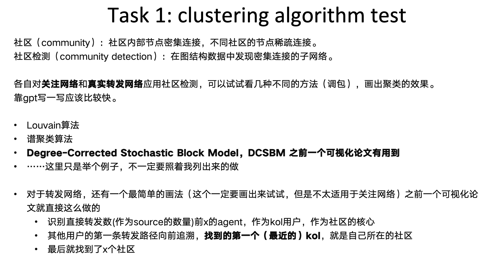
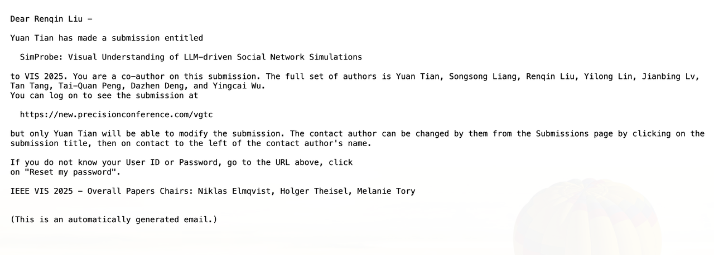

时间过得好快呀！距离我在 CAD&CG 的实习结束已经有一段时间了。这段实习从 2024 年 12 月一直持续到 2025 年 8 月，主要是在巫英才老师下属的邓达臻老师团队里，跟着学姐做 Multi-agent 及其可视化的相关研究。

最近整理之前的文档和代码，觉得有必要把这段经历记录下来，算是一个阶段性的总结。

## 项目背景与整体工作

我们的项目核心是基于一个叫做 OASIS 的 LLM 社交网络模拟框架进行二次开发。简单来说，就是研究 LLM 驱动的智能体在模拟信息传播时，和真实世界的人类行为有多像？为了评估和调试这种相似度，我们开发了一个可视分析系统 **SimProbe**。

## 具体做了什么

### 数据的清理与对齐

为了评估模拟的效果，我们需要真实的推特数据作为 Ground Truth。虽然我用学术用途申请了推特的开发者 API，但推特的速率限制极其严苛——即便是开发者，15分钟也只能发 75 个请求，根本不够采集足量的传播网络数据。

为了绕过这个限制，我手写了一个自动化工具来模拟人工采集数据，最后作为开源项目发布在了 GitHub 上（[twitter-crawler](https://github.com/cyrus28214/twitter-crawler)）。这套工具成功帮我们拿到了对比实验所需的真实数据。

拿到了真实的推特数据后，我发现里面的无关字段太多，而且数据结构和我们模型跑出来的结果完全不一样。为了让这两边的数据能放到同一个系统里进行可视化对比，我写了一系列脚本，对推特数据进行了清洗、提取和格式化，把它们和模拟实验的结果彻底对齐。

### 社交网络的社区聚类算法

在我们的可视化系统里，Agent 之间会互相关注和转发，形成复杂的网络。学姐希望我调研一下 Multi-layer network 和 Community detection，把有相似兴趣的 Agent 聚类在一起，分配不同的颜色进行可视化。

我读了一圈文献综述，发现现有的多层网络聚类模型要么太重太复杂，要么不符合我们的需求。我们的网络如果只用关注关系（单层），图会非常稀疏，出现大量无法可视化的孤立点。所以我们需要融合**关注网络（Following）**和**文本语义（Profile + 历史发帖）**。

我最终把这个任务拆成了三个 subtask 实现：

1. 把网络拓扑结构转化为向量。
2. 把文本语义数据转化为向量。
3. 混合这两组向量进行最终的聚类计算。

其实还是一个比较暴力的思路...

## 遇到的坑与解决思路

遇到了几个比较有意思的坑：

1. **推特数据不记录转发树**：我们在分析 Repost 数据（纯转发）时发现，如果用户 A 被 B 转发，B 又被 C 转发（A -> B -> C），推特官方的接口实际上会把路径扁平化处理成 A -> B 和 A -> C，你根本拿不到真实的转发链路。好在我们的模拟系统主要针对的是带评论的转发（也就是Quote），所以对实际工作影响不大。但这个发现让我们对之前某篇声称“获取了此类转发树数据”的论文产生了怀疑，学姐去核实后，也认同那个工作的结果是存疑的。
2. **找不到合适的聚类 Benchmark**：在做社区检测算法时，我一直纠结于怎么找一个适合我们这种“文本+网络”特定场景的 Benchmark 来评估算法好坏，甚至想自己标一个。学姐提醒了我，不要陷入完美主义。我改变了策略：先在模糊的需求下把算法跑通，然后慢慢建立 intuition，以此来优化算法，甚至最终提出评估方法。
3. **长短文本的权重失衡**：在做基于文本的相似度聚类时，我用的是“用户简介 + 历史发帖”。但实际跑下来发现，简介通常很短，而历史帖子很长，导致帖子的权重在算相似度时远高于简介。我针对这种情况做了一个加权 Rebalance 处理，拉平了两者的影响权重。

## 结果

2025年4月1日，我们把这篇名为 *SimProbe: Visual Understanding of LLM-driven Social Network Simulations* 的工作投给了可视化领域的顶会 VIS2025。不过很遗憾，结果是 Rejected。

看了 Reviewers 的意见，大家基本都认可课题的相关性和技术复杂度，但指出了几个硬伤：

1. 评估不够客观：我们只找了参与系统设计的 2 位专家来做 Case Study，没有外部用户的定量测试。
2. 论文撰写问题：Case Study 部分居然没有放图，大大降低了可读性。
3. 缺乏对 Scalability 的讨论。

之后因为个人时间安排冲突，就没有继续跟进这个项目。不过回头来看，这 9 个月在 ZJUIDG 的经历依然非常充实。死磕推特爬虫、设计混合聚类算法、魔改开源框架，再到亲历了一次顶会投稿的完整流程，这些都是踏实的沉淀和经验。