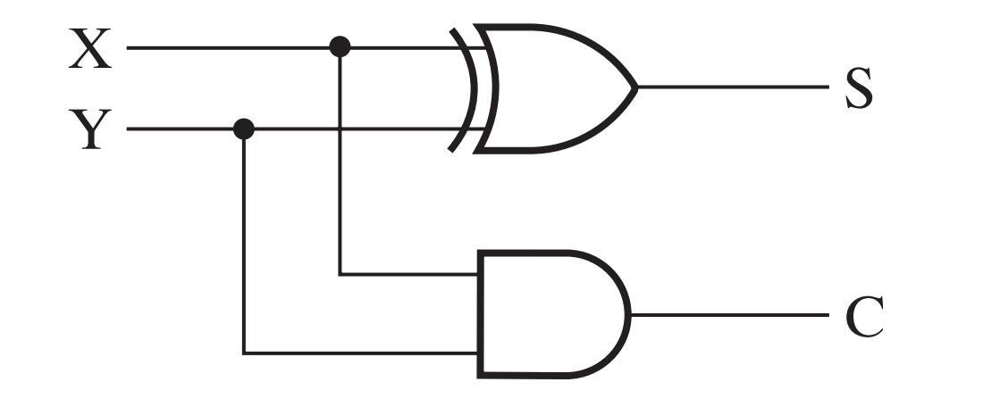
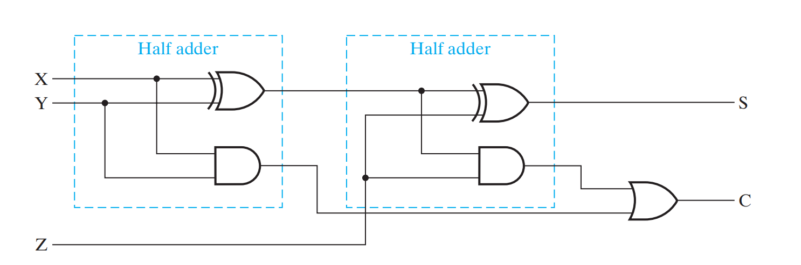
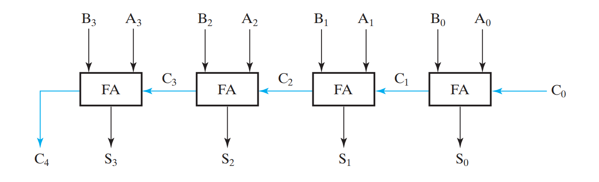

## 半加器 (Half Adder)

半加器用于计算两个 1 位二进制数 $A$ 和 $B$。之所以叫半加器，是因为它不考虑来自低位的进位。



逻辑表达式：

$$
\begin{align}
S &= A \oplus B \quad \\
C &= A \cdot B \quad
\end{align}
$$

真值表：

| $A$  | $B$  | $S$  | $C$  |
| :--- | :--- | :--- | :--- |
| 0    | 0    | 0    | 0    |
| 0    | 1    | 1    | 0    |
| 1    | 0    | 1    | 0    |
| 1    | 1    | 0    | 1    |

Verilog 实现：

```verilog
module half_adder(
    input  A, B,
    output S, C
);
    assign S = A ^ B;
    assign C = A & B;
endmodule
```

## 全加器 (Full Adder)

为了实现多位加法，我们需要处理低位的进位。全加器接受三个输入：加数 $A$、被加数 $B$ 以及低位进位 $C_{in}$。



逻辑表达式：

$$
\begin{align}
S &= A \oplus B \oplus C_{in} \\
C_{out} &= AB + (A \oplus B)C_{in}
\end{align}
$$

真值表：

| A    | B    | C    | S    | C1   |
| :--- | :--- | :--- | :--- | :--- |
| 0    | 0    | 0    | 0    | 0    |
| 0    | 0    | 1    | 1    | 0    |
| 0    | 1    | 0    | 1    | 0    |
| 0    | 1    | 1    | 0    | 1    |
| 1    | 0    | 0    | 1    | 0    |
| 1    | 0    | 1    | 0    | 1    |
| 1    | 1    | 0    | 0    | 1    |
| 1    | 1    | 1    | 1    | 1    |

Verilog 实现：

```verilog
module full_adder(
    input  A, B, Cin,
    output S, Cout
);
    wire s1, c1, c2;

    // 实例化第一个半加器计算 A 和 B 的和
    half_adder ha1(.A(A), .B(B), .S(s1), .C(c1));
    // 实例化第二个半加器将结果与 Cin 相加值
    half_adder ha2(.A(s1), .B(Cin), .S(S), .C(c2));

    assign Cout = c1 | c2; // 两次相加中只要有一次产生进位，最终进位即为 1
endmodule
```


## 行波进位加法器 (RCA)

将 $n$ 个全加器首尾相接，低位的 $C_{out}$ 接到高位的 $C_{in}$，就得到了 行波进位加法器 (Ripple Carry Adder)。



这种加法器被称为串行进位加法器(Ripple Carry Adder, RCA)，也叫行波进位加法器或脉冲进位加法器，RCA的特点是电路简单，但由于高位必须等到低位运算完成才能进行，电路产生的延时很大，运算速度较慢，而且位数越多运算越慢。而超前进位加法器(Carry Look-ahead Adder, CLA)可以解决这个问题。

## 超前进位加法器 (Carry Look-ahead Adder)

CLA 采用了**空间换时间**的策略：通过增加逻辑门，提前并行计算出所有进位。

1. Generate $G_i = A_i B_i$：若 $A, B$ 全为 $1$，本位必然产生进位。
2. Propagate $P_i = A_i \oplus B_i$：若 $A, B$ 有一个为 $1$，则低位进位会通过本位传递。

通过数学展开，进位公式可以改写为：

- $C_1 = G_0 + P_0 C_0$
- $C_2 = G_1 + P_1 G_0 + P_1 P_0 C_0$
- $C_3 = G_2 + P_2 G_1 + P_2 P_1 G_0 + P_2 P_1 P_0 C_0$

Verilog 实现：

```verilog
module cla_4bit(
    input  [3:0] A, B,
    input  Cin,
    output [3:0] S,
    output Cout
);
    wire [3:0] G, P;
    wire [4:0] C;

    assign C[0] = Cin;

    assign G = A & B;
    assign P = A ^ B;

    assign C[1] = G[0] | (P[0] & C[0]);
    assign C[2] = G[1] | (P[1] & G[0]) | (P[1] & P[0] & C[0]);
    assign C[3] = G[2] | (P[2] & G[1]) | (P[2] & P[1] & G[0]) | (P[2] & P[1] & P[0] & C[0]);
    assign C[4] = G[3] | (P[3] & G[2]) | (P[3] & P[2] & G[1]) | (P[3] & P[2] & P[1] & G[0]) | (P[3] & P[2] & P[1] & P[0] & C[0]);

    assign S = P ^ C[3:0];
    assign Cout = C[4];
endmodule
```

## 计算机设计的权衡

从 RCA 到 CLA，本质上是用硬件面积换取速度。这种 Trade-off 贯穿了计算机体系结构的始终。

这种 Trade-off 不仅存在于加法器设计中，它几乎存在于计算机的每一处：

- Cache：用昂贵的高速缓存来换取内存访问速度。
- RISC vs CISC：用更复杂的软件编译器换取更精简的硬件执行效率。
- 预测执行：用额外的功耗换取分支指令的吞吐量。