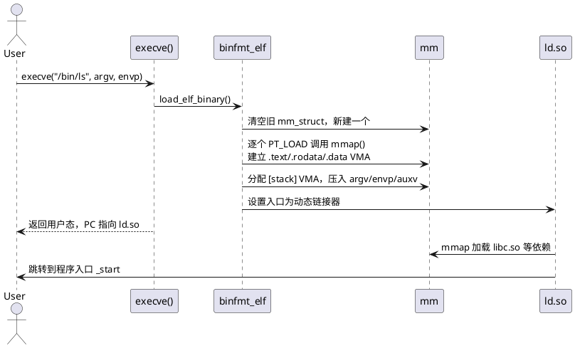

## 0x00: 地址空间布局

64 位 x86_64 Linux 使用 48 位有效虚拟地址（5 级页表打开时是 57 位），整个虚拟地址空间被劈成两半：

- 用户态：`0x0000_0000_0000_0000` ~ `0x0000_7FFF_FFFF_FFFF`（128 TiB）
- 非规范区：中间一大段不可用
- 内核态：`0xFFFF_8000_0000_0000` ~ `0xFFFF_FFFF_FFFF_FFFF`（128 TiB）

中间为什么都不可用？因为硬件要求高 16 位必须是符号扩展位（要么全 0，要么全 1），否则触发 #GP。这是 x86_64 规定的，不是 Linux 的选择。

## 0x01: `mm_struct` 与 VMA

## 0x03: 页表

## 0x02: ELF 加载

## 0x03: 堆的管理

## 0x04: 栈的管理

## 0x05: Demand Paging, fork 与 COW

## 0x08: 推荐阅读


用户态那 128 TiB 里，进程实际用到的部分大致是这样：

```plantuml

```

这里有几个第一张图里看不到的关键点：

**第一，`.rodata` 是独立段，只读。** 回到开头那段代码：`"hello"` 这种字符串字面量被编译器放进了 `.rodata`，整段所在页在内核里的 VMA 权限是 `r-xp` 或 `r--p`。`s1` 和 `s2` 指向同一个字面量，链接器做了字符串合并（string pooling），所以地址相同。你往只读页写东西，MMU 抛出 page fault，内核检查 VMA 权限发现是写违例，给你发 SIGSEGV。

`s3` 是数组，`= "hello"` 是把字面量逐字节拷贝到栈上的 6 字节空间。栈是可写的，所以 `s3[0]='H'` 没事。

**第二，堆和栈之间不是一条直路。** 中间塞着一大片 mmap 区域，所有动态库、`malloc` 申请的大块（默认 ≥ 128 KiB）、文件映射都落在这里。所以"堆一直涨、栈一直降，撞上就溢出"这种说法在 64 位现实里基本不会发生——栈先撞上 mmap 段，或者堆的 `brk` 早就被 mmap 段挡住了。

**第三，地址是被随机化的。** ASLR 默认打开，每次启动栈基址、mmap 基址、堆基址（如果是 PIE）、可执行段基址都会变。你可以验证：

```sh
$ cat /proc/self/maps | head -5
55a3c8e1f000-55a3c8e21000 r--p 00000000 fd:01 ... /usr/bin/cat
55a3c8e21000-55a3c8e26000 r-xp 00002000 fd:01 ... /usr/bin/cat
55a3c8e26000-55a3c8e29000 r--p 00007000 fd:01 ... /usr/bin/cat
55a3c8e29000-55a3c8e2a000 r--p 00009000 fd:01 ... /usr/bin/cat
55a3c8e2a000-55a3c8e2b000 rw-p 0000a000 fd:01 ... /usr/bin/cat
```

连跑两次基址不同。

**第四，最低一页永远不可访问。** `mmap_min_addr`（默认 65536）以下的地址不允许任何映射，这就是为什么 `*(int*)0 = 1` 必崩——并不是因为"0 是特殊数字"，而是因为那一页根本没有 VMA。

---

## 2. 内核视角：mm_struct 与 VMA

上面那张图里的"段"在内核里不是连续大块，而是一串 `vm_area_struct`（VMA）。每个进程有一个 `mm_struct`，挂着这个进程所有的 VMA 链表 + 红黑树（6.1 之后换成了 maple tree）。

```c
struct mm_struct {
    struct maple_tree mm_mt;       // 所有 VMA 的容器
    pgd_t            *pgd;         // 顶级页表
    unsigned long     start_code, end_code;
    unsigned long     start_data, end_data;
    unsigned long     start_brk,  brk;     // 堆
    unsigned long     start_stack;          // 栈起点
    unsigned long     arg_start, arg_end;   // argv
    unsigned long     env_start, env_end;   // envp
    ...
};

struct vm_area_struct {
    unsigned long  vm_start, vm_end;   // 地址范围 [start, end)
    unsigned long  vm_flags;           // VM_READ | VM_WRITE | VM_EXEC | VM_SHARED ...
    struct file   *vm_file;            // 若是文件映射
    unsigned long  vm_pgoff;           // 文件内偏移（页为单位）
    const struct vm_operations_struct *vm_ops;
    ...
};
```

`/proc/<pid>/maps` 里的每一行就是一个 VMA。理解这个数据结构后，下面几件事就顺了：

- `mmap(2)` 做的事就是新建一个 VMA。
- `munmap(2)` 把 VMA 从树里拿掉，并释放页表项。
- `mprotect(2)` 改 `vm_flags`，并刷一次 TLB。
- `brk(2)` 就是把堆那个 VMA 的 `vm_end` 往上抬。
- 一次 `malloc(8)` 通常什么系统调用都不发——glibc 已经从堆或 mmap 区域里预留了大块，自己切。

**重要事实：用户态访问内存时，页表里可能根本没有这块地址的映射。** 内核只在缺页时按需分配物理页（demand paging）。所以 `malloc(1GB)` 在一个 8 GB 内存的机器上瞬间返回成功是正常的——你还没碰过这块虚拟地址，物理页一张都没分。

---

## 3. ELF 是怎么变成 VMA 的

`.text / .data / .bss / .rodata` 这些是**链接视图**里的段（section）。真正决定运行时布局的是**执行视图**里的 program header（segment），主要看 `PT_LOAD`：

```sh
$ readelf -l /bin/ls | grep -A1 LOAD
  LOAD  0x000000  0x0000000000000000  ...  R E   0x1000
  LOAD  0x021000  0x0000000000021000  ...  R     0x1000
  LOAD  0x02b000  0x000000000002b000  ...  RW    0x1000
```

`execve` 触发以下流程：



注意一个细节：内核加载的不是你的 `main`，而是 `ld-linux-x86-64.so.2`。它在用户态完成符号重定位、TLS 初始化、构造函数调用，再跳到 `_start → __libc_start_main → main`。

`.bss` 不占文件大小但占内存的原因也在 program header 里：某个 `PT_LOAD` 的 `MemSiz > FileSiz`，多出来的部分由内核映射成匿名零页。

---

## 4. 堆的真相：brk 与 mmap 的分工

很多人以为 `malloc` 总是从 `brk` 那个堆里切。其实 glibc 的 ptmalloc2 有个阈值 `M_MMAP_THRESHOLD`（默认 128 KiB，可动态调整）：

- 小于阈值：从 arena 里切。主 arena 用 `brk` 扩张，其他 arena 用 `mmap` 申请大块再自切。
- 大于阈值：直接 `mmap` 一块匿名内存，`free` 时直接 `munmap` 还给内核。

实测：

```sh
$ cat > t.c <<'EOF'
#include <stdlib.h>
#include <unistd.h>
int main(){ void *p = malloc(200*1024); *(char*)p = 1; sleep(100); }
EOF
$ gcc t.c -o t && ./t &
$ cat /proc/$!/maps | grep -E 'heap|rw-p'
```

你会看到这块 200 KiB 落在 mmap 区域而不是 `[heap]`。

`brk` 模式的缺陷很直接：堆是一段连续的 VMA，中间释放的洞不能还给内核——`brk` 只能砍尾巴。所以长期运行的服务用 ptmalloc 经常出现 RSS 涨上去就降不下来的现象。这是 jemalloc / tcmalloc / mimalloc 流行的原因之一，它们更激进地用 `mmap + madvise(MADV_DONTNEED)` 把脏页交还给内核。

---

## 5. 栈：不是无限大，也不是一开始就分配好

栈的 VMA 默认只有 132 KiB 左右，带 `VM_GROWSDOWN` 标志。当你访问栈底以下的页，内核走 `expand_stack()` 自动扩展，上限是 `ulimit -s`（默认 8 MiB）。超过这个上限就是 stack overflow，发 SIGSEGV。

栈初始内容由内核构造，从高地址往低排：

```
高地址
  ┌──────────────────────┐
  │  环境变量字符串       │
  │  argv 字符串          │
  ├──────────────────────┤
  │  辅助向量 auxv[]      │  ← AT_RANDOM, AT_PHDR, AT_ENTRY 等
  │  envp[] (指针数组)    │
  │  argv[] (指针数组)    │
  │  argc                 │  ← %rsp 初始值
  └──────────────────────┘
低地址
```

`_start` 拿到的就是 `%rsp` 指向 `argc` 的状态。auxv 里的 `AT_RANDOM` 是 16 字节随机数，glibc 用它初始化栈金丝雀（stack canary）。

线程栈不是这个机制。`pthread_create` 内部走 `mmap(MAP_STACK | MAP_ANONYMOUS)` 直接申请一个固定大小的 VMA（默认 8 MiB），没有 `VM_GROWSDOWN`。所以多线程程序里你不会看到栈"自动扩展"，反而更容易在深递归时直接踩穿到守护页（guard page）触发段错误。

---

## 6. 共享与零拷贝：fork、mmap、写时复制

`fork()` 不复制物理内存。父子进程共用同一套物理页，所有可写页表项被改成只读，并在 page->_mapcount 上加一。任何一方写时触发 page fault，内核才真正分配新页并复制——这就是 COW（copy-on-write）。这也是 `fork + exec` 模型能在大内存进程上活下来的根本原因（虽然 Redis 之类还是要担心 fork 期间 COW 把内存吃爆）。

`mmap` 是另一种零拷贝。把文件映射进地址空间后，读写文件等价于读写内存，内核 page cache 直接被映射，省掉 `read()/write()` 的拷贝。但有几个坑值得记住：

- `MAP_PRIVATE` 的写不会回写文件，是 COW；`MAP_SHARED` 才会。
- 写共享映射并不立即落盘，`msync` 或者内核回写线程才会写。
- 文件被 truncate 后再访问映射区会收到 SIGBUS，不是 SIGSEGV——因为 VMA 还在，只是后端页没了。

---

## 7. vDSO 与 vvar：用户态的"系统调用"

`/proc/self/maps` 里几乎一定有这两行：

```
7ffd...000-7ffd...000 r-xp 00000000 00:00 0  [vdso]
7ffd...000-7ffd...000 r--p 00000000 00:00 0  [vvar]
```

vDSO 是内核映射到每个进程地址空间的一个小型共享库，提供 `clock_gettime`、`gettimeofday`、`getcpu` 等的用户态实现。vvar 是内核暴露给 vDSO 的只读数据页（比如当前时钟）。这样高频时间调用根本不用陷入内核，性能差距能到 10 倍。

写性能敏感的代码时，能用 `clock_gettime(CLOCK_MONOTONIC, ...)` 就别用 `syscall(SYS_clock_gettime, ...)`，前者走 vDSO，后者每次都陷内核。

---

## 8. 回到开头：把那个段错误拆给你看

```c
char *s1 = "hello";
char  s3[] = "hello";
s1[0] = 'H';   // SIGSEGV
s3[0] = 'H';   // OK
```

汇编（`gcc -O0 -S`）里看到的关键差异：

```asm
    leaq    .LC0(%rip), %rax        ; s1 = &.LC0
    movq    %rax, -8(%rbp)
    movq    .LC0(%rip), %rax        ; 把 "hello\0" 拷到栈上
    movq    %rax, -22(%rbp)         ; s3 在栈帧里
```

`.LC0` 落在 `.rodata`，对应 VMA 权限 `r--p`。当 CPU 执行写入时：

1. MMU 查页表，发现该页存在但 PTE 没有写位（dirty/RW=0）；
2. 触发 `#PF` (page fault)，向量号 14；
3. 内核 `do_page_fault → handle_mm_fault`，查到对应 VMA，发现 `vm_flags` 里没有 `VM_WRITE`；
4. 走 `bad_area_access_error`，给进程发 SIGSEGV，`si_code = SEGV_ACCERR`。

`s3` 在栈帧里，栈 VMA 权限是 `rw-p`，写入合法。

如果你想看完整路径，可以用 `dmesg` 或者 `coredumpctl` 抓到精确的 fault 信息：

```
[12345.6789] crash[1234]: segfault at 400540 ip 0000000000401156 sp ...
             error 7 in crash[400000+1000]
```

`error 7 = 0b111`，意思是：用户态(4) + 写(2) + 页存在(1)。"页存在但你不能写"——和我们上面分析的完全对上。

---

## 9. 实战工具速查

调试地址空间问题最常用的几个，按从粗到细排：

- `cat /proc/<pid>/maps`：看 VMA 边界与权限。
- `cat /proc/<pid>/smaps`：看每个 VMA 的 RSS、PSS、脏页、是否 THP。
- `pmap -X <pid>`：smaps 的人类友好版。
- `gdb` + `info proc mappings` + `x/20gx $rsp`：现场看栈。
- `strace -e trace=%memory ./a.out`：观察 brk/mmap/mprotect/munmap。
- `eu-readelf -a` / `readelf -lWS`：看 ELF segment/section。
- `bpftrace -e 'tracepoint:exceptions:page_fault_user { @[comm] = count(); }'`：统计哪些进程在频繁缺页。
- `perf record -e page-faults`：按调用栈看 page fault 热点。

---

## 10. 收个尾

把"程序的内存布局"理解成一张静态分层图，能应付面试题，但解决不了线上问题。真实的进程地址空间是一组 VMA 加一棵页表，行为由 `vm_flags`、page fault 处理路径和分配器策略共同决定。理解这个模型后，下面这些问题都不再玄学：

- 为什么写字符串字面量会崩，写字符数组不会。
- 为什么 `malloc(1GB)` 能立刻返回，第一次写才慢。
- 为什么 RSS 涨上去不掉，但 VSZ 看着不大。
- 为什么 `fork` 一个 100 GB 的进程在毫秒级完成，写一下就突然 OOM。
- 为什么 `clock_gettime` 比 `syscall` 快十倍。
- 为什么 `*(int*)0 = 0` 一定崩，而 `*(int*)0x123 = 0` 也一定崩，但原因不一样。

下次再遇到段错误，别再只盯着代码看。把 `/proc/<pid>/maps` 打开，对着 `fault_addr` 找到对应的 VMA，权限位会告诉你真相。