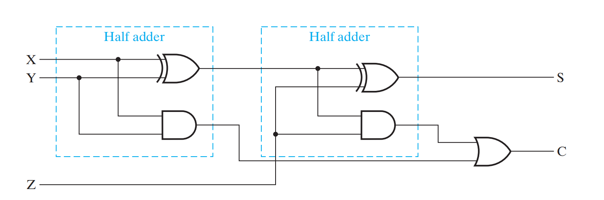

## 半加器(Half Adder)

半加器接受两个输入A、B，输出加法的计算结果S和进位C，表达式及真值表如下：

$$
\begin{align*}
S &= A \oplus B \\
C &= AB
\end{align*}
$$

| A   | B   | S   | C   |
| --- | --- | --- | --- |
| 0   | 0   | 0   | 0   |
| 0   | 1   | 1   | 1   |
| 1   | 0   | 1   | 1   |
| 1   | 1   | 0   | 1   |

利用异或门可以很简单的设计出一个半加器

## 全加器(Full Adder)

如果我们需要将低位所位的1也加上，就需要用到全加器，它接受三个输入A、B和C，输出加法的计算结果S和进位C1。由此可以写出全加器的表达式。

$$
\begin{align*}
S &= A \oplus B \oplus C \\
C_1 &= AB + AC + BC
\end{align*}
$$

*\*这里的乘法和加法分别代表布尔代数中的“与”和“或”，而“$\oplus$”是异或*

第一个式子很好理解，因为逻辑门里面的异或就是不进位的加法。而第二个式子翻译成人话就是“A、B、C中至少有两个为真”，也就是有进位的情况。

根据表达式可以列出它的真值表。

| A   | B   | C   | S   | C1  |
| --- | --- | --- | --- | --- |
| 0   | 0   | 0   | 0   | 0   |
| 0   | 0   | 1   | 1   | 0   |
| 0   | 1   | 0   | 1   | 0   |
| 0   | 1   | 1   | 0   | 1   |
| 1   | 0   | 0   | 1   | 0   |
| 1   | 0   | 1   | 0   | 1   |
| 1   | 1   | 0   | 0   | 1   |
| 1   | 1   | 1   | 1   | 1   |

具体的实现也很简单，可以使用两个半加器来实现。

有了全加器和半加器，制作一个n位加法器就很简单，可以简单地将全加器串联，得到多位的加法器。

这种加法器被称为串行进位加法器(Ripple Carry Adder, RCA)，也叫行波进位加法器或脉冲进位加法器，RCA的特点是电路简单，但由于高位必须等到低位运算完成才能进行，电路产生的延时很大，运算速度较慢，而且位数越多运算越慢。而超前进位加法器(Carry Look-ahead Adder, CLA)可以解决这个问题。

## 超前进位加法器

上面全加器的式子还有另一种写法

$$
\begin{align*}
C_{i+1} &= A_i B_i + A_i C_i + B_i C_i\\
&= A_i B_i + (A_i + B_i)C_i\\
S_i &= A_i \oplus B_i \oplus C_i \\
&= (A_i + B_i) \oplus (A_i B_i) \oplus C_i
\end{align*}
$$

由此，不妨令

$$
\begin{align*}
G_i &= A_i B_i\\
P_i &= A_i + B_i
\end{align*}
$$

则有

$$
\begin{align*}
C_{i+1} &= G_i + P_i C_i\\
S_i &= P_i \oplus G_i \oplus C_i
\end{align*}
$$

利用这个我们可以提前计算出进位，降低计算的延迟。

$$
\begin{align*}
C_1 &= G_0 + P_0 C_0\\
C_2 &= G_1 + P_1(G_0 + P_0 C_0)\\
&= G_1 + P_1 G_0 + P_1 P_0 C_0\\
C_3 &= G_2 + P_2(G_1 + P_1 G_0 + P_1 P_0 C_0)\\
&= G_2 + P_2 G_1 + P_2 P_1 G_0 + P_2 P_1 P_0 C_0\\
&\ldots \ldots
\end{align*}
$$

进位延时只有三个门的延时，加上最后一级全加器的延时，最多四个延时时间。
具体的实现如图。

## 引用

Mano, M. M., Kime, C. R., & Martin, T. (2015). *Logic and computer design fundamentals (5th ed.)* . Hoboken, NJ: Pearson Higher Education.
