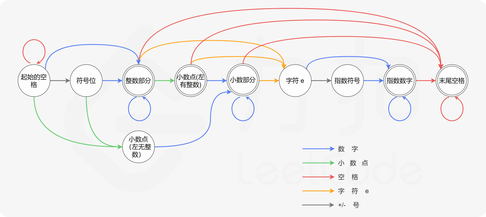

## 题面

<details>
<summary>
题面
</summary>

请实现一个函数用来判断字符串是否表示**数值**（包括整数和小数）。

**数值**（按顺序）可以分成以下几个部分：

1. 若干空格
2. 一个 小数 或者 整数
3. （可选）一个 `'e'` 或 `'E'` ，后面跟着一个 整数
4. 若干空格

**小数**（按顺序）可以分成以下几个部分：

1. （可选）一个符号字符（`'+'` 或 `'-'`）
2. 下述格式之一：

    1. 至少一位数字，后面跟着一个点 `'.'`
    2. 至少一位数字，后面跟着一个点 `'.'` ，后面再跟着至少一位数字
    3. 一个点 `'.'` ，后面跟着至少一位数字

**整数**（按顺序）可以分成以下几个部分：

1. （可选）一个符号字符（`'+'` 或 `'-'`）
2. 至少一位数字

部分数值列举如下：

- `["+100", "5e2", "-123", "3.1416", "-1E-16", "0123"]`

部分非数值列举如下：

- `["12e", "1a3.14", "1.2.3", "+-5", "12e+5.4"]`

示例 1：

```txt
输入：s = "0"
输出：true
```

示例 2：

```txt
输入：s = "e"
输出：false
```

示例 3：

```txt
输入：s = "."
输出：false
```

示例 4：

```txt
输入：s = "    .1  "
输出：true
```

提示：

- `1 <= s.length <= 20`
- `s` 仅含英文字母（大写和小写），数字（`0-9`），加号 `'+'` ，减号 `'-'` ，空格 `' '` 或者点 `'.'` 。

</details>

## 题解

要匹配格式化字符串，首先想到的就是利用正则表达式，构造这样的表达式也很容易。

首先，根据题面，首位可能有空格，正则表达式里面可以直接用空格`' '`或者用能够匹配所有空白字符的`\s`，要0个或多个就用`*`字符。

然后匹配正负号0次或1次，注意`+`需要转义`[\+-]?`

假如是整数或者有整数部分的小数，就用`\d+\.?\d*`，`\d`可以匹配任意数字，相当于`[0-9]`。

假如是没有整数部分的小数，就用`\.\d+`。

这两个之间使用`|`或符号连接在一起就是`(\d+\.?\d*|\.\d+)`

然后是指数部分，首先是字母`E`或者`e`，然后是整数部分`\d+`，指数部分是可选的，所以括号括起来加上`?`。

最后因为我们需要匹配整个字符串，加上匹配首尾的符号`^`和`$`就大功告成了，表达式为`^\s*[\+-]?(\d+\.?\d*|\.\d+)([Ee][\+-]?\d+)?\s*$`代码非常简单，如下：

```cpp
class Solution {
public:
    bool isNumber(string s) {
        regex r(R"(^\s*[\+-]?(\d+\.?\d*|\.\d+)([Ee][\+-]?\d+)?\s*$)");
        return regex_match(s
  - r);
    }
};
```

然而，他竟然TLE了


不信邪的我又写了Python版和JS版的代码

```py
class Solution:
    def isNumber(c, s):
        return re.match(r"^\s*[\+-]?(\d+\.?\d*|\.\d+)([Ee][\+-]?\d+)?\s*$", s) != None
```

```js
var isNumber = function(s) {
    return /^\s*[\+-]?(\d+\.?\d*|\.\d+)([Ee][\+-]?\d+)?\s*$/i.test(s)
};
```

结果惊奇的发现：竟然过了，还挺快的。难道是我在C++程序中使用正则表达式的姿势不对？


在我的印象中C++在性能方面应该是强于Python的，有空研究一下到底为什么会出现这种现象。

我准备想第二种方法，来完成C++版本的程序

实际上正则表达式的本质就是构建了一个自动机在字符串上跑，如果不使用正则表达式，也可以直接用有限状态自动机（FSM, finite state machine 又称FSA, finite state automaton ）来搞。

我自己推导的FSM用了太多的节点，这里贴出力扣的官方题解配的图。



根据这个转移箭头，可以直接用数组模拟自动机

```cpp
int mapping[256], FSM[16][8] = {,
    {0, 3, 10, 1, 0, 2},
    {0, 3, 10, 0, 0, 0},
    {0, 3, 4, 9, 6, 0},
    {0, 5, 0, 9, 6, 0},
    {0, 5, 0, 9, 6, 0},
    {0, 8, 0, 0, 0, 7},
    {0, 8, 0, 0, 0, 0},
    {0, 8, 0, 9, 0, 0},
    {0, 0, 0, 9, 0, 0},
    {0, 5, 0, 0, 0, 0},
};

class Solution {
public:
    bool isNumber(string s) {
        for(char ch = '0'; ch <= '9'; ++ch) mapping[ch] = 1;
        mapping['.'] = 2;
        mapping[' '] = 3;
        mapping['e'] = mapping['E'] = 4;
        mapping['+'] = mapping['-'] = 5;
        int st = 1;
        for(char ch : s)
            st = FSM[st][mapping[ch]];
        return st == 3 || st == 4 || st == 5 || st == 8 || st == 9;
    }
};

```

`mapping`数组将ASCII字符转化为1-5，分别对应图上的数字、小数点、空格、字符e、+/-号，其余没填充的0会把引入第0节点，即匹配失败。

`FSM`数组定义了图中10个节点之间的转移关系，当自动机跑到字符串的末尾，如果st处于图中双边缘线圆的节点内就是匹配成功。

程序速度很快，因为除了查询数组没有什么其他的开销。

比起使用if-else嵌套，自动机极大地降低了心智负担，避免了逻辑混乱。
