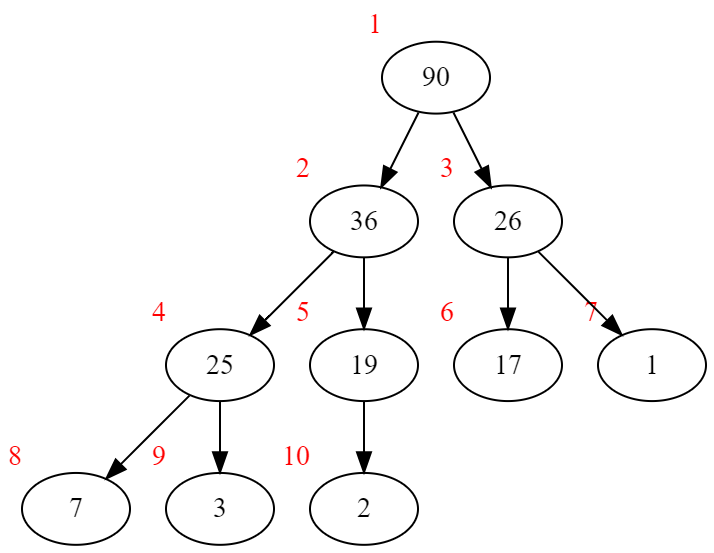

## 简介

堆其实是很基础的数据结构，堆往往是初学者学习的第一个树形数据结构，排在数组、链表、队列、栈等线形数据结构之后。但其实堆并没有那么好理解，而且也常常被忽略（特别是对于OIer来说），因为经常可以直接调包使用，不需要手写堆，C++内置了`std::priority_queue`，python也有`import heapq`。

堆的思想简洁明了——大的在上面；堆的实现高效优雅——只需要维护一个数组；堆的插入、删除、修改的时间复杂度都是一样的 $O(\log n)$ ，因此堆绝对值得好好地理解并且手写一个出来。

一般来说，只要满足父节点的值比子节点大就可以称作堆，但是在具体实现上，最常用的还是**二叉堆**，也就是同时满足堆性质和二叉树性质的堆，除了二叉堆以外，还有二项堆、斐波那契堆等。通常说的堆指的都是二叉堆。

## 堆的储存

**注意：以下默认为最大堆（Max Heap），最小堆（Min Heap）也是同理**

要储存堆，首先要给堆中的每个结点编号。首先，以根节点为1，从上至下，每层再从左至右地编号，如图：



*\*其实编号从零开始也可以，但是之后取子节点和父节点编码的公式会有所不同。*

然后，我们只需要用一个数组，就可以储存下整个堆了。


一般来说，我们会让堆是一棵**完全二叉树（Complete Binary Tree）**，完全二叉树就是除了最后一层以外每一层均填满，而且最后一层从左至右地填满（请与**完美二叉树（Perfect Binary Tree）**区分），这样既节省了数组的空间，又方便了后续的操作。

假如这个堆不是一棵完全二叉树会怎么样呢？请看下图：


如果这样的话，数组就会变成下图：


可以看到存在空间浪费，不仅如此，后续操作也会带来麻烦。因此通常令堆为完全二叉树，并使用一个大小为$n$的数组储存。

### 这种储存方式相应的操作

观察图形与编号的关系不难发现有以下规律：

假如某节点编号为`x`\
左子节点的编号就是`x*2`，或者写成`x<<1`\
右子节点的编号就是`x*2 + 1`，或者写成`x<<1|1`\
父节点的编号就是`x/2`，或者写成`x>>1`

这些对我们后面的操作非常有用

采用面向对象的方式写堆的代码

## 向上调整和向下调整

在讲解堆的插入、删除、修改、建立操作之前，需要先了解堆的两个最基本的操作：向上调整（Percolate Up）和向下调整（Percolate Down）

### 向上调整

假如其中一个节点偏大而不满足堆性质，那么根据最大堆的特点我们可以知道，这个节点需要向上调整其位置。按照以下程序框图执行。


当然，也有可能遇到不存在父节点的情况（此节点已经变成了根节点），那么也算调整完毕

例：有一个这样的堆，其中橙色节点需要向上调整


$61 \gt 19$ 因此交换它们，并继续向上调整61


$61 \gt 36$ 交换61和36，并继续向上调整61


$61 \lt 90$ 调整结束，可以看到调整后的二叉树已经满足了堆性质。

### 向下调整

向下调整就是和向上调整相反的过程，假如一个节点偏小而不满足堆性质，则这个节点需要被向下调整，按照下面的流程图完成向下调整。


同样举个例子


22的两个子节点36、26都比它大，则交换22和36，并继续向下调整22


$25 \lt 22$ 交换25和22


22的两个子节点7、3都比它小，满足堆性质，向下调整结束。

### 时间复杂度分析

无论是向上调整还是向下调整，节点移动的距离都不会超过树高，则显然时间复杂度为 $O(\log n)$

### 实现

这里实现的是整数的最大堆，当然也可以实现泛型的`Heap<T>`，或者进一步自定义比较函数的`Heap<T, _cop<T, T>>`

```cpp
inline int& Heap::_get(int node){
    if(!isValid(node)) throw "无效节点";
    return tree[node-1];
}

bool Heap::isValid(int node){
    return node >= 1 && node <= size();
}

void Heap::shiftUp(int node){ //传入要调整的节点编号
    while(node > 1 && _get(node>>1) < _get(node)){ //如果不是根节点而且父节点小于自己就交换自己和父节点
        std::swap(_get(node>>1), _get(node));
        node >>= 1;
    }
}

void Heap::shiftDown(int node){
    while((node<<1|1) <= size()){ //如果有两个孩子
        int max_chd = _get(node<<1) > _get(node<<1|1) ? node<<1 : node<<1|1; //取较大的孩子
        if(_get(max_chd) > _get(node)){
            std::swap(_get(max_chd), _get(node));
            node = max_chd;
        }
        else break;
    }
    if(node<<1 == size() && _get(node<<1) > _get(node)){ //最后可能出现只有一个子节点的情况，单独判断
        std::swap(_get(node<<1), _get(node));
    }
}
```

*\*完整代码在最后面*

## 插入操作

有了向上调整，插入操作就很简单了，我们只需要把新的节点加到数组末尾，然后向上调整它。


相应的二叉树为：


调整后即为插入完毕后的堆


由于插入操作本质上就是向上调整，复杂度显然是 $O(\log n)$

### 实现

```cpp
void Heap::push(int val){
    tree.push_back(val);
    shiftUp(size());
}
```

## 删除操作

删除操作就是插入操作的逆操作，在堆里面，通常说的删除是指**pop**操作，也就是删除根节点。

逆着插入操作，我们只需要将根节点的值与最后一个节点交换，去掉最后一个节点，然后向下调整根节点。


顺带一提，假如需要删除非根节点，只需要让这个节点一直与它的父节点交换直到它变成根节点，再执行`pop`操作就行了。

显然时间复杂度也是 $O(\log n)$

### 实现

```cpp
void Heap::pop(){
    if(size() == 0) throw "堆不能为空";
    if(size() == 1){
        tree.pop_back();
        return;
    }
    std::swap(_get(1), _get(size()));
    tree.pop_back();
    shiftDown(1);
}

void Heap::remove(int node){
    if(size() == 0) throw "堆不能为空";
    while(node > 1){ //向上交换到根节点
        std::swap(_get(node>>1), _get(node));
        node >>= 1;
    }
    pop();
}
```

## 修改操作

修改操作非常显然，就不过多讲解了

将一个节点修改成更大的节点，那么就向上调整它\
将一个节点修改成更小的节点，那么就向下调整它

时间复杂度：$O(\log n)$

### 实现

```cpp
void Heap::set(int node, int val){
    if(val > _get(node)){
        _get(node) = val;
        shiftUp(node);
    }
    if(val < _get(node)){
        _get(node) = val;
        shiftDown(node);
    }
}
```

## 堆的建立

堆的建立显然有最简单的方式，就是逐个将节点插入一个空堆，但这样的时间复杂度为 $O(n \log n)$

存在更好的办法，可以使得建堆只需要 $O(n)$ 的时间复杂度。

我们从倒数第二行开始，自底向上对每个节点进行向下调整。（因为倒数第一行没有子节点不需要向下调整）


进行倒序遍历：

7号、6号没有子节点，不调整。5号、4号的子节点小于它，无需调整。

向下调整3号后：


向下调整2号后：


向下调整1号后：


可以看到此时堆已经建好了

### 时间复杂度分析

为了简便，考虑这个堆是一个完美二叉树时的情况（当 $n$ 足够大时最后一行的影响可以忽略）

设树高为 $h$ ，则 $n = 2^h-1$

最差情况时，倒序调整每个节点时都要经过最长路径到叶子节点。

定义根节点深度为0，则深度为为 $d$ 的节点有 $2^d$ 个，经过的最长路径为 $h-d-1$，对每个节点求和有：

$$
\begin{align*}
T(n) &\leq 2^0 \times (h-1) + 2^1 \times (h-2) + 2^2 \times (h-3) + \dots + 2^{h-2} \times 1 \\
&= 2^h - h - 1  &\text{（使用高中阶段学过的差比数列求和）}\\
&\lt 2^h - 1 \\
&= n \\
\end{align*}
$$

则时间复杂度为 $O(n)$

也可以使用[**主定理（Master Theorem）**](/posts/master-theorem-application-examples/)求解，结果是一样的。

$$
\begin{align*}
T(n) &= 2T(\frac{n}{2}) + O(\log n) \\
&\text{由主定理有} \\
T(n) &= \Theta (n^{\log _2 2}) \\
&= \Theta (n) \\
\end{align*}
$$

### 实现

```cpp
Heap::Heap(std::vector<int>& vec){
    tree =  vec;
    for(int i = size()>>1; i; --i){
        shiftDown(i);
    }
}
```

## 完整代码

```cpp
class Heap{
        inline int& _get(int node); //_get不能暴露给用户，因为可能使值被修改导致堆性质被破环。
    public:
        std::vector<int> tree;
        Heap(){};
        Heap(std::vector<int>& vec);
        inline int size();
        inline int top();
        inline int get(int node);
        bool isValid(int node);
        void shiftUp(int node);
        void shiftDown(int node);
        void push(int val);
        void pop();
        void remove(int node);
        void set(int node, int val);
    
};

Heap::Heap(std::vector<int>& vec){
    tree =  vec;
    for(int i = size()>>1; i; --i){
        shiftDown(i);
    }
}

inline int Heap::size(){
    return tree.size();
}

inline int Heap::top(){
    if(size() == 0) throw "堆不能为空";
    return get(1);
}

inline int Heap::get(int node){
    if(!isValid(node)) throw "无效节点";
    return tree[node-1];
}

inline int& Heap::_get(int node){
    if(!isValid(node)) throw "无效节点";
    return tree[node-1];
}

bool Heap::isValid(int node){
    return node >= 1 && node <= size();
}

void Heap::shiftUp(int node){ //传入要调整的节点编号
    while(node > 1 && _get(node>>1) < _get(node)){ //如果不是根节点而且父节点小于自己就交换自己和父节点
        std::swap(_get(node>>1), _get(node));
        node >>= 1;
    }
}

void Heap::shiftDown(int node){
    while((node<<1|1) <= size()){ //如果有两个孩子
        int max_chd = _get(node<<1) > _get(node<<1|1) ? node<<1 : node<<1|1; //取较大的孩子
        if(_get(max_chd) > _get(node)){
            std::swap(_get(max_chd), _get(node));
            node = max_chd;
        }
        else break;
    }
    if(node<<1 == size() && _get(node<<1) > _get(node)){ //最后可能出现只有一个子节点的情况，单独判断
        std::swap(_get(node<<1), _get(node));
    }
}

void Heap::push(int val){
    tree.push_back(val);
    shiftUp(size());
}

void Heap::pop(){
    if(size() == 0) throw "堆不能为空";
    if(size() == 1){
        tree.pop_back();
        return;
    }
    std::swap(_get(1), _get(size()));
    tree.pop_back();
    shiftDown(1);
}

void Heap::remove(int node){
    if(size() == 0) throw "堆不能为空";
    while(node > 1){ //向上交换到根节点
        std::swap(_get(node>>1), _get(node));
        node >>= 1;
    }
    pop();
}

void Heap::set(int node, int val){
    if(val > _get(node)){
        _get(node) = val;
        shiftUp(node);
    }
    if(val < _get(node)){
        _get(node) = val;
        shiftDown(node);
    }
```
