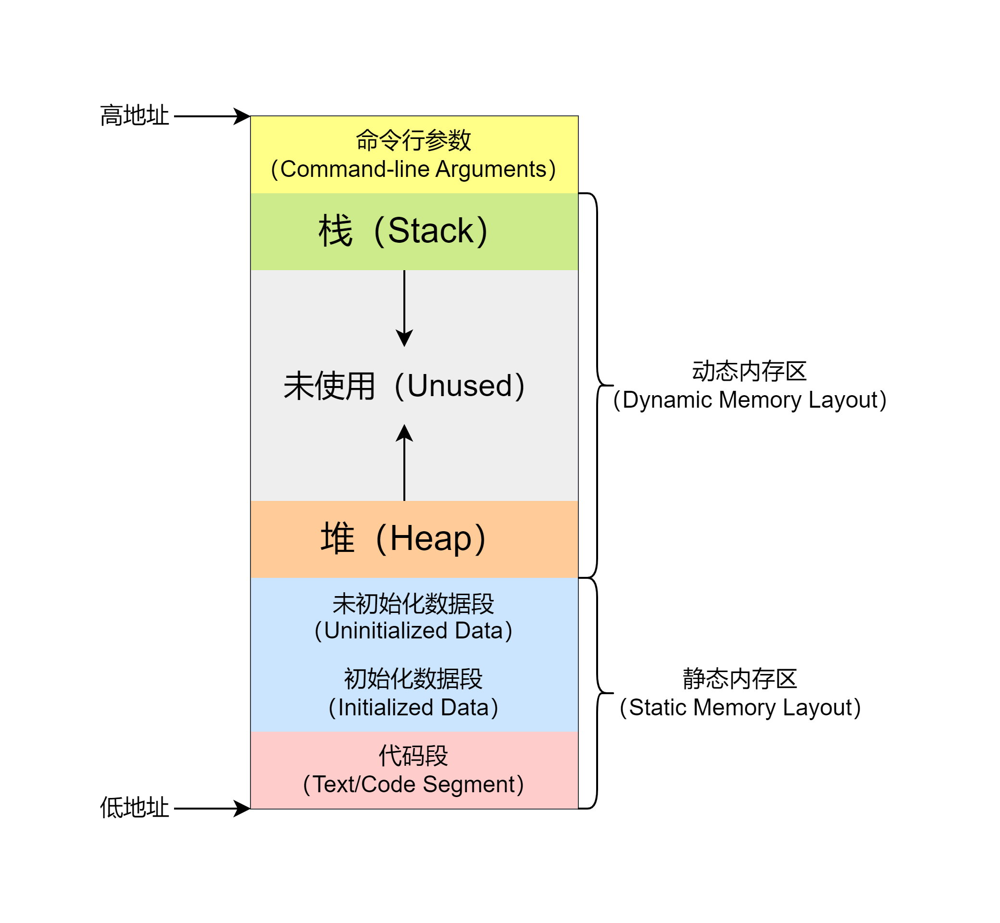
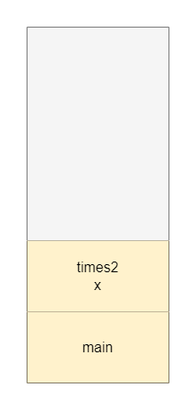
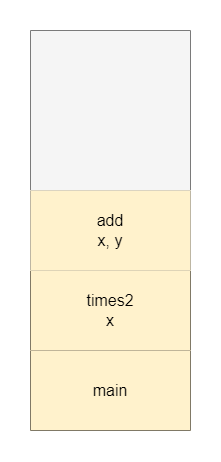

## 简介

通常，一个程序的内存布局包括以下部分

1. 代码段
2. 初始化数据段
3. 未初始化数据段（bss）
4. 堆
5. 栈

它们的位置如图所示



## 代码段（Text/Code Segment）

代码段就是程序代码编译后的机器码储存的位置，储存着计算机可执行的指令。

代码段通常是**只读**的，防止程序在运行的时候意外修改到自身的代码。

## 数据段

数据段只包含全局变量和静态变量，局部变量并不在这块区域里，而是在栈里。

### 初始化数据段（Initialized Data Segment）

顾名思义，就是被程序员手动初始化的全局变量和静态变量。

### 未初始化数据段（Initialized Data Segment）

由于一些历史原因，也被叫做bss段，这个名字是“block started by symbol”的简称，感兴趣的可以在[wiki百科](https://en.wikipedia.org/wiki/.bss)（需要魔法）上了解。

未初始化的全局变量和静态变量会被默认置0。

## 栈（Stack）

开头的图中可以看出，栈区和堆区在程序运行的时候朝着不同的方向增长，当两个区域碰上的时候，程序的可分配内存就耗尽了，可能造成程序异常、崩溃等。

假如向栈内写入了过多数据（如调用函数层数过多，函数使用的局部数据太大），就会造成栈溢出（Stack Overflow），使程序报错。有趣的是，那个世界著名的[程序员问答网站StackOverflow](https://stackoverflow.com/)名字正源于此，或许正是因为栈溢出错误很常见吧。

内存中所说的栈，确实和数据结构中的栈类似，它也是一个先入后出（LIFO）的结构，每当调用一个函数，就会把函数运行所需要的值压栈（Push），包括实参、返回地址，形成一个**栈帧（Stack Frame）**，然后为程序运行中可能的局部变量分配空间。

每个栈帧保存着函数运行所需要的环境，当函数被调用，新的栈帧被压入栈，当函数返回了，栈帧被弹出（Pop），程序恢复到上一个栈帧对应的环境。因此，每一个栈帧对应着一个未执行完的函数。

递归函数也不特殊的，每当进行一层递归，就将栈帧压栈，每一层递归的栈帧之间相互独立，不同层间的变量不会相互影响。

例：

```c
#include <stdio.h>

int add(int x, int y) {
    return x + y;
}

int times2(int x) {
    return add(x, x);
}

int main() {
    printf("%d\n", times2(3));

    return 0;
}
```

一开始我们的程序只有`main`在执行


当`times2`被调用，新的栈帧入栈，保存了传入的值`3`，以及将返回值返回地址（图上未画出）等。



`add`被调用。



`add`返回了，弹栈，恢复到执行`times2`的上下文。


`times2`返回。


## 堆（Heap）

和栈不同的是，堆这个名字和数据结构的堆没有任何关系，他只是一个分配动态内存的空间，堆从bss段结尾开始，朝向栈的方向增长。在C语言中，使用`malloc`、`realloc`、`free`命令所管理的内存就是这块区域。

---

## 例子

```c
//example.c
#include<stdio.h>

int main() {
    return 0;
}
```

```shell
gcc -c example.c -o example # 使用-c让编译器只编译不链接，这样用size看到的程序大小就只包括我们自己写的代码
size example
#    text    data     bss     dec     hex filename
#      67       0       0      67      43 example
```

### 全局变量

使用`gcc`编译后，可以用`size`命令查看可执行程序的内存布局，其中“text”就是代码段，“data”就是已初始化数据段，“bss”就是未初始化数据段，“dec”是十进制下的程序总大小，“hex”是十六进制下的程序总大小。

我们为程序增加一个全局变量，且不初始化它。

```c
//example.c

static int global;
/*一般来说，全局变量是不需要添加static的
这里添加static是为了让编译器知道这个变量定义在当前文件里，立即分配bss空间
而不是把他当做一个弱声明（weak declaration），在链接的时候再一起分配空间。
可以自己试一下如果不加static有什么不同，想想为什么。
如果无法理解可以先跳过，这不是本文的重点*/

int main() {
    return 0;
}
```

```sh
gcc -c example.c -o example && size example
#    text    data     bss     dec     hex filename
#      67       0       4      71      47 example
```

可以看到bss字段大小增加了4个字节，恰好是一个int变量的大小。

### 静态变量

```c
//example.c

static int global;

int main() {
    static int static_variable;

    return 0;
}
```

```sh
gcc -c example.c -o example && size example
#    text    data     bss     dec     hex filename
#      67       0       8      75      4b example
```

添加一个变量后，bss又增加了4个字节

### 初始化的变量

```c
//example.c

static int global = 1;

int main() {
    static int static_variable;

    return 0;
}
```

```sh
gcc -c example.c -o example && size example
#    text    data     bss     dec     hex filename
#      67       4       4      75      4b example
```

我们将`global`初始化为1，可以看到，现在`global`被放到了.data里而不是.bss里。对于静态变量`static_variable`，效果一样，就不展示了。

### 局部变量

```c
//example.c

int main() {
    int local[10];

    return 0;
}
```

```sh
gcc -c example.c -o example && size example
#    text    data     bss     dec     hex filename
#      67       0       0      67      43 example
```

可以看到，局部变量既不在.data里，又不在.bss里，那么他在哪里呢，前文讲过，局部变量在**栈**里，当函数调用时动态分配空间，并不是编译时确定的。
