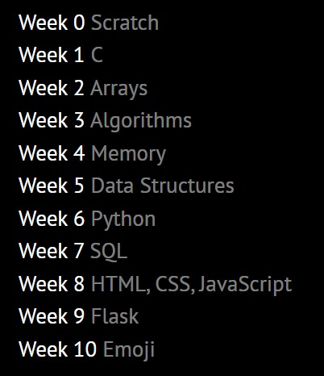
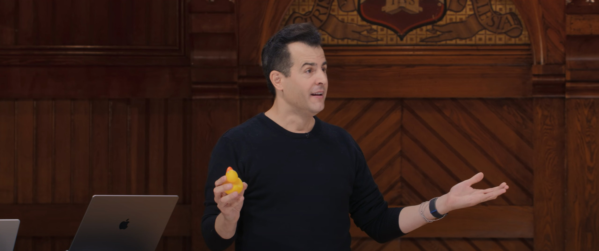
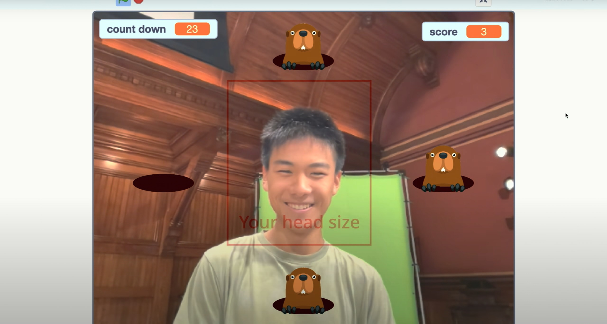
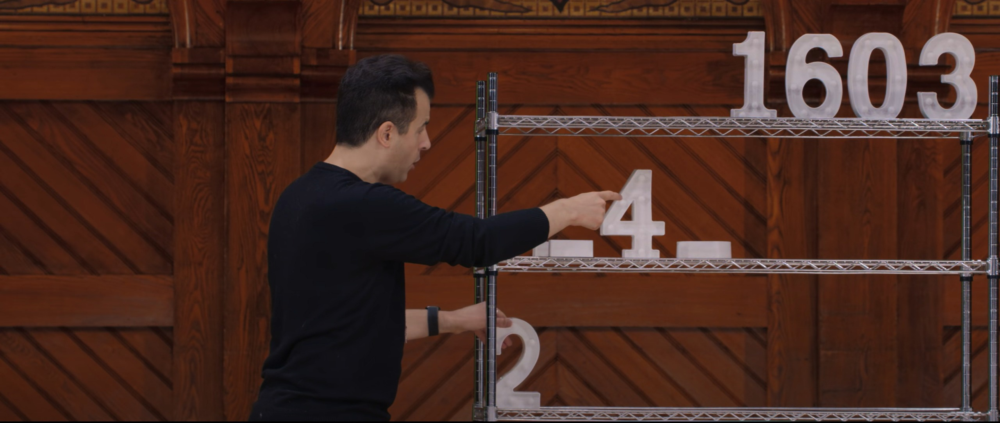
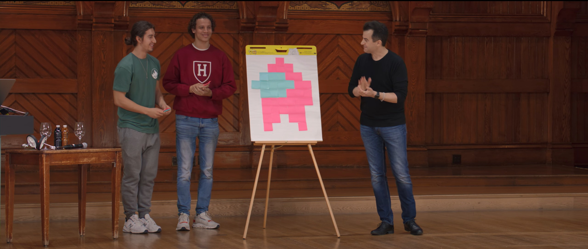
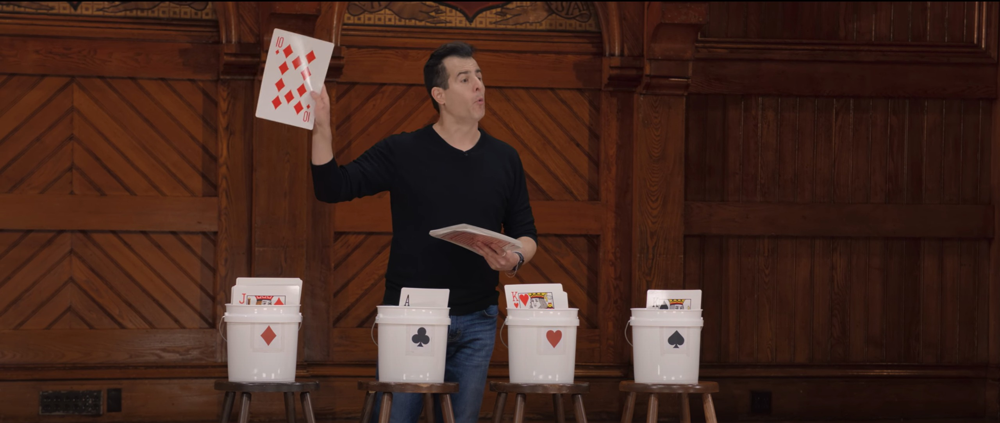
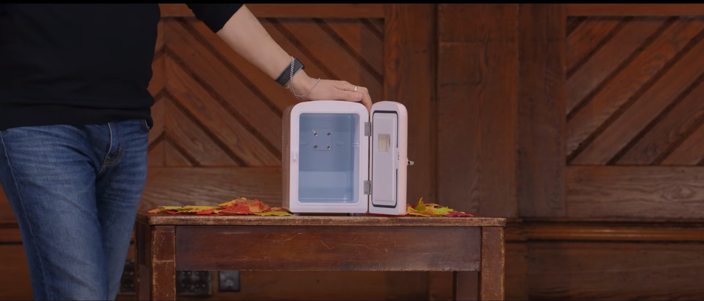
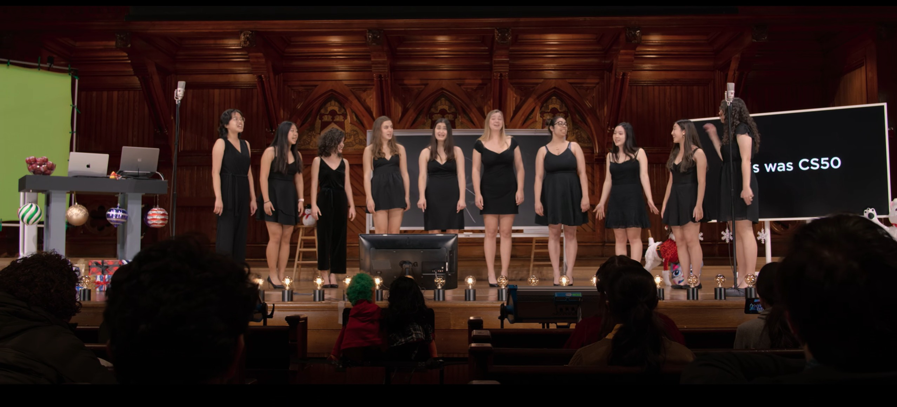

*注：本文中所有标注\*号的链接表示需要魔法上网*

## 推荐

CS50真的是非常好的一门计算机入门课程，由哈佛大学David J. Malan教授主讲，它完全是面向对于计算机科学0基础的学习者，既简单易懂又干货满满，我真的难以相信，这是一门完全免费的课程。

看看CS50的目录，CS50是从*scratch*开始讲的，这足以证明它的初学者友好。

难能可贵的是，这门课并不因为简单就牺牲专业性。这并不是一门水课，它干货满满。从算法、数据结构到web三剑客html、css、js，再到web开发框架flask。全都是干货，况且每一次的CS50课程还配套相应的作业，有些作业难度不低。

这门课程很多内容都只是一个入门的引导，而不是一个完整的教程，但是正如David教授所说的那样，他不是要教你一种编程语言，他要教你 **计算机科学** ，让你能够学会任何一门编程语言，让你有能力追逐最新的技术潮流。

## 学习心得

尽管我并不是零基础的学习者，但是听了这门课程我仍然收获颇丰，不仅收获了专业知识，也获得了很多乐趣，毕竟David教授是我见到的第一个能把课上得比看电影还有意思的教授。

非常羡慕Harvard这样的世界名校提供的资源，这门课有丰富的教具（下文会有图片展示），还有很多在线工具：[*CS50的答疑AI](https://cs50.ai/)、[*CS50的在线开发环境](https://cs50.dev/)、单元测试工具check50、码风检查工具style50。希望国内的大学有朝一日也能在教学上与之媲美吧。

## 图片预览

## 链接

[*CS50 2023的官网](https://cs50.harvard.edu/x/2023/)

[*CS50的答疑AI“cs50.ai”](https://cs50.ai/)

[*CS50的在线开发环境“cs50.dev”，基于网页版VSCode](https://cs50.dev/)

[B站上的课程搬运与中文字幕翻译](https://www.bilibili.com/video/BV1m24y1W7b1)
