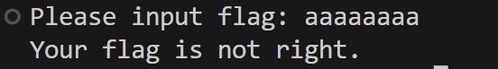

## 前言

最近开始正式学习CTF了，准备先打一打校巴上比较简单的题，遇到什么不懂的再去学习。慢慢提升自己的水平。

这是我的第一道Reverse。

## 题目

题目给了一个二进制可执行程序，执行这个程序，会显示“Please input flag:”，尝随便输入几个字符，结果会输出“Your flag is not right.”。



使用Ollydbg打开这个程序，找到以下这段需要逆向分析的主要内容


在这段代码之前，还有一系列的赋值操作，以ASCII的形式读取，可以获得 “MMMwjau\`S]]S}ybS?4:;5:<4<q” 这串神秘的字符串，猜测与flag的值有关。

```asm
004015AB  |. E8 40110000    CALL <JMP.&msvcrt.scanf>                 ; \scanf
004015B0  |. C74424 4C 0000>MOV DWORD PTR SS:[ESP+4C],0
004015B8  |. EB 40          JMP SHORT rev_fmyl.004015FA
004015BA  |> 8D5424 14      /LEA EDX,DWORD PTR SS:[ESP+14]           ; ||
004015BE  |. 8B4424 4C      |MOV EAX,DWORD PTR SS:[ESP+4C]           ; ||
004015C2  |. 01D0           |ADD EAX,EDX                             ; ||
004015C4  |. 0FB600         |MOVZX EAX,BYTE PTR DS:[EAX]             ; ||
004015C7  |. 83F0 0C        |XOR EAX,0C                              ; ||
004015CA  |. 89C1           |MOV ECX,EAX                             ; ||
004015CC  |. 8D5424 32      |LEA EDX,DWORD PTR SS:[ESP+32]           ; ||
004015D0  |. 8B4424 4C      |MOV EAX,DWORD PTR SS:[ESP+4C]           ; ||
004015D4  |. 01D0           |ADD EAX,EDX                             ; ||
004015D6  |. 0FB600         |MOVZX EAX,BYTE PTR DS:[EAX]             ; ||
004015D9  |. 38C1           |CMP CL,AL                               ; ||
004015DB  |. 74 18          |JE SHORT rev_fmyl.004015F5              ; ||
004015DD  |. C70424 1740400>|MOV DWORD PTR SS:[ESP],rev_fmyl.0040401>; ||ASCII "Your flag is not right."
004015E4  |. E8 FF100000    |CALL <JMP.&msvcrt.printf>               ; |\printf
004015E9  |. C70424 0000000>|MOV DWORD PTR SS:[ESP],0                ; |
004015F0  |. E8 EB100000    |CALL <JMP.&msvcrt.exit>                 ; \exit
004015F5  |> 834424 4C 01   |ADD DWORD PTR SS:[ESP+4C],1
004015FA  |> 8B4424 4C       MOV EAX,DWORD PTR SS:[ESP+4C]           ; ||
004015FE  |. 83F8 1A        |CMP EAX,1A                              ; ||
00401601  |.^72 B7          \JB SHORT rev_fmyl.004015BA              ; ||
00401603  |. C70424 2F40400>MOV DWORD PTR SS:[ESP],rev_fmyl.0040402F ; ||ASCII "You are right!"
0040160A  |. E8 D9100000    CALL <JMP.&msvcrt.printf>                ; |\printf
0040160F  |. C70424 0000000>MOV DWORD PTR SS:[ESP],0                 ; |
00401616  |. E8 C5100000    CALL <JMP.&msvcrt.exit>                  ; \exit
```

从 scanf 函数返回开始看，注意到JMP和JB之间的这段内容，明显是一个循环，而循环的退出条件是 `CMP EAX,1A; JB SHORT rev_fmyl.004015BA` ，也就是若EAX的值小于 0x1A ，即26，循环继续，否则跳到 `printf("You are right!")` 。

`MOV DWORD PTR SS:[ESP+4C],0` 和 `MOV EAX,DWORD PTR SS:[ESP+4C]` 这两句可以看出，EAX的初始值是0。

循环的中间还有一个 `CMP CL,AL; JE SHORT rev_fmyl.004015F5` ，一旦不满足，直接 `printf("Your flag is not right.");` 并退出。结合程序的功能很容易猜到这是在比较输入字符串和正确的flag。

基本的框架如下

```c
char *s = "MMMwjau`S]]S}ybS?4:;5:<4<q", in[30];
printf("Please input flag: ");
scanf("%s", &in);
for (int i = 0; i < 26; ++i) {
    //...
    if (/*...*/) {
        printf("Your flag is not right.");
        return 0;
    }
}
printf("You are right!");
```

现在分析 JE 之前， LEA 之后的内容。首先，将 ESP+14 地址赋给 EDX 。从Ollydbg的堆栈区中可以查看到 ESP 指向 0061FF20 ， ESP+14 也就是 0061FF34 ， EDX 储存的是读取到的字符串地址。


`MOV EAX,DWORD PTR SS:[ESP+4C]`，其中 ESP+4C 就是刚刚初始化为0的循环变量地址。这句就是把循环变量取出来放到`EAX`里。

然后 ADD EAX,EDX ，根据我们刚才的分析， EDX 是输入字符串首地址，与循环变量相加，就是计算 in + i ;

`MOVZX EAX,BYTE PTR DS:[EAX]`取出了 EAX 的首字节，因为这里要做 char 类型的比较，而 char 类型长度一个字节。

`XOR EAX,0C`这句话就是破解的关键了，这句做了异或运算`in[i] ^= 12;`。

继续看：

```asm
MOV ECX,EAX
LEA EDX,DWORD PTR SS:[ESP+32]
MOV EAX,DWORD PTR SS:[ESP+4C]
ADD EAX,EDX
MOVZX EAX,BYTE PTR DS:[EAX]
```

这几句先是把前面的 in[i] 放到 ECX 里，之后与上面一样的，就是取出了 (ESP+32)[i] ，放到 EAX 里，而这个 (ESP+32) 是什么呢，就是那一段神秘字符串 “MMMwjau\`S]]S}ybS?4:;5:<4<q” 的首地址。也就是 s[i] 。

`CMP CL,AL`比较了A寄存器和C寄存器的最低字节即 in[i] 和 s[i] ，如果不相等就输出"Your flag is not right."并直接退出。

这样一来，源代码就很容易写出了。

```c
char *s = "MMMwjau\`S]]S}ybS?4:;5:<4<q", in[30];
printf("Please input flag: ");
scanf("%s", &in);
for (int i = 0; i < 26; ++i) {
    in[i] ^= 12;
    if (s[i] != in[i]) {
        printf("Your flag is not right.");
        return 0;
    }
}
printf("You are right!");
```

根据这个源代码，正确的flag可以由以下程序给出：

```c
#include<stdio.h>

char s[] = "MMMwjau`S]]S}ybS?4:;5:<4<q";

int main() {
    char *p = s;
    while(*p) {
        putchar(*p ^ 12);
        ++p;
    }
    return 0;
}
```

## 总结

这道题还是比较简单的，作为我这样的CTF小白的第一题Reverse刚刚好。

