## 简介

SymPy 是一个开源的符号计算Python库，SymPy采用了宽松的BSD开源协议，并且完全免费。它的目标是成为一个全功能的计算机代数系统（CAS），同时保持代码尽可能简单，以便于理解和扩展。

本学习笔记参考官方的教程：[https://docs.sympy.org/latest/tutorials](https://docs.sympy.org/latest/tutorials)

## 安装与基本使用

如果你使用Anacoda，无需安装，Anacoda内置了SymPy。

:::tip
推荐使用micromamba代替Anacoda，它更轻量，也更快速。且默认使用conda-forge源。
```bash
micromamba install sympy
```
:::

如果你使用pip：

```bash
pip install sympy
```

### 前置芝士

会Python就行。数学水平因人而异，根据自己的需要选用相应的功能。

### 什么是符号计算？

前面提到，SymPy是一个 **符号计算** 库，那么什么是符号计算。符号计算（Symbolic Computation），就是在计算机上用符号精确表示数学对象，而不是得到一个近似的数值解。

看一个例子：

```python
>>>import math
>>>math.sqrt(8)
2.8284271247461903
```

Python的math库给出的计算$\sqrt 8$的结果是$2.8284271247461903$，然而实际上，这只是$\sqrt 8$的一个近似值，我们知道，它的精确值是不能用有限的小数表示的。

而在SymPy中：

```python
>>> from sympy import *
>>> sqrt(8)
2*sqrt(2)
```

SymPy给我们的结果是$\sqrt 8 = 2 \sqrt 2$，这才是一个精确的化简的结果。在SymPy中，非完全平方数的平方根默认会被保留。

### 定义符号与计算

在SymPy中，符号需要在使用前用`Symbol()`或`symbols()`来定义：

```
a = Symbol('a') 
x, y = symbols('x y')
# symbols接受一系列用空格或逗号隔开的符号，返回对应的变量
```

最好将变量名设置得与符号名一致，方便记忆和使用。除非符号中包含了Python不允许的符号，或者符号名太长，想使用一个短一点的变量名来表示。

SymPy支持直接使用`+`、`-`、`*`、`/`、`**`来操作这些符号。

```
>>> x, y = symbols("x y") 
>>> expr = x + 2*y
>>> expr
x + 2*y
>>> expr + 1 - x
2*y + 1
>>> expr / 2
x/2 + y
```

输入`x * expr`你会发现SymPy并没有为我们展开表达式为`x**2 + 2*x*y`，而是保留了`x*(x + 2*y)`的形式。因为因式分解是SymPy默认的化简操作，你也可以利用`expand`来展开，用`factor`来分解。

```
>>> expand(x * expr)
x**2 + 2*x*y
>>> factor(2*x**2 - 7*x - 4)
(x - 4)*(2*x + 1)
```

SymPy计算出了展开$x(x + 2y)$的结果$x^2 + 2xy$，和因式分解$2x^2 - 7x - 4$的结果$(x-4)(2x+1)$。
 

### 输出

可以通过调整一些选项改变SymPy输出的格式。

用`init_printing(use_unicode=True)`可以允许SymPy使用Unicode输出。

计算$\int^{+\infty}_{-\infty}\sin(x^2)dx$

```
>>> init_printing(use_unicode=False)   
>>> integrate(sin(x**2), (x, -oo, oo))
  ___   ____
\/ 2 *\/ pi
------------
     2
>>> init_printing(use_unicode=True)  
>>> integrate(sin(x**2), (x, -oo, oo)) 
√2⋅√π
─────
  2
```

第一个输出中SymPy使用了字符画的方式画出$\sqrt \quad$，使用了`pi`表示$\pi$。第二个输出使用了Unicode字符“√”和“π”。

SymPy还可以使用$\LaTeX$:

```
>>> latex(Integral(cos(x)**2, (x, 0, pi)))
\int\limits_{0}^{\pi} \cos^{2}{\left(x \right)}\, dx
```

将`\int\limits_{0}^{\pi} \cos^{2}{\left(x \right)}\, dx`使用任意一个$\LaTeX$编译器编译，就可以得到下面这样漂亮的结果：

$$\int\limits_{0}^{\pi} \cos^{2}{\left(x \right)}\, dx$$

### 符号的替换

用`subs()`，但注意`subs()`并不改变原表达式。

```
>>> expr = cos(x) + 1
>>> expr.subs(x, y)
cos(y) + 1
>>> expr
cos(x) + 1
```

也可以替换数字，进行在某一点求值的操作。

```
>>> expr = sin(2*x) + cos(2*x)
>>> expr.subs(x, pi/5)
-1/4 + sqrt(5)/4 + sqrt(sqrt(5)/8 + 5/8)
```

也可以替换多个符号

```
>>> expr = x**3 + 4*x*y - z
>>> expr.subs([(x, 2), (y, 4), (z, 0)])
40
```

### 字符串转表达式

用`sympify()`（不是`symplify（`）

```
>>> str_expr = "x**2 + 3*x - 1/2"
>>> expr = sympify(str_expr)
>>> expr
x**2 + 3*x - 1/2
>>> expr.subs(x, 2)
19/2
```

### 表达式转浮点数

用`evalf()`

```
>>> expr = sqrt(8)
>>> expr.evalf()
2.82842712474619
```

默认情况下，会给出15位的精度，但是也可以指定所需要的精度

```
expr.evalf(100) 
2828427124746190097603377448419396157139343750753896146353359475981464956924214077700775068655283145 
```

如果想要用`subs()`进行单点求值后再用`evalf()`进行数值估计，用`expr.evalf(subs={<Symbol>: <Value>})`是比`expr.subs(<Symbol>, <Value>).evalf()`更推荐的方法。因为这样会使计算更高效且稳定。

```
>>> expr = cos(2*x)
>>> expr.evalf(subs={x: 2.4})
0.0874989834394464
```

假如指定了`chop=True`，SymPy会自动移除小于期望精度的舍入误差

```
>>> one = cos(1)**2 + sin(1)**2
>>> (one - 1).evalf()
-0.e-124
>>> (one - 1).evalf(chop=True)
0
```

### 多点求值

使用SymPy对表达式做多点的求值（比如成千上万点后）是比较慢的。如果有这种需求，可以对表达式`lambdify()`后交给其他库处理（比如NumPy或SciPy）

```
>>> import numpy                                     
>>> a = numpy.arange(10)
>>> expr = sin(x)
>>> f = lambdify(x, expr, "numpy") 
>>> f(a)
array([ 0.        ,  0.84147098,  0.90929743,  0.14112001, -0.7568025 ,
       -0.95892427, -0.2794155 ,  0.6569866 ,  0.98935825,  0.41211849])
```

`lambdify()`将一个SymPy表达式转换成一个计算表达式在某点的值的函数，以便于使用其他库进行计算。

## 需要避免的坑

### 坑一：符号与变量

符号（Symbol）指的是SymPy提供的，用`symbols()`定义的符号，而变量是Python提供的。

```
>>> x = symbols('x')
>>> expr = x + 1
>>> x = 2
>>> print(expr)
x + 1
```

以上这个程序，并没有输出`3`，而是输出了`x + 1`，这是因为`x = 2`只是将变量`x`的值，从符号$x$，变成了数字2，而符号$x$并没有发生改变，因此`expr`的值也就没有改变。

想要计算`expr`在x=2条件下的值，可以使用`subs`:

```
>>> x = symbols('x')
>>> expr = x + 1
>>> expr.subs(x, 2)
3
```

### 坑二：等于号

假如你用`==`检测两个式子是否相等，你将会得到错误的结果：

```
>>> (x + 1)**2 == x**2 + 2*x + 1
False
```

SymPy并没有扩展Python的语法，`=`依然表示赋值，`==`表示变量的相等，因此在SymPy中，主要用这两种方式表示两个式子相等：

1. 这是官方文档中推荐的方法：假如你想要验证$a = b$是否成立，可以检测$a - b = 0$是否成立，只要将两个式子相减，然后使用`simplify()`函数化简，如果结果是0，则必定相等，*如果不是0，大多数情况下不相等，但也存在极少数情况，式子确实为0，但是SymPy无法将其化简*，对于常见的数学式子，可以放心地使用这个方法检验其是否相等。
```
>>> a = (x + 1)**2
>>> b = x**2 + 2*x + 1
>>> simplify(a - b)
0
>>> c = x**2 - 2*x + 1
>>> simplify(a - c)
4*x
```

2. 另一种方法是使用`a.equals(b)`，但是这个方法并不是使用式子的化简得到的结论，而是通过随机地给式子赋多个值，比较二者是否相等。 
```
>>> a = cos(x)**2 - sin(x)**2
>>> b = cos(2*x)
>>> a.equals(b)
True
```

### 坑三：^符号

SymPy使用和Python一样的符号约定，用`**`表示指数，`^`表示异或（Xor），所以不应该尝试使用`^`表示指数。

```
>>> Xor(x, y)
x ^ y
```

### 坑四：`/`符号

两个SymPy对象相除，或者一个SymPy对象相除的时候，返回值都是SymPy对象，这没有问题。但是当分子分母都是Python的int时，要小心了。两个SymPy对象相除会返回一个分数，但是两个Python的int相除会返回一个浮点数（Python3）。

```
>>> x / y
x/y
>>> x / 19
x/19
>>> 3 / x
3/x
>>> 3 / 19
0.15789473684210525
```

`0.15789473684210525`不是我们想要的结果，这个值不是精确的，当处理两个整数相除的时候，可以使用`Rational()`来避免这种结果：

```
Rational(3, 19) 
3/19
```

如果和其他符号连接起来的时候这种错误就更难以察觉：

```
>>> x + 1/3
x + 0.333333333333333
>>> x + Rational(1, 3) 
x + 1/3
```

## 输出

### 初始化

`init_printing()`会为你启用当前环境下可用的最佳的输出效果。

```
from sympy import init_printing
init_printing() 
```

如果你使用交互式命令行，init_session() 函数将自动导入SymPy中的所有内容，创建一些常用符号，设置绘图，并运行 `init_printing()`。

```
>>> from sympy import init_session
>>> init_session() 
Python console for SymPy 0.7.3 (Python 2.7.5-64-bit) (ground types: gmpy)

These commands were executed:
>>> from __future__ import division
>>> from sympy import *
>>> x, y, z, t = symbols('x y z t')
>>> k, m, n = symbols('k m n', integer=True)
>>> f, g, h = symbols('f g h', cls=Function)
>>> init_printing() # doctest: +SKIP

Documentation can be found at https://www.sympy.org/
```

### 用Jupyter美化输出

但是终端的输出效果实在是有点丑

这是设置了`init_printing(use_unicode=False)`，不允许使用Unicode字符的输出

```
>>> Integral(sqrt(1/x), x)
  /
 |
 |     ___
 |    / 1
 |   /  -  dx
 | \/   x
 |
/
```

这是设置了`init_printing(use_unicode=True)`，允许使用Unicode字符的输出

```
>>> Integral(sqrt(1/x), x)
⌠
⎮     ___
⎮    ╱ 1
⎮   ╱  ─  dx
⎮ ╲╱   x
⌡
```

这是Jupyter notebook里的输出，使用了MathML渲染的$\LaTeX$：

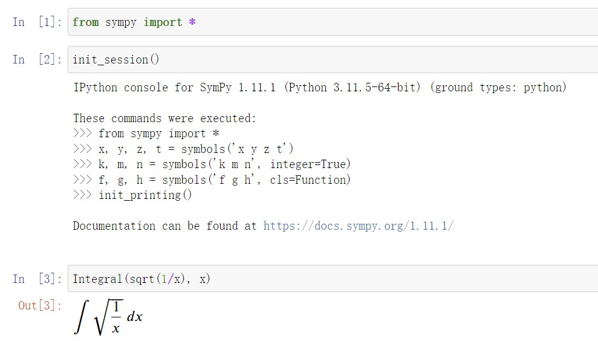

:::note
确保你安装好了Jupyter Notebook，在Jupyter中才能达成上面的效果
:::

输出了很漂亮的公式，以后都可以这样使用。

## 化简

SymPy中的 `simplify()` 可以进行智能的化简

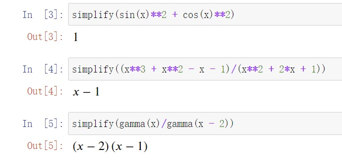

但是，`simplify()` 的输出有时候会和你的预想不同，因为并没有“最简”并没有一个严格的定义。

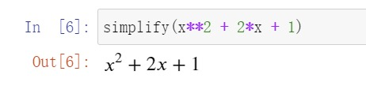

想要得到 $(x+1)^2$ 应该使用 `factor()`。

而且，`simplify()` 会调用多种化简函数，为了方便，一般在交互式界面里使用 `simplify()` 。如果在程序里使用，会造成运行效率低下。当你知道需要化简成什么形式时，应该使用对应的化简函数。这样不仅运行快，而且输出的格式是固定的。

### 一些常用的化简函数

1. `expand()`展开，如
$$(x + 2)*(x - 3) = x^2 - x - 6$$
2. `factor()`因式分解，如
$$x^{2} z + 4 x y z + 4 y^{2} z = z \left(x + 2 y\right)^{2}$$
如果希望得到所有因子的列表，用`factor_list()`
3. `collect(expr, x)`将x作为主元整理expr。如
$$x^{3} - x^{2} z + 2 x^{2} + x y + x - 3 = x^{3} + x^{2} \cdot \left(2 - z\right) + x \left(y + 1\right) - 3$$
4. `cancel()`对分子分母自动消去共同因子，如
$$\frac{x^{2} + 2 x + 1}{x^{2} + x} = \frac{x + 1}{x}$$
5. `apart()`会执行部分因式分解（Partial fraction decomposition）
6. `trigsimp()`是三角函数版本的`simplify()`会智能地化简三角函数表达式。
7. `expand_trig()`会使用和差角、二倍角等公式展开表达式，如
$$\sin{\left(x + y \right)} + \tan{\left(2 x \right)} = \sin{\left(x \right)} \cos{\left(y \right)} + \sin{\left(y \right)} \cos{\left(x \right)} + \frac{2 \tan{\left(x \right)}}{1 - \tan^{2}{\left(x \right)}}$$
8. `expr.rewrite(function)`尝试用function表示expr，如
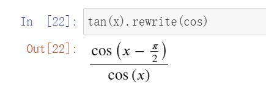

SymPy中的化简函数还有很多，这里只是一些常用的。

## 微积分

SymPy提供了完善的微积分支持：

### 求导

`diff(expr, x)`可以求expr关于x的导数，也可以写成`expr.diff(x)`。

`diff(expr, x，x, x)`可以对x求三阶导，也可以写成`diff(expr, x，3)`或`expr.diff(x, 3)`。

`Derivative()`可以创建一个导数但不计算它


对未计算的导数使用`.doit()`可以计算它。

### 积分

`integrate(exp(-x), (x, 0, oo))`将会计算

$$\int\limits_{0}^{\infty} e^{- x}\, dx = 1$$

其中`oo`是两个“o”，用来表示无穷大。

`integrate(exp(-x**2 - y**2), (x, -oo, oo), (y, -oo, oo))`将会计算

$$\int\limits_{-\infty}^{\infty}\int\limits_{-\infty}^{\infty} e^{- x^{2} - y^{2}}\, dx\, dy = \pi$$

和上面求导一样，`Integral`会创建一个积分但是不计算它，`.doit()`可以计算未计算的积分。

### 极限

`limit(sin(x)/x, x, 0)`将会计算

$$\lim_{x \to 0^+}\left(\frac{\sin{\left(x \right)}}{x}\right) = 1$$


计算单侧极限，可以向第三个参数传入`'+'`或`'-'`。`limit(1/x, x, 0, '-')`将会计算

$$\lim_{x \to 0^+} \frac{1}{x} = \infty$$

同上，`Integral`会创建一个未计算的极限，`.doit()`可以计算它。

### 计算某点处的级数展开

用`expr.series(x, a, n)`会给出表达式在 x = a 处的 n 阶展开。

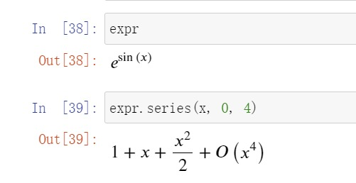

不想要那个表示余项的O，就用`.removeO()`

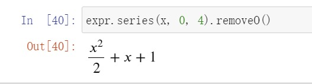

## 解方程

### 求解方程

在前面已经提到过，SymPy中表达相等应该用`Eq()`而不是`==`或`=`

`用solveset(equation, x)`可以求equation关于x的解集，如果等式右边是0，也可以不写成`solveset(Eq(expr, 0), x)`，直接写成`solveset(expr, x)`，例如：

```
>>> solveset(Eq(x**2, 1), x)
{-1, 1}
>>> solveset(x**2 - 1, x)
{-1, 1}
```

如果无解，将返回 $\varnothing$ ，如果无法求解，会返回一个条件集合。

```
>>> solveset(exp(x), x)     # 无解
∅
>>> solveset(cos(x) - x, x)  # 无法求解
{x │ x ∊ ℂ ∧ (-x + cos(x) = 0)}
```

### 求解线性方程组

使用`linsolve()`

```
>>> linsolve([x + y + z - 1, x + y + 2*z - 3 ], (x, y, z)) # 等式列表形式
{(-y - 1, y, 2)}
>>> linsolve(Matrix(([1, 1, 1, 1], [1, 1, 2, 3])), (x, y, z)) # 增广矩阵形式
{(-y - 1, y, 2)}
>>> M = Matrix(((1, 1, 1, 1), (1, 1, 2, 3))) # A*x = b 形式
system = A, b = M[:, :-1], M[:, -1]
linsolve(system, x, y, z)
{(-y - 1, y, 2)}
```

### 求解非线性方程组

使用`nonlinsolve()`

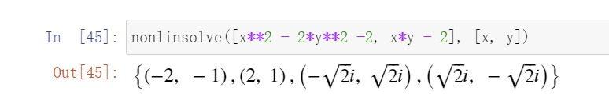

### 获得多项式的重根数

`solveset()`返回的都是不重复的根，要获得多项式的重根数，可以使用`roots()`

```
>>> solveset(x**3 - 6*x**2 + 9*x, x)
{0, 3}
>>> roots(x**3 - 6*x**2 + 9*x, x)
{0: 1, 3: 2}
```

### 求解微分方程

使用`dsolve()`

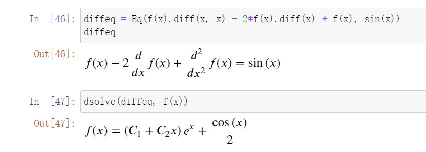

## 矩阵

`Matrix()`可以创建矩阵，参数是一个二维数组。如果传入了一维数组，默认会生成一个列向量。

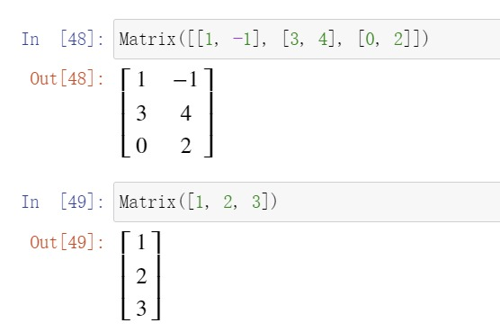

与 SymPy 中的其他对象不同，`Matrix` 是可变的。这意味着它们可以就地修改。这样的缺点是 `Matrix` 不能用于需要不可变的地方，例如其他 SymPy 表达式内部或作为字典的键。要用不可变版本的 Matrix，可以使用 `ImmutableMatrix`。

`shape(M)`返回一个元组，描述了矩阵的形状。

`.row(0)`可以得到第一行，`.col(-1)`可以得到最后一列，负数下标倒序访问这一点和 Python 中的数组是一样的。

`.col_del()`和``.row_del()`可以删除行或列。`.row_insert`和`.col_insert`可以插入行或列。

```
>>> M.col_del(0)
>>> M
⎡2  3⎤
⎢    ⎥
⎣0  4⎦
>>> M.row_del(1)
>>> M
[2  3]
>>> M
[2  3]
>>> M = M.row_insert(1, Matrix([[0, 4]]))
>>> M
⎡2  3⎤
⎢    ⎥
⎣0  4⎦
>>> M = M.col_insert(0, Matrix([1, -2]))
>>> M
⎡1   2  3⎤
⎢        ⎥
⎣-2  0  4⎦
```

### 基本操作

`+` `*` `**`，分别代表加法，乘法和乘方，矩阵求逆就是`M**-1`

`M.T`返回矩阵的转置。

`eye(n)`、`ones(n, m)`、`zeros(n, m)`分别可以用来创建单位矩阵、全1矩阵和零矩阵。

`diag()`可以创建对角矩阵

```
>>> diag(-1, ones(2, 2), Matrix([5, 7, 5]))
⎡-1  0  0  0⎤
⎢           ⎥
⎢0   1  1  0⎥
⎢           ⎥
⎢0   1  1  0⎥
⎢           ⎥
⎢0   0  0  5⎥
⎢           ⎥
⎢0   0  0  7⎥
⎢           ⎥
⎣0   0  0  5⎦
```

### 其他操作

 - 行列式：`.det()`
 - 转化为简化行阶梯矩阵：`.rref()`，返回一个元组，第一个元素是简化行阶梯矩阵，第二个元素是一个存放了阶梯头所在列的列标的元组。
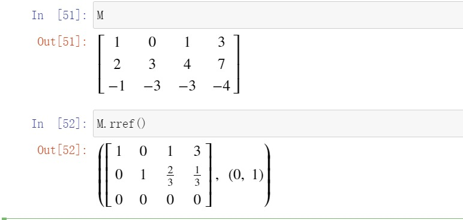
 - 子空间：`.nullspace()` 零空间、 `.columnspace()`列空间、 `rowspace()`行空间。
 - `.eigenvals()`特征值、`.eigenvects()`特征向量、`.charpoly(lamda)`特征多项式、`.diagonalize()`对角化。

### 一个实例

矩阵$A=\left[
\begin{array}{llll}
	1  & 2  & 3   & 4   \\
	2  & -1 & -2  & a^2 \\
	-1 & -7 & -11 & a
\end{array}\right]$是一个线性方程组的增广矩阵，问$a$取多少的时候，该方程组有解？

输入以下代码，即可解出，当 $a = -3$ 或 $a = 4$ 时方程组有解。

```python
a, x1, x2, x3 = symbols('a x1 x2 x3')
A = Matrix([
    [1, 2, 3],
    [2, -1, -2],
    [-1, -7, -11]
])
b = Matrix([4, a**2, a])
x = Matrix([x1, x2, x3])
solve(A*x - b)
```

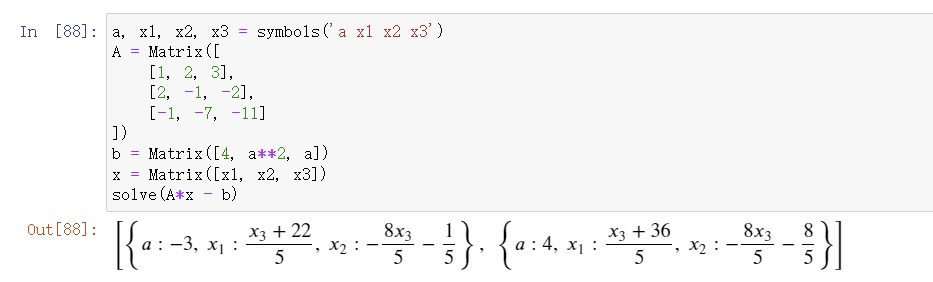
