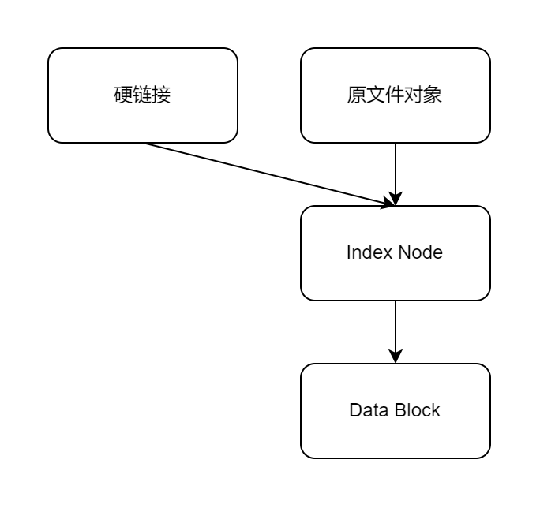
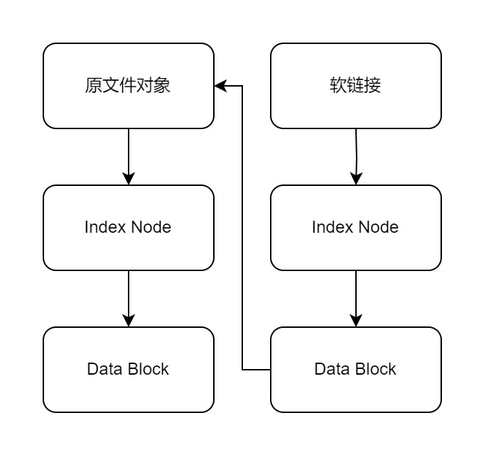

## inode

inode（index node），索引节点，是文件系统中用来储存文件元数据（metadata）的数据结构，例如文件储存的位置、创建时间、最后修改时间、所有者、访问权限等（但不包括名字）。每一个inode在创建的时候都会分配一个唯一的编码，知道了这个编码，就可以查到文件的元数据。

inode文件系统会将储存空间分成两个连续的区域，一个是由inode组成的表，另一个储存了文件的内容数据。读取文件时先通过inode找到文件储存的位置，再读取文件。

类Unix系统中的目录其实就是一种特殊的文件，也有自己的inode。这个特殊的文件中保存了所有包含的文件和子目录的名称以及它们的inode号码。访问目录，就是在读取目录这个特殊的文件中的内容。

## 硬链接与软链接

在Linux中，使用`ln <target> <link_name>`命令可以创建链接，默认创建的是 **硬链接（hard link）**。加上`-s`（代表soft）可以创建 **软链接（soft link）**。那么，两者有何区别？

首先要强调的是，在日常的使用中，软硬链接几乎是一样的，他们的区别在于底层的实现。

### 硬链接

硬链接实际上新建了一个指向与原来文件相同inode的链接，每一个inode都包含一个“链接数”，记录了有多少个硬链接指向此inode，当硬链接计数归零，代表这个inode指向的文件数据不再被需要，操作系统会释放其数据块和inode本身。这和编程语言中的GC（garbage collection）机制非常类似。

正因为硬链接指向了相同的inode，因此创建硬链接必须要在同一分区内（无论是物理分区或逻辑分区），因为在其他分区是找不到这个inode的。

用图片解释比较清楚：



从图中可以看出，新建的硬链接实际上和原本的文件对象地位是平等的，若新建了硬链接后，又`rm`删除原文件对象，实际上和`mv`命令移动文件是一样的效果。

### 软链接

软链接其实就和windows中的快捷方式是一样的效果。软链接储存了指向的文件或目录的位置，当源文件移动、重命名、删除，软链接就会变成死链（dangling link）。

```txt
$ mkdir -p ./some/path
$ echo 'some text' > ./some/path/source.txt
$ ln -s ./some/path/source.txt soft_link
$ cat soft_link
some text
$ rm -f ./some/path/source.txt
$ cat soft_link
cat: soft_link: No such file or directory
```

软链接失效了，输出“No such file or directory”

作为对比，试一下硬链接是什么效果。

```txt
$ echo 'some text' > ./some/path/source.txt
$ ln ./some/path/source.txt hard_link
$ cat hard_link
some text
$ rm -f ./some/path/source.txt
$ cat hard_link
some text
```

可以看到删除了原来的文件，硬链接并没有失效。

同样用图片说明软链接的原理：



## 创建目录的时候发生了什么

创建一个目录时，实际做了三件事：

1. 在“父目录文件”中增加一个条目，指向这个目录
2. 为新的目录分配一个inode
3. 为新的目录再分配一个数据块（data block），保存包含的文件与子目录。

新的“目录文件”中自动生成两个子目录的条目，名称分别是：“.”和“..”。“.”其实是该目录的一个“硬链接”。“..”其实是该目录的父目录的一个硬链接。

<!-- ## 一个我遇到的例子

这个博客在服务器上的地址是“/data/www/hexo”，我使用nginx代理静态文件，设置路由“/”到“/data/www/hexo”。

后来我写了一个js小游戏（详见[我用JavaScript写了一个小游戏！](/post/068582ed9a63/)）。放在“/data/www/js-game”，我想要让用户访问“/js-game”时路由到“/data/www/js-game”。我没有直接拷贝“js-game”到hexo目录下，因为这会造成二者同时进行git版本控制的困难。

于是我使用软链接将“hexo/js-game”链接到“../js-game”，轻松解决。 -->

## 参考文章

[https://cloud.tencent.com/developer/article/2253464](https://cloud.tencent.com/developer/article/2253464)

[https://zh.wikipedia.org/wiki/Inode](https://zh.wikipedia.org/wiki/Inode)

[https://mp.weixin.qq.com/s?__biz=MjM5Nzk1NzI2MQ==&mid=2649353722&idx=2&sn=31acc34f567c9fa3ced7cd451e98441a&chksm=becf561889b8df0ef65558380f8e198cc1a7a1998c8d803be9be2755714263fe4a4653953ea1&scene=27](https://mp.weixin.qq.com/s?__biz=MjM5Nzk1NzI2MQ==&mid=2649353722&idx=2&sn=31acc34f567c9fa3ced7cd451e98441a&chksm=becf561889b8df0ef65558380f8e198cc1a7a1998c8d803be9be2755714263fe4a4653953ea1&scene=27)

[https://www.bilibili.com/read/cv20365690/](https://www.bilibili.com/read/cv20365690/)
