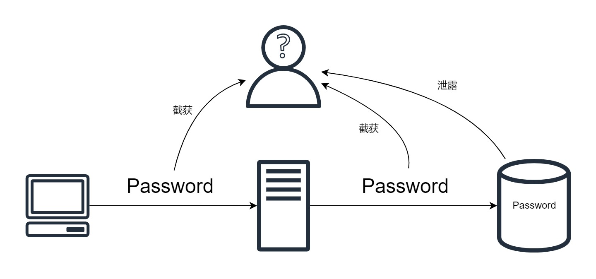

## 简介

本文将从攻防两方的视角出发，简单讲解在数据库中储存密码的正确方法。

## 明文储存

我们都知道不应该在数据库中明文储存密码，假设有个粗心的程序员忘记了这一点怎么办呢？



有两种可能，攻击者可能可以在密码传递的过程中截取密码（假如传递的过程没有其他的保护），或者数据库泄露给了攻击者。

如果整个数据库都泄露了（拖库），情况非常糟糕，因为你的所有用户的密码都泄露了，你的所有用户数据都被开放给了攻击者，所有用户的身份认证都失效了！

## 储存哈希值

为了避免这一点，我们可以不储存明文密码，而是储存密码的哈希值$Hash(\text{Password})$。

一个理想的哈希加密函数需要满足这些条件：

1. 一致性：对于相同的输出，输出应该是相同的， $Hash(x) = Hash(x)$
2. 不可逆性：难以将哈希值还原成原始数据，即 $Hash^{-1}(Hash(x)) = x$ 是难以计算的。
3. 抗碰撞性：对于随机的 $x$ 和 $y$, 若 $x \neq y$ ，则 $Hash(x) = Hash(y)$ 的概率是极小的。
4. ……（还有些其他性质可以让这个函数更好，比如 $Hash(x)$ 的计算很快）

有了一致性，我们就可以通过不传递明文，而是传递哈希值的方法，判断用户输入的密码是否正确。设置密码时，储存 $Hash(\text{Password})$ ，而不储存 $\text{Password}$ 。当用户输入密码，如果$Hash(\text{Input}) = Hash(\text{Password})$ ，我们就认为 $\text{Input} = \text{Password}$ ，从而验证了密码正确。

有了不可逆性，我们就可以防止攻击者从 $Hash(\text{Password})$ 反推出 $\text{Password}$ ，即使攻击方拿到了 $Hash(\text{Password})$， 也没有任何用处。

需要注意的是，哈希函数的性质里不要求它是一个单射，也就是说，可能存在和 $\text{Password}$ 不相同的序列，设为 $\text{Cnffjbeq}$ ，它的哈希值和密码是一样的，根据我们对用户输入密码的处理方式，只要 $Hash(\text{Cnffjbeq}) = Hash(\text{Password})$ ，我们就认为用户通过了身份验证，然而用户并没有输入正确的密码。这叫做哈希碰撞（Hash Collision），这怎么办呢？

这里就要用到第三个性质了，我们的第三个性质保证了这种情况的概率非常低，因此对这种情况的发生不必担心，只要保证有效的密码（设置的密码+会发生碰撞的密码）占所有可能密码的比例很小，比如 $\frac{1}{10^{100}}$ ，攻击者想要暴力枚举试出密码就是困难的。

常见的哈希加密函数有：md5、SHA-1、SHA-2、SHA-3等。一些加密算法由于时代的发展，被破解的速度越来越快，因而变得越来越不安全，如md5。但md5因为计算速度快，仍然在数据完整性检查中广泛应用。目前，SHA-2因为计算速度较快，安全性也较高，被广泛使用。

## 彩虹表攻击（Rainbow Attack）

攻击者可以构造一个巨大的弱密码的哈希值的集合，称作彩虹表，然后用彩虹表比对数据库中的哈希值，一旦发现相同，就成功破解了密码。

$$
Rainbow=\left[
\begin{array}{c}
    Hash(\text{12345678})\\
    Hash(\text{qwerty})\\
    Hash(\text{Password})\\
    Hash(\text{20030101})\\
    Hash(\text{00000000})\\
    \cdots
\end{array}\right]
$$

## 密码加盐

但是彩虹表攻击可以通过给密码加盐轻松解决，我们为每一个密码都生成一个随机数，称作“盐”，然后将盐储存到单独的表中。储存密码时，我们储存 $Hash(\text{Password} + \text{salt})$ （这里的加不一定是简单的字符串连接，可以是间隔插入、打乱插入等）。盐是不需要保密的，即使攻击者知道了盐的内容，也无法破解密码。**加盐的操作可以轻松使攻击者的彩虹表失效，因为彩虹表是针对弱密码进行的，加了盐之后相当于密码都变成强密码了。**

例如：

```txt
假设密码和盐分别为
Password = 12345678
salt = Cl9W8TGGMCJj1bZ0SA14Cmb9tCG21i3F
则加了盐的密码就是
salted_Password = 12345678Cl9W8TGGMCJj1bZ0SA14Cmb9tCG21i3F
```

这样，即使储存密码的数据库泄露了，攻击者也没有办法访问用户的数据，保证了数据的安全性。
