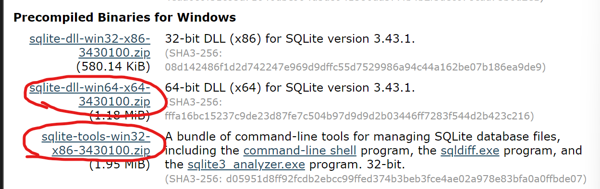
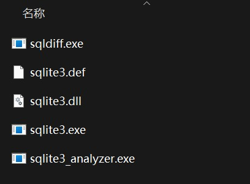
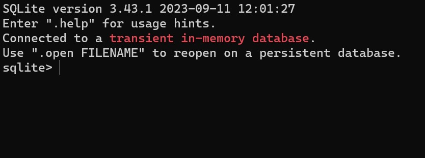

## 1. 引入

现代的程序，无论是网站、手机app等等，往往都要处理大量的数据，这些数据需要通过**数据库（Database）**来管理。为了便于程序与数据库之间的交互，我们引入一门语言，**SQL（Structured Query Language，结构化查询语言）**。使用SQL可以方便地对 ***关系型数据库（Relational Database）*** 进行增、查、改、删等操作。

*如果你不知道关系型数据库和非关系型数据库是什么，可以看看[我的这篇文章](/posts/relation-database-and-nosql-database/)*

## 2. SQLite的安装

为了学习SQL，我们先来安装一个轻量级的关系型数据库 **SQLite** ，请与SQL区分，SQL是一种查询语言，SQLiete是一种数据库。

因为我们只是用来学习SQL语言，所以比起Oracle这样的庞然大物，使用轻量级的SQLite是更好的选择。当然，你学会了SQL之后，可以自由选择符合你需求的数据库，关系型数据库都使用统一的SQL语言，无需再次学习。

安装SQLite非常简单，访问[SQLite官网的下载页面](https://sqlite.org/download.html)，下载你的系统对应的带有“Precompiled”前缀的压缩包。以windows x64系统为例，下载这两个文件，并把他们解压到相同的文件夹下面，例如“C:\\sqlite”。





此时双击sqlite3.exe，看到以下界面就成功了，连安装都不需要，只要解压，够轻量级吧。



但是当你在命令行输入`sqlite3`命令时会发现，系统找不到这个命令，这是因为没有在系统的环境变量path里加上sqlite3.exe所在的路径（例如C:\\sqlite）。假如你不知道环境变量path是什么，可以看看我的[这篇文章](/posts/environment-variable-path/)。

添加了环境变量后，在cmd/powershell/bash或者你喜欢的任何shell里输入`sqlite3`，你应该能看到和上面双击exe一样的输出。

在命令行里键入以下命令：

```bash
sqlite3
```

如果你配置好了环境，应该可以看到以下输出。

```bash
# SQLite version 3.43.1 2023-09-11 12:01:27
# Enter ".help" for usage hints.
# sqlite>
```

看到输入提示符变成“sqlite>”，我们就进入了sqlite的命令行。

## 3. 创建一个表

使用以下命令来创建一个表，注意所有的SQL语句末尾都要有分号。

```sql
CREATE TABLE 表名 ('列名' 数据类型, ...);
```

*不同的数据库可能对相同的类型有不同的名称、不同的长度、数据范围*
以sqlite为例，常用的数据类型有以下几种：

|数据类型|描述|
|---|---|
|NULL|空值NULL|
|INTEGER|整数，具体位数取决于插入数据的大小|
|REAL|8位IEEE浮点数|
|TEXT|字符串|
|BLOB|二进制大对象（Binary Large Object）|

另外，SQLite还提供了两个修饰符：`NOT NULL`和`UNIQUE`，分别表示这个字段不能为空，以及这个字段必须唯一。

根据我们的需求，创建一个这样的表：

```sql
CREATE TABLE books ('title' TEXT NOT NULL, 'price' REAL, 'sales' INTEGER, 'category' TEXT);
```

我们先把一些数据拷贝到books.csv中（csv是Comma-Separated Values，逗号分隔的值的缩写）

*数据是ChatGPT生成的，所以不要在意一些不合理的小细节*

 ```txt
The Great Gatsby,50.99,4,Fiction
To Kill a Mockingbird,25.99,3,Fiction
Pride and Prejudice,40.99,2,Fiction
1984,35.99,1,Science Fiction
The Catcher in the Rye,60.99,5,Fiction
Animal Farm,30.5,2,Fiction
The Hobbit,45,4,Fantasy
The Lord of the Rings,55.99,3,Fantasy
Harry Potter and the Sorcerer's Stone,20,1,Fantasy
The Chronicles of Narnia,15.98,5,Fantasy
Moby Dick,45.99,3,Fiction
The Odyssey,30.99,2,Classic
To the Lighthouse,40,4,Classic
The Adventures of Tom Sawyer,25.1,2,Classic
War and Peace,50.99,4,Classic
Crime and Punishment,35.99,1,Classic
The Alchemist,55.99,2,Fiction
Fahrenheit 451,20.99,4,Science Fiction
The Picture of Dorian Gray,15.98,5,Classic
Brave New World,60.3,3,Science Fiction
```

将sqlite切换为csv模式并导入这个.csv文件。

```sql
.mode csv
.import books.csv books
```

*所有以逗号开头的命令都不属于SQL，而是SQLite的语法*

### 查看表

这样可以查看有哪些表，每个表有哪些字段：

```sql
.schema
```

这样查看表的内容：

```sql
SELECT 列名,... FROM 表名;
```

切换到box模式，这样的输出比较好看，然后我们用`SELECT`命令查看一下导入的数据。

```sql
.mode box
SELECT * FROM books;
```

“*”表示通配符，即选择所有的列，在这里相当于`SELECT name, price, sales FROM books;`

可以看到输出了刚刚导入的表格

```txt
┌───────────────────────────────────────┬───────┬───────┬─────────────────┐
│                 title                 │ price │ sales │    category     │
├───────────────────────────────────────┼───────┼───────┼─────────────────┤
│ The Great Gatsby                      │ 50.99 │ 4     │ Fiction         │
│ To Kill a Mockingbird                 │ 25.99 │ 3     │ Fiction         │
│ Pride and Prejudice                   │ 40.99 │ 2     │ Fiction         │
│ 1984                                  │ 35.99 │ 1     │ Science Fiction │
│ The Catcher in the Rye                │ 60.99 │ 5     │ Fiction         │
│ Animal Farm                           │ 30.5  │ 2     │ Fiction         │
│ The Hobbit                            │ 45.0  │ 4     │ Fantasy         │
│ The Lord of the Rings                 │ 55.99 │ 3     │ Fantasy         │
│ Harry Potter and the Sorcerer's Stone │ 20.0  │ 1     │ Fantasy         │
│ The Chronicles of Narnia              │ 15.98 │ 5     │ Fantasy         │
│ Moby Dick                             │ 45.99 │ 3     │ Fiction         │
│ The Odyssey                           │ 30.99 │ 2     │ Classic         │
│ To the Lighthouse                     │ 40.0  │ 4     │ Classic         │
│ The Adventures of Tom Sawyer          │ 25.1  │ 2     │ Classic         │
│ War and Peace                         │ 50.99 │ 4     │ Classic         │
│ Crime and Punishment                  │ 35.99 │ 1     │ Classic         │
│ The Alchemist                         │ 55.99 │ 2     │ Fiction         │
│ Fahrenheit 451                        │ 20.99 │ 4     │ Science Fiction │
│ The Picture of Dorian Gray            │ 15.98 │ 5     │ Classic         │
│ Brave New World                       │ 60.3  │ 3     │ Science Fiction │
└───────────────────────────────────────┴───────┴───────┴─────────────────┘
```

当然，不一定要选择所有的列，如果输入`SELECT name FROM books;`就只会显示所有的书名。试一试吧！

### 退出/打开数据库

输入`.quit`退出SQLite。

你会发现，SQLite为你在目录下自动创建了一个名为“books.db”的文件。

下一次打开数据库只需要输入`sqlite3 books.db`即可恢复原来的数据。

## 4. 基本操作

数据库有四个基本操作<span style="color:red">CRUD</span>，即<span style="color:red">C</span>reate增、<span style="color:red">R</span>ead查、<span style="color:red">U</span>pdate改、<span style="color:red">D</span>elete删，在SQL中分别对应以下语句。

- 增：CREATE, INSERT
- 查：SELECT
- 改：UPDATE
- 删：DELETE, DROP

### 查询

我们已经学会了使用`SELECT`来查询数据，现在我们来学习一些常用的函数。

SQL中自带了很多函数，常用的有这几种：

|函数|描述|
|---|---|
|AVG|求平均数|
|COUNT|计数|
|DISTINCT|去重|
|LOWER|小写|
|UPPER|大写|
|MAX|取最大值|
|MIN|取最小值|

### DISTINCT

假如我们想要查看所有的分类，可以这样子写:

```sql
SELECT DISTINCT(category) FROM books;
```

输出:

```txt
┌─────────────────┐
│    category     │
├─────────────────┤
│ Fiction         │
│ Science Fiction │
│ Fantasy         │
│ Classic         │
└─────────────────┘
```

### COUNT

查看有多少种分类：

```sql
SELECT COUNT(DISTINCT(category)) FROM books; 
```

输出是这样的

```txt
┌───────────────────────────┐
│ COUNT(DISTINCT(category)) │
├───────────────────────────┤
│ 4                         │
└───────────────────────────┘
```

### AS

这个“COUNT(DISTINCT(category))”有点太长了，我们可以给它起个别名，比如说叫“n”。

SQL中有一个关键字`AS`可以实现这个功能。

```sql
SELECT COUNT(DISTINCT(category)) AS n FROM books; 
```

输出：

```txt
┌───┐
│ n │
├───┤
│ 4 │
└───┘
```

### WHERE

`WHERE`可以用来指定选择的条件，如

```sql
SELECT COUNT(*) FROM books WHERE category = 'Fiction';
```

结果显示一共有7本小说

```txt
┌──────────┐
│ COUNT(*) │
├──────────┤
│ 7        │
└──────────┘
```

### AND 和 OR

也可以使用`AND`或者`OR`来连接多个条件，比如我想知道有哪些经典小说的价格在30或以上。

```sql
SELECT * FROM books WHERE category = 'Classic' AND price >= 30;
```

非常简单对吧？

```txt
┌──────────────────────┬───────┬───────┬──────────┐
│        title         │ price │ sales │ category │
├──────────────────────┼───────┼───────┼──────────┤
│ The Odyssey          │ 30.99 │ 2     │ Classic  │
│ To the Lighthouse    │ 40.0  │ 4     │ Classic  │
│ War and Peace        │ 50.99 │ 4     │ Classic  │
│ Crime and Punishment │ 35.99 │ 1     │ Classic  │
└──────────────────────┴───────┴───────┴──────────┘
```

也可以自己试试把`AND`换成`OR`。

:::note
容易注意到，上面写的SQL语句的关键字都是使用全大写的，其实小写的命令也能被识别，大写的风格是一种传统的风格。
:::

## 5. 条件与分组

上一节里我们使用了`WHERE`关键字进行了条件的筛选，实际上这样的关键字还有很多，以下是常用的一些。

### GROUP BY

将数据按某个字段分组

```sql
SELECT category, COUNT(*) FROM books GROUP BY category;
```

输出：

```txt
┌─────────────────┬──────────┐
│    category     │ COUNT(*) │
├─────────────────┼──────────┤
│ Classic         │ 6        │
│ Fantasy         │ 4        │
│ Fiction         │ 7        │
│ Science Fiction │ 3        │
└─────────────────┴──────────┘
```

### ORDER BY

按某个字段排序，例如按每种分类的个数排序。

```sql
SELECT category, COUNT(*) FROM books GROUP BY category ORDER BY COUNT(*);
```

输出：

```txt
┌─────────────────┬──────────┐
│    category     │ COUNT(*) │
├─────────────────┼──────────┤
│ Science Fiction │ 3        │
│ Fantasy         │ 4        │
│ Classic         │ 6        │
│ Fiction         │ 7        │
└─────────────────┴──────────┘
```

默认是升序排列的，如果我们想要降序排列，需要在后面加上`DESC`（Descending，降序）。默认情况和后面加上`ASC`是一样的（Ascending，升序）

```sql
SELECT category, COUNT(*) FROM books GROUP BY category ORDER BY COUNT(*) DESC;
```

输出

```txt
┌─────────────────┬──────────┐
│    category     │ COUNT(*) │
├─────────────────┼──────────┤
│ Fiction         │ 7        │
│ Classic         │ 6        │
│ Fantasy         │ 4        │
│ Science Fiction │ 3        │
└─────────────────┴──────────┘
```

### LIMIT

`LIMIT`可以限制最多显示的数据条数，让我们看看最贵的5本书：

```sql
SELECT title, price FROM books ORDER BY price DESC LIMIT 5;
```

输出：

```txt
┌────────────────────────┬───────┐
│         title          │ price │
├────────────────────────┼───────┤
│ The Catcher in the Rye │ 60.99 │
│ Brave New World        │ 60.3  │
│ The Lord of the Rings  │ 55.99 │
│ The Alchemist          │ 55.99 │
│ The Great Gatsby       │ 50.99 │
└────────────────────────┴───────┘
```

### LIKE

`LIKE`字句允许你使用通配符进行模糊匹配。

1. “%” 表示0或任意个字符（包括数字）
2. “_” 表示1个字符（包括数字）

我想找出所有以“The”开头的书，可以这样：

```sql
SELECT title FROM books WHERE title LIKE 'The%'; 
```

输出：

```txt
┌──────────────────────────────┐
│            title             │
├──────────────────────────────┤
│ The Great Gatsby             │
│ The Catcher in the Rye       │
│ The Hobbit                   │
│ The Lord of the Rings        │
│ The Chronicles of Narnia     │
│ The Odyssey                  │
│ The Adventures of Tom Sawyer │
│ The Alchemist                │
│ The Picture of Dorian Gray   │
└──────────────────────────────┘
```

## 6. 插入、更新与删除

### INSERT

```sql
INSERT INTO 表名 (列名, ...) VALUES (值, ...);
```

这样可以插入新的数据，例如插入一本新书“A Wrinkle in Time”。

```sql
INSERT INTO books (title, price, sales, category) VALUES ('A Wrinkle in Time',23.99,1,'Fantasy');
```

键入`SELECT * FROM books;`可以看到已经成功地插入了新的书。

### UPDATE

用`UPDATE`将所有“Science Fiction”分类改名为“Sci-fi”可以这样写：

```sql
UPDATE books SET category = 'Sci-fi' WHERE category = 'Science Fiction';
```

这是我们接触到的第一个“破坏性”的命令，所以键入命令时请double check一下，确认这就是你想要的，**避免造成严重的后果** 。实际的项目中一般有权限控制、备份、生产环境隔离等方法来避免这种悲剧的发生，但是养成这个好习惯也很重要。

### DELETE

这个命令比`UPDATE`更加危险，因此请确保你所写下的命令，就是你想要的，不要漏掉任何条件语句如`WHERE`。

下面的命令可以删除所有销量不高于2的书：

```sql
DELETE FROM books WHERE sales <= 2;
```

现在的数据是这样的：

```txt
┌────────────────────────────┬───────┬───────┬──────────┐
│           title            │ price │ sales │ category │
├────────────────────────────┼───────┼───────┼──────────┤
│ The Great Gatsby           │ 50.99 │ 4     │ Fiction  │
│ To Kill a Mockingbird      │ 25.99 │ 3     │ Fiction  │
│ The Catcher in the Rye     │ 60.99 │ 5     │ Fiction  │
│ The Hobbit                 │ 45.0  │ 4     │ Fantasy  │
│ The Lord of the Rings      │ 55.99 │ 3     │ Fantasy  │
│ The Chronicles of Narnia   │ 15.98 │ 5     │ Fantasy  │
│ Moby Dick                  │ 45.99 │ 3     │ Fiction  │
│ To the Lighthouse          │ 40.0  │ 4     │ Classic  │
│ War and Peace              │ 50.99 │ 4     │ Classic  │
│ Fahrenheit 451             │ 20.99 │ 4     │ Sci-fi   │
│ The Picture of Dorian Gray │ 15.98 │ 5     │ Classic  │
│ Brave New World            │ 60.3  │ 3     │ Sci-fi   │
└────────────────────────────┴───────┴───────┴──────────┘
```

## 7. 主键与外键

### 准备

为了介绍 **主键（Primary Keys）** 与外键 **（Foreign Keys）** ，我们再新建一个数据库。

```bash
sqlite3 movies.db
# SQLite version 3.43.1 2023-09-11 12:01:27
# Enter ".help" for usage hints.
# sqlite>
```

假如movies.db不存在，SQLite会自动创建它。

我用ChatGPT又生成了一些数据（不确定有没有错误）。

movies.csv:（两列分别代表id和title）

```txt
1,The Dark Knight
2,Inception
3,The Shawshank Redemption
4,The Godfather
5,The Godfather: Part II

......

```

stars.csv:（两列分别代表id和name）

```txt
1,Christian Bale
2,Heath Ledger
3,Aaron Eckhart
4,Michael Caine
5,Gary Oldman

......

```

movies_stars.csv:（两列分别代表movie_id和star_id）

```txt
1,1
1,2
1,3
1,4
1,5

......

```

[下载这三个文件](/files/SQLdata.zip)

创建三个相应的表格，并载入数据：

```sql
CREATE TABLE movies (
  'id' INTEGER PRIMARY KEY,
  'title' TEXT
);
CREATE TABLE stars (
  'id' INTEGER PRIMARY KEY,
  'name' TEXT
);
CREATE TABLE movies_stars (
  'movie_id' INTEGER,
  'star_id' INTEGER,
  FOREIGN KEY('movie_id') REFERENCES movies('id'),
  FOREIGN KEY('star_id') REFERENCES stars('id')
);
.mode csv
.import movies.csv movies
.import stars.csv stars
.import movies_stars.csv movies_stars
.mode box
```

### 主键和外键

我们这次的数据里，每个电影都对应了多名主演，而每个演员也可能出演多部电影，所以我们使用一张movies_stars表格来记录电影和主演之间的关系，而不是直接放在同一个表格的另一列中。

主键是一种约束，一个表只能有一列主键，每个主键唯一，且不可以为空。`'id' INTEGER PRIMARY KEY`会将id设置为主键。

外键可以连接其他的表的主键，设置外键的约束可以防止插入外部表中不存在的主键。按以下格式：

```sql
CREATE TABLE movies_stars (
  ......,
  FOREIGN KEY(外键) REFERENCES 外部表(外部表的主键)
);
```

### JOIN

查看movies_stars，发现它实际上只有两列数字id，如果我们想看看这些数字id代表那哪电影或哪名演员，就要使用`JOIN`合并两张表。

```sql
SELECT 列名, ... FROM 表1 JOIN 表2 ON 条件;
```

按照上面的格式，有：

```sql
SELECT * FROM movies_stars JOIN stars ON movies_stars.star_id = stars.id LIMIT 5;
```

输出如下结果：

```txt
┌──────────┬─────────┬────┬────────────────┐
│ movie_id │ star_id │ id │      name      │
├──────────┼─────────┼────┼────────────────┤
│ 1        │ 1       │ 1  │ Christian Bale │
│ 1        │ 2       │ 2  │ Heath Ledger   │
│ 1        │ 3       │ 3  │ Aaron Eckhart  │
│ 1        │ 4       │ 4  │ Michael Caine  │
│ 1        │ 5       │ 5  │ Gary Oldman    │
└──────────┴─────────┴────┴────────────────┘
```

比如我们想知道Morgan Freeman和Tom Hardy主演了哪些电影，我们可以使用两次`JOIN`:

```sql
SELECT title, name FROM movies_stars
JOIN stars ON movies_stars.star_id = stars.id
JOIN movies ON movies_stars.movie_id = movies.id
WHERE name = 'Morgan Freeman'
OR name = 'Tom Hardy'
ORDER BY name;
```

得到以下结果：

```txt
┌──────────────────────────┬────────────────┐
│          title           │      name      │
├──────────────────────────┼────────────────┤
│ The Shawshank Redemption │ Morgan Freeman │
│ Se7en                    │ Morgan Freeman │
│ The Dark Knight Rises    │ Morgan Freeman │
│ Inception                │ Tom Hardy      │
│ The Dark Knight Rises    │ Tom Hardy      │
└──────────────────────────┴────────────────┘
```

还有一种写法，效果是一样的：

```sql
SELECT title, name FROM movies_stars, stars, movies
WHERE movies_stars.star_id = stars.id
AND movies_stars.movie_id = movies.id
AND name IN ('Morgan Freeman', 'Tom Hardy')
ORDER BY name;
```

请注意`FROM`后面写出了多个表格。

## 8. 建立索引

当数据量小的时候，查找操作几乎是瞬间完成的，但是当数据库的规模很大的时候，对数据库的搜索操作会变得很慢，因为默认情况下数据库是使用低效的线性查找，这时候就需要我们建立 **索引** 。

```sql
CREATE INDEX 索引名 ON 表名 (列名, ...);
```

```sql
CREATE INDEX title_index ON movies (title);
```

当执行这个语句之后，数据库会为这几列创建一种名为 **B树（B-Tree）** 的数据结构，将搜索加速到 $O(\log n)$ ，但同时使用的储存空间也会更多，所以推荐只在需要经常查找的字段上建立索引。

*另外，`.timer on`可以打开计时器比较执行速度，但是在我使用的这么小的数据里是看不出效果的。*

## 9. 事务

### “事务”的介绍

**事务（Transaction）** 可以将一系列数据库操作绑定在一起执行，要么一起成功，要么都不执行。

设想假如我去银行取钱，我的账户余额扣除了1000元，但是这个时候ATM机坏了，什么都没有吐出来，此时我的钱就凭空消失了。如果把“从账户里扣除1000元”和“ATM吐出1000元”绑定成一个 **事务** ，就可以避免这种情况的发生，如果ATM吐钱失败了，我的账户也不会扣钱。

还有一种情况，是David教授在CS50的课上举的例子，假如宿舍里有一个小冰箱，一天我打开冰箱发现牛奶喝完了，于是我去买牛奶，这时我的室友回来了，他也看到冰箱里没牛奶了，于是也去买。结果两个人都买了牛奶，冰箱放不下了。

买牛奶这个问题的关键在于，我的室友并不知道冰箱有没有牛奶的状态正在从“没有”更新到“有”，他只能看到冰箱里“没有”牛奶，而不知道我已经去买牛奶了。具体到数据库上，我们需要一种方法，把数据库“锁住”，让其他读取操作等待，直到数据更新完毕后再执行。

“取钱”和“买牛奶”这两个问题都可以通过SQL中的“事务”来解决，你只需要把一系列的命令用`BEGIN TRANSACTION`和`COMMIT`包裹起来就可以了。

```sql
BEGIN TRANSACTION
......
COMMIT
```

### 四大特性

事务具有<span style="color:red">ACID</span>四大特性：

1. 原子性（<span style="color:red">A</span>tomicity）：事务中的操作不可再分，要么全部成功，要么全部取消。
2. 一致性（<span style="color:red">C</span>onsistency）：事务开始前与结束后的数据都是合法的，例如甲给乙转账，转账前后他们俩的钱加起来应该不变。
3. 隔离性（<span style="color:red">I</span>solation）：事务的运行互不干扰。
4. 持久性（<span style="color:red">D</span>urability）：事务完成后，它对数据库的修改就永久提交了，不再回滚。

## 10. 在Python中使用SQL

SQL很少被单独使用，通常SQL会与其他的一些语言结合使用，比如Python、Java、 C#等等。这篇文章里，我们关注如何在Python中使用SQL操作数据库。

Python中内置了SQLite3，你只需要执行

```python
import sqlite3
```

就可以开始使用了，不需要安装任何第三方库。

```python
db = sqlite3.connect("database.db") 
# 连接到一个现有的数据库，如果没有这个文件就创建它

cur = db.cursor() 
# 创建一个cursor，才能执行SQL语句

# cur.execute(你想执行的SQL语句)
cur.execute("CREATE TABLE books ('title' TEXT NOT NULL, 'price' REAL, 'sales' INTEGER, 'category' TEXT);")  
# 创建一个表

res = cur.execute("SELECT name FROM sqlite_master")
# SQLite内置了一个名叫“sqlite_master”的表，储存了所有已创建的表

print(res.fetchone())
# 输出('books',)

cur.execute("""
    INSERT INTO books VALUES
        ('The Great Gatsby', 50.99, 4, 'Fiction'),
        ('The Lord of the Rings', 55.99, 3, 'Fantasy')
""")
db.commit()
# 插入两名学生
# 会自动地创建事务，无需手动加上“BEGIN TRANSACTION”
# 需要手动db.commit()


category = input("category:")
res = cur.execute("SELECT title FROM books WHERE category = ?", (category, ))
# 注意传入的第二个参数是一个元组，不能直接传category
# 请使用“?”占位符，不要使用 f"SELECT title FROM books WHERE category = {category}"或者其他任何方式
# 否则可能会受到SQL注入攻击（SQL injection attacks）
# “?”占位符会自动处理传入的字符串，防止SQL注入


# cur.executemany可以批量执行SQL语句，推荐使用executemany而不是for循环嵌套execute
cur.executemany("INSERT INTO books VALUES(?, ?, ?, ?);", data)
db.commit()

res = cur.execute('SELECT title, price FROM books')
for row in res:
    print(row)
'''
输出
('The Great Gatsby', 50.99)
('The Lord of the Rings', 55.99)
('To Kill a Mockingbird', 25.99)
('Pride and Prejudice', 40.99)
('To Kill a Mockingbird', 25.99)
('Pride and Prejudice', 40.99)
('1984', 35.99)
('The Catcher in the Rye', 60.99)
('Animal Farm', 30.5)
('The Hobbit', 45.0)
'''

db.close()
# 关闭数据库连接，现在可以连接别的数据库
```
