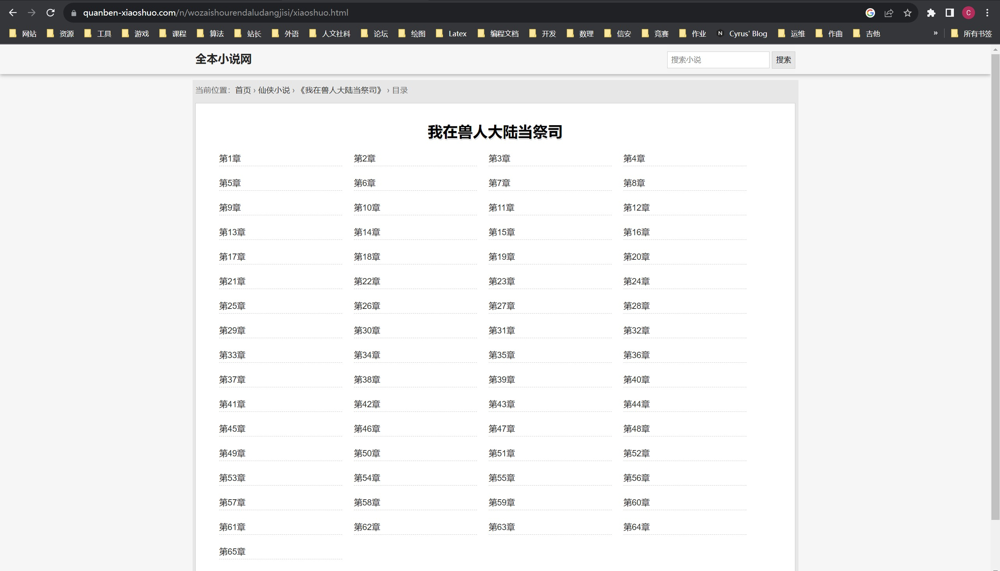
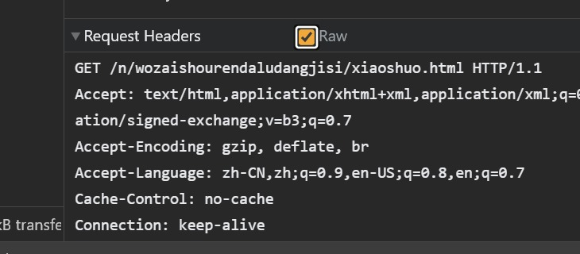
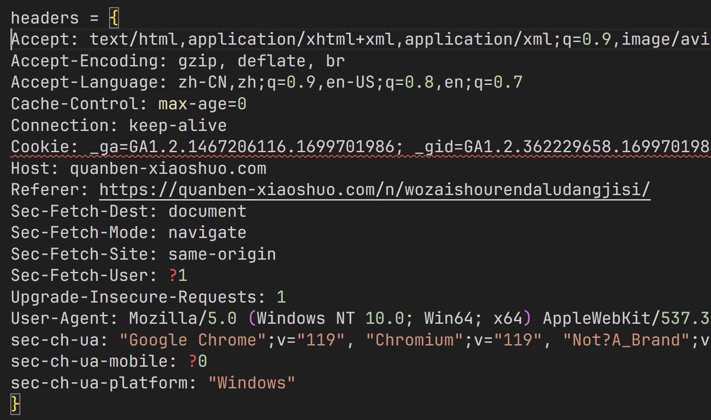
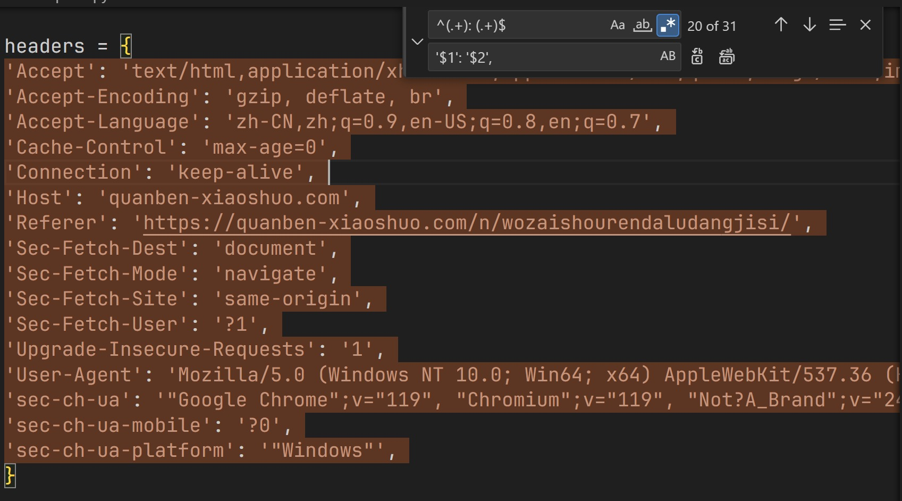
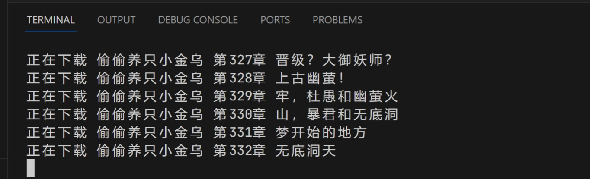

将学到的爬虫知识运用到实践中去吧！

要爬的网站是[https://quanben-xiaoshuo.com/](https://quanben-xiaoshuo.com/)，这是一个小说网站，目标是可以下载给定小说的所有章节，并保存到本地文件。

## 开始

首先，我选择的 Python 库是 `requests` 和 `lxml`，如果你没有安装这两个库，可以使用 `pip install requests` 和 `pip install lxml` 来安装

`requests` 用来发送请求并获得网页，`lxml` 用来解析网页，并使用 XPath 找到要获取的数据的位置，如果你不熟悉 XPath，可以看看我的这一篇文章 [XPath语法参考](/post/64e4e3d61f56/)

假如你更喜欢css选择器的风格，可以使用 `beautifulsoup` 这个库，两个库都很方便的

## 使用requests库获取网页内容

打开要爬取的页面[https://quanben-xiaoshuo.com/n/wozaishourendaludangjisi/xiaoshuo.html](https://quanben-xiaoshuo.com/n/wozaishourendaludangjisi/xiaoshuo.html)，看到以下内容：image.png



打开 Python 交互式编辑器，输入以下代码：

```txt
Python 3.11.4 (tags/v3.11.4:d2340ef, Jun  7 2023, 05:45:37) [MSC v.1934 64 bit (AMD64)] on win32
Type "help", "copyright", "credits" or "license" for more information.
>>> import requests
>>> r = requests.get('https://quanben-xiaoshuo.com/n/wozaishourendaludangjisi/xiaoshuo.html') 
>>> r.text
''
```

我们惊奇的发现，网页居然什么都没有返回。其实这是因为网页做了反爬措施，我们的请求的Header一看就是个机器人，我们只要从浏览器里面拷贝过来我们自己使用的请求头，就可以模拟人类访问网站，从而绕过网站的反爬措施了。

打开浏览器，我的是Chrome，按F12，然后切换到Network标签页，在左边选择当前的页面文件，在下面的Headers里找到“Request Headers”（Request Headers是你发送的Headers，Response Headers是网站返回的Headers，看英文意思就知道啦）



就可以看到以下请求头：

```txt
GET /n/wozaishourendaludangjisi/xiaoshuo.html HTTP/1.1
Accept: text/html,application/xhtml+xml,application/xml;q=0.9,image/avif,image/webp,image/apng,*/*;q=0.8,application/signed-exchange;v=b3;q=0.7
Accept-Encoding: gzip, deflate, br
Accept-Language: zh-CN,zh;q=0.9,en-US;q=0.8,en;q=0.7
Cache-Control: max-age=0
Connection: keep-alive
...
```

第一行可以删掉，要获取的URL和使用GET方法已经写好在Python代码里了。

但是为了导入Python中，这个Headers的格式还需要修改成`{'key':'value'}`的形式，手动一个一个修改很麻烦，假如你使用编辑器的是VSCode，我这里提供一种使用正则表达式的方法。将Header（删去第一行）拷贝进VSCode，写上`headers={...}`，如下：



按下Ctrl+H，打开替换菜单，点亮“.*”这个按钮来开启正则表达式，输入正则表达式`^(.+): (.+)$`和替换串`'$1': '$2',`，接着按下Ctrl+Alt+Enter开始全文替换，Headers就会被转化成Python支持的格式了。



:::tip
如果你使用Vim，也可以利用Vim的替换功能，选中这几行，按`:`，输入`s/(.+): (.+)/'\1': '\2'`替换即可。
:::

把这些headers写到Python代码里，就可以发送请求了：

```python
import requests

headers = {
    'Accept': 'text/html,application/xhtml+xml,application/xml;q=0.9,image/avif,image/webp,image/apng,*/*;q=0.8,application/signed-exchange;v=b3;q=0.7', 
    'Accept-Encoding': 'gzip, deflate, br', 
    'Accept-Language': 'zh-CN,zh;q=0.9,en-US;q=0.8,en;q=0.7', 
    'Cache-Control': 'max-age=0', 
    'Connection': 'keep-alive', 
    'Host': 'quanben-xiaoshuo.com', 
    'Referer': 'https://quanben-xiaoshuo.com/n/wozaishourendaludangjisi/', 
    'Sec-Fetch-Dest': 'document', 
    'Sec-Fetch-Mode': 'navigate', 
    'Sec-Fetch-Site': 'same-origin', 
    'Sec-Fetch-User': '?1', 
    'Upgrade-Insecure-Requests': '1', 
    'User-Agent': 'Mozilla/5.0 (Windows NT 10.0; Win64; x64) AppleWebKit/537.36 (KHTML, like Gecko) Chrome/119.0.0.0 Safari/537.36', 
    'sec-ch-ua': '"Google Chrome";v="119", "Chromium";v="119", "Not?A_Brand";v="24"', 
    'sec-ch-ua-mobile': '?0', 
    'sec-ch-ua-platform': '"Windows"', 
}

r = requests.get('https://quanben-xiaoshuo.com/n/wozaishourendaludangjisi/xiaoshuo.html', headers=headers)

print()
```

唰的一下，命令行输出了网页的内容：

```txt
<!DOCTYPE html>
<html>
<head>
<meta charset="utf-8" />
<meta name="viewport" content="width=device-width, initial-scale=1.0" />
<title>我在兽人大陆当祭司 - 全本小说网</title>
...
```

我们离一个完整的爬虫只差一个XPath的距离了。

## 使用XPath库解析网页

我们只会用到`lmxl`库里的`etree`，所以在文件开头加上`from lxml import etree`

`etree.HTML(<字符串>)`可以将字符串解析成元素树的形式，并且可以使用XPath获取页面元素，我们写一个函数，方便我们进行后续的获取请求：

```python
def getHTML(path, prefix=f'https://quanben-xiaoshuo.com/n/'):
    # 加一个prefix参数，这样调用函数的时候就不用手动传入一长串前缀了
    r = requests.get(prefix + path, headers=headers)
    return etree.HTML(r.text)
```

打开小说第一章，按F12观察HTML的结构，发现所有小说内容都在一个`<div>`里面，这个`<div>`的`class`属性为`articlebody`，然后这个`<div>`里面有很多`<p>`，每个`<p>`是一个段落的小说文本。为了获取这些文本，我们可以写出XPath`//div[@id="articlebody"]/p/text()`，并将其包装到一个函数里：

```python
def getChapter(name, page):
    r = getHTML(f'{name}/{page}.html')
    r = r.xpath('//div[@id="articlebody"]/p/text()') # 此时的r是一个数组，每个元素是小说的一个段落
    content = '\n'.join(['    '+para for para in r]) # 遍历r中每一个元素，在行首加上空格，并用换行符分隔每一段落
    return content
```

然后我们还要获取每一章的标题，在标题上右键选择“审查元素”，Chrome会自动跳转到对应元素的位置，由此写出获取每章标题的XPath，并改善我们的`getChapter`函数

```python
def getChapterTitle(name, page):
    r = getHTML(f'{name}/{page}.html')
    return r.xpath('//h1[@class="title"]/text()')[0]

def getChapter(name, page):
    r = getHTML(f'{name}/{page}.html')
    r = r.xpath('//div[@id="articlebody"]/p/text()')
    content = '\n'.join(['    '+para for para in r])
    title = getChapterTitle(name, page)
    return '\t' + title + '\n' + content
```

同理，可以获取书的书名，也可以获取这本书有多少个章节

```python
def getPageCount(name):
    r = getHTML(f'{name}/xiaoshuo.html')
    return len(r.xpath('//ul[@class="list"]/li'))

def getBookTitle(name):
    r = getHTML(f'{name}/xiaoshuo.html')
    return r.xpath('//h1[@class="title"]/text()')[0]
```

## 最后一步：保存小说

有了上面写的那些函数，剩下的工作量就很小了

```python
names = 'wozaishourendaludangjisi'
page_count = getPageCount(name)
title = getBookTitle(name)
with open(title + '.txt', 'w') as f:
    for i in range(1, page_count+1):
        print(f'正在下载 {title} {getChapterTitle(name, i)}')
        f.write(getChapter(name, i) + '\n')
```

刚刚我们写函数的时候并没有将书名硬编码到代码里，这样的好处是只要改变传入的参数，就可以下载另一本书了，注意到这个网站使用小说名称的拼音作为小说页面的标识（好奇对于拼音相同的小说怎么办），只要多拷贝几个拼音，就能下载多本书了

```python
names = ('toutouyangzhixiaojinwu','wozaishourendaludangjisi')

for name in names:
    page_count = getPageCount(name)
    title = getBookTitle(name)
    with open(title + '.txt', 'w') as f:
        for i in range(1, page_count+1):
            print(f'正在下载 {title} {getChapterTitle(name, i)}')
            f.write(getChapter(name, i) + '\n')
```



轻松搞定！


完整代码：

```python
import requests
from lxml import etree

headers = {
'Accept': 'text/html,application/xhtml+xml,application/xml;q=0.9,image/avif,image/webp,image/apng,*/*;q=0.8,application/signed-exchange;v=b3;q=0.7', 
'Accept-Encoding': 'gzip, deflate, br', 
'Accept-Language': 'zh-CN,zh;q=0.9,en-US;q=0.8,en;q=0.7', 
'Cache-Control': 'max-age=0', 
'Connection': 'keep-alive', 
'Host': 'quanben-xiaoshuo.com', 
'Referer': 'https://quanben-xiaoshuo.com/n/wozaishourendaludangjisi/', 
'Sec-Fetch-Dest': 'document', 
'Sec-Fetch-Mode': 'navigate', 
'Sec-Fetch-Site': 'same-origin', 
'Sec-Fetch-User': '?1', 
'Upgrade-Insecure-Requests': '1', 
'User-Agent': 'Mozilla/5.0 (Windows NT 10.0; Win64; x64) AppleWebKit/537.36 (KHTML, like Gecko) Chrome/119.0.0.0 Safari/537.36', 
'sec-ch-ua': '"Google Chrome";v="119", "Chromium";v="119", "Not?A_Brand";v="24"', 
'sec-ch-ua-mobile': '?0', 
'sec-ch-ua-platform': '"Windows"', 
}

def getHTML(path, prefix=f'https://quanben-xiaoshuo.com/n/'):
    r = requests.get(prefix + path, headers=headers)
    return etree.HTML(r.text)

def getPageCount(name):
    r = getHTML(f'{name}/xiaoshuo.html')
    return len(r.xpath('//ul[@class="list"]/li'))

def getBookTitle(name):
    r = getHTML(f'{name}/xiaoshuo.html')
    return r.xpath('//h1[@class="title"]/text()')[0]

def getChapterTitle(name, page):
    r = getHTML(f'{name}/{page}.html')
    return r.xpath('//h1[@class="title"]/text()')[0]

def getChapter(name, page):
    r = getHTML(f'{name}/{page}.html')
    r = r.xpath('//div[@id="articlebody"]/p/text()')
    content = '\n'.join(['    '+para for para in r])
    title = getChapterTitle(name, page)
    return '\t' + title + '\n' + content


names = ('toutouyangzhixiaojinwu','wozaishourendaludangjisi')

for name in names:
    page_count = getPageCount(name)
    title = getBookTitle(name)
    with open(title + '.txt', 'w') as f:
        for i in range(1, page_count+1):
            print(f'正在下载 {title} {getChapterTitle(name, i)}')
            f.write(getChapter(name, i) + '\n')
```
