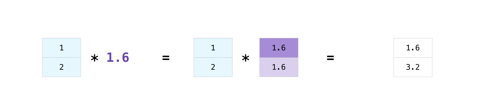
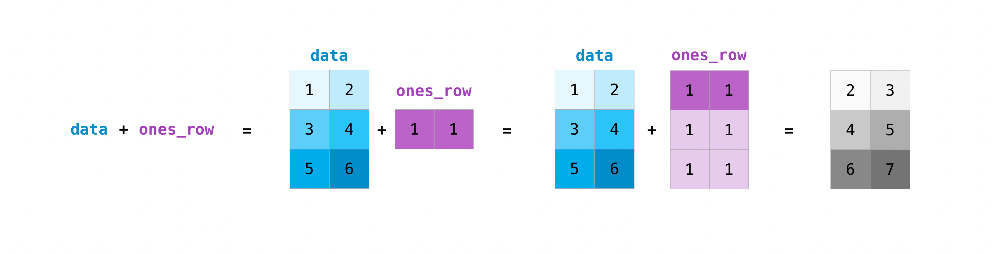

NumPy是一个广泛使用的Python库，NumPy是Numerical Python的缩写，用于多维数组的计算，并且支持对多维数组进行各种数学处理，同时保持非常高的性能。Pandas, SciPy, Matplotlib, scikit-learn等一系列库都使用了NumPy提供的多维数组。

## 安装

```bash
conda install numpy # 如果你使用Anaconda
micromamba install numpy # 如果你使用micromamba
pip install numpy # 如果你使用pip
```

## 引入NumPy

```python
import numpy as np
```

将NumPy重命名为`np`不仅能让代码简短，还是一种约定俗成的写法，建议任何时候都这么写。

## NumPy中的数组和Python原生的list有什么区别？

|不同点|NumPy array|Python list|
|---|---|---|
|元素类型|数组的所有元素必须拥有相同类型|数组的元素可以有不同的类型|
|内存占有|内存占用少|有额外的内存占用|
|性能表现|速度快|速度较慢|

## 数组

数组是NumPy的核心。在NumPy中，数组被称作`ndarray`，是多维数组（N-Dimensional Array）的缩写。向量（vector）就是1维数组（对于NumPy中的`ndarray`，向量就是向量，不区分行向量和列向量），矩阵（matrix）就是二维数组，三维以上的数组通常叫做“张量”（tensor）。

### 创建数组

创建数组使用的函数有：`np.array()`、`np.zeros()`、`np.ones()`、`np.empty()`、`np.arange`、`np.linspace()`、`np.random.rand()`。

`np.array()`接受Python list，返回一个NumPy的`ndarray`。

```python
>>> import numpy as np
>>> import numpy as np
>>> np.array([1, 2, 3]) # 创建1维数组 
array([1, 2, 3])
>>> np.array([[1, 2, 3], [4, 5, 6]]) # 创建2维数组
array([[1, 2, 3],
       [4, 5, 6]])
>>> np.array([[[1, 2], [3, 4]], [[5, 6], [7, 8]]]) # 创建3维数组
array([[[1, 2],
        [3, 4]],

       [[5, 6],
        [7, 8]]])
>>>
```

`np.zeros()`返回全部为0的数组，`np.ones()`返回全部为1的数组。

```python
>>> np.zeros(3) 
array([0., 0., 0.])
>>> np.ones(4)
array([1., 1., 1., 1.])
>>> np.ones((2, 2)) # 注意生成多维数组要传入元组，而不是多个参数
array([[1., 1.],
       [1., 1.]])
```

`np.empty()`返回一个包含垃圾值的数组，它里面的值是未初始化的随机值。

为什么要使用`np.empty()`而不是`np.zeros()`？因为省去了初始化的时间，所以速度更快。如果你需要一个数组来装某些东西，就创建一个`np.empty()`代表“里面的值之后再确定”。

```python
>>> np.empty(2) # 你的输出会和我不一样，这是正常的
array([-4.85269502e+281,  1.75993746e-270])
```

`np.arange()`就相当于NumPy版本的`range()`

```python
>>> np.arange(5)     
array([0, 1, 2, 3, 4])
>>> np.arange(3, 6)
array([3, 4, 5])
>>> np.arange(3, 12, 2)
array([ 3,  5,  7,  9, 11])
```

:::tip
看不懂？[复习一下Python中的range()](https://docs.python.org/3/library/stdtypes.html?highlight=range#range)
:::

`np.linspace`是用来在两个点之间均匀地取n个点的（包含头尾）

```python
>>> np.linspace(0, 10, num = 5)  
array([ 0. ,  2.5,  5. ,  7.5, 10. ])
```

`np.random.rand()`可以生成一个随机的数组

```python
>>> np.random.rand(3) # 生成长度为3的一维数组
array([0.64400357, 0.61173257, 0.74255108])
>>> np.random.rand(2, 3) # 生成2x3的随机数组
array([[0.64385017, 0.01831495, 0.20365181],
       [0.8246319 , 0.28612528, 0.72145898]])
```

最后，还有一个可选择的参数`dtype`需要知道。`dtype`是用来指定数组里面的元素的类型，如果不指定，默认值为`np.float64`，大部分创建数组的函数都支持`dtype`参数。

```python
>>> np.ones(3, dtype=np.int64)
array([1, 1, 1], dtype=int64)
>>> np.arange(1, 11, 2, dtype = np.uint32) 
array([1, 3, 5, 7, 9], dtype=uint32)
>>> np.array([[1, 2], [3, 4]], dtype=complex)      
array([[1.+0.j, 2.+0.j],
       [3.+0.j, 4.+0.j]])
```

[NumPy支持的所有数据类型列表](https://numpy.org/doc/stable/user/basics.types.html)

## 索引、切片和迭代数组

在NumPy中，有很多种方式可以索引（indexing）、切片（slicing）和迭代（iterating）数组

### 1维数组

1维数组的索引、切片和迭代与原生的list完全相同。

```python
>>> arr = np.arange(10)
>>> arr[3] # 下标从0开始 
3
>>> arr[-2] # 支持负数倒序访问 
8
>>> arr[3:7] # 切片  
array([3, 4, 5, 6])
>>> arr[2:6:2] # 和Python的语法一致 
array([2, 4])
>>> arr[::-1] # 翻转一个数组
array([9, 8, 7, 6, 5, 4, 3, 2, 1, 0])
>>> for i in arr: # 迭代也是一样的
...     print(i*i, end=' ')
...
0 1 4 9 16 25 36 49 64 81
```

:::tip
不熟悉？[复习Python列表](https://docs.python.org/3/library/stdtypes.html#list)
:::

### 多维数组

```python
>>> arr = np.arange(1, 26).reshape(5, 5)
>>> arr
array([[ 1,  2,  3,  4,  5],
       [ 6,  7,  8,  9, 10],
       [11, 12, 13, 14, 15],
       [16, 17, 18, 19, 20],
       [21, 22, 23, 24, 25]])
>>> arr[2, 3] # 单元素访问，注意从0开始
14
>>> arr[2:4, 1] # 对第一维切片
array([12, 17])
>>> arr[2:4, 0:3] # 对两个维度切片 
array([[11, 12, 13],
       [16, 17, 18]])
>>> arr[:, 2] # 取第三列
array([ 3,  8, 13, 18, 23])
>>> arr[4, :] # 取第五行  
array([21, 22, 23, 24, 25])
>>> arr[4] # 和上一个一样，如果后面都是“:”，可以全部省略
array([21, 22, 23, 24, 25])
>>> arr[-1] # 也可以用负数倒序访问， 效果和上一个一样 
array([21, 22, 23, 24, 25])
>>> arr[:, -1] # 最后一列
array([ 5, 10, 15, 20, 25])
```

`...`（三个点）可以省略多维数组索引中的多个“:”

```python
>>> arr = np.arange(16).reshape(2, 2, 2, 2) # 这是一个4维数组，每一维大小都是2
>>> arr
array([[[[ 0,  1],
         [ 2,  3]],

        [[ 4,  5],
         [ 6,  7]]],


       [[[ 8,  9],
         [10, 11]],

        [[12, 13],
         [14, 15]]]])
>>> arr[0, ..., 1] # 相当于 arr[0, :, :, 1]
array([[1, 3],
       [5, 7]])
>>> arr[..., 1] # 相当于 arr[:, :, :, 1]
array([[[ 1,  3],
        [ 5,  7]],

       [[ 9, 11],
        [13, 15]]])
```

迭代数组时迭代的是他的每一行，如果想要迭代每一个元素，请使用`arr.flat`（注意没有括号）。

```python
>>> arr = np.array([[1, 2], [3, 4]])
>>> for i in arr:
...     print(i) 
...
[1 2]
[3 4]
>>> for i in arr.flat():
...     print(i)
...
>>> for i in arr.flat:
...     print(i)
...
1
2
3
4
```

## 排序数组

```python
>>> arr = np.array([3, 6, 4, 2, 5, 1])    
>>> np.sort(arr)
array([1, 2, 3, 4, 5, 6])
```

## 拼接数组

```python
>>> arr1 = np.array([3, 4, 5]) 
>>> arr2 = np.ones(4)  
>>> np.concatenate((arr1, arr2)) 
array([3., 4., 5., 1., 1., 1., 1.])
>>> arr3 = np.array([[1, 2], [3, 4]]) 
>>> arr4 = np.array([[5, 6], [7, 8]]) 
>>> np.concatenate((arr3, arr4))
array([[1, 2],
       [3, 4],
       [5, 6],
       [7, 8]])
>>> np.concatenate((arr3, arr4), axis=1) # 可以指定拼接的维度
# 在NumPy中，维度（diamension）被称为“轴”（axis），所以上面的语法是`axis=1`*
array([[1, 2, 5, 6],
       [3, 4, 7, 8]])
>>> np.vstack((arr3, arr4)) # 垂直拼接（vertically stack的缩写）
array([[1, 2],
       [3, 4],
       [5, 6],
       [7, 8]])
>>> np.hstack((arr3, arr4)) # 水平拼接（horizontal stack的缩写）
array([[1, 2, 5, 6],
       [3, 4, 7, 8]])
```

## 切割数组

切割数组最常用的方式就是用`[]`来索引，也可以使用`np.vsplit()`和`np.hsplit()`

```python
>>> arr
array([[ 1,  2,  3,  4,  5,  6],
       [ 7,  8,  9, 10, 11, 12],
       [13, 14, 15, 16, 17, 18],
       [19, 20, 21, 22, 23, 24]])
>>> np.vsplit(arr, 2) # 横着切，平均切成2份
[array([[ 1,  2,  3,  4,  5,  6],
       [ 7,  8,  9, 10, 11, 12]]), array([[13, 14, 15, 16, 17, 18],
       [19, 20, 21, 22, 23, 24]])]
>>> np.hsplit(arr, 3) # 竖着切，平均切成3份
[array([[ 1,  2],
       [ 7,  8],
       [13, 14],
       [19, 20]]), array([[ 3,  4],
       [ 9, 10],
       [15, 16],
       [21, 22]]), array([[ 5,  6],
       [11, 12],
       [17, 18],
       [23, 24]])]
```

## 数组的形状

|属性|含义|
|---|---|
|`arr.ndim`|数组的维数|
|`arr.shape`|数组的形状|
|`arr.size`|数组的元素个数|

```python
>>> arr
array([[1, 2, 3],
       [9, 8, 7]])
>>> arr.ndim
2
>>> arr.shape # arr.shape是一个tuple，表示每一维的容量
(2, 3)
>>> arr.size # 一共有6个元素，等于arr.shape里每一个数字相乘
6
```

`arr.reshape()`可以改变数组的形状，我们在前面的例子里已经用到了。

```python
>>> arr
array([0, 1, 2, 3, 4, 5])
>>> arr.reshape(3, 2)
array([[0, 1],
       [2, 3],
       [4, 5]])
```

使用`np.newaixs`或`np.expand_dims`可以给一个数组增加维度。

```python
>>> arr = np.array([1, 2, 3, 4, 5, 6])
>>> arr.shape  
(6,)
>>> arr1 = arr[:, np.newaxis] # 等价于arr1 = np.expand_dims(arr, axis=1)
>>> arr1.shape
(6, 1)
>>> arr2 = arr[np.newaxis, :] # 等价于arr2 = np.expand_dims(arr, axis=0)
>>> arr2.shape
(1, 6)
>>>
```

## 条件筛选

NumPy里的数组支持按条件筛选出一些元素，如：

```python
>>> arr[arr > 5] 
array([ 6,  7,  8,  9, 10, 11])
>>> arr[(arr % 2 == 0) & (arr < 7)] # “且”和“或”要使用“&”和“|”来表示，这是为了防止歧义
array([0, 2, 4, 6])
```

这看上去很神奇，NumPy是怎么做到的呢？让我们输出一下`arr > 5`

```python
>>> arr > 5
array([[False, False, False],
       [False, False, False],
       [ True,  True,  True],
       [ True,  True,  True]])
```

`arr > 5`不过是个布尔数组，而`arr[arr > 5]`只是把所有`True`对应的元素列出来而已。

因此这样操作也是可行的：

```python
>>> condition = (arr % 2 == 0) & (arr < 7)   
>>> arr[condition]
array([0, 2, 4, 6]) # 和上面那个效果一样
```

`np.nonzero()`可以找到数组里面的非0元素

```python
>>> arr = np.array([[0, 0, 1], [2, 0, 0], [1, 0, 1]]) 
>>> np.nonzero(arr)
(array([0, 1, 2, 2], dtype=int64), array([2, 0, 0, 2], dtype=int64))
```

`np.nonzero()`会返回一个元组，元组的大小等于arr.ndim，元组里面是数组，描述了每一维非零的元素在哪里。

这个形式看起来不是很直观，用`zip()`处理一下，就可以得到每个非零元素的坐标。

```python
>>> list(zip(*np.nonzero(arr)))
[(0, 2), (1, 0), (2, 0), (2, 2)]
```

这里的`*`是[参数解包语法](https://docs.python.org/3/glossary.html#term-argument)

`np.nonzero()`也可以用来处理上面提到的布尔数组，因为在Python里，`False`被看做0，`True`被看做1。

## view和copy

`arr.view()`和`arr.copy()`分别对应浅拷贝和深拷贝，前者类似与C++中的引用，只是一个别名，后者就是创建一个新的数组，只是里面的数据和原数组一致。

### view

```python
>>> a = np.ones((3, 3)) 
>>> b = a 
>>> b[0, 0] = 0 # 改变b的第一个元素
>>> b
array([[0., 1., 1.],
       [1., 1., 1.],
       [1., 1., 1.]])
>>> a
array([[0., 1., 1.],
       [1., 1., 1.],
       [1., 1., 1.]]) # 结果a也被改变了
```

出现这个情况是因为NumPy默认使用浅拷贝，从而减少数据的复制，`b = a`就相当于`b = a.view()`，提高性能，`b = a.view()`可以把`b`变成和`a`看起来一样的数组，但实际上两个变量还是共享同样的数据，因此改变其中一个，两个都会改变。

要注意的是，切片创建的数组也算`view`

```python
>>> a = ones((3, 3))
>>> c = a[:, 0]
>>> c += 1
>>> c
array([2., 2., 2.])
>>> a
array([[2., 1., 1.],
       [2., 1., 1.],
       [2., 1., 1.]])
```

如果要复制一个数组，而不是创建一个引用，就要使用`arr.copy()`

```python
>>> a = np.zeros((3, 3)) 
>>> b = a.copy()
>>> b[2] = 3
>>> a
array([[0., 0., 0.],
       [0., 0., 0.],
       [0., 0., 0.]])
>>> b
array([[0., 0., 0.],
       [0., 0., 0.],
       [3., 3., 3.]])
```

## 对数组运算

### 广播机制

对一个数组执行某种基本运算（包括但不限于`+`、`-`、`*`、`/`、`**`、`%`），NumPy会自动地把它变成对数组里每个元素的运算，这是NumPy的“广播”（broadcasting）机制。

对于一元运算符，广播很简单，就是将这个运算应用到每一个数上，如`np.exp()`、`np.sqrt()`等都算一元运算符。

对于二元运算符，广播机制的具体规则是这样的：

1. 如果两个数组的维数不同，numpy会在维数小的那一个数组的shape前面添加若干个“1”。如`(3, 4) * (1, 2, 3, 4)`->`(1, 1, 3, 4) * (1, 2, 3, 4)`。
2. 然后，NumPy会从前到后比较每一维，设两个数组在这一维的容量分别为$n$、$m$，有三种情况

    1. $n=m$，则结果的容量也是这个数，如`(3, 4) + (3, 4) = (3, 4)`
    2. $n\neq m$，但是$n$和$m$中有一个等于$1$，则NumPy会将等于$1$的这一维自动地对齐另外一个数组，如`(5, 1, 4) - (5, 3, 4) -> (5, 3, 4) - (5, 3, 4)`
    3. $n\neq m$，且没有一个等于$0$，程序将会报错。
3. 执行2直到数组中的元素可以直接计算，比如对于`+`、`-`、`*`、`/`等数值类型的运算符，会广播到最后一维，再对里面存放的数值变量执行两两相加/减/乘/除。对于`@`（表示矩阵乘法）这种针对二维数组的运算符，会广播直到倒数第二维，再开始两两矩阵乘。

猜猜下面代码输出什么

```python
>>> a = np.random.random((3, 5)) 
>>> b = np.random.random((4, 5, 7))
>>> c = a @ b 
>>> c.shape  
```

<details>
<summary>答案</summary>
`(4, 3, 7)`
这是因为

```txt
   (3, 5) @ (4, 5, 7) 
-> (1, 3, 5) @ (4, 5, 7)
-> (4, 3, 5) @ (4, 5, 7)
=  (4, 3, 7)
```

</details>

这里，我引用一些官方文档中的图片来帮助你理解






```python
>>> a = np.ones(2)
>>> a * 2
array([2., 2.])
>>> a / 3
array([0.33333333, 0.33333333])
>>> b = np.array([1, 2])
>>> b ** 2
array([1, 4])
>>> a - b
array([ 0., -1.])
>>> a += 3
>>> a
array([4., 4.])
>>> a * b # 要注意的是这里并不是矩阵乘法，只是单纯将对应元素相乘
array([4., 8.])
>>> c = np.array([[1, 2], [3, 4]]) 
>>> d = np.array([5, 6]) 
>>> c + d
array([[ 6,  8],
       [ 8, 10]])

```

### 一些运算的示例

`arr.sum()`可以对数组求和，`arr.max()`和`arr.min()`可以求最大最小值

```python
>>> a = np.array([[1, 2], [3, 4]])
>>> a.sum()
10
>>> a.sum(axis=0) # 也可以指定求和某一维
array([4, 6])
>>> a.sum(axis=1) 
array([3, 7])
>>> a.max()
4
>>> a.min(axis=1)
array([1, 3])
```

除了`np.sum()`外，NumPy还提供了很多其他的数学函数，用来替代Python的math库的函数，如`np.sqrt()`、`np.sin()`、`np.exp()`等

## 获取不同的元素

`np.unique()`可以获取不同的元素

```python
>>> a = np.array([[0, 0, 1, 2], [1, 2, 0, 4], [0, 0, 1, 2]]) 
>>> np.unique(a)                     
array([0, 1, 2, 4])
>>> np.unique(a, return_index=True) # 返回元素的位置，[0, 1, 2, 4]的位置为[0, 2, 3, 7]
(array([0, 1, 2, 4]), array([0, 2, 3, 7], dtype=int64)) 
>>> np.unique(a, return_counts=True) # 返回元素的数量，[0, 1, 2, 4]各有[5, 3, 3, 1]个
(array([0, 1, 2, 4]), array([5, 3, 3, 1], dtype=int64))
>>> np.unique(a, axis=0)  # 指定axis，返回独一无二的行，而不是元素
array([[0, 0, 1, 2],
       [1, 2, 0, 4]])
```

## 反转数组

用`np.flip()`

```python
>>> arr
array([[0, 1, 2],
       [3, 4, 5]])
>>> np.flip(arr)
array([[5, 4, 3],
       [2, 1, 0]])
>>> np.flip(arr, axis=1) 
array([[2, 1, 0],
       [5, 4, 3]])
```

## 压平数组

`arr.flatten()`和`arr.ravel()`都可以压平一个数组，但是前者会创建一个copy，后者不会，因此后者有更高的性能，但是对后者进行修改会影响到原数组。

```python
>>> a = np.array([[1, 1, 4], [5, 1, 4]]) 
>>> b = a.flatten()
>>> c = a.ravel()
>>> a
array([[1, 1, 4],
       [5, 1, 4]])
>>> b
array([1, 1, 4, 5, 1, 4])
>>> c
array([1, 1, 4, 5, 1, 4])
>>> b[2] = 0
>>> a
array([[1, 1, 4],
       [5, 1, 4]])
>>> c[2] = 0 
>>> a
array([[1, 1, 0],
       [5, 1, 4]])
```

## 保存和读取NumPy数组

有多种方法保存NumPy数组

|函数|含义|后缀名|读取|
|---|---|---|---|
|`np.save()`|保存单个数组|`.npy`|`np.load()`|
|`np.savez()`|在一个文件中保存多个数组|`.npz`|`np.load()`|
|`np.savez_compressed()`|和上一个一样，但是有压缩，生成的文件体积更小|`.npz`|`np.load()`|
|`np.savetxt()`|用文本形式保存，便于共享，但速度和体积都不如上面三个|`.csv`或`.txt`|`np.loadtxt()`|

```python
>>> a
array([0.08451327, 0.75102915, 0.94578432])
>>> b
array([[0.80930188, 0.38539336],
       [0.5628236 , 0.22558801],
       [0.25427619, 0.52475443]])
>>> np.save('file1', a) # 保存到文件“file1.npy”
>>> np.load('file1.npy')
array([0.08451327, 0.75102915, 0.94578432])
>>> np.savez('file2', apple=a, banana=b) # 保存多个数组，并添加标识“apple”和“banana”
>>> data = np.load('file2.npz') # 保存到文件“file2.npz”
>>> data['apple']
array([0.08451327, 0.75102915, 0.94578432])
>>> data['banana']
array([[0.80930188, 0.38539336],
       [0.5628236 , 0.22558801],
       [0.25427619, 0.52475443]])
>>> np.savetxt('file3.csv', a) # 保存到文件“file3.csv”
>>> np.loadtxt('file3.csv') 
array([0.08451327, 0.75102915, 0.94578432])
```

## 使用NumPy进行线性代数计算

用NumPy处理线性代数的矩阵可以使用NumPy中的矩阵库`numpy.matlib`，这个库里面有所有`numpy`命名空间里面的函数，但是换成了矩阵版本的。

```python
>>> import numpy as np
>>> import numpy.matlib
>>> arr = np.ones(3)
>>> arr
array([1., 1., 1.])
>>> arr.shape
>>> arr.shape
(3,)
>>> mat = np.matlib.ones(3)
>>> mat
matrix([[1., 1., 1.]])
>>> mat.shape 
(1, 3)
```

从这里我们可以看出`ndarray`和`matrix`的主要区别，`ndarray`不区分行向量和列向量（对多维数组进行切片操作会变成一维数组），但是`matrix`区分（对矩阵切片仍然是矩阵）。用`(1, n)`和`(n, 1)`和代表行向量和列向量。

使用`np.asarray()`和`np.asmatrix()`可以将二者互相转换。

官方文档里推荐使用`np.matlib.mat()`代替`np.matlib.matrix()`创建矩阵，因为这样可以不拷贝原数组，提高效率。

## 矩阵转置

矩阵转置使用`arr.T`

```python
>>> mat = np.matlib.mat([[0, 1, 2], [3, 4, 5]]) 
>>> mat
matrix([[0, 1, 2],
        [3, 4, 5]])
>>> mat.T
matrix([[0, 3],
        [1, 4],
        [2, 5]])
```

## 矩阵乘法

NumPy为矩阵乘法提供了专门的运算符`@`，相当于`np.matmul(a, b)`

```python
>>> mat
matrix([[0, 1, 2],
        [3, 4, 5]])
>>> mat.T
matrix([[0, 3],
        [1, 4],
        [2, 5]])
>>> a = np.matlib.mat([[1, 2], [3, 4]])
>>> b = np.matlib.mat([[5, 6], [7, 8]]) 
>>> a @ b
matrix([[19, 22],
        [43, 50]])
```

## 矩阵求逆

NumPy提供了`np.linalg.inv()`函数来计算矩阵的逆。

```python
>>> c = np.matlib.mat([[2, 0], [1, 3]])
>>> inv_c = np.linalg.inv(c)
>>> inv_c
matrix([[ 0.5       ,  0.        ],
        [-0.16666667,  0.33333333]])
```

## 特征值和特征向量

NumPy还提供了计算矩阵特征值和特征向量的函数 `np.linalg.eig()`。

```python
>>> d = np.matlib.mat([[4, 2], [1, 3]])
>>> eigvals, eigvecs = np.linalg.eig(d)
>>> eigvals
array([5., 2.])
>>> eigvecs
matrix([[ 0.89442719, -0.70710678],
        [ 0.4472136 ,  0.70710678]])
```

`eigvals` 是矩阵 `d` 的特征值，`eigvecs` 是对应的特征向量。

## 奇异值分解

奇异值分解（SVD）可以使用 `np.linalg.svd()` 函数进行计算。

```python
>>> e = np.matlib.mat([[1, 2], [3, 4], [5, 6]])
>>> U, S, Vt = np.linalg.svd(e)
>>> U
matrix([[-0.2298477 ,  0.88346102,  0.40824829],
        [-0.52474482,  0.24078249, -0.81649658],
        [-0.81964194, -0.40189603,  0.40824829]])
>>> S
array([9.52551809, 0.51430058])
>>> Vt
matrix([[-0.61962948, -0.78489445],
        [-0.78489445,  0.61962948]])
```

这里，`U` 是左奇异矩阵，`S` 是奇异值数组，`Vt` 是右奇异矩阵。

更多线性代数计算请看官方文档。

## 参考链接

[官方文档](https://numpy.org/doc/stable/)
