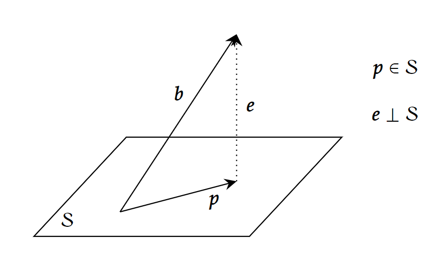

## 投影矩阵的推导

假设我们想把一个向量 $\boldsymbol{b}$ 投影到线性空间 $\mathcal{S}$ 中，应该怎么做呢。

设投影后的向量为 $\boldsymbol{p}$，则有 $\boldsymbol{p}\in \mathcal{S}$，设误差向量（error vector）$\boldsymbol{e}=\boldsymbol{b}-\boldsymbol{p}$，则 $\boldsymbol{e}$ 应与 $\mathcal{S}$ 正交。投影就是将向量分为两部分 $\boldsymbol{b}=\boldsymbol{p}+\boldsymbol{e}$，一部分在 $\mathcal{S}$ 中，另一部分与 $\mathcal{S}$ 正交，然后取其中的 $\boldsymbol{p}$。也可以用图像直观理解：

要求得 $\boldsymbol{p}$，只需要将 $\boldsymbol{p}\in \mathcal{S}\;\mathrm{(1)}$ 和 $\boldsymbol{e}\perp \mathcal{S}\;\mathrm{(2)}$ 这两个条件翻译成线性代数的语言即可。

首先，我们要先表达线性空间 $\mathcal{S}$，设 $\mathcal{S} \subset \mathbb{P}^m$，$\mathrm{dim}\mathcal{S}=n$，取 $\mathcal{S}$ 的一组基，作为矩阵 $A_{m\times n}$ 的列向量，则 $\mathcal{S}$ 就是 $A$ 的列空间，$\mathcal{S}=\mathrm{C}(A)$。

1. 然后要翻译 $\boldsymbol{p}\in \mathcal{S}$，只需要令 $\boldsymbol{p}=A\hat{\boldsymbol{x}}$，其中 $\hat{\boldsymbol{x}}$为$\mathbb{P}^m$ 中的任意向量。
2. 翻译 $\boldsymbol{e}\perp\mathcal{S}$，就是 $\boldsymbol{e}\in\mathcal{S}^\perp=\mathrm{C}(A)^\perp=\mathrm{N}(A^T)$，即 $A^T\boldsymbol{e}=0$。

得到方程组
$$
\begin{cases}
\boldsymbol{p}=A\hat{\boldsymbol{x}}\\
A^T\boldsymbol{e}=0
\end{cases}
$$

$$
\begin{align*}
A^T \boldsymbol{e} &= 0 \\
A^T(\boldsymbol{b}-A\hat{\boldsymbol{x}}) &= 0 \\
A^T \boldsymbol{b} &= A^T A\hat{\boldsymbol{x}} \\
\hat{\boldsymbol{x}} &= (A^T A)^{-1}A^T\boldsymbol{b} \\
\boldsymbol{p} &= A(A^T A)^{-1}A^T\boldsymbol{b}
\end{align*}
$$

令 $P=A(A^T A)^{-1}A^T$，称 $P$ 为 $\mathcal{S}$ 的**投影矩阵（projection matrix）**，则要将 $\boldsymbol{b}$ 投影至 $\mathcal{S}$ ，只需左乘$P$即可，$\boldsymbol{p}=P\boldsymbol{b}$。

这里的 $(A^T A)^{-1}$ 不能拆作 $A^{-1}(A^{-1})^T$，因为 $A$ 不一定为方阵，当 $n<m$ 时，$A$ 不可逆。当 $n=m$ 时，$A$ 必定可逆，因为列向量线性无关，然而当 $n=m$ 时，投影的意义不大，易得 $P=I$ ，投影不会改变任何东西。而 $(A^T A)^{-1}$ 一定是可逆的（想想为什么？）。

___

### 当 $A$ 是向量时

当$A$是向量而非矩阵时，一切都没有变，我们仍然有 $\boldsymbol{p}=\boldsymbol{a}(\boldsymbol{a}^T \boldsymbol{a})^{-1} \boldsymbol{a}^T \boldsymbol{b}$，不过现在 $\boldsymbol{a}^T \boldsymbol{a}$ 是一个标量了，也可以写作

$$
\boldsymbol{p}=\frac{\boldsymbol{a}^T \boldsymbol{b}}{\boldsymbol{a}^T \boldsymbol{a}}\boldsymbol{a}=\frac{\boldsymbol{a}\cdot \boldsymbol{b}}{\boldsymbol{a}\cdot \boldsymbol{a}}\boldsymbol{a}
$$
这和我们常见的向量投影到另一个向量的形式是一致的。

___

## 投影矩阵的特性

### 1. 对称性

$$
P^T=P
$$

#### 证明

$$
\begin{align*}
P^T &= (A(A^T A)^{-1}A^T)^T \\
&= A((A^T A)^{-1})^T A^T \\
&= A((A^T A)^T)^{-1} A^T \\
&= A(A^T A)^{-1}A^T \\
&= P
\end{align*}
$$

### 2. 幂等性

$$
P^k=P\quad(k=1,2,\dots)
$$

直观理解，就是将 $\boldsymbol{b}$ 投影到 $\mathcal{S}$ 后，再投影一次，没有任何变化，因为 $\boldsymbol{p}$ 已经在 $\mathcal{S}$ 里了。

#### 证明

要证原命题，只需证 $P^2=P$

$$
\begin{align*}
P^2 &= (A(A^T A)^{-1}A^T)(A(A^T A)^{-1}A^T) \\
&= A(A^T A)^{-1}(A^T A)(A^T A)^{-1}A^T \\
&= A(A^T A)^{-1}A^T \\
&= P
\end{align*}
$$

___

## 两种极端情况

### 1. 当 $\boldsymbol{b}\in\mathcal{S}$ ，有 $P\boldsymbol{b}=\boldsymbol{b}$

已经在 $\mathcal{S}$ 上的向量再投影到 $\mathcal{S}$ 不会变化

#### 证明

因为 $\boldsymbol{b}\in\mathrm{C}(A)$，则 $\exists\boldsymbol{x},\;s.t.\;\boldsymbol{b}=A\boldsymbol{x}$，有：

$$
\begin{align*}
P\boldsymbol{b} &= A(A^T A)^{-1}A^TA\boldsymbol{x} \\
&= A(A^T A)^{-1}(A^T A)\boldsymbol{x} \\
&= A\boldsymbol{x} \\
&= \boldsymbol{b}
\end{align*}
$$

### 2. 当 $\boldsymbol{b} \perp \mathcal{S}$，有 $P\boldsymbol{b}=0$

正交与 $\mathcal{S}$ 的向量，投影到 $\mathcal{S}$ 就只剩下一个点了

#### 证明

$\boldsymbol{b}\perp\mathrm{C}(A) \Leftrightarrow \boldsymbol{b} \in \mathrm{N}(A^T)$，故 $A^T\boldsymbol{b}=0$

$$
\begin{align*}
P\boldsymbol{b} &= A(A^T A)^{-1}A^T\boldsymbol{b} \\
&= A(A^T A)^{-1}(A^T\boldsymbol{b}) \\
&= 0
\end{align*}
$$

___

## 投影的应用

### 解一个无解的方程

$A\boldsymbol{x}=\boldsymbol{b}$ 有时是无解的，因为 $\boldsymbol{b}$ 不在 $A$ 的列空间 $\mathrm{C}(A)$ 中，于是我们可以将 $\boldsymbol{b}$ 投影到 $\mathrm{C}(A)$ 中。设 $\boldsymbol{p}$ 为 $\boldsymbol{b}$ 在 $\mathrm{C}(A)$ 的投影，则 $A\hat{\boldsymbol{x}}=\boldsymbol{p}$ 一定有解。

注意：这里的 $\boldsymbol{p}$ 不能和前文一样使用 $A(A^T A)^{-1}A^T\boldsymbol{b}$ 求得，因为前面的 $A$ 是列线性无关的，这里不一定。当 $A$ 列线性无关时，$\hat{\boldsymbol{x}}$ 有唯一解，当 $A$ 列线性相关时，$\hat{\boldsymbol{x}}$ 有无穷多解，无论如何，$\hat{\boldsymbol{x}}$ 总是存在的。

回归正题，我们解出来的这个 $\hat{\boldsymbol{x}}$ 虽然不是一个精确的解，但却是一个最好的解，这个 $\hat{\boldsymbol{x}}$ 可以令 $||A\boldsymbol{x}-\boldsymbol{b}||^2$ 最小，这一点可以从两个角度证明：

1. 几何直观理解：$||A\boldsymbol{x}-\boldsymbol{b}||^2$就是 $A\boldsymbol{x}$ 和 $\boldsymbol{b}$ 的欧氏距离，所有可能的 $A\boldsymbol{x}$ 都在 $\mathrm{C}(A)$ 中，而 $\mathrm{C}(A)$ 中距离 $\boldsymbol{b}$ 最近的那个点，就是 $\boldsymbol{b}$ 的投影 $\boldsymbol{p}$，此时 $\boldsymbol{x}=\hat{\boldsymbol{x}}$。
2. 代数严格证明：由 $||A\boldsymbol{x}-\boldsymbol{b}||^2=||A\boldsymbol{x}-\boldsymbol{p}-\boldsymbol{e}||^2=||A\boldsymbol{x}-\boldsymbol{p}||^2+||\boldsymbol{e}||^2\geq||\boldsymbol{e}||^2$，其中 $||\boldsymbol{e}||^2$ 是与 $\boldsymbol{x}$ 无关的常量，则当 $||A\boldsymbol{x}-\boldsymbol{p}||^2=0$ 时，取得最小值，此时 $A\boldsymbol{x}=\boldsymbol{p}$，即 $\boldsymbol{x}=\hat{\boldsymbol{x}}$

新的方程 $A\hat{\boldsymbol{x}}=\boldsymbol{p}$，不仅有“一定有解”、“解是最好的”这两个良好的性质，当 $A\boldsymbol{x}=\boldsymbol{b}$ 本身就有解时，新的方程与原方程的解是一致的，这是因为当 $\boldsymbol{b}\in\mathrm{C}(A)$ 时，$\boldsymbol{p}=\boldsymbol{b}$ （上面两种极端情况的第一种）。

也就是说，无论 $A\boldsymbol{x}=\boldsymbol{b}$ 是否有解，你可以不管三七二十一，就计算 $A\hat{\boldsymbol{x}}=\boldsymbol{p}$，肯定能解出来一个最好的 $\hat{\boldsymbol{x}}$，它满足“如果有精确解，我就是精确解，如果没有精确解，我就是最好的解”。你可以在对 $A$ 一无所知的情况下，保证能解出一个优秀的 $\hat{\boldsymbol{x}}$。

### 换一个形式

为了方便，下面还是假设 $A$ 列满秩。

$A\hat{\boldsymbol{x}}=\boldsymbol{p}=A(A^T A)^{-1}A^T\boldsymbol{b}$，我们都知道求逆矩阵既困难又会造成精度问题（浮点数计算时），于是可以两边都左乘 $A^T$，变成

$$
\begin{align*}
A^T A\hat{\boldsymbol{x}}&=(A^T A)(A^T A)^{-1}A^T\boldsymbol{b} \\
A^T A\hat{\boldsymbol{x}}&=A^T\boldsymbol{b} \tag{1} \\
\hat{\boldsymbol{x}}&= (A^T A)^{-1}A^T\boldsymbol{b} \tag{2}
\end{align*}
$$

其中 $\text{(1)}$ 是比较好用的形式

而 $\text{(2)}$ 在线性回归领域也写作

$$
\boldsymbol{\theta}=(X^T X)^{-1}X^T\boldsymbol{y}
$$

并被称为**normal equation**（或许译作正交方程？）

### 最小二乘法

最小二乘法其实可以从投影的角度理解，个人认为这是最巧妙，无需计算的解法了（相比于对均方误差求导的解法）

假设我们有 $m$ 个点 $(t_1,b_1),(t_2,b_2),\dots,(t_m,b_m)$，要找一条直线 $y=cx+d$，最佳拟合它们，即令 $\sum (ct_i+d-b_i)^2$（也被称为均方误差，mean square error, MSE）最小。

只需令

$$
\boldsymbol{b}=\left[
\begin{array}{ll}
 b_1    \\
 b_2  \\
 \vdots \\
 b_m
\end{array}\right]\qquad
A=\left[
\begin{array}{ll}
 1 & t_1            \\
 1 & t_2            \\
  \vdots & \vdots \\
 1 & t_m
\end{array}\right]\qquad
\boldsymbol{x}=\left[
\begin{array}{ll}
 d    \\
 c
\end{array}\right]
$$

就有 $A\boldsymbol{x}=\boldsymbol{b}$。假如 $m$ 个点落在同一条直线上，这个方程才有解，大多数情况下，它是无解的，运用前面推导的式子，有

$$
A^T A=\left[\begin{array}{ll}
m & \sum t_i \\
\sum t_i & \sum t_i^2
\end{array}\right]\qquad
A^T \boldsymbol{b}=\left[\begin{array}{l}
\sum b_i \\
\sum b_i t_i
\end{array}\right]
$$

只需解

$$
\left[\begin{array}{ll}
m & \sum t_i \\
\sum t_i & \sum t_i^2
\end{array}\right]\left[\begin{array}{l}d\\ c\end{array}\right]=\left[\begin{array}{l}
\sum b_i \\
\sum b_i t_i
\end{array}\right]
$$
即可得到使MSE最小的$c$和$d$。

### 拟合抛物线

假如将拟合直线变成拟合抛物线 $y=c_2x^2+c_1x+c_0$，只需要改成

$$
\boldsymbol{b}=\left[
\begin{array}{ll}
 b_1    \\
 b_2  \\
 \vdots \\
 b_m
\end{array}\right]\qquad
A=\left[
\begin{array}{lll}
 1 & t_1 & t_1^2           \\
 1 & t_2 & t_2^2          \\
  \vdots & \vdots & \vdots \\
 1 & t_m & t_m^2
\end{array}\right]\qquad
\boldsymbol{x}=\left[
\begin{array}{ll}
 c_0    \\
 c_1 \\
 c_2 \\
\end{array}\right]
$$
然后求 $A^T A\hat{\boldsymbol{x}}=A^T\boldsymbol{b}$ 就完事了，如果把抛物线换成$n$次多项式也是类似的。

___

## 参考

Introduction to Linear Algebra, 5th edition, by Gilbert Strang
