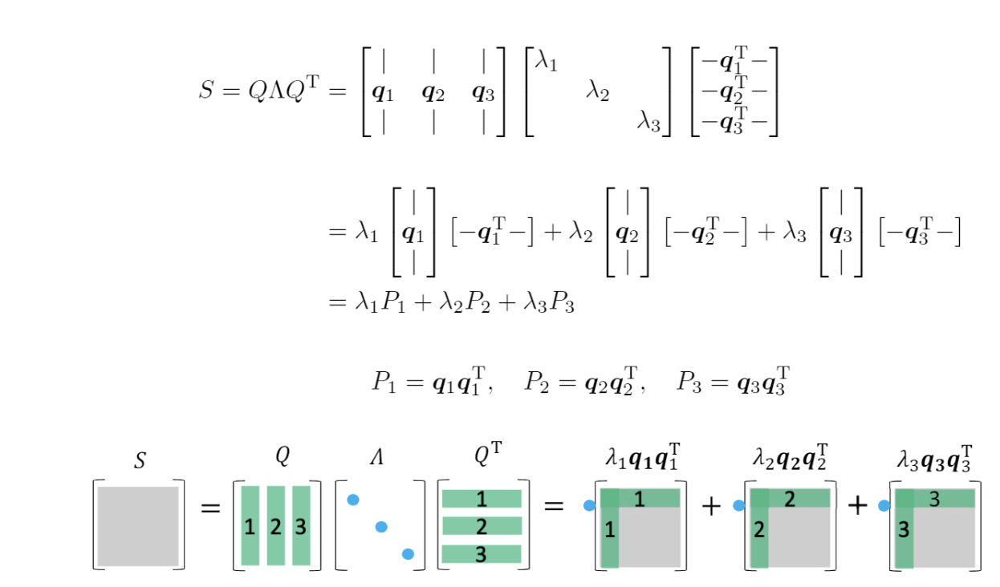

## 回顾特征值分解/对角化image.png

### 定义

对于 $n \times n$ 的方阵 $\boldsymbol{A}$，如果有下面的等式：

$$
\boldsymbol{Ax}=\lambda \boldsymbol{x}
$$

其中 $\boldsymbol{x}$ 为**非零**向量。

我们就称 $\boldsymbol{x}$ 是 $\boldsymbol{x}$ 的一个**特征向量（eigenvector）**，$\lambda$ 是 $\boldsymbol{x}$ 的一个**特征值（eigenvalue）**。

### 求解

$$
\begin{align*}
\boldsymbol{Ax} &= \lambda \boldsymbol{Ix} \\
(\boldsymbol{A} - \lambda \boldsymbol{I})\boldsymbol{x} &= \boldsymbol{0} \\
\det(\boldsymbol{A} - \lambda \boldsymbol{I}) &= 0 \\
\end{align*}
$$

特征值可以通过解特征根方程 $\det(\boldsymbol{A}-\lambda \boldsymbol{I})=0$ 来求得。 由代数基本定理，这个多项式方程一定有 $n$ 个复根（可能有重根）

由于行列式为0，$(\boldsymbol{A}-\lambda \boldsymbol{I})\boldsymbol{x}=\boldsymbol{0}$ 一定有非零解，任取一非零解，即可得出特征向量 $\boldsymbol{x}$。

如果 $\boldsymbol{A}$ 有 $n$ 个线性无关的特征向量 $\boldsymbol{x}_1, \boldsymbol{x}_2, \dots, \boldsymbol{x}_n$，对应的 $n$ 个特征值为 $\lambda_1, \lambda_2, \dots, \lambda_n$，令 $\boldsymbol{X}=(\boldsymbol{x}_1, \boldsymbol{x}_2, \dots, \boldsymbol{x}_n)$，$\boldsymbol{\Lambda}=\mathrm{diag}(\lambda_1, \lambda_2, \dots, \lambda_n)$ 则

$$
\begin{align*}
\boldsymbol{AX}&=\boldsymbol{X \Lambda} \\
\boldsymbol{A}&=\boldsymbol{X \Lambda} \boldsymbol{X}^{-1} \tag{1}
\end{align*}
$$

$(1)$ 式称作 $\boldsymbol{A}$ 的**特征值分解**，此时 $\boldsymbol{A}$ 称作**可对角化（diagonalizable）**。

实对称矩阵 $\boldsymbol{S}$ 必定可对角化，且一定可以选取两两正交的的单位特征向量，使得 $\boldsymbol{X}$ 为正交矩阵 $\boldsymbol{Q}$，这时原式可以写成这样。

下面，我们将要把实对称矩阵推广到所有正规矩阵，将正交矩阵推广到复数域的酉矩阵。

## 通向SVD的基础：谱定理

定义：对称矩阵

> 若 $\boldsymbol{A}=\boldsymbol{A}^*$，称 $\boldsymbol{A}$ 为对称矩阵（symmetric matrix）。
> 这里的 $\boldsymbol{A}^*=\overline{\boldsymbol{A}}^\mathrm{T}$，表示 $\boldsymbol{A}$ 的共轭转置（conjugate transpose）。

定义：酉矩阵

> 若 $\boldsymbol{U}^*\boldsymbol{U}=\boldsymbol{UU}^*=\boldsymbol{I}$，称方阵 $\boldsymbol{U}$ 为酉矩阵（unitary matrix）
>
> 推论 $\boldsymbol{U}^* = \boldsymbol{U}^{-1}$

定义：正规矩阵

> 若 $\boldsymbol{A}\boldsymbol{A}^*=\boldsymbol{A}^* \boldsymbol{A}$，称方阵 $\boldsymbol{A}$ 为正规矩阵（normal matrix）。
>
> 显然，对称矩阵和酉矩阵都是正规矩阵

### 谱定理（Spectral Theorem）

谱定理在线性代数里可以这样表述

> $\boldsymbol{A}$ 是正规矩阵当且仅当存在酉矩阵 $\boldsymbol{U}$，使得
> $$
> \boldsymbol{A}=\boldsymbol{U \Lambda U}^* \tag{2}
> $$
>
> 其中 $\boldsymbol{\Lambda}$ 为对角阵。

结合特征值分解和酉矩阵的定义，不难发现 $(2)$ 其实就是一种特殊的特征值分解 $\boldsymbol{A}=\boldsymbol{U \Lambda U}^{-1}$，$\boldsymbol{\Lambda}$ 就是特征值组成的对角阵 $\boldsymbol{\Lambda}=\mathrm{diag}(\lambda_1, \lambda_2, \dots, \lambda_n)$。

### 证明

#### 必要性

$$
\begin{align*}
\boldsymbol{A} &= \boldsymbol{U \Lambda U}^* \\
\boldsymbol{AA}^* &= \boldsymbol{U \Lambda U}^*  \boldsymbol{U} \overline{\boldsymbol{\Lambda}}\boldsymbol{U}^* \\
&= \boldsymbol{U \Lambda \overline{\Lambda} U}^* \\
\boldsymbol{A}^*\boldsymbol{A} &= \boldsymbol{U \overline{\Lambda} U}^*  \boldsymbol{U} \boldsymbol{\Lambda}\boldsymbol{U}^* \\
&= \boldsymbol{U \overline{\Lambda} \Lambda U}^* \\
\end{align*}
$$

其中 $\boldsymbol{\Lambda \overline{\Lambda}}=\boldsymbol{\overline{\Lambda} \Lambda}=\mathrm{diag}(|\lambda_1|^2, |\lambda_2|^2, \dots, |\lambda_n|^2)$。 故 $\boldsymbol{AA}^*=\boldsymbol{A}^*\boldsymbol{A}$，$\boldsymbol{A}$ 为正规矩阵。

#### 充分性

使用数学归纳法，当 $n=1$，结论显然成立。 若谱定理对 $n-1$ 成立，下面证明其对 $n$ 成立。

任取特征值 $\lambda_1$，和对应的特征向量 $\boldsymbol{x}_1$（存在至少一个，一定能取到！），标准化这个特征向量 $\boldsymbol{q}=\frac{\boldsymbol{x}_1}{|\boldsymbol{x}_1|}$，则 $\boldsymbol{q}^*\boldsymbol{q}=1$。

$$
\begin{align*}
\boldsymbol{Aq}&=\lambda_1\boldsymbol{q} \\
\boldsymbol{q}^*\boldsymbol{Aq}&=\lambda_1\boldsymbol{q}^*\boldsymbol{q}=\lambda_1 \\
\end{align*}
$$

任取一组包含 $\boldsymbol{q}$ 的基，经过Gram-Schmidt 正交化，和标准化，得到酉矩阵 $(\boldsymbol{q}, \boldsymbol{q}_2, \dots, \boldsymbol{q}_n)=(\boldsymbol{q}, \boldsymbol{Q})$

则

$$
\begin{align*}
\boldsymbol{q}^*\boldsymbol{Q} = \boldsymbol{Q}^* \boldsymbol{q} &= 0 \tag{3} \\
\boldsymbol{Q}^* \boldsymbol{Q} &= \boldsymbol{I} \tag{4}
\end{align*}
$$

为了对 $\boldsymbol{Q}^*\boldsymbol{AQ}$ 应用谱定理，需要证明 $\boldsymbol{Q}^*\boldsymbol{AQ}$ 为正规矩阵。

$$
\begin{align*}
(\boldsymbol{Q}^*\boldsymbol{AQ})(\boldsymbol{Q}^*\boldsymbol{AQ})^* &= \boldsymbol{Q}^* \boldsymbol{AA}^* \boldsymbol{Q} \\
(\boldsymbol{Q}^*\boldsymbol{AQ})^*(\boldsymbol{Q}^*\boldsymbol{AQ}) &= \boldsymbol{Q}^* \boldsymbol{A}^*\boldsymbol{A} \boldsymbol{Q} \\
\end{align*}
$$

由 $\boldsymbol{A}$ 正规 $\boldsymbol{AA}^* = \boldsymbol{A}^* \boldsymbol{A}$，得 $\boldsymbol{Q}^*\boldsymbol{AQ}$ 正规。

由谱定理对于 $n-1$ 成立，应用 $(2)$ 式，有

$$
\boldsymbol{Q}^* \boldsymbol{A} \boldsymbol{Q} = \boldsymbol{V} \boldsymbol{\Lambda}_1 \boldsymbol{V}^*  \tag{5}
$$

其中 $\boldsymbol{\Lambda}_1,\boldsymbol{V}$ 均符合谱定理的描述的性质。

令

$$
\boldsymbol{U} = \left(\begin{array}{cc}
\boldsymbol{q} & \boldsymbol{QV} \\
\end{array}\right)
$$

根据 $(3),(4)$

$$
\boldsymbol{U}^*\boldsymbol{U} = \left(
\begin{array}{cc}
\boldsymbol{q}^*\boldsymbol{q} & \boldsymbol{q}^* \boldsymbol{Q} \boldsymbol{V} \\
\boldsymbol{V}^* \boldsymbol{Q}^* \boldsymbol{q} & \boldsymbol{V}^* \boldsymbol{Q}^* \boldsymbol{Q} \boldsymbol{V} \\
\end{array}
\right)=\boldsymbol{I}
$$

故 $\boldsymbol{U}$ 是酉矩阵

$$
\begin{align*}
\boldsymbol{U}^* \boldsymbol{A} \boldsymbol{U} &= \left(\begin{array}{cc}
\boldsymbol{q}^* \boldsymbol{A} \boldsymbol{q} & \boldsymbol{q}^* \boldsymbol{A} \boldsymbol{Q} \boldsymbol{V} \\
\boldsymbol{V}^* \boldsymbol{Q}^* \boldsymbol{A} \boldsymbol{q} & \boldsymbol{V}^* \boldsymbol{Q}^* \boldsymbol{A} \boldsymbol{Q} \boldsymbol{V}
\end{array}\right)
\end{align*}
$$

根据 $(5)$ 有

$$
\begin{align*}
\boldsymbol{AQV} &= \boldsymbol{QV\Lambda}_1 \\
\boldsymbol{V}^* \boldsymbol{Q}^* \boldsymbol{A} &= \boldsymbol{\Lambda}_1 \boldsymbol{V}^* \boldsymbol{Q}^* \\
\boldsymbol{V}^* \boldsymbol{Q}^* \boldsymbol{AQV} &= \boldsymbol{\Lambda}_1
\end{align*}
$$

则

$$
\begin{align*}
\boldsymbol{U}^*\boldsymbol{AU} &= \left(\begin{array}{cc}
\lambda_1 \boldsymbol{q}^* \boldsymbol{q} & \boldsymbol{q}^* \boldsymbol{QV\Lambda}_1 \\
\boldsymbol{\Lambda}_1 \boldsymbol{V}^* \boldsymbol{Q}^* \boldsymbol{q} & \boldsymbol{\Lambda}_1
\end{array}\right)\\
&= \left(\begin{array}{cc}
\lambda_1 &  \\
 & \boldsymbol{\Lambda}_1 \\
\end{array}\right) \\
&= \boldsymbol{\Lambda}
\end{align*}
$$

故原命题 $\boldsymbol{A}=\boldsymbol{U}\boldsymbol{\Lambda}\boldsymbol{U}^*$ 得证。

## 参考

[https://github.com/kenjihiranabe/The-Art-of-Linear-Algebra/tree/main](https://github.com/kenjihiranabe/The-Art-of-Linear-Algebra/tree/main)

[https://inst.eecs.berkeley.edu/~ee127/sp21/livebook/thm_sed.html](https://inst.eecs.berkeley.edu/~ee127/sp21/livebook/thm_sed.html)

Introduction to Linear Algebra, 5th edition, by Gilbert Strang
