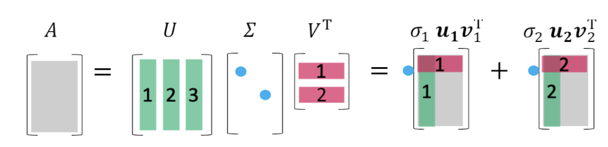
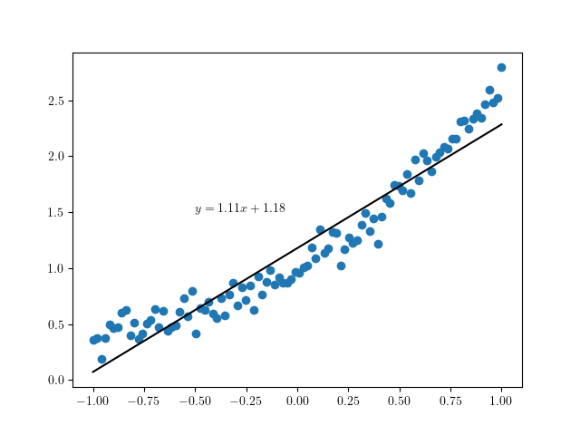

## 前置知识

见另一篇博客：[谱定理的证明](/posts/spectral-theorem-proof/)

## 奇异值分解（SVD）

奇异值分解（singular value decomposition, SVD），说的是任意矩阵 $\boldsymbol{A} \in \mathbb{C}^{m\times n}$ ，都可以分解成以下形式

> $$
> \begin{align*}
> \boldsymbol{A}&=\boldsymbol{u}_1\sigma_1\boldsymbol{v}^* _1 + \boldsymbol{u}_2\sigma_2\boldsymbol{v}^* _2 + \dots + \boldsymbol{u}_r\sigma_r\boldsymbol{v}^*_r \\
> &= \left(\begin{array}{cccc}
> \boldsymbol{u}_1 & \dots & \boldsymbol{u}_2 & \boldsymbol{u}_m \\
> \end{array}\right)
> \left(\begin{array}{cc}
> \mathrm{diag}(\sigma_1, \sigma_2, \dots, \sigma_r) & 0\\
> 0 & 0\\
> \end{array}\right)
> \left(\begin{array}{c}
> \boldsymbol{v}_1^* \\
> \boldsymbol{v}_2^* \\
> \vdots \\
> \boldsymbol{v}_n^*
> \end{array}\right)\\
> &= \boldsymbol{U} \boldsymbol{\Sigma} \boldsymbol{V}^*
> \end{align*}
> $$

其中 $r$ 是矩阵 $A$ 的秩， $\boldsymbol{u} _1 , \boldsymbol{u} _2 , \dots , \boldsymbol{u} _m$ 为 $\boldsymbol{A}\boldsymbol{A}^*$ 的特征向量， $\boldsymbol{v} _1,  \boldsymbol{v} _2,  \dots  \boldsymbol{v} _n$ 为 $\boldsymbol{A}^*\boldsymbol{A}$ 的特征向量

$\boldsymbol{U}$ 和 $\boldsymbol{V}$ 满足

$$
\begin{align*}
\boldsymbol{U}^*\boldsymbol{U}&=\boldsymbol{I}\\
\boldsymbol{V}^*\boldsymbol{V}&=\boldsymbol{I}
\end{align*}
$$

即 $\boldsymbol{U}$ 和 $\boldsymbol{V}$ 均为酉矩阵。

且 $\sigma_1 \geq \sigma_2 \geq \cdots \geq \sigma_r > \sigma_{r+1} = \sigma_{r+2} = \cdots = \sigma_n = 0$ 。

奇异值分解表明了任意矩阵都可以拆分成$r$个秩为$1$的矩阵之和。酉矩阵表明 $\boldsymbol{u}_1$ 和 $\boldsymbol{v}_1$ 的长度均为 $1$。则 $\sigma_i$ 的大小描述了拆分成的这个矩阵的重要程度， $\sigma_i$ 越大，说明 $\boldsymbol{u}_i\sigma_i\boldsymbol{v}_i^*$ 这一项越重要。这就揭示了奇异值分解在数据降维、图像压缩、统计分析（如：主成分分析）方面大有用处。

### 优势

相比于特征值分解，奇异值分解的优势多多。

1. 对矩阵的要求少

    特征值分解要求 $\boldsymbol{A}$ 为方阵，且可对角化。而奇异值分解对 $\boldsymbol{A}$ 没有什么限制。

2. 稳定性

    当 $\boldsymbol{A}$ 中一个值微小的改变时，特征值分解的 $\boldsymbol{\Lambda}$ 可能会发生比较大的改变。但是奇异值分解的 $\boldsymbol{\Sigma}$ 只会发生很小的改变。并且这些改变都发生在靠后的、 $\sigma_i$ 更小的项里。

### 截取k项

由于 $\sigma_i$ 的大小是从大到小排列，因此我们可以只取前面 $k$ 项，得到

$$
\begin{align*}
&\boldsymbol{u}_1\sigma_1\boldsymbol{v}^* _1 + \boldsymbol{u}_2\sigma_2\boldsymbol{v}^* _2 + \dots + \boldsymbol{u}_k\sigma_k\boldsymbol{v}^*_k \\
&=\boldsymbol{U}_k \boldsymbol{\Sigma}_k \boldsymbol{V}_k^*
\end{align*}
$$

其中 $\boldsymbol{U}_k$ 为 $m\!\times\!k$ 矩阵，$\boldsymbol{\Sigma}_k$ 为 $k\!\times\!k$ 对角阵， $\boldsymbol{V}$ 为 $n\!\times\!k$ 矩阵。

当 $k=r$ 时，则

$$
\boldsymbol{A}=\boldsymbol{U}_k\boldsymbol{\Sigma}_k \boldsymbol{V}_k^*
$$

仍然成立，此时相当于对$\boldsymbol{A}$进行了无损压缩。

当 $k\lt r$ 时，$\sigma_1$ 最小的 $r-k$ 项被舍弃了，但是得到的新矩阵和原来的矩阵仍然是相近的，相当于一个有损压缩。

$$
\boldsymbol{A}\approx\boldsymbol{U}_k\boldsymbol{\Sigma}_k \boldsymbol{V}_k^*
$$

显然，新矩阵的秩为$k$，此时相当于做了一个数据降维。

### 存在性证明

引理1：对称矩阵均为半正定矩阵（半正定矩阵：特征值均非负的矩阵）

> 先证明$\lambda$为实数
> $$
> \begin{align*}
> \boldsymbol{S}^* &= \boldsymbol{S} \\
> \boldsymbol{Sx} &= \lambda \boldsymbol{x}\\
> \Rightarrow\\
> \boldsymbol{x}^*\boldsymbol{S} &= \overline{\lambda}\boldsymbol{x}^* \\
> \boldsymbol{x}^*(\boldsymbol{S}\boldsymbol{x}) &= \overline{\lambda}\boldsymbol{x}^*\boldsymbol{x}=\overline{\lambda}|\boldsymbol{x}|^2\\
> (\boldsymbol{x}^*\boldsymbol{S})\boldsymbol{x}&=\lambda \boldsymbol{x}^* \boldsymbol{x} = \lambda|\boldsymbol{x}|^2\\
> (\lambda - \overline{\lambda})|\boldsymbol{x}|^2 &= 0\\
> \end{align*}
> $$
>
> 又因为特征向量 $\boldsymbol{x}$ 非零，得 $\lambda = \overline{\lambda}$，即 $\lambda$ 为实数
>
> 再证明 $\lambda$ 非负
>
> $$
> \begin{align*}
> \boldsymbol{x}^*\boldsymbol{A}^*\boldsymbol{Ax}&=(\overline{\lambda}\boldsymbol{x}^*)(\lambda \boldsymbol{x})\\|\boldsymbol{Ax}|^2&=|\lambda|^2|\boldsymbol{x}^2|\\|\lambda|^2&=\frac{|\boldsymbol{Ax}|^2}{|\boldsymbol{x}|^2}\geq 0
> \end{align*}
> $$

引理2：$\mathrm{rank}(\boldsymbol{A}^*\boldsymbol{A})=\mathrm{rank}(\boldsymbol{AA}^*)=r$

> 由 $\boldsymbol{Ax}=0 \Rightarrow \boldsymbol{A}^*\boldsymbol{Ax}=0$ 得
>
> $$
> \mathrm{N}(\boldsymbol{A}
> ^*\boldsymbol{A}) \subset \mathrm{N}(\boldsymbol{A})
> $$
> 若 $\boldsymbol{A}^*\boldsymbol{Ax}=0$，则
>
> $$
> \boldsymbol{x}^*\boldsymbol{A}^*\boldsymbol{AX}=(\boldsymbol{Ax})^*\boldsymbol{Ax}=|\boldsymbol{Ax}|^2=0
> $$
>
> $$
> \boldsymbol{Ax}=0
> $$
>
> 所以
>
> $$
> \mathrm{N}(\boldsymbol{A}) \subset \mathrm{N}(\boldsymbol{A}^*\boldsymbol{A})
> $$
>
> 有
>
> $$
> \begin{align*}\mathrm{N}(\boldsymbol{A})&=\mathrm{N}(\boldsymbol{A}^*\boldsymbol{A})\\\dim\mathrm{N}(\boldsymbol{A})&=\dim\mathrm{N}(\boldsymbol{A}^*\boldsymbol{A})\\n-\mathrm{rank}(\boldsymbol{A})&=n-\mathrm{rank}(\boldsymbol{A}^*\boldsymbol{A})\\\mathrm{rank}(\boldsymbol{A})&=\mathrm{rank}(\boldsymbol{A}^*\boldsymbol{A})
> \end{align*}
> $$
>
> 同理可证明$\mathrm{rank}(\boldsymbol{A}^*)=\mathrm{rank}(\boldsymbol{AA}^*)$，故原式成立

引理3：$\boldsymbol{A}^*\boldsymbol{A}$ 和 $\boldsymbol{AA}^*$ 均有 $r$ 个相同的正特征值。

> 首先证明均有 $r$ 个特征值：
>
> 由于 $\boldsymbol{A}^*\boldsymbol{A}$ 为对称矩阵，由于对称矩阵一定是正规矩阵，由谱定理有
>
> $$
> \boldsymbol{A}^*\boldsymbol{A}=\boldsymbol{U\Lambda}\boldsymbol{U}^*
> $$
>
> 由引理1，特征值不可能为负。且 $\boldsymbol{\Lambda}$ 中非零元素个数其实就是 $\mathrm{rank}(\boldsymbol{\Lambda})$
>
> 则正特征值个数 $\mathrm{rank}(\boldsymbol{\Lambda})=\mathrm{rank}(\boldsymbol{A}^*\boldsymbol{A})$
>
> 对 $\boldsymbol{AA}^*$ 同理
>
> 再证明 $\boldsymbol{A}^*\boldsymbol{A}$ 的正特征值也是 $\boldsymbol{AA}^*$ 的正特征值：
>
> $$
> \begin{align*}
> \boldsymbol{A}^*\boldsymbol{Ax}&=\lambda\boldsymbol{x}\\
> \boldsymbol{A}\boldsymbol{A}^*\boldsymbol{Ax}&=\lambda\boldsymbol{Ax}\\
> \boldsymbol{A}\boldsymbol{A}^*(\boldsymbol{Ax})&=\lambda(\boldsymbol{Ax})\\
> \end{align*}
> $$
>
> 由 $\lambda \neq 0$ 得 $\boldsymbol{Ax}\neq 0$，故 $\boldsymbol{Ax}$ 是 $\boldsymbol{A}^*\boldsymbol{A}$ 的一个特征向量，对应的特征值为 $\lambda$。
>
> 反之可证 $\boldsymbol{A}\boldsymbol{A}$ 的正特征值也是 $\boldsymbol{A}^*\boldsymbol{A}$ 的特征值，则两矩阵拥有相同的一组正特征值。

由引理3，我们设这一组相同的特征值为 $\lambda_i\quad(i \leq r)$ 并从大到小排列，$\lambda_1 \geq \lambda_2 \geq \dots \geq \lambda_r > \lambda_{r+1} = \lambda_{r+2} = \dots = \lambda_m = 0$。

证明是构造性的

对 $\boldsymbol{A}^*\boldsymbol{A}$ 谱分解可以求出 $\boldsymbol{V}$ 和 $\lambda_i$，设 $\boldsymbol{V}$ 的第 $i$ 列为 $\boldsymbol{v}_i$，对应特征值 $\lambda_i$。

设 $\boldsymbol{V}=\left(\begin{array}{cc}\boldsymbol{V}_r & \boldsymbol{V}_0\end{array}\right)$ ，前 $r$ 列为 $\boldsymbol{V}_r$，剩下 $m-r$ 列为 $\boldsymbol{V}_0$。

$
\boldsymbol{U}=\left(\begin{array}{cc}
\boldsymbol{U}_r & \boldsymbol{U}_0 \\
\end{array}\right)$，前 $r$ 列为 $\boldsymbol{U}_r$，剩下 $n-r$ 列为 $\boldsymbol{U}_0$。

当 $i>r$ 时，由 $\boldsymbol{A}^*\boldsymbol{Av}_i=0$ 两边左乘以 $\boldsymbol{v}_i^*$，易得 $\boldsymbol{Av}_i=0$，故有 $\boldsymbol{AV}_0 = 0$。

等价变换原式

$$
\begin{align*}
\boldsymbol{A} &= \boldsymbol{U\Sigma V}^*\\
\boldsymbol{AV} &= \boldsymbol{U \Sigma}\\
\boldsymbol{A}\left(\begin{array}{cc}
\boldsymbol{V}_r\\
\boldsymbol{V}_0\\
\end{array}\right)&=\left(\begin{array}{cc}
\boldsymbol{U}_r & \boldsymbol{U}_0\\
\end{array}\right)
\left(\begin{array}{cc}
\boldsymbol{\Sigma}_r & 0 \\
0 & 0 \\
\end{array}\right) \tag{1}\\
\boldsymbol{AV}_r &= \boldsymbol{U}_r \boldsymbol{\Sigma}_r \tag{2}\\
\end{align*}
$$

再令

$$
\begin{align*}
\sigma_i &= \sqrt{\lambda_i}\\
\boldsymbol{\Sigma}_r &= \mathrm{diag}(\sigma_1,  \sigma _2,  \dots,  \sigma_r)\\
\end{align*}
$$

$\boldsymbol{V}_r$、$\boldsymbol{\Sigma}_r$ 均已构造出来，则只需构造符合 $(1)$ 的 $\boldsymbol{U}_r$，且 $\boldsymbol{u}_i$（$i\leq r$）满足以下条件：

1. $\boldsymbol{u}_i$ 为单位向量。
2. $\boldsymbol{u}_i \perp \boldsymbol{u}_j$（$i \neq j$）。
3. $\boldsymbol{u}_i$ 是 $\boldsymbol{AA}^*$ 的特征向量。

令 $\boldsymbol{u}_i=\frac{1}{\sigma_i}\boldsymbol{Av}_i$，下面证明其满足三个条件

#### 1

$$
\begin{align*}
\boldsymbol{u}_i^*\boldsymbol{u}_i &= \frac{1}{\sigma_i^2}\boldsymbol{v}_i^*\boldsymbol{A}^*\boldsymbol{Av}_i\\
&=\frac{1}{\lambda_i}\boldsymbol{v}_i^*\lambda_i \boldsymbol{v}_i\\
&=1\\
\end{align*}
$$

##### 2

$$
\begin{align*}
\boldsymbol{u}_i^*\boldsymbol{u}_j &= \frac{1}{\sigma_i\sigma_j}\boldsymbol{v}_i^*\boldsymbol{A}^*\boldsymbol{Av}_j\\
&=\frac{1}{\sigma_i\sigma_j}\boldsymbol{v}_i^*\boldsymbol{v}_j\\
\end{align*}
$$

由 $\boldsymbol{v}_i$ 和 $\boldsymbol{v}_j$ 正交知上式等于 $0$，即 $\boldsymbol{u}_i$ 和 $\boldsymbol{u}_j$ 也正交。

#### 3

$$
\begin{align*}
\boldsymbol{AA}^*\boldsymbol{u}_i &= \frac{1}{\sigma_i}\boldsymbol{AA}^*\boldsymbol{A}\boldsymbol{v}_i\\
&= \sigma_i\boldsymbol{Av}_i\\
&=\lambda_i \boldsymbol{u}_i\\
\end{align*}
$$

证毕。

### 与四个基本子空间的关系

- $\boldsymbol{V}_r=(\boldsymbol{v} _1,  \boldsymbol{v} _2,  \dots,  \boldsymbol{v} _n)$是$\boldsymbol{A}$的行空间$\mathrm{C}(\boldsymbol{A}^*)$的一组标准正交基；
- $\boldsymbol{V}_0=(\boldsymbol{v} _r,  \boldsymbol{v} _{r+1},  \dots,  \boldsymbol{v} _n)$是$\boldsymbol{A}$的零空间$\mathrm{N}(\boldsymbol{A})$的一组标准正交基；
- $\boldsymbol{U}_r=(\boldsymbol{u} _1,  \boldsymbol{u} _2,  \dots,  \boldsymbol{u} _u)$是$\boldsymbol{A}$的列空间$\mathrm{C}(\boldsymbol{A})$的一组标准正交基；
- $\boldsymbol{U}_0=(\boldsymbol{u} _r,  \boldsymbol{u} _{r+1},  \dots,  \boldsymbol{u} _n)$是$\boldsymbol{A}$的左零空间$\mathrm{N}(\boldsymbol{A}^*)$的一组标准正交基。

线性代数中非常重要的子空间，和SVD就这样巧妙地联系在一起了，由 $\boldsymbol{V}^*\boldsymbol{V} = \boldsymbol{I}$ 和 $\boldsymbol{U}^*\boldsymbol{U} = \boldsymbol{I}$，又能再次验证四个基本子空间的两组垂直关系：

$$
\begin{align*}
\mathrm{C}(\boldsymbol{A}) \perp \mathrm{N}(\boldsymbol{A}^*)\\
\mathrm{C}(\boldsymbol{A}^*) \perp \mathrm{N}(\boldsymbol{A})\\
\end{align*}
$$

### 补充

为了结论的泛用性，上面的证明是在复数域 $\mathbb{C}$ 下进行的，当然换成实数域也是同理的，只要将 $\boldsymbol{A}^*$ 换成 $\boldsymbol{A}^\mathrm{T}$ 即可。

## 参考

Introduction to Linear Algebra, 5th edition, by Gilbert Strang

[https://inst.eecs.berkeley.edu/~ee127/sp21/livebook/thm_sed.html](https://inst.eecs.berkeley.edu/~ee127/sp21/livebook/thm_sed.html)
