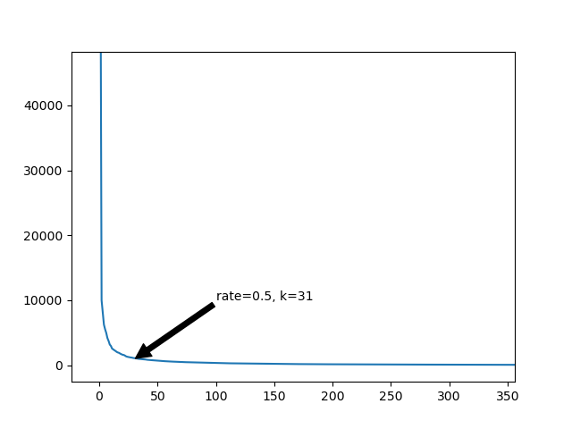

## 理论基础

详见[奇异值分解](/posts/singular-value-decomposition/)

奇异值分解（SVD）可以将任意矩阵分解为 $\boldsymbol{A}=\boldsymbol{u}_1\sigma_1\boldsymbol{v}^* _1 + \boldsymbol{u}_2\sigma_2\boldsymbol{v}^* _2 + \dots + \boldsymbol{u}_r\sigma_r\boldsymbol{v}^*_r=\boldsymbol{U \Sigma V}^\mathrm{T}$ 的形式。并且越靠近后面的项越不重要，去除它们就可以用更小的空间储存一个与原来矩阵相近的矩阵。

若将图像看作RGB三通道的三个矩阵，对图像SVD并保留前$k$项，就可以实现图像压缩。

## 效果展示&分析


可以看到，当压缩率在0.5以上时，图像基本保持原本的细节，压缩率0.5以下时，逐渐丢失了细节。

画出 $\sigma_k$ 曲线。可以看到 $\sigma_k$ 随 $k$ 的增加先急剧降低，后缓慢降低。



## 代码

::github{repo="cyrus28214/SVD-image-compression"}
[GitHub项目地址](https://github.com/cyrus28214/SVD-image-compression)

```python
import numpy as np
import matplotlib.pyplot as plt
import PIL.Image
import argparse

def load_img(path):
    img = PIL.Image.open(path)
    img = np.array(img).astype('float32')
    return img

def compress(path, rate):
    img = load_img(path)
    img = np.transpose(img, (2, 0, 1)) # (m, n, 3) -> (3, m, n)
    u, s, v = np.linalg.svd(img) # SVD分解
    if rate >= 1:
        return u, s, v
    m, n = img.size
    k = rate_to_k(m, n, rate)
    return truncate(u, s, v, k)

def truncate(u, s, v, k): # 截断矩阵
    u = u[..., :k] # 保留前k列
    s = s[:, :k] # 保留前k个奇异值
    v = v[:, :k] # 保留前k行
    return u, s, v    

def rate_to_k(m, n, rate):
    '''
    设原图像size为m*n
    则占用空间为m*n*3
    设保留k个奇异值
    压缩后占用空间为(m+n+1)*k*3*4
    压缩率为rate=(m+n+1)*k*4/(m*n)
    k = rate*m*n/((m+n+1)*4)
    '''
    return int(rate*m*n/((m+n+1)*4))


def decompress(u, s, v):
    img = (u * s[:, np.newaxis]) @ v # (3, m, k) * (3, 1, k) @ (3, k, n) -> (3, m, n)
    img = np.transpose(img, (1, 2, 0)) # (3, m, n) -> (m, n, 3)
    img = np.round(img.clip(0, 255)).astype('uint8')
    return img

def preview(path, rates, col=5):
    row = (len(rates) + col - 1) // col
    fig, axes = plt.subplots(row, col)
    for i in axes.flat:
        i.axis('off')
    u, s, v = compress(path, 1)
    m, n = PIL.Image.open(path).size
    for i, rate in enumerate(rates):
        k = rate_to_k(m, n, rate)
        img = decompress(*truncate(u, s, v, k))
        ax = axes[i // col, i % col]
        ax.set_title(f'rate={rate}')
        ax.imshow(img)
    plt.show()

def save(path, u, s, v):
    np.savez_compressed(path, u=u, s=s, v=v)

def load_c(path):
    d = np.load(path)
    return d['u'], d['s'], d['v']

def main(): # main里的内容并不重要，这是使用ChatGPT自动生成的命令行界面，便于使用。
    parser = argparse.ArgumentParser(description="SVD Image Compression")
    
    # Compression options
    parser.add_argument('-c', '--compress', metavar='FILE', help='Compress an image')
    parser.add_argument('-o', '--output', metavar='FILE', help='Specify output file for compression')
    parser.add_argument('-r', '--rate', type=float, help='Compression rate')

    # Decompression options
    parser.add_argument('-d', '--decompress', metavar='FILE', help='Decompress a compressed file')

    # Preview options
    parser.add_argument('-p', '--preview', metavar='FILE', help='Preview the compressed images')
    parser.add_argument('--rates', type=float, nargs='+', help='Specify compression rates for preview')

    args = parser.parse_args()

    if args.compress:
        u, s, v = compress(args.compress, args.rate or 0.8)
        output = args.output or args.compress
        if not output.endswith('.npz'):
            output += '.npz'
        save(output, u, s, v)
        print(f'Image compressed and saved to {output}')

    elif args.decompress:
        u, s, v = load_c(args.decompress)
        output = args.output or args.decompress
        if output.endswith('.npz'):
            output = output[:-4]
        img = decompress(u, s, v)
        PIL.Image.fromarray(img).save(output)
        print(f'Image decompressed and saved to {output}')

    elif args.preview:
        rates = args.rates or [
            1, 0.9, 0.8, 0.7, 0.6, 0.5, 0.4, 0.3, 0.2, 0.1
        ]
        preview(args.preview, rates)

    else:
        parser.print_help()

if __name__ == '__main__':
    main()
```
