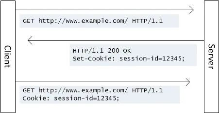
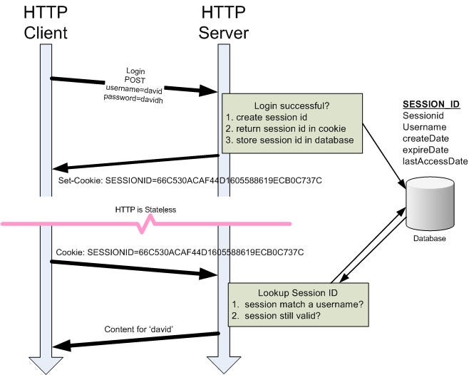
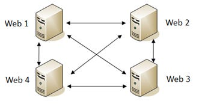
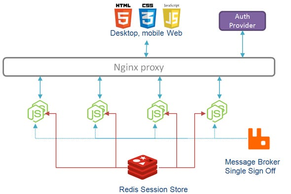
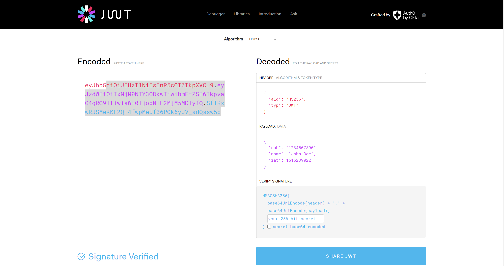

## 身份验证

Web应用经常需要对用户进行身份验证，才能判定用户的权限，决定用户能访问哪些资源。比如只有你才能看到自己的私密QQ相册，比如只有老师才能看到智学网中全班同学的成绩，同学只能看到自己的。

身份验证需要在服务器和客户端之间交换和保存数据，比如当你登录了一个网站，你并不希望下次登录的时候还要输入账号密码，需要建立一些机制，保存这个登录的状态，告诉服务器“是我，我不久前刚刚登录过”。于是就有了以下这些概念。

---

## Cookie

cookie，就是<del>曲奇饼干</del>**一小段储存在客户端（浏览器）的数据**。cookie可以用来保存状态，不仅仅是账户的登录状态，也可能包括一些设置、浏览记录等。

cookie是由服务器生成，储存在客户端的数据。目的是为了保存一些状态，让服务器知道这次请求和之前的请求发送自相同的客户端。

### 机制

当服务器想要向客户端添加cookie的时候，服务器会在response headers中添加`Set-Cookie`项，然后浏览器会保存`Set-Cookie`中的值。之后每次访问相同站点的时候，都会带上相同的数据，放在`Cookie`中。当然，服务器那里也要保存一份cookie，用于比对验证。

用图片表示就是这样



就好比在理发店办卡，理发师记不住哪些顾客办了会员，于是就给办了会员的用户发一张会员卡，顾客每次来理发的时候，都戴上这张卡，理发师就知道这位顾客办过会员了。

另外cookie是不能跨域的，也就是说cookie不能在不同网站之间共享（假如能共享显然会非常不安全）。访问这个网站，浏览器就只会带上这个网站的cookie。

### 缺陷

- 容量：cookie不能储存太多的数据，大小限制一般是4KB。
- 隐私问题：cookie可能会记录一些敏感信息。
- 临时性：cookie是有时效的，超过一定时间会过期，或者被浏览器自动清理。并且cookie属于是浏览器缓存的一部分，如果清除了浏览器缓存，cookie也会被清除。
- 安全性：
  - cookie是明文传输的，容易受到中间人攻击
  - 跨站脚本攻击（XSS）可以获取用户的cookie
  - 跨站请求伪造（CSRF）可以利用用户的授权状态执行操作。

### 我可以看看我的cookie吗

因为cookie是储存在客户端的，每个人都可以看自己的cookie。具体的步骤是：

1. 按<kbd>F12</kbd>打开开发者工具
2. 切换到“Application”选项卡
3. 在左侧选择“Cookies”

**注意：请不要把你的cookie给别人看，不怀好意之人可能用你的cookie“窃取”你的登录状态**

### 后端代码怎么设置和获取cookie

用流行的几个Web框架演示一下

#### JavaScript | Express.js

<details>
<summary>点击展开</summary>

设置cookie：

```js
const express = require('express');
const app = express();

app.get('/', (req, res) => {
    res.cookie('cookieName', 'cookieValue', { maxAge: 900000, httpOnly: true });
    res.send('Cookie has been set');
});

app.listen(3000, () => {
    console.log('Server is running on port 3000');
});
```

获取cookie

```js
app.get('/getCookie', (req, res) => {
    const cookieValue = req.cookies.cookieName;
    res.send('Cookie Value: ' + cookieValue);
});

```

</details>

#### Python | Flask

<details>
<summary>点击展开</summary>

设置cookie：

```py
from flask import Flask, make_response

app = Flask(__name__)

@app.route('/')
def set_cookie():
    resp = make_response('Cookie has been set')
    resp.set_cookie('cookieName', 'cookieValue', max_age=900, httponly=True)
    return resp
```

获取cookie:

```py
@app.route('/getCookie')
def get_cookie():
    cookie_value = request.cookies.get('cookieName')
    return 'Cookie Value: ' + str(cookie_value)
```

</details>

#### Java | Spring

<details>
<summary>点击展开</summary>

设置cookie：

```java
import javax.servlet.http.Cookie;
import javax.servlet.http.HttpServletResponse;

@Controller
public class MyController {

    @GetMapping("/")
    public String setCookie(HttpServletResponse response) {
        Cookie cookie = new Cookie("cookieName", "cookieValue");
        cookie.setMaxAge(900);
        cookie.setHttpOnly(true);
        response.addCookie(cookie);
        return "Cookie has been set";
    }
}
```

获取cookie:

```java
@GetMapping("/getCookie")
public String getCookie(@CookieValue(name = "cookieName", defaultValue = "defaultValue") String cookieValue) {
    return "Cookie Value: " + cookieValue;
}
```

</details>

---

## 会话（Session）

session和cookie并不是两个平行的概念，session是基于cookie实现的。

我们前面提到的做法，只是让用户每次携带cookie来找服务器，服务器本身并没有储存额外的数据。在session中，需要的数据被储存在服务器端，唯一对应一个**session ID**，而cookie中只储存session ID。（session ID一般就是一个包含字母和数字的字符串）

### 机制

1. 当用户第一次访问网站，网站创建一个session，这个session带有一个唯一的session ID
2. 服务器将session ID放到HTTP response里的`Set-Cookie`
3. 现在每次用户访问这个网站，都会带上这个session ID，服务器将这个session ID与服务端的相比对，如果这个session存在，就保持这个session的状态。
4. session是会过期的，当过期时间到，服务器就会删除这个session，下次用户携带session ID的时候，服务器上找不到对应的session，就会提示用户重新登录。



### 多台服务器

假如我们只有一台服务器，这样做是可行的。但是如果我们有多台服务器，并采用一定的负载均衡策略，现在session在服务器A上建立，然后用户访问了服务器B怎么办？

解决这个问题有三种方案：

有三种方式：

1. **会话复制（Session Replication）** — 服务器A将会话信息复制到服务器B和服务器C，确保每个服务器都有一个副本，无论登录请求被发送到哪个服务器。然而，它有明显的缺点，即数据冗余，并且如果节点过多，实现会变得非常复杂。

    

2. **会话粘性（Session Stickiness）** — 允许每个客户端的请求只被发送到某个固定的的服务器。如Nginx负载均衡器，可以通过IP地址或cookie支持粘性。只要其IP地址保持不变，可以通过对IP地址进行哈希计算来路由请求到固定的服务器。

3. **会话共享（Session Sharing）** — 会话存储在中间件中，如Redis和Memcached。当请求到达时，每个服务器可以访问中间件以获取会话信息。

    

---

## 令牌（Token）

通过刚才对session的介绍，我们可以发现将数据储存在服务器既会增加储存成本，又会带来多服务器共享的问题。

对于一些用户规模庞大的大公司，上面的解决方案是合理可行的。但是对于一些用户量少的产品，处理这些棘手的问题就不值得了，不如不要让服务器保存这些session，还是让客户端保存吧，客户端保存的这个能够验证身份的数据就叫做令牌（token）！

token是一种泛指，用来验证身份的数据块，就叫做作token。而JWT是一种标准，一种具体的实现。顾名思义，json web token就是使用json格式，用于web领域的token。我们下面说的token都指的是JWT。

问题来了，既然token储存在用户侧，那么用户就可以伪造token来骗过身份验证，为了解决这个问题，我们需要用到**数字签名**，数字签名是一种能确保数据来源可靠，防篡改、防伪造的技术。

具体来说，服务器会将token使用一个只有服务器知道的密钥进行加密，然后将密文发给用户，记录在用户的cookie中。

由于这个密钥只有服务器知道，别人就无法伪造密文。当用户携带cookie访问网站的时候，服务器再使用这个密钥解密，就得到了token的内容。

在[JWT的官网](https://jwt.io/)中，我们可以看到一个JWT长这样：



---

## 参考链接

[https://medium.com/geekculture/cookies-session-token-d9f068cccdc6](https://medium.com/geekculture/cookies-session-token-d9f068cccdc6)
