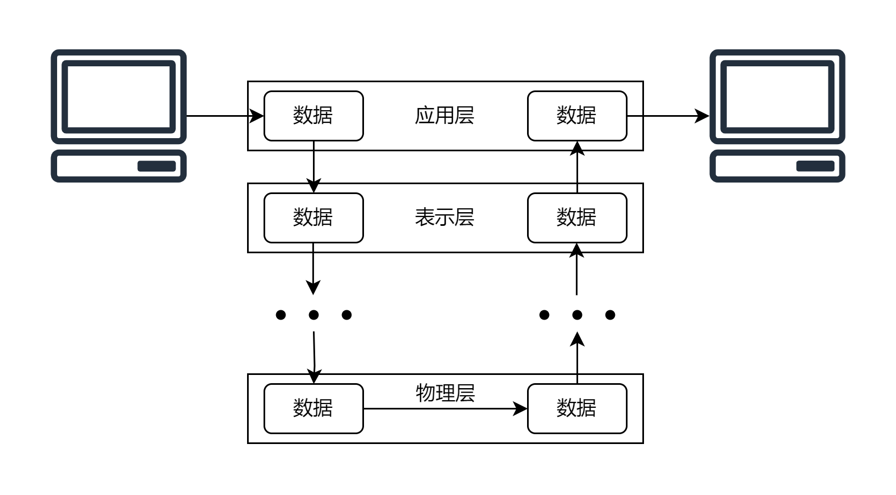

## 概念

OSI模型（Open Systems Interconnection model）是由国际标准化组织（ISO）制定的一种用将各个计算机连接成网络的标准框架。

OSI模型将通信系统中的数据流划分成8层，从上至下分别是应用层、表示层、会话层、传输层、网络层、数据链路层、物理层。每一层都在下一层的基础上构建，为其上一层提供功能。从一台计算机发送信息到另一台计算机时，这些信息会从N层开始，向N-1层传递，直到物理层，使用物理的线路进行传输，传输到另一台计算机后，再从低至高解析数据，直到第N层，再交给某个应用程序处理。

OSI是一种概念模型，这意味着OSI并没有规定具体的实现，而只是描述了一些概念，用来为实际的标准制定和开发提供参考。也就是说，对于同一层可能有多种不同的协议来实现。

## 应用层（Application Layer）

应用层是最贴近用户的一层，应用程序通过网络传输数据，根据程序的功能，处理数据、为用户提供图形界面、发送数据等。直接为网络应用提供服务。

具体的应用举例：浏览器、QQ

应用层的网络协议有：HTTP（上网协议）、FTP（文件传输协议）、SMTP（电子邮件传输协议）等。

## 表示层（Presentation Layer）

因为数据在传输的时候需要转换成一定的格式，有的还会进行加密、压缩。为了让程序能读取这些数据，表示层会将数据在应用程序使用的格式和网络使用的格式之间转换。

表示层处理的任务包括协议转换、数据加密、数据解密、数据压缩、数据解压缩、操作系统间数据不兼容等。

## 会话层（Session Layer）

会话（session）用来在客户端和服务器之间建立关联，在一个有限的时间内保持端对端的交互。

会话层用于建立、管理、关闭会话。会话层的常见功能包括用户登录、用户注销。

上面三层的实现都要由应用程序完成，也就是软件工程师们应该负责的部分。有是会把他们统称为软件层（software layer），或者叫upper layer。在这三层里，数据被称作**报文（message）**。

---

## 传输层（Transport Layer）

传输层负责端到端的完整信息传递，在传输层中，数据单元被称为 **“数据段”（segment）**。

### 分段

在发送者那里，数据首先要被分片，就好像我们有200吨货物需要运输，但是一辆货车最多只能承载50吨货物，让货车超载并不是一个好的解决方案，我们可以将货物分成四个部分，装到四辆货车里运输。

### 序列号

序列号可以保证接收到的数据段顺序不会被打乱，在传输过程中，先传输的数据有可能后到达，假如没有对每一个包进行标记，只是按照收到数据的顺序进行拼接，有可能数据会乱序！所以要使用序列号标记数据的顺序。

### 端口号

然后，每一个数据段还要加上一个头，头里面有关于数据本身的信息，包括序列号、源端口号、目标端口号。根据具体使用的协议，这个头被称作TCP/UDP头。

IP地址我们都很熟悉，IP地址告诉互联网“我要找哪一台机器”，而端口告诉机器“我要找哪一个应用程序”。加上端口号，才能告诉机器，这份数据应该交给哪一个应用程序去处理。

比如默认的http网络服务开设在80端口，https网络服务监听443端口，ssh服务监听21端口。

### 流量控制（Flow Control）和差错控制（Error Control）

传输层还需要负责流量控制和差错控制

关于流量控制和差错控制，想了解更多请点此

数据传输的过程中，可能因为发送方和接收方处理数据的能力不同，从而出现信息的丢失。比如说接受信息的计算机处理速度比较慢，缓冲区已经满了，但是发送方还在发送数据，这些数据可能就会丢失。流量控制就是为了解决这个问题，当数据传输速度超出了接收方的承受能力，接收方就会告诉发送方，让发送方降低速度。

错误控制包括错误检测和错误纠正两个过程，它需要利用一定的数据效验机制（比如添加一些校验位），发现并纠正传输过程中的错误。

## 网络层（Network Layer）

在网络层中，传输层中的数据段会被进一步划分为**数据包（packet）**。网络层主要的工作设备是路由器，主要负责的功能是逻辑寻址和路由。

### 逻辑寻址（Logical Addressing）

网络层将会为发送方和接收方都分配上唯一的IP地址，并将这些信息添加到传输的数据包头，因此这个数据包头也被称作IP头，这样才能端对端地传输信息。

### 路由（Routing）

路由是一种“寻路的过程”，在互联网这个巨大的网络中，两台机器想要互相发送信息，它们一般不是直接联通的，需要通过几次跳转，最终到达目的地。网络层应当为数据包选择尽量短的路径，从而提高传输速度。

## 数据链路层（Data Link Layer）

在数据链路层，网络层中的数据包被进一步划分成**数据帧（frames）**，以便在物理层进行传输。在这一层，数据帧被赋予物理地址（MAC地址），以确保它们能够被正确送达目标设备。网卡就是工作在这一层的。

数据链路层的功能包括分帧（Framing）、流量控制（Flow Control）、差错控制（Error）、物理寻址（Physical Addressing）、访问控制（Access Control）。常见的数据链路协议有以太网协议，用于局域网通信。

## 物理层（Physical Layer）

物理层是OSI模型的最底层，它负责管理硬件设备之间的原始比特流（Bit Flow）传输。这包括定义连接器和电缆的规范，以及传输介质的特性。

在物理层，数据以二进制形式传输。这一层的设备要负责将由0和1组成的比特数据转化成物理信号，如电压、光信号、无线电波等，然后接收方的设备再转化回0和1。

---

相比最上面三层，这四层显得更复杂一些，因此我做了一张图方便理解

---

## 总结

OSI模型为计算机网络提供了一个清晰而有序的结构，使不同的公司或组织能够设计和实现互操作性的网络设备。每一层都有其特定的功能，通过层次化的设计，网络通信变得更加高效和可维护。

理解OSI模型的每一层以及它们之间的关系，有助于网络工程师更好地排查问题、设计网络架构，并理解不同协议在网络通信中的作用。

---

## 参考链接

[https://www.geeksforgeeks.org/open-systems-interconnection-model-osi/](https://www.geeksforgeeks.org/open-systems-interconnection-model-osi/)

[https://en.wikipedia.org/wiki/OSI_model](https://en.wikipedia.org/wiki/OSI_model)

[https://blog.51cto.com/ITEvan/6459789](https://blog.51cto.com/ITEvan/6459789)

[https://zhuanlan.zhihu.com/p/473211616](https://zhuanlan.zhihu.com/p/473211616)
