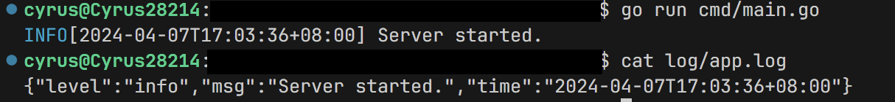

## 背景

在Web项目开发中，日志记录是维护和调试程序的重要手段。[`logrus`](https://github.com/sirupsen/logrus) 是一个流行的Go语言日志库，提供了丰富的日志级别和格式定制能力。logrus它支持 `JSONFormatter` 和 `TextFormatter` 两种格式化器，允许开发人员根据不同的场景，选择最合适的日志输出格式。

### JSONFormatter

`JSONFormatter` 将日志信息输出为JSON格式，这被称为"结构化日志"。结构化日志易于程序解析，非常适合于传输到日志分析系统，如ELK Stack（Elasticsearch、Logstash、Kibana），以便进行集中管理和分析。

JSONFormatter的输出示例：

```json
{"level":"info","msg":"Server started.","time":"2024-04-07T16:14:36+08:00"}
```

### TextFormatter

与JSON相对，TextFormatter 输出的日志更适合人类阅读。同时还能支持彩色输出。

```txt
INFO[2024-04-07T16:28:39+08:00] Server started.
```

在调试或本地开发过程中，直观的文本输出可以更快地帮助开发者定位问题。

在实际应用中，我们可能希望日志同时满足人和机器的阅读需求：将日志以JSON格式输出到日志文件，方便系统的日志分析工具处理；同时，为了开发者的方便，也需要将日志以文本格式输出到标准错误流（stderr）。

那么，如何同时实现两种格式的日志输出？

## 解决方案

这里不得不吐槽，golang的生态并不成熟，关于这个问题的实现方法网上很少有相关资料

### Hook

logrus 提供Hook功能 ，它允许在日志事件发生时，执行特定操作。我们可以使用 Hook 来实现我们的需求。

```go
// A hook to be fired when logging on the logging levels returned from
// `Levels()` on your implementation of the interface. Note that this is not
// fired in a goroutine or a channel with workers, you should handle such
// functionality yourself if your call is non-blocking and you don't wish for
// the logging calls for levels returned from `Levels()` to block.
type Hook interface {
    Levels() []Level
    Fire(*Entry) error
}
```

Hook 接口定义了两个方法

- `Levels() []Level`：返回一个日志级别数组，当这些级别的日志事件发生时，将调用 `Fire` 方法。
- `Fire(*Entry) error`：当符合 `Levels()` 返回的日志级别的日志事件发生时，将调用此方法。

### 实现

于是可以写出以下代码

```go
package logger

import (
    "io"
    "log"
    "os"

    "github.com/sirupsen/logrus"
)

var Logger *logrus.Logger

type Hook struct {
    Writer    io.Writer
    Formatter logrus.Formatter
    Level     []logrus.Level
}

func (h *Hook) Fire(entry *logrus.Entry) error {
    line, err := h.Formatter.Format(entry)
    if err != nil {
        return err
    }
    h.Writer.Write(line)
    return nil
}

func (h *Hook) Levels() []logrus.Level {
    return h.Level
}

func newHook(writer io.Writer, formatter logrus.Formatter, level logrus.Level) *Hook {
    var levels []logrus.Level
    for _, l := range logrus.AllLevels {
        if l <= level {
            levels = append(levels, l)
        }
    }
    return &Hook{
        Writer:    writer,
        Formatter: formatter,
        Level:     levels,
    }
}

func Init(logFilePath string, logLevelStr string) {

    logLevel, err := logrus.ParseLevel(logLevelStr)
    if err != nil {
    logLevel = logrus.InfoLevel
        log.Printf("Invalid log level: %s. Defaulting to info", logLevelStr)
    }

    Logger = logrus.New()
    Logger.SetOutput(io.Discard)

    logFile, err := os.OpenFile(logFilePath, os.O_CREATE|os.O_WRONLY|os.O_APPEND, 0644)
    if err != nil {
        log.Printf("Failed to open log file: %s", logFilePath)
        panic(err)
    }

    Logger.AddHook(newHook(
        logFile,
        &logrus.JSONFormatter{},
        logLevel,
    ))

    Logger.AddHook(newHook(
        os.Stderr,
        &logrus.TextFormatter{
            FullTimestamp: true,
            ForceColors:   true,
        },
        logLevel,
    ))
}
```

## 效果

在指定的日志文件中，会输出JSON格式的日志，同时在标准错误流（stderr）中，会输出文本格式的日志。


