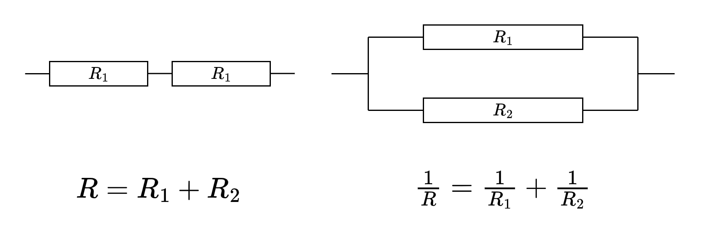
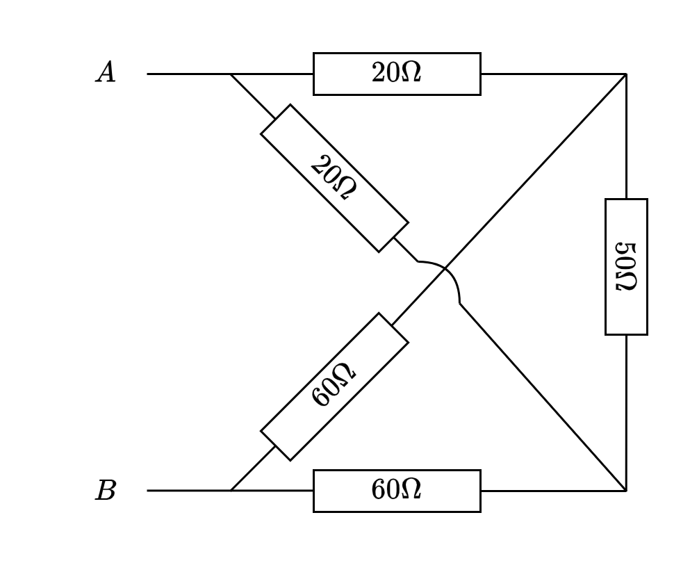
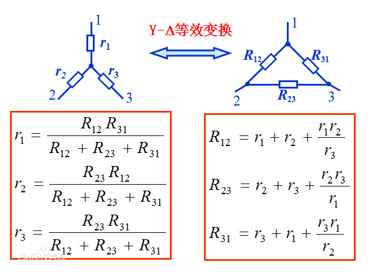
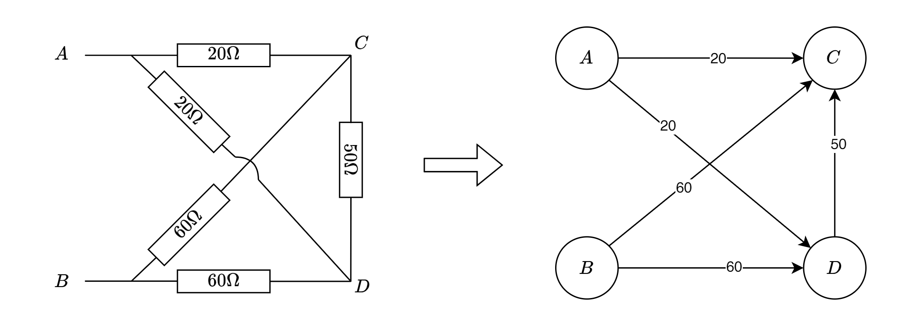
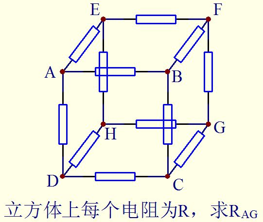

## 引入

我们早就学过了计算串并联电阻的等效电阻的公式：



针对混合的电阻网络，有些时候我们依然可以反复运用这两个公式来计算等效电阻。在有些电阻网络中，这样是无法得到答案的：



如果你熟悉**星三角变换**，你应该能很快算出答案。（或者你能看出这就是一个平衡桥，那就能口算了）



星三角变换固然是一种手工计算等效电阻的很好方法，但是对于计算机而言，利用这个方法计算电阻会很麻烦。下面，我将使用高斯消元法来计算两点之间的等效电阻。

## 建模

我们可以把两点之间的纯电阻网络看作是一张有向图，节点表示导线，边表示电阻，边权表示电阻的大小。要求源点和汇点之间的等效电阻大小。



为什么要建成有向边呢，因为虽然电阻是无向的，但是电流是有向的，我们一开始并不知道电流的方向，但是可以任意地假定一个方向，然后给每一条边赋上一个电流 $I_i$，当 $I_i$ 为正，表示电流方向与箭头同向，当 $I_i$ 为负，表示电流方向与箭头反向。然后我们再假定汇点的电势为$0$，其余每个节点赋上一个电势 $\varphi_i$。

若要求源点到汇点的等效电阻，只需要知道源点的电势 $\varphi_s$ 和汇点的电势 $\varphi_t$，以及汇入汇点的总电流 $I$，就可以计算出等效电阻 $R = \frac{\varphi_s - \varphi_t}{I}$。为了计算这些量，我们要把整个网络的电流和电势都算出来。

设这张图共有 $n$ 节点 $m$ 条边，则我们一共有 $m$ 个 $I_i$ 未知，$n-2$ 个 $\varphi_i$ 未知。一共 $m+n-2$ 个未知量，需要 $m+n-2$ 个方程才能解出来。我们可以利用所学的物理知识来找到这些方程。

## 欧姆定律

最简单的就是欧姆定律了，对于编号为 $i$ 的边 $(u, v)$，有

$$
\varphi_u - \varphi_v = I_i R_i
$$

这一共有 $m$ 个方程。

## 基尔霍夫电流定律（KCL）

除了源点和汇点外，每个结点流入的电流都等于流出的电流。

对于编号为 $u$ 的节点，有

$$
\sum_{i \in Adj(u)} I_i = 0
$$

这 $n-2$ 个方程，再加上前面的 $m$ 个，正好有 $m+n-2$ 个方程，我们可以用高斯消元法来解出所有的电流。

## 高斯消元法

现在不妨令 $\varphi_s = 1$，$\varphi_t = 0$，则有

$$
\begin{cases}
\varphi_u - \varphi_v = I_i R_i && \forall (u, v) \in E \\
\sum_{i \in Adj(u)} \pm I_i = 0 && \forall u \in V - \{s, t\} \\
\varphi_s = 1 \\
\varphi_t = 0 \\
\end{cases}
$$

有了这 $m+n$ 个方程，我们就可以用高斯消元法解出所有的电势和电流，进而求出等效电阻了。

高斯消元法是一种求解线性方程组的算法，在计算机中的实现也很简单。此处复杂度 $O((m+n)^3)$

> 此处的优化空间：从上面可以看出，这些方程一般是很稀疏的，如果改用计算稀疏线性方程组的算法可以达到更高的效率。如LU分解、bfgs、lbfgs

## 代码实现

使用纯C实现

[Github项目地址](https://github.com/cyrus28214/resistance)
::github{repo="cyrus28214/resistance"}

```c
#include <stdio.h>
#include <stdlib.h>
#include <math.h>

double **array2d(int rows, int cols);
void gauss(double **a, int n);

int main() {
    int n, //节点数量
        m, //边的数量
        s, //源点
        t; //汇点
    //图不能有自环，可以有重边，需要联通

    scanf("%d%d%d%d", &n, &m, &s, &t);

    //为了代码方便，增加一个变量I_总
    int k = n + m + 1; //方程的个数

    double **a = array2d(k, k+1);//多出的一列是等号右边的常数
    //每一列代表的变量分别为：
    // I_0 ... I_{m-1} | phi_0 ... phi_{n-1} | I_总
    //I_i = a[][i]
    //phi_i = a[][m+i]

    //各个方程为
    //0 ~ m-1 欧姆定律： phi_u - phi_v - I_i R_i = 0
    //m ~ m+n-1 KCL:    sum I_i = 0 (对非源点汇点)
    //                  phi_s = 1 (对源点，加1V电压)
    //                  phi_t = 0 (对汇点，接地)
    //m+n：             计算总电流I_总=汇入t电流

    //m行，每行三个整数u, v, r表示u到v有一个阻值为r的电阻
    for (int i = 0; i < m; i++) {
        int u, v;
        double r;
        scanf("%d%d%lf", &u, &v, &r);

        //欧姆定律
        a[i][m+u] = 1;
        a[i][m+v] = -1;
        a[i][i] = -r;
        //第i个方程 phi_u - phim+n- I_i R_i = 0

        //KCL 注意电流方向，这里按流出为负，流入为正
        if (u != s && u != t) a[m+u][i] = -1;
        else if (u == t) a[m+n][i] = -1;
        if (v != s && v != t) a[m+v][i] = 1;
        else if (v == t) a[m+n][i] = 1;
    }

    a[m+s][m+s] = 1, a[m+s][k] = 1; //源点电电势为1V
    a[m+t][m+t] = 1, a[m+t][k] = 0; //汇点电势为0
    a[m+n][m+n] = -1; //计算总电流I_总

    gauss(a, k); //求解方程组

    double I_total = a[k-1][k];
    printf("%6e\n", 1 / I_total);//由于我们设定了整体电压为1，最后的等效电阻就是1/I_总
}

//生成一个rows行cols列的二维数组，全部初始化成0
double **array2d(int rows, int cols) {
    double **arr = malloc(rows * sizeof(double *));
    for (int i = 0; i < rows; i++) {
        arr[i] = calloc(cols, sizeof(double));
    }
    return arr;
}

void gauss(double **a, int n) {
    //高斯-约旦消元法求解线性方程组
    for (int i = 0; i < n; i++) { //当前行
        //将当前行替换为列主元最大的行
        for (int j = i + 1; j < n; j++) {
            if (fabs(a[j][i]) > fabs(a[i][i])) {
                double *temp = a[i];
                a[i] = a[j];
                a[j] = temp;
            }
        }

        double c = a[i][i];
        //通常的算法此处需要特判c是否为0，但根据物理意义，本问题一定有唯一解，可以不用。
        for (int k = 0; k <= n; k++) 
            a[i][k] /= c;

        //消元
        for (int j = 0; j < n; j++) {
            if (i == j) continue;
            c = a[j][i];
            for (int k = 0; k <= n; k++)
                a[j][k] -= c * a[i][k];
        }
    }
}
```

## 验证


对于开头的这个例子，我们可以验证一下：

输入

```txt
4 5 0 1
0 2 20
0 3 20
1 2 60
1 3 60
3 2 50
4.000000e+01
```

输出`4.000000e+01`，和手算结果一致

再来一个例子，经典高中物理题，每个电阻都是$1\Omega$，求对角线电阻：



用我们的程序算出：

```txt
8 12 0 6
0 1 1
1 2 1
2 3 1
3 0 1
4 5 1
5 6 1
6 7 1
7 4 1
0 4 1
1 5 1
2 6 1
3 7 1
8.333333e-01
```

而这一题的答案是$5 / 6 \,\Omega$，答案正确。

## 一些私货

qzqz机房的hxd们可以在cofun上看到我出的这一题，快去做（cofun服务器好像又爆炸了）

如果你不知道cofun是什么，请忽略这段私货。
