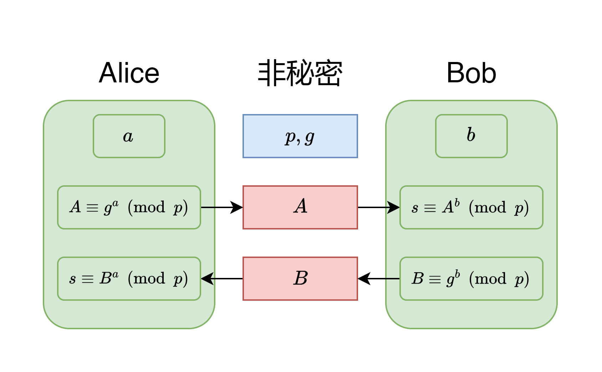

## 什么是 Diffie–Hellman 密钥交换？

Diffie-Hellman是一种密钥交换方法，可以让双方从不安全信道中建立一个共同的密钥来加密通讯内容。

DH方法本身很简单，但它却是许多现代安全协议的基础，如[TLS安全传输层协议](https://en.wikipedia.org/wiki/Transport_Layer_Security)，[安全外壳协议](https://en.wikipedia.org/wiki/Secure_Shell)以及[IPSec互联网安全协议](https://en.wikipedia.org/wiki/IPsec)，都部分使用到了DH算法。

## Diffie–Hellman 密钥交换的过程

Diffie-Hellman密钥交换的过程如下：



1. 双方协定一个质数 $p$ 和基数 $g$。这两个数无需保密，可以随意协商或传输。
2. Alice生成一个随机数 $a$，并计算 $A=g^a \mod{p}$ 。
3. Bob生成一个随机数 $b$，并计算 $B=g^b\pmod{p}$。
4. Alice发送 $A$ 给Bob。
5. Bob发送 $B$ 给Alice。
6. Alice计算 $s=B^a\pmod{p}$
7. Bob计算 $s=A^b\pmod{p}$

由于 ${(g^a)}^b \equiv g^{ab} \equiv {(g^b)}^a$，双方计算出来的$s$是同一个数，双方成功交换了一个共享密钥$s$。后续的通信可以基于$s$进行。

不难发现，窃听的第三方只知道 $A$ 和 $B$，无法计算出 $s$。

与RSA不同，生成DH密钥的速度非常快。因为RSA要求公钥和私钥都是大质数，而DH没有这个限制。

## 安全性

### 中间人攻击

DH只是一种密钥交换方法。并没有身份验证的功能。DH无法抵御中间人攻击，中间人有办法向Alice伪装成Bob，向Bob伪装成Alice。要解决这个问题，必须引入一个认证机构（Certificate Authority, CA）。这就是一个老生常谈的问题了。

### 完美前向保密性（Perfect Forward Secrecy）

> 首先要注意的是，在英语语境中，前向（forward）指的是“向过去”，而后向（backward）指的是“向未来”。我经常记反。例如“向前兼容（forward compatibility）”指的是兼容过去的版本，而“向后兼容（backward compatibility）”指的是兼容未来的版本。

这里，完美前向保密性（PFS）指的是，即使密钥泄露，之前的对话内容也无法被破解。

DH方法可以保证前向安全性。假如攻击者记录了历史的所有对话，并盗取一方的私钥，也无法恢复出历史对话。因为每一次DH使用的参数都是临时的，会在密钥交换结束后销毁。（使用固定参数的DH不是PFS的）

### 离散对数

就像RSA算法的安全性依赖于大素数分解的难度一样。Diffie-Hellman密钥交换的安全性依赖于离散对数的计算难度。随着量子计算的发展，如果出现了高效的解决离散对数的算法，那么DH和基于DH的加密方法都将变得不安全。

目前，有一些DH方法的变种旨在解决后量子密码学挑战下的密钥交换，如[Post-Quantum Extended Diffie-Hellman(PQXDH)](https://en.wikipedia.org/wiki/Post-Quantum_Extended_Diffie-Hellman)

### 在其他群上的扩展

原始的DH算法定义在整数乘法群上，事实上，可以改变这个群给出DH的不同变种。

例如，DH方法有一种变种叫做Elliptic Curve Diffie-Hellman(ECDH)。ECDH使用椭圆曲线的乘法来代替质数阶模乘法，提供了更高的安全性。在同等的安全级别下，ECDH只需要更短的密钥，使ECDH的计算效率也得到提升。

## OpenSSL中的Diffie–Hellman实现

OpenSSL中实现了Diffie–Hellman算法，相关代码如下：

```c
int ossl_dh_compute_key(unsigned char *key, const BIGNUM *pub_key, DH *dh)
{
    BN_CTX *ctx = NULL;
    BN_MONT_CTX *mont = NULL;
    BIGNUM *z = NULL, *pminus1;
    int ret = -1; 

    //1. 确保各个参数都有效，满足安全性要求
    if (BN_num_bits(dh->params.p) > OPENSSL_DH_MAX_MODULUS_BITS) {
        ERR_raise(ERR_LIB_DH, DH_R_MODULUS_TOO_LARGE);
        goto err;
    }

    if (dh->params.q != NULL
        && BN_num_bits(dh->params.q) > OPENSSL_DH_MAX_MODULUS_BITS) {
        ERR_raise(ERR_LIB_DH, DH_R_Q_TOO_LARGE);
        goto err;
    }

    if (BN_num_bits(dh->params.p) < DH_MIN_MODULUS_BITS) {
        ERR_raise(ERR_LIB_DH, DH_R_MODULUS_TOO_SMALL);
        return 0;
    }

    //2. 初始化BN_CTX，BN代表BIGNUM，OpenSSL中用BIGNUM处理大整数
    ctx = BN_CTX_new_ex(dh->libctx);
    if (ctx == NULL)
        goto err;
    BN_CTX_start(ctx);
    pminus1 = BN_CTX_get(ctx);
    z = BN_CTX_get(ctx);
    if (z == NULL)
        goto err;

    if (dh->priv_key == NULL) {
        ERR_raise(ERR_LIB_DH, DH_R_NO_PRIVATE_VALUE);
        goto err;
    }

    //3. 如果 `DH_FLAG_CACHE_MONT_P` 标志被设置，函数会为模数 p 运用蒙哥马利预计算来优化后续的模幂运算。
    if (dh->flags & DH_FLAG_CACHE_MONT_P) {
        mont = BN_MONT_CTX_set_locked(&dh->method_mont_p,
                                      dh->lock, dh->params.p, ctx);
        BN_set_flags(dh->priv_key, BN_FLG_CONSTTIME);
        if (!mont)
            goto err;
    }

    //4. Z = pub_key^priv_key mod p
    if (!dh->meth->bn_mod_exp(dh, z, pub_key, dh->priv_key, dh->params.p, ctx,
                              mont)) {
        ERR_raise(ERR_LIB_DH, ERR_R_BN_LIB);
        goto err;
    }

    //5. Error if z <= 1 or z = p - 1
    if (BN_copy(pminus1, dh->params.p) == NULL
        || !BN_sub_word(pminus1, 1)
        || BN_cmp(z, BN_value_one()) <= 0
        || BN_cmp(z, pminus1) == 0) {
        ERR_raise(ERR_LIB_DH, DH_R_INVALID_SECRET);
        goto err;
    }

    //6. 将z转换为密钥，密钥的长度与模数的长度相同
    ret = BN_bn2binpad(z, key, BN_num_bytes(dh->params.p));
 err:
    //7. 清理和释放资源
    BN_clear(z); 
    BN_CTX_end(ctx);
    BN_CTX_free(ctx);
    return ret;
}
```

DH算法的实现非常简单，上面这段代码的核心部分只有`4.`和`5.`两处。尤其需要注意`5.`的部分，假如`Z = 1`或`Z = p-1`，这两个数是模p乘法群中的平凡元素，很容易作为加密系统的弱点被攻击。

## 参考链接

[https://en.wikipedia.org/wiki/Diffie%E2%80%93Hellman_key_exchange](https://en.wikipedia.org/wiki/Diffie%E2%80%93Hellman_key_exchange)

[https://en.wikipedia.org/wiki/Elliptic-curve_Diffie%E2%80%93Hellman](https://en.wikipedia.org/wiki/Elliptic-curve_Diffie%E2%80%93Hellman)

[https://www.techtarget.com/searchsecurity/definition/Diffie-Hellman-key-exchange](https://www.techtarget.com/searchsecurity/definition/Diffie-Hellman-key-exchange)

[https://stackoverflow.com/questions/14034508/dh-vs-dhe-and-ecdhe-and-perfect-forward-secrecy](https://stackoverflow.com/questions/14034508/dh-vs-dhe-and-ecdhe-and-perfect-forward-secrecy)

[https://www.geeksforgeeks.org/difference-between-diffie-hellman-and-rsa/](https://www.geeksforgeeks.org/difference-between-diffie-hellman-and-rsa/)
