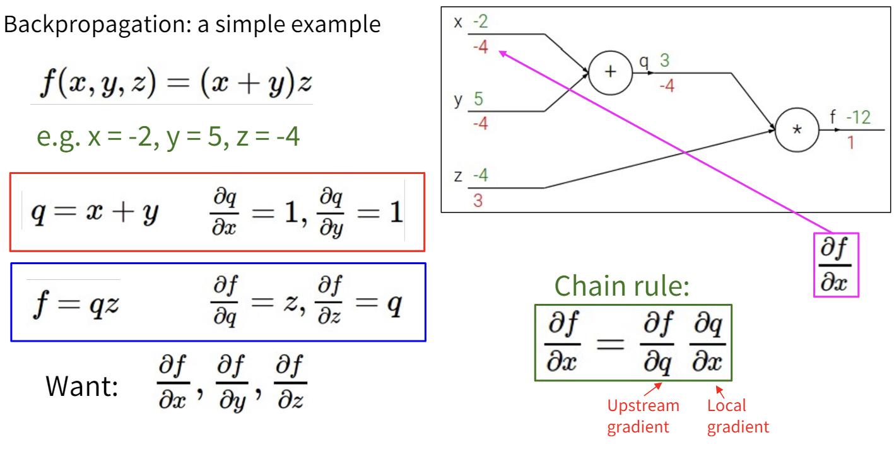
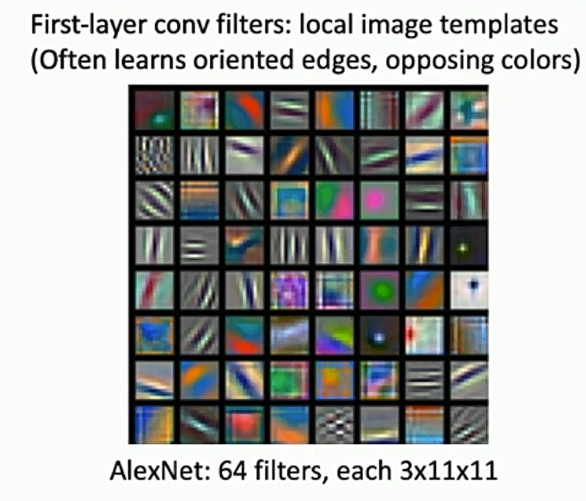

## 课程介绍

Deep Learning for Computer Vision是一门介绍深度学习在计算机视觉中的应用的课程，本课程中介绍了如何实现、训练和调试自己的神经网络，并详细展示了计算机视觉的前沿研究。课程中还包括一些训练和微调视觉识别任务网络的实用工程技巧。CS231n是斯坦福大学的版本，由于这门课程在网络上最新的版本是2017年比较早，因此我选择了教学大纲基本相同，但有额外扩充内容的另一门课程，密歇根大学的EECS498/598，这门课在网上公开的最新版本是FA2019。

课程相关链接：

[https://web.archive.org/web/20230328031120/https://web.eecs.umich.edu/~justincj/teaching/eecs498/FA2020/](https://web.archive.org/web/20230328031120/https://web.eecs.umich.edu/~justincj/teaching/eecs498/FA2020/)

[http://cs231n.stanford.edu/schedule.html](http://cs231n.stanford.edu/schedule.html)

## 课后作业答案

下面是我的作业解答链接

::github{repo="cyrus28214/EECS598-solutions"}
[GitHub项目地址](https://github.com/cyrus28214/EECS598-solutions)

## Lecture 1

对计算机视觉做了简单的引入，主要介绍了计算机视觉的发展历史。

这篇CV领域著名的论文SIFT完成了recognition in matching的任务。

人脸识别方面的技术得到了迅速的商业化。

ImageNet项目作为一个图像数据集，其数据规模达到了惊人的1400万张图片，也成为了计算机视觉领域算法效果的重要检验标准。随后，AlexNet将深度学习引入计算机视觉领域，大大地降低了错误率，并开启了深度学习在CV领域的广泛应用。

GPU的发展极大地增加了计算机视觉的计算能力。结合深度学习的模型，使计算机视觉领域得到突破。

Justin教授认为，计算机视觉领域的发展，主要取决于三个因素：算法、数据、计算。这三个方面对应上面提到的深度学习、ImageNet、GPU for deep learning。

Lecture 1剩下的内容就是一些课程大纲的介绍，就不提了。

## Lecture 2

Lecture 2首先使用了猫作为例子来阐述图片分类任务有哪些挑战，这个例子非常令人印象深刻，我看过的一些博客文章里，也引用了这个“CS231n的猫”的例子。

图片分类任务的挑战主要包括：

1. 所谓的Semantic Gap，我看了一下，大致的意思就是说人类可以一眼看出来图片上是个猫，但是在计算机眼中，图片只是一堆数字组成的点阵，而且人类没法设计一个精确的算法告诉计算机什么是猫，怎么识别猫。
2. 不同的视角：即使是同一只猫，在不同的视角下拍摄的图片也会大不相同。
3. 光照：光照也可以是识别的对象发生很大的改变。
4. 背景干扰：不同的背景可能会干扰模型的识别结果。
5. Occlusion：有时图片里的猫不会是一个完整的个体，而是有部分被遮挡了。
6. Deformation：物体会发生形变，譬如猫有不同的姿态，站着、躺着、坐着……
7. Intraclass variation：猫的品种不同，它们有不同的颜色、花纹、大小等。给计算机视任务造成了困难。
8. Context：比如说，猫可能与场景中的其他物体有关系，比如猫的身上有栏杆投下的影子，使得猫看起来像一只老虎，我们的算法甚至还需要理解现实世界的一些规律。

要解决上面的问题，可以使用数据驱动（Data-Driven）的算法，这样你无需语义化地告诉计算机什么是猫，只需要提供大量的猫的图片，让计算机自己学习什么是猫。

这种方法同时带来了另一个好处：**可重用**，也就是说，你使用猫的图片训练模型，模型就能识别猫，使用星系的图片训练模型，模型就能分辨星系的种类。你无需为各种计算机视觉任务开发不同的模型。

### KNN算法（K-Nearest Neighbor Classifier）

KNN算法是一种非常简单的数据驱动算法，它非常容易实现。KNN并不是一个进行图像分类的理想算法（但是经常和其他算法结合，达到更好的效果），课程使用KNN应该是为了以此为例，解释数据驱动的算法。

KNN的基本思想是：我们首先将训练的图片保存在模型中。给定一张新的图片，我们首先计算这张图片与所有训练图片的距离，然后选择距离最近的K张图片，这K张图片中，出现次数最多的类别，就是这张图片的类别。

要计算图片之间的距离，首先你要把图片变成一个一维向量，比如一张`(H, W, C)`的图片（H、W、C分别代表高度、宽度、通道），就可以变成一个`(H*W*C)`的向量。然后，我们就可以计算任意两张图片之间的距离了。

距离函数有多种选择，如L1距离（曼哈顿距离）、L2距离（欧式距离）。公式如下：

$$
\begin{align*}
d_1(I_1, I_2) &= \sum\limits_p |I_1^p - I_2^p| \\
d_2(I_1, I_2) &= \sqrt{\sum\limits_p (I_1^p - I_2^p)^2}
\end{align*}
$$

从图中可以发现，L1距离实现的KNN算法的特点是决策边界都是横线、竖线或45°斜线，而L2距离实现的KNN算法的决策边界可以是任何直线。

像$k$这样，不是通过模型训练得到，而是提前设置好的参数，被称为**超参数（Hyperparameter）**。

### 训练集和测试集（Training Set and Testing Set）

训练集和测试集是两个非常重要的概念。训练集用于训练模型，测试集用于评估模型的性能。

为什么要分训练集和测试集呢，因为你的模型有可能在训练集上表现很好，但是在测试集上表现不好，这种现象被称为过拟合（Overfitting）。

假如你将所有数据都作为训练集，那么你将无法评估你的模型到底在从未见过的数据集上表现如何。

具体到KNN算法来说，假如你选取$k=1$，并使用同一份数据进行训练和测试，那么结果会怎么样？

答案是你的模型将永远是100%正确，你无法评估模型的效果如何。

### 交叉验证（Cross Validation）

交叉验证是用来评估模型性能的常用方法。将数据集分成n份，每次选择其中一份作为验证集（Validation set），其他n-1份作为训练集，然后训练模型，最后在测试集上模型的性能。交叉验证可以防止因为分割数据方式不同引起的误差。

### 设置超参数

KNN中有一个参数$k$，代表选择最近邻的个数。$k$的取值不同，KNN算法的效果也不同。

我们可以用交叉验证来设置超参数$k$，我们不能故意选择一个使得模型在测试集上表现很好的$k$。我们只能在最后使用测试集评估性能，不能人为地引入误差使得模型在测试集上表现很好。

在我们的KNN模型中，我们设置不同的$k=1,2,3,\dots$，然后在验证集上测试模型的效果，得出了表现最好的$k\approx 7$，然后用$k=7$的模型在整个训练集上训练，最后用测试集评估结果。

*按照我的理解，$k$越小模型越倾向于过拟合，而$k$过大的话模型容易欠拟合。*

### KNN的缺陷

- 图片之间的距离并不能很好的衡量图片的相似程度，比如只是对图片主体进行平移就会使图片距离变得很远。
- 计算的复杂性，课程中提到了**Curse of dimensionality**，假如我们在低维空间内使用足够多的数据点覆盖空间，KNN算法的确能得到不错的效果，然而随着模型维度的升高，我们需要的数据点个数将以指数增加。图像识别任务通常需要使用非常高（成千上万）个维度。假如我们使用$4$个点覆盖一维坐标轴，那么要达到相似的数据密度，一个平面就需要$4^2$个点，一个$10000$维的空间就需要$4^{10000}$个点！这是无法接受的
- KNN的训练很快而计算很慢，KNN的训练只需要保存所有数据，如果按照传递引用算就是$O(1)$，而计算新的数据的分类需要计算它与所有点的距离，这是$O(ND)$的（$N$是训练数据个数，$D$是维度）。这与我们的希望相反，我们更偏爱训练慢而计算快的模型（下一节课就会有这种模型）。

## Lecture 3

### 线性分类器

这节课介绍了一个新的模型：**线性分类器（Linear Classifier）**。

线性分类器就是这样一个简单的模型：

$$
f(x, W) = Wx
$$

其中$W$是一个权重矩阵，$x$是输入的图片。

这个模型重要不是因为它效果很好，而是因为这个简单的模型是完成后续的复杂模型的“积木”。

为了理解这个重要的模型，这节课提供了三种视角：

#### 代数视角

从代数视角看，线性分类器仅仅是把图片乘以一个矩阵$W$，然后加上一个偏置项$b$，一切操作都是线性的，这意味着将图片乘以一个常数，结果也将线性地变化。对于分类图片，这个性质比较奇怪，但是明白这个有利于我们更好地理解线性分类器。

#### 可视化视角

从可视化的视角来看，每一种类别都对应着一个不同的“模版”，我们可以把图片投影到这些模版上，和模版越接近的就会被分到相应的类别。

#### 几何视角

从几何的视角来看，线性分类器就是一个超平面，面向超平面的方向越往前就越属于某个类别。

### 损失函数

损失函数（Loss Function）是衡量模型预测结果与真实结果的差距的函数。损失越低，意味着模型的预测效果越好。

#### SVM Loss

SVM Loss会惩罚错误的分类，和不自信的正确分类。

$$
L_i = \sum_{j\neq y_i} \max(0, s_j - s_{y_i} + 1)
$$

总的Loss是所有$L_i$之和

#### 正则化（Regularization）

正则化可以防止过拟合。正则化向损失函数中加入一个正则化项，惩罚模型中过大的参数：

$$
L(W) = \frac{1}{N} \sum_{i=1}^N L_i + \lambda R(W)
$$

其中$R(W)$是正则化项，$\lambda$是正则化系数。

L2正则化：

$$
R(W) = \sum_{i,j} W_{i,j}^2
$$

L1正则化：

$$
R(W) = \sum_{i,j} |W_{i,j}|
$$

Elastic Net：结合使用L1和L2正则化：

$$
R(W) = \sum_{i,j} \beta W_{i,j}^2 + |W_{i,j}|
$$

更多方案包括Dropout、Batch Normalization等。

正则化更喜欢简单的模型，$W$里面如果有绝对值很大的系数，$R(W)$就会变大，这使得模型在获得更好的表现的同时采用更简单的方法，避免了过拟合。

#### 交叉熵（Cross Entropy）

交叉熵将模型的预测结果转换为概率分布，然后计算真实结果的对数似然。

$$
P(Y=k|X=x_i) = \frac{e^{f(x_i, W)}}{\sum_{j=1} e^{f(x_j, W)}}
$$

$$
L_i = -\log P(Y=y_i|X=x_i)
$$

## Lecture 4

### 优化

优化（Optimization）是指找到使得损失函数尽量小的模型参数。

$$
W^* = \arg_W \min L(W)
$$

#### 梯度下降

如果把损失函数看作是一座山脉，如果你要下山，你会每次都沿着高度降低的方向走，这就是梯度下降的思想。

梯度下降法计算出损失函数在当前参数的梯度，然后沿着**负梯度**的方向**走一小步**，然后更新当前参数，重复这个过程。

这里写的是负梯度而不是梯度，是因为数学上，梯度的定义是

$$
\nabla f(\boldsymbol{x}) = \left(\frac{\partial f}{\partial x_1}, \frac{\partial f}{\partial x_2}, \dots, \frac{\partial f}{\partial x_n}\right)
$$

这是一个矢量，矢量的方向指向$f$函数增长最快的方向，而反过来，负梯度的方向就是$f$函数减小最快的方向。

##### 数值方法和分析方法

为了精度和效率的考虑，我们应该使用analytic的方法而不是numerical的方法来计算梯度。像PyTorch这样的深度学习框架都有Autograd的功能，可以方便地自动计算梯度，但有时你也需要手写梯度计算的代码。

Numerical gradient精度又低计算速度又慢，最好不要使用。例外是gradient check，你可以用数值的方法来验证analytic梯度计算的正确性。这个也不需要你手写，`torch.autograd.gradcheck`专门用来干这个。

##### 学习率

学习率（Learning Rate）是梯度下降法中一个重要的超参数。学习率决定了模型参数更新的步长，如果学习率过大，模型可能无法收敛到最优解，如果学习率过小，模型收敛速度会很慢。

我们上面提到，梯度下降法就是每次向负梯度的方向走**一小步**，学习率决定了这一步有多长。

$$
W^* = W - \eta \nabla L(W)
$$

其中$\eta$是学习率。在训练模型的时候我们会反复应用这一更新规则，直到损失函数下降到可以接受。

#### Batch

$$
\nabla L(W) = \frac{1}{N} \sum_{i=1}^N \nabla L(x_i, y_i, W) + \lambda \nabla R(W)
$$

$N$是我们训练集的大小，当$N$比较小的时候，我们可以一次性计算所有梯度。但是当$N$比较大的时候，一次性计算梯度会是比较昂贵的，（比如显存不够用之类的），这时我们可以分 batch计算梯度,每次只送入一部分数据计算梯度，然后更新参数。

这就引入了一个新的超参数`batch_size`。超参数越来越多了，终于有调参炼丹的感觉了（bushi

`batch_size`的参考取值差不多是32、64、128、256这个大小。

#### 随机梯度下降（SGD）

随机梯度下降没什么难理解的，就是每次从训练集中随机sample一个batch来梯度下降。

#### SGD + Momentum

SGD有一些问题。

##### Zigzag

由于SGD每次选择梯度最低的方向，如果某个维度上梯度下降很快，那么其他维度上的步长就会很小，导致算法走出zigzag的形状。

关于图片底部这句话，想要理解它需要一定的线性代数基础，如果不懂的话跳过也没关系。

> Aside: Loss function has high **condition number**: ratio of largest to smallest eigenvalue of Hessian matrix is large.

下面是我个人的一点理解：

> Hessian矩阵可以类比成是一元函数的二阶导。直观理解的话，Hessian矩阵可以描述函数在某一点处弯曲的形状。
>
> 矩阵的条件数可以衡量矩阵有多“扁”，比如正交矩阵你就当做是一个圆，它每一个方向上都一样长，它的条件数是1。一个条件数很大的矩阵可以看成一个很扁的椭圆，它最显著的维度和最不显著的维度相差很大。
>
> Hessian矩阵的条件数很大的话，说明loss funtion在某个维度上面呈现陡峭的“V”形，函数的梯度来回变化，导致算法走出zigzag的形状。

##### 鞍点

鞍点（Saddle point）就是长这样的点：

鞍点并不是极小值，但是鞍点的梯度却是0，按照之前的算法，零梯度会让我们卡在鞍点动不了。

顺带一提，Hessian矩阵也可以用来判断鞍点，如果$\nabla f(\boldsymbol{x})=0$，且$\mathbf{H}$是不定矩阵，即特征值有正有负，那么$\boldsymbol{x}$就是鞍点。（当Hessian矩阵有零特征值的时候这个判断失效，需要展开到三阶或以上）

##### 解决方案

这两个问题都可以通过引入动能项来解决。

$$
\begin{align*}
v_{t+1} &= \rho v_t - \alpha \nabla L(x_t)\\
x_{t+1} &= x_t + v_{t+1}
\end{align*}
$$

*这个方程有很多种写法*，如果见到了不一样的形式不用奇怪，都是对的

$v$就好像给了这个点一个速度，让它记住历史的梯度，$\rho$用来模拟摩擦，让速度衰减，然后每次用梯度更新速度，再用速度更新参数。

引入动能项可以解决zigzag问题，因为两个相反方向上的梯度会在动能项里相互抵消，让模型专注于其他维度。

也可以解决鞍点问题，模型走到鞍点的时候还有动能，不会停滞不前。

一举两得！

#### Nestrov Momentum

Mestrov Momentum是SGD + Momentum的变种，它用了“look ahead”的思想，使用$x_t+\rho v_t$而非$x_t$处的梯度。

$$
\begin{align*}
v_{t+1} &= \rho v_t - \alpha \nabla L(x_t + \rho v_t)\\
x_{t+1} &= x_t + v_{t+1}
\end{align*}
$$

关于这个算法我查阅了相关资料，之所以这样做有更好的效果，是因为这种做法会包含函数的二阶项，允许更加精细的梯度下降（但不是真正的二阶近似）。具体的数学推导比较冗长，有兴趣可以自行了解。

#### Adagrad

Adagrad是一种自适应学习率的方法，它会动态调整学习率。当梯度比较平坦的时候走得快一点，梯度比较陡峭的时候走得慢一点。

#### RMSprop

RMSprop是Adagrad的变种，增加了Decay。

#### Adam

Adam≈RMSprop + Momentum。Adam是实践中非常常用，效果也很不错的Optimizer。

#### L-BFGS

到目前为止我们的优化算法都是一阶近似，而BFGS算法使用了二阶近似，**当一次性使用整个训练集做full batch的时候效果非常好**，但是当使用mini-batch的时候效果不怎么好。这比较好理解，因为用到了二阶项，如果batch太小的话，高阶项比低阶项更容易出现偏差。

缺点是复杂度是$O(n^3)$的，一般只用于小数据集。

L-BFGS是BFGS的内存优化版本。

#### In practice

- **Adam**是一个很好的默认选择，在大多数情况下效果不错。
- **SGD + Momentum**有时比Adam好，但是需要很多玄学调参。
- 如果训练集比较小，你的机器能跑$O(n^3)$，试试**L-BFGS**吧。

## Lecture 5

### Neural Network

#### 线性分类器的局限

Linear Classifier能做的其实很有限，从Lecture 3的“几何视角”中，我们知道了线性分类相当于画了一个超平面来将超空间分类。然而并非所有情况下样本点都可以被一个平面简单的分割。

一种方法是对原有数据集做一些变换，使得线性分类器能够分割变换后的数据。

这种方法的确能取得不错的结果，只需要人工提取出数据集的一些特征，然后用这些特征来训练线性分类器。比如，对于图像分类，可以设计算法来提取图像的边缘、颜色、纹理等特征，然后用这些特征来训练线性分类器。同时，也有一些data-driven的方法可以用来提取特征。

但是这种方法的缺点也很明显，就是研究者必须知道哪一些特征变换对于分类是有效的。而神经网络解决了这个问题。

或许，神经网络只是将特征提取的步骤和训练的步骤融合在了一起。

#### 从线性分类器到神经网络

神经网络其实只是线性分类器的叠加

- Linear Score Function: $f=\boldsymbol{W}x$
- 2-layer Neural Network: $f=\boldsymbol{W_2}\sigma(\boldsymbol{W_1}x)$ （省略了bias项）

公式里的$\sigma$马上就会提到。

在Lecture 3中，有一种理解线性分类器的视角是把权重矩阵看作是若干个“模版”，而输出代表了图片和每个模版的相似度。

对于两层的神经网络，我们可以这样理解，把第一个权重矩阵看作是一个“模版仓库”，第二个权重矩阵可以自由组合这些模版，从而得到输出。如此一来，隐含层就代表了图片与每一个模版的相似程度，输出就代表了图片与某种模版的组合的相似程度。

之前线性分类器中的模版很容易看出到底是什么物体。但是图片左侧这些神经网络第一层的模版，有一些就不好辨认了。按照我的理解，在第一层的网络中，神经网络更倾向于学习更加**基本**的特征，这样才能在后续的层里面充分利用，组合这些特征，完成更加高级的任务。

### 激活函数

在刚刚的神经网络公式里，有一个$\sigma$函数，这个实际上就是神经网络的**激活函数**。

激活函数对神经网络是**必须**的，假如一个神经网络 $f=\boldsymbol{W_2 W_1}x$ 没有激活函数，会怎么样？没错，他其实就退化成了一个线性分类器 $f=(\boldsymbol{W_2 W_1})x$。我们白费力气地将两个线性分类器堆叠，然后得到了一个新的线性分类器。

激活函数给一大堆线性的矩阵中间加上了非线性的成分，让神经网络得以拟合非线性的函数。

常用的激活函数有这一些：

ReLU是深度学习中最常用的激活函数。

激活函数可以非线性地变换空间，使得线性不可分的点云转化成线性可分的点云。

### 万能近似定理（Universal Approximation Theorem）

> 万能近似定理（Universal Approximation Theorem）
> **单隐含层**的神经网络可以拟合任意连续函数$f: \mathbb{R}^n \rightarrow \mathbb{R}^m$。

其证明过程考虑了ReLU作为激活函数的情况，首先构造了一个“bump function”，这个函数在某个位置凸起，其他位置为0，通过线性地组合这个函数，可以拟合任何连续函数。

这样的证明有很多细节不严谨，[http://neuralnetworksanddeeplearning.com/chap4.html](http://neuralnetworksanddeeplearning.com/chap4.html)中有更多的讨论。

Universal Approximation的确很cool，但其实只是一种数学上的构造，这个定理解决不了什么工程上的问题，如“我们是否能用SGD拟合这个函数”、“我们需要多少数据才能拟合这个函数？”等。它只是告诉我们有这样一组权值可以让神经网络拟合你想要拟合的函数，但是并没有告诉我们如何找到它。

并且，拟合任意函数看起来是一个很强大的性质，其实不然，简单如K-Means的算法都能做到万能近似。

### 凸优化

万能近似定理不能保证我们能否找到一组权值来最佳拟合，但是假如我们的目标函数是凸（convex）的，那么相关的理论可以保证，我们就能保证无论选取什么样的初始值，都能找到全局最优解。

线性分类器的优化问题就是一个凸优化问题。对于线性分类器，无论你使用SVM loss还是Softmax，L1正则化还是L2正则化，最终的目标函数都是凸的！这意味着线性分类器可以保证一定收敛到全局最优解，线性分类器的优化问题具有确定性。

然而，很遗憾的是，多层的神经网络并不具有这种性质，神经网络收敛到哪里依赖于随机初始化的值，或是优化的方法，神经网络不一定能收敛到全局最优解，可能陷入局部最优解，甚至不收敛。尽管在工程实践中神经网络取得了许多成功，神经网络的有效性并没有理论的保证，这仍然是一个相当活跃的研究领域。

## Lecture 6

### 误差反向传播

为了优化误差函数，寻找到最优的权值$W$，我们需要计算梯度$\nabla_W L$。

相比手动计算误差函数的梯度，更好的方法是发明一些数据结构和算法来自动计算梯度。

这里的数据结构就是计算图，计算图用图的方式建模了数据在的计算过程。而算法就是反向传播（Back Propagation），我们可以反向遍历计算图来更新整个模型的梯度。这种方法允许我们使用更复杂、更灵活的模型，而无需推导梯度的表达式。

计算梯度时，我们首先正向计算输出，然后反向传播梯度。

使用计算图和误差反向传播的另一个好处是**模块化**，我们可以在计算图中定义自己的节点，而不必永远使用最简单的算术原语。

课程提到了一个让我感觉挺新奇的视角，它介绍了这几种门在梯度传播流中的意义。

- add gate：相加门将下游的梯度复制到上游的每一个输入。
- copy gate：复制门将下游的梯度相加传到上游。**copy gate和add gate**在某种程度上是**对偶**的。
- mul gate：乘法门将下游的梯度乘到上游并交换两个输入，mul gate在某种程度上将梯度混合在一起了。
- max gate：最大门将梯度传播到最大的输入，相当于起到了一个路由的作用。

在神经网络中，我们实际上处理的不是标量，而是向量。道理是相同的，只需要将一元的求导变成对向量求导。整个计算过程是相通的。

这里的向量对标量求导很直观。而这里的向量对向量求导，实际上就是**Jacobian矩阵**（然而在实际的梯度计算中并不会显式地形成一个Jacobian矩阵）。

反向传播不仅能计算一阶的梯度，也能计算更高阶的导数。

## Lecture 7

### 卷积层

在处理图像信息的时候，全连接层存在一个明显的局限性，全连接层会将一个32x32x3的图像，展开成一个3072维的向量，然后经过一个全连接的权矩阵$W$，计算出输出。但是这样的问题是，**图片中原有的位置信息全部丢失了**。

卷积层可以解决这个问题。卷积层引入了卷积核，让卷积核在图片上滑动，然后计算卷积核覆盖的部分的带权和，输出到下一层。通过这种方式，卷积层保留了图片的空间信息。卷积核的大小一般是3x3或5x5。一个卷积层会包括不止一个卷积核，而是多个卷积核。

两种理解卷积层的视角：

1. 将卷积层理解成activation maps，一种卷积核对应的输出的每一个位置告诉我们这个位置附近的像素和此卷积核的匹配程度。
2. 将卷积层理解成一个特征向量的网格s每个位置有n种卷积核对应的输出，这些输出拼起来就是一个特征向量。

观察卷积层输出的形状，不难发现它也可以看作是图片，因此我们可以将卷积层相连，形成多层的卷积神经网络。

在连接卷积层的时候，记得一定要加上激活函数，原因和之前的全连接层s一样。如果不加激活函数，两个卷积层串联在一起，其实只是相当于一个卷积层的效果。

### 卷积核学习到什么？

回忆Lecture 3，在理解线性分类器的第二种视角里，我们发现线性分类器的权重实际上学习到了一种图片的“模版”，而卷积核学习到了什么呢？

实际上，卷积核学习到的是一些局部的特征，如图，AlexNet的第一层是一些简单的条纹和网格纹理。

结合前面的两种视角，AlexNet第一层的输出，可以理解成图片对64种卷积核的激活地图，也可以理解成图片在每一个位置都有一个64维的特征向量。而这个输出会被AlexNet后面的卷积层使用，后面的卷积层可以利用前面学习到的简单的纹理，并组合它们形成更加复杂的pattern。

### 卷积层的超参数

首先是我们前面就提到的

- 输入的大小：$W \times W$
- 卷积核的大小：$K \times K$

经过这样的一层卷积之后，图片的大小会变成$W - K + 1$

#### 引入Padding

注意到我们上面的卷积会使得输出的图像形状变小几个像素，我们通常不希望输出发生这样的变化，最好是保证输入输出的形状保持相同，因此我们可以在图片的四个边缘加上$P$个像素，用“0”填充。

这样，输出的图像大小就是 $W - K + 1 + 2P$，当 $P = (K - 1) / 2$ 时，输入输出的形状保持一致，这被称为“same padding”，也是最常用的一种设定。

用“0”填充图片边缘会不会引入额外的信息？Justin Johnson提到，实际上，zero padding隐式地给图片引入了边缘的位置信息。有一些卷积核会通过边缘的“0”学习到如何识别图像边缘。这不好说是一种Bug还是Feature。

#### 引入Stride

注意到，假如输入的图片很大，或者卷积核的尺寸很小，我们就需要更多的层数才能让某一点“看到”整张图片。如果我们能让图片的大小缩小一点，就可以加快这个“看到全局”的过程。

因此我们可以引入一个stride，$S$。当用卷积核遍历图片的时候，我们让卷积核每次移动的距离为$S$，这样，输出图片的大小就会被大大缩小。

#### 总结

超参数：

1. Input：$W$
2. Kernel：$K$
3. Padding：$P$
4. Stride: $S$

最终的输出为：$(W - K + 2P) / S + 1$，我们一般会调整参数让这个式子能挣除。

#### 补充

有时候会有卷积核大小为1x1的时候，这种层可以看作是每一个像素形成一个全连接层，通过这种方式可以将每一个位置对应的特征向量降维，有时候也是很有用的。

其他维度的卷积。我们刚才讨论的都是2D卷积，实际上，也可以进行1D卷积，3D卷积等，道理是一样的。

PyTorch提供了开箱即用的卷积层`torch.nn.Conv2d`、`torch.nn.Conv1d`、`torch.nn.Conv3d`，只需要对超参数进行配置，就可以往神经网络里加入卷积层。

### 池化层

刚刚提到了可以用Stride > 1，构造一个downsample的卷积层。另一种downsample的方式是使用**池化层**。

池化层一个好处就是它没有任何需要学习的参数。

#### Max Pooling

就是对每个区域计算最大值。

#### Average Pooling

就是对每个区域计算平均值。

### 搭建神经网络

有了卷积层、池化层这些乐高积木，我们就可以搭建自己的卷积神经网络了。卷积神经网络通常从前到后，图片的形状维度会越来越小，特征维度会越来越大，形成一个“逐渐铺平”的效果，CNN一个经典的结构是LeNet-5。

### Batch Normalization

深度神经网络非常难以训练。

比起层数少的神经网络，深度神经网络非常难收敛。为了解决这个问题，我们引入normalizatio层。其中最常用的一种是**batch normalization**。

为什么normalization可以加速深度神经网络的收敛，我查阅了一些资料，以下是我的理解：

深度神经网络因为层数深，当训练的时候存在“内耗”的问题。因为误差反向传播到中间的某一层的时候，实际上已经叠加了后面所有层的梯度，这一层不是在“配合”我们的正确输出，而是在“配合”之后的所有层。而这种误差会被放大，第i-1层会去拟合第i层，导致数据在流过深度神经网络的时候经历十分“曲折”的旅途，大部分时间不是为了拟合训练数据，而是为了相邻层之间的对齐，造成了一种“内耗”。

这种现象的一种表现就是“internel covariate shift”，由于神经网络深度比较深，在训练的过程中每一层可能会不再独立同分布，使得某一层需要适应新的输入分布，还可能会造成数值落入激活函数的饱和区，造成梯度消失。batch normalization让输出保持平均值为0，标准差为1的“正态分布”。缓解了这个问题。（这就是统计上常用的“白化”处理）

但是有时候，这个平均值为0，标准差为1的限制可能太过与严格，为了增加灵活性，增强模型的表达能力，我们可以学习一个scale$\gamma$和一个shift$\beta$,令$y_{i,j} = \gamma_j x_{i,j} + \beta_j$，然后在每个minibatch里面调整这两个参数。不过这带来一个反直觉的问题，就是我们同一个batch里面的不同数据，会互相之间影响，并且在测试模型的时候，我们并没有所谓的minibatch给我们计算参数。

所以我们可以在测试的时候，把这两个参数直接设置成训练时参数的移动平均。这样还带来了一个好处。由于normalization layer是线性的，因此当参数均为常数的时候，这一层可以合并到上一层，这是zero overhead!

一般来说，batch normalization layer会放在fully-connected layer或convolution layer后面，激活函数的前面。

好处：更快收敛、更稳定的随机初始化、test-time zero overhead等。

坏处：暂未被理论很好地解释，在training和在testing表现不同。

### Layer Normalization

以下非课程内容，为个人学习并补充。

近些年来，batch normalization变得越来越不流行。新的网络更多使用layer normalization。如transformer。

layer normalization实际上比batch normalization更简单，它只对每个样本进行归一化，不依赖batch size，而且laer normalization在测试与训练表现一致。

其他的Normalization方法：

- Instance Normalization：对每个样本的每个通道独立进行归一化，适合处理图像数据中的风格和内容。
- Group Normalization：将特征通道分成多个组，对每个组进行归一化处理，综合了 Batch Normalization 和 Layer Normalization 的优点，适合于小batch size 和高维数据。
- Weight Normalization：对权重矩阵进行归一化，将权重分解为规范化的部分和非规范化的部分，可以加速训练过程，提高模型收敛速度，特别是在深层网络中。

## Lecture 8

### AlexNet (2012)

AlexNet是一个非常有影响力的卷积神经网络，Google Scholar显示，其原论文的引用已经达到了惊人的160203次。

AlexNet的结构就是`(conv + [pool]) * 5 + (fc + dropout) * 3`，随着层数的增加，图片的长宽不断减少，而通道数不断增多。当通道数达到一定数量时，它们会flatten后作为特征输入全连接神经网络中。

分析内存使用和参数量，可以发现AlexNet有趣的特征，随层数增加，内存占用变少，而参数量增多，即所有内存基本都在前面的卷积层，所有参数量基本都在后面的全连接层。

### ZFNet (2013)

ZFNet基本上就是一个更大的AlexNet，但是其基本结构依然是相同的，前面是卷积层和池化层，后面是全连接层。

### VGG  (2014)

AlexNet和ZFNet的网络结构参数，即卷积核形状, 每层通道数，池化层形状，都是通过尝试人工设置出来的。这让网络的scale up变得困难。VGG提出了一种系统的卷积神经网络设计方法：

1. 所有卷积层都是3x3, 步长为1, 填充为1：两个3x3的卷积层优于一个5x5的卷积层，我们没有理由使用比3x3更大的卷积核。
2. 所有池化层就是2x2, 步长为2，使得长宽减半，每经过一个池化层，卷积的通道翻倍。这样的设计使得FLOPs数在每层之间保持相同。

### GoogleNet (2014)

GoogleNet很有趣，我们看到了ZFNet和VGG都开始叠参数量，神经网络变得越来越大。但是GoogleNet是一个关注效率的网络，因为谷歌想要在现实中使用这个模型。

GoogleNet为了达到这一点，卷积网络的空间维度下降得非常快，只经过了最初的几层，就从224x224降到了28x28。

GoogleNet还是用了一种叫做Inception的模块，Inception使用多种不同尺寸的卷积核并行，加速了计算效率。

GoogleNet还使用了一种叫做Global Average Pooling的技术，避免使用全连接层的巨大开销。

### ResNet (2015)

2015年之后，ImageNet获奖者的深度跳跃式地从十几层进化到几百层，发生了什么？

自从Batch Normalization出现以后，10+层的神经网络变得可行，然而再深度的神经网络却效果不好，反直觉的是五十多层的神经网络反而比二十多层的效果差，理论上来说深层的神经网络应该可以包括浅层的神经网络作为其中一部分，然后剩余的部分只要拟合单位矩阵就可以了。没有道理深层的神经网络更差。

一开始人们认为这是因为过拟合的问题，后来的一些研究表明，这些网络并非过拟合，而是不知怎么地欠拟合了。也就是说即使使用了batch normalization，现有的优化方式仍然失效。

上面提到了，如果有一个训练好的浅层神经网络，可以让深层神经网络的前几层和这个浅层神经网络一样，然后剩下的层什么都不做，只要拟合单位函数就可以了。然而实验证明我们连这样简单的策略都很难通过优化器得到。于是就有一个简单的思想，既然你需要单位函数，我就给你单位函数。原本是让某一层拟合$y = f(x)$，现在拟合$y = f(x) + x$，也就是说，如果需要单位函数，$f(x)$只要始终输出0就行了，这被称为残差链接。

残差链接可以促进深层神经网络的收敛，让深层神经网络的训练成为可能，这就是ResNet的基本思想。

就是这么一个非常简单的思想，促成了“Revolution of Depth”。从此之后，神经网络的层数大大增加。

*未完成，待更新...*
