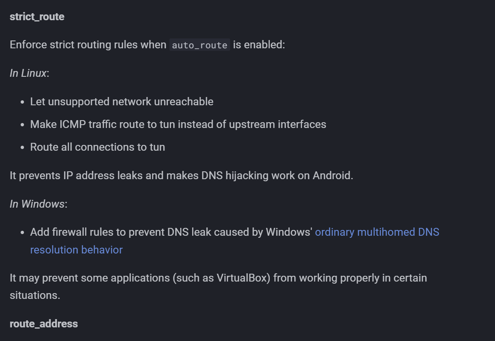
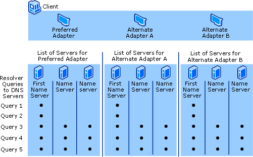

## 问题

最近使用sing-box的TUN模式进行网络代理的时候遇到了一个坑。具体表现为，当设置`"strict_route": false`时，WSL网络正常，宿主机浏览器访问google.com却返回*.facebook.com的证书，经查发现这是经典的DNS污染。然而我设置的分流策略中google.com是走远程DNS的，理论上不应该出现这个问题：

```json
"dns": {
    "servers": [
        {
        "tag": "dns-direct",
        "address": "dhcp://auto",
        "detour": "out-direct"
        },
        {
        "tag": "dns-proxy",
        "address": "tls://8.8.8.8",
        "detour": "out-proxy"
        }
    ],
    "rules": [
      {
        "outbound": "any",
        "server": "dns-direct"
      },
      {
        "rule_set": "geosite-geolocation-cn",
        "server": "dns-direct"
      }
    ],
    "final": "dns-proxy",
}
```

## 尝试

尝试改变多个配置选项均未能解决问题。但是当我设置`strict_route": true`时，宿主机的网络恢复正常，然而WSL下多个工具网络连接缓慢或失败。查阅[sing-box官网](https://sing-box.sagernet.org/configuration/inbound/tun/#auto_redirect_output_mark)，发现`strict_route`为`true`时，可以解决由Windows默认的DNS策略带来的DNS泄露问题，但是这种模式下部分应用程序无法正常工作。



这样就合理了，关闭严格路由时WSL工作正常，但是宿主机出现DNS污染，开启时WSL不正常，但是宿主机DNS正常。

## 解决

但是我想让宿主机和WSL都能访问网络，这两种方案明显都不适合我。于是我在[https://www.dnsleaktest.com](https://www.dnsleaktest.com/how-to-fix-a-dns-leak.html)上找到了一个解决方案，只需要新建`sing-box.bat`，然后输入以下代码，每次运行`sing-box.exe`时，从`sing-box.bat`启动即可：

```bat
:: 在管理员权限下执行，"WLAN"换成你本地的网络适配器名称（不是sing-box的适配器名称）
ipconfig /flushdns
netsh interface IPv4 set dnsserver "WLAN" static 0.0.0.0 both

sing-box run

netsh interface IPv4 set dnsserver "WLAN" dhcp
ipconfig /flushdns
```

## 原理



Windows采用了一种叫“多宿主解析”的机制来加速DNS请求，尽管设置了全局由sing-box的虚拟网卡接管，但是发起DNS请求的时候，Windows还是会对所有配置的DNS服务器进行查询，哪一个先返回就采用哪一个。于是便会出现有时被DNS污染的情况。解决方法也很简单，在启动sing-box之前，先禁用本地网络适配器的DNS（配置为0.0.0.0），关闭sing-box后再恢复成DHCP即可。
