## 省流版

以下是我把 项目方给的材料+我的每日总结+我的课堂笔记 喂给GPT生成的总结：

我非常荣幸能够在这个暑假参与卡内基梅隆大学（CMU）的"深度视觉与人工智能：探索视界未来"国际交流项目，这是一个独特的机会，让我深入了解了人工智能领域的前沿技术。该项目为期一个月，包括两周的线上预学习以及两周的线下课堂和文化体验。这次经历不仅让我提升了对深度学习和计算机视觉的认识，也让我有机会与来自全球的教授进行学术交流。

项目期间，课程内容涵盖了多个前沿主题，包括深度学习的基础理论、计算机视觉和3D视觉的最新研究进展。特别是Shubham Tulsiani教授的课程让我对3D视觉有了更深入的理解，学习了深度图、点云、网格等不同的表面表示方法，以及体素网格和隐函数等体积表示。课程还介绍了pinhole摄像机模型和齐次坐标等相关概念。我还学习了Retrival Augmented Generation (RAG) 模型和向量数据库的相关内容。RAG模型通过检索相关文档来增强生成式模型的回答能力，而向量数据库则在其中扮演了关键角色，能够进行嵌入的计算和比较。我们还学习了Hierarchical Navigable Small Worlds (HNSW) 算法，该算法是目前最广泛使用的检索算法之一。这些都为我之后的研究奠定了理论基础。

除了学术内容，项目还安排了丰富的文化体验活动，例如参观了安迪·沃霍尔博物馆和钢铁河国家遗产区，这让我对匹兹堡的文化有了更深入的了解。同时，我们还参观了PNC球场，观看了匹兹堡Pirates队的棒球比赛，亲身体验了美国的体育文化。

在项目的课程安排中，我选择了transformer模型这一实验课题，并与团队成员合作完成了多个项目。我们成功构建了一个图像标注和图像分类模型。通过这一过程，我深入理解了transformer模型的架构，特别是在图像处理任务中的应用。在此基础上，我学到了如何在团队合作中高效分工与协作，提升了项目管理和解决实际问题的能力。作为小组的一员，我负责了最终的presentation，展示了我们的成果，并得到了教授的高度评价。

通过这个项目，我不仅在技术上得到了长足的进步，还拓宽了视野，结识了许多志同道合的朋友和学术伙伴。这次国际交流项目让我对未来的学术和职业发展有了更加清晰的认识，也激发了我继续探索计算机视觉和人工智能的热情。未来，我将继续深耕这一领域，为人工智能的应用和发展贡献自己的力量。

## 正文

漂亮话说完了，下面是流水账，我就稍微回忆一下几个印象深刻的部分：

### Pre-learning Course

这个项目在开始之前提供了几节线上的预修课程，还有一些预修材料。我发现预修材料里面居然有CS231n，这我老熟人啊（我之前就自学过一段时间的CS231n）

线上课程用Zoom进行，英文授课，内容主要是基础CV概念，辅以一些Graphics和Robotics相关的内容。授课老师是Tianyi Zhang，他的background是机器人相关的，他后来还是我们线下课程的TA。

因为我已经有所了解，所以也没怎么认真听。

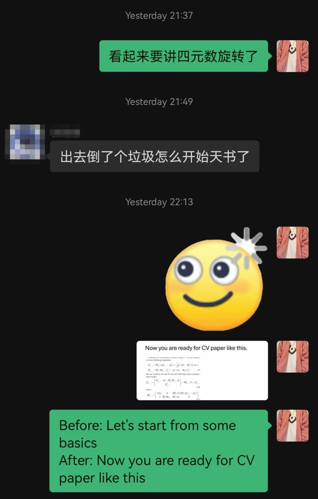

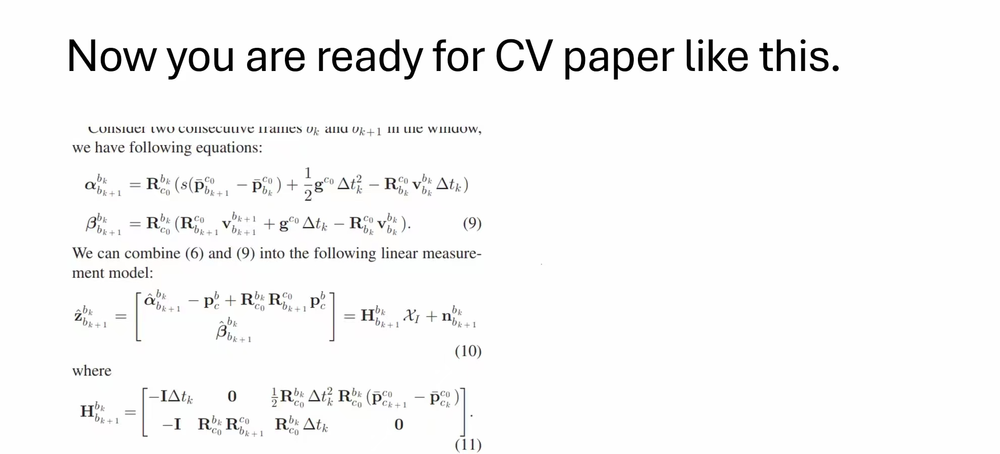

### 飞机延误

提着大包小包行李，满怀憧憬地踏入浦东国际机场，等待我们第一班航班LH733的我，完全没有意识到接下来的24h将充满飞机延误的折磨。  

原定晚上23:50起飞的LH733，每当快到登机时间，汉莎航空都会发来邮件通知航班延误。一直拖到凌晨2:10才登机，我终于觉得熬出头了，结果……又被整了个大活。  

上了飞机后，迟迟未起飞，直到凌晨3:40，广播突然开始用德语叽里呱啦讲了一通，然后用英语重复一遍，大概是说根据德国法律，机组人员已经超过了最长劳动时间，飞机不能起飞。

当时只觉得“飞不了就算了吧，放我们下去休息改签吧”，结果被告知海关还未上班，现在不能返流，只能继续等到早上9:00……（已老实.jpg  

波折不断：我们改签至第二天的航班，第二天的航班虽准时起飞并降落在波士顿，但国内段由波士顿开往匹兹堡的航班（CMU就在匹兹堡，匹兹堡是我们的目的地）已经没有了，我们只能滞留在波士顿，并且自行安排当晚的住宿。

### 滞留波士顿

也算是因祸得福吧，滞留在波士顿的一天让我认识了这个美丽的城市。作为一个港口城市，波士顿有很多海鸥（还看到了“去码头整点披萨”的海鸥），这里的海鲜也很不错，我们还沿着波士顿的海岸线散步，缓解了长时间坐飞机的疲劳。

波士顿承载了我太多的第一次：第一次用英文点菜，第一次在国外和陌生人搭话，第一次坐美国的地铁...

在街上乱逛还遇到了一个很漂亮的教堂，一开始我还不敢进去，觉得这里是宗教场所。后来看到门口有一个小姐姐，问了一下我们是否能进入，得知她也是来旅游的，她说我们可以进入，但是要保持安静。进去之后发现里面更是漂亮，没想到随便乱逛能看到这么美的建筑。

后来我们还去了哈佛和MIT，也是不虚此行吧，我们这些滞留波士顿的倒霉蛋，至少还能多体验一个城市、两座大学。

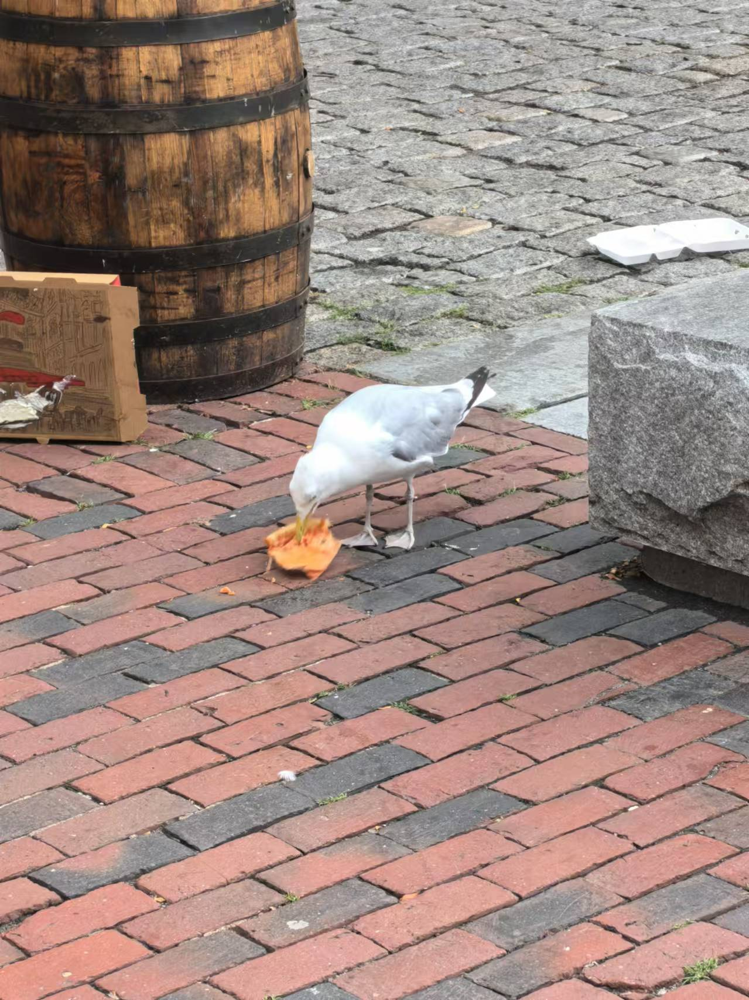

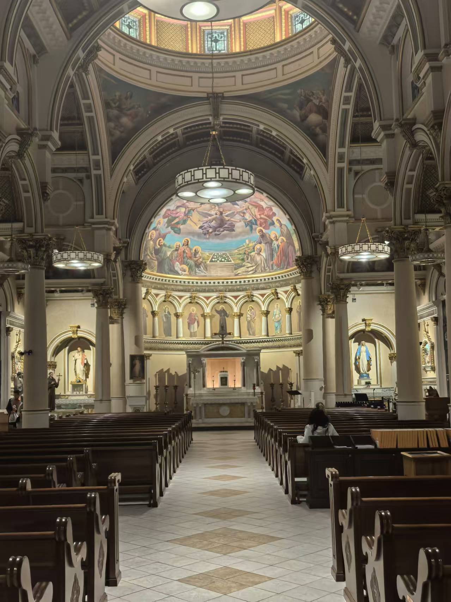

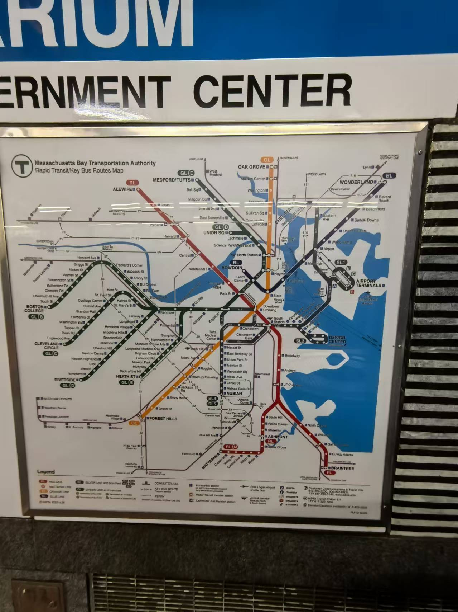

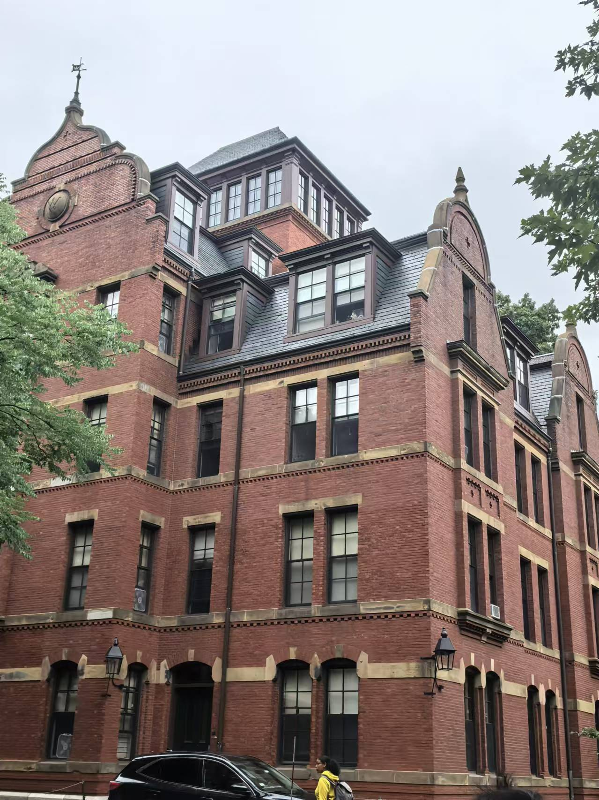

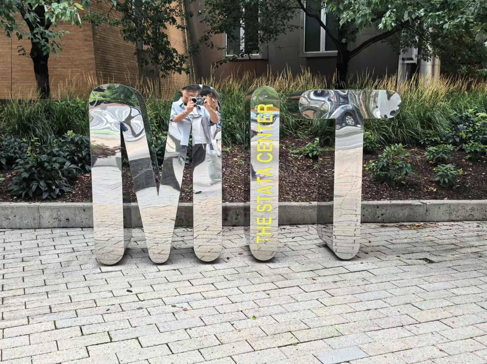

买地铁票时，我的Mastercard始终无法被购票的机器识别。求助附近一位穿工作制服的黑人小妹，她直接用自己的卡帮我刷开闸机，笑着示意我进去，于是我就一脸懵地坐了一趟没付钱的地铁。虽然只是一次小帮助，却真的让我很感动。

### 抵达匹兹堡

当我们到达匹兹堡的时候，我们实际上已经错过了前两天的课程了。但提前到的同学说前两天内容没啥特别的，这让我稍微安心了一些。  

虽然是CMU的项目，老师也的确是来自CMU的教授/副教授，但是上课地点却不在CMU内，而是在Cathedral of Learning这个地方，这是一个哥特复兴式建筑，外观富有中世纪气息，是西半球最高的教学建筑，在这里面学习的确是很特别的体验。

这个Cathedral of Learning真的很高！有多高呢，有个同学说他本来想谎称自己迷路了找不到教学楼，以此为借口来逃一节课，但是仔细一想，这个理由不成立！因为这个Cathedral of Learning实在是太高太显眼了，不可能找不到。

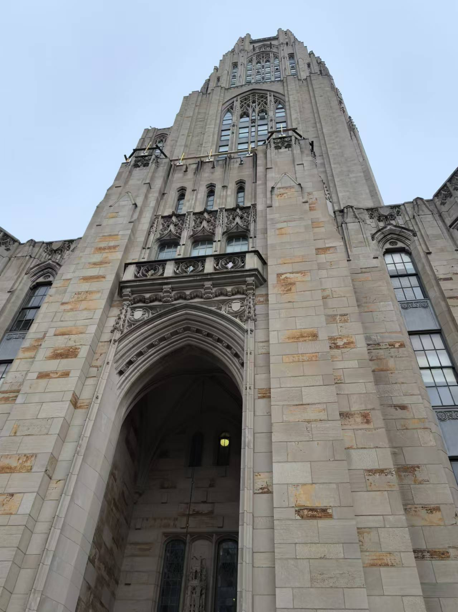

原谅我shi一样的拍照技术（摊手

### 消费

老美这里真是什么都贵啊，在波士顿住了一晚上大床房，两人要350美刀，吃一顿five guys十几美刀。吃一顿好一点的牛排什么的，动辄五六十刀，一换算我的心都在滴血啊。

来美国之前，爸妈和我说有什么美国便宜中国贵的东西可以带一点回去。我在超市逛了半天也没发现什么便宜的，除了哈根达斯，14oz装的只要4美元，的确比国内便宜，问题是这玩意也带不回去啊-_-。

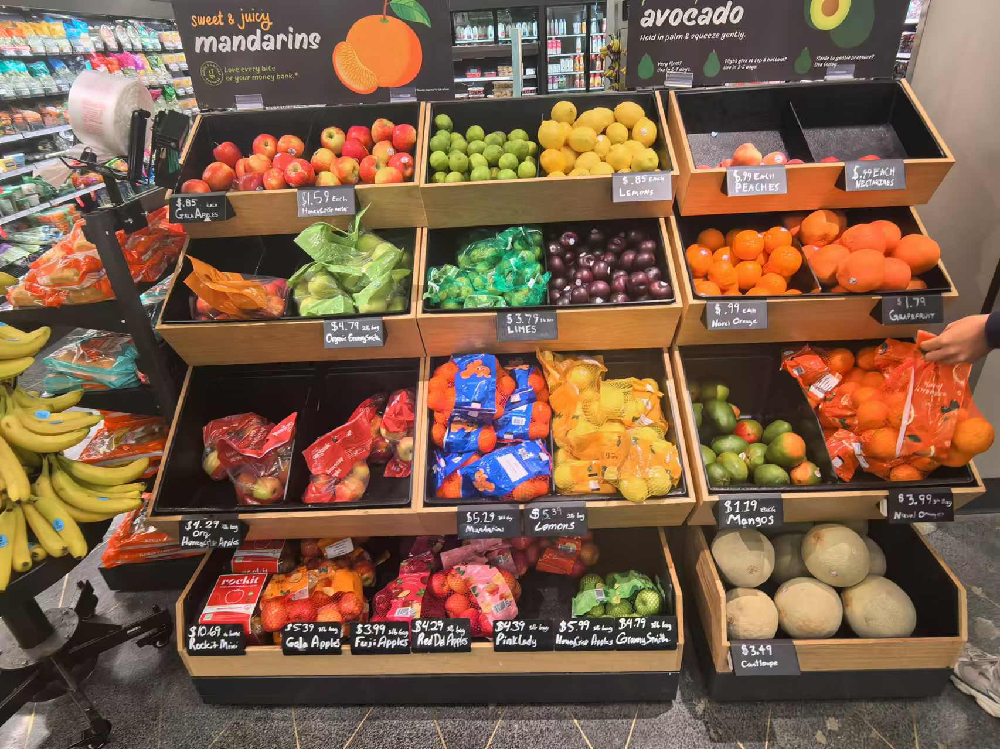

### 老美的体育氛围

不得不说，美国的体育氛围非常好。我们去了PNC Park看了一场匹兹堡海盗队对阵圣迭戈的棒球赛，现场氛围非常热烈，人浪翻涌，球迷们穿着海盗队的衣服，挥舞着海盗队的旗帜，喊着Let's go bucs（支持海盗队的口号）。虽然不怎么懂棒球的规则，但是体验了一下现场的气氛，也挺开心的（笑

平时感觉大街上空荡荡的，都看不到几个行人，结果来到体育场里面，竟然座无虚席，体育馆里面的那些卖啤酒、卖热狗的小店都排起了长队。

这种氛围不止体现在体育馆里。我们有一次去一家披萨店吃晚饭，前台的小哥穿着海盗队的球衣，店里还挂着各种号码的球服，有的上面还有知名球星的签名。另一家是匹兹堡的North Shore Tavern，店里也有很多海盗队的元素，顶上挂的电视估计是用来转播棒球赛的，以此来吸引顾客。Btw，这家店的steak on stone是真好吃，推荐来试一试。（在美国吃了很多不同餐厅，他们说我是探店达人，乐）

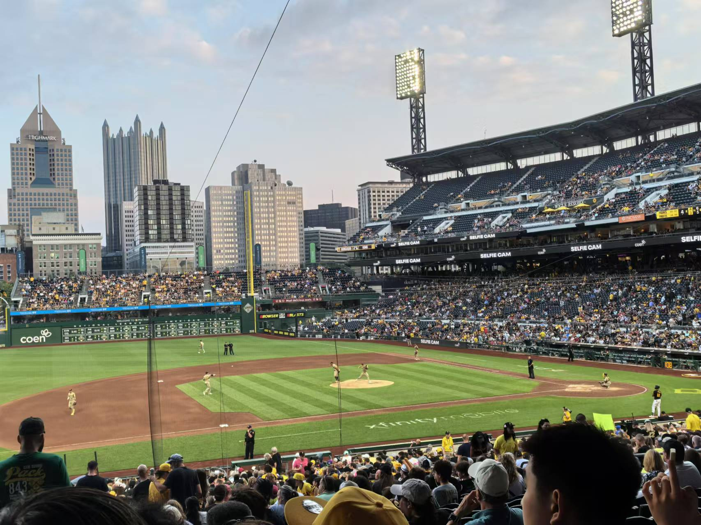

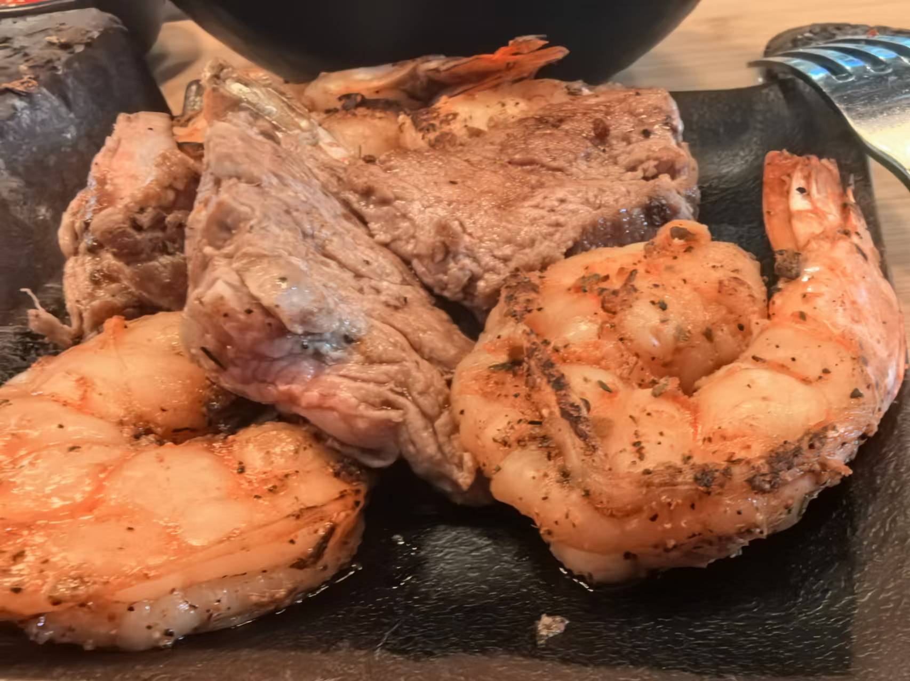

### 授课内容

其实原本宣传材料上说的是这个夏令营主要是关于Computer Vision的，但是过来之后才发现，讲什么的老师都有，有LLM（LangChain）啦、Graphics啦、HCI啦、ML/DL啦...

我最喜欢的还是Shubham Tulsiani教授，虽然讲着一口咖喱味英语，但是上课思路很清晰，为人也很nice。

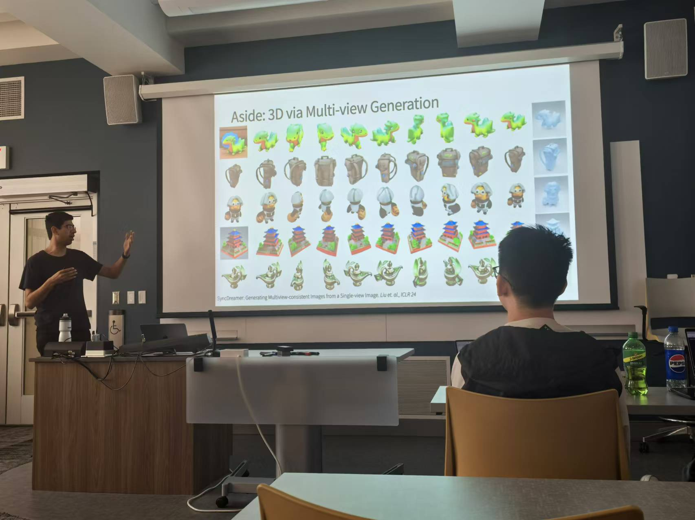

TA就是之前online courses的[Tianyi Zhang](https://tyz1030.github.io/)，人也很nice，陆本、Michigan硕、CMU PhD，目前在做潜艇机器人。

在日程表上面安排的TA Session里，他也和我们交流了一些留学的经历和经验，对我来说收获还是挺大的。

### Project & Pre

项目安排了三个Final Project给我们选择：

1. AR
2. 3D Reconstruction
3. Transformer

因为我有CS231n的学习经验，所以我倾向于选择Transformer，Transformer这个项目里面分成两个task，一个是Captioning，另一个是利用ViT做Classification。

项目的代码框架其实都搭好了，能够自由发挥的空间不大，我基本上是独立完成了代码部分，有几位组员也差不多，最后把我们的代码放在一起看了一下。

项目一个难点是在后面的Pre部分，因为其实在这样受限的代码框架内能讲出来的创新点真不多。（其实现在看来他给的代码框架应该是可以随便修改的，当时把这个限制看太严格了，应当多多自由发挥的）

做项目的过程中还出现了一个乌龙，我经过一些探索，对ViT模型的数据做了一点Data Argumentation，把准确率提高了5%，同时显著减少了过拟合现象。

然后组里的那个大三的同学，就让负责做PPT的同学把“LRQ的部分加上”（LRQ是我的姓名缩写），结果那个同学看错成“LQR”，理解成“LQR”算法，然后称我们在项目中使用了这个算法。我疯狂暗示做PPT的同学，没想到她到最后还是没有发现有什么不对，最后还是那个大三的同学把这部分改过来了，感谢。

没有责怪那个做PPT的同学的意思，只是觉得这个乌龙特别搞笑hhh

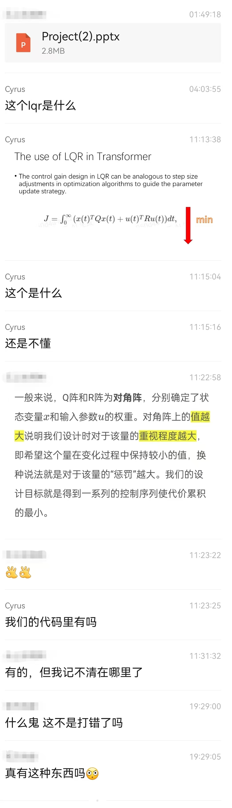

经过分工的讨论，由我来负责做pre。最后做Pre的时候效果还蛮不错的，我觉得背稿子效果不好，所以我只是大概写了一个提要，然后自由发挥，由于英语水平的缘故还是有一点不太流利，但是最后效果还不错，Shubham评价我的Data Argumentation策略好，对Transformer的介绍以及对Learning Rate对模型效果影响的分析也好，但是用时有点超过限制了。

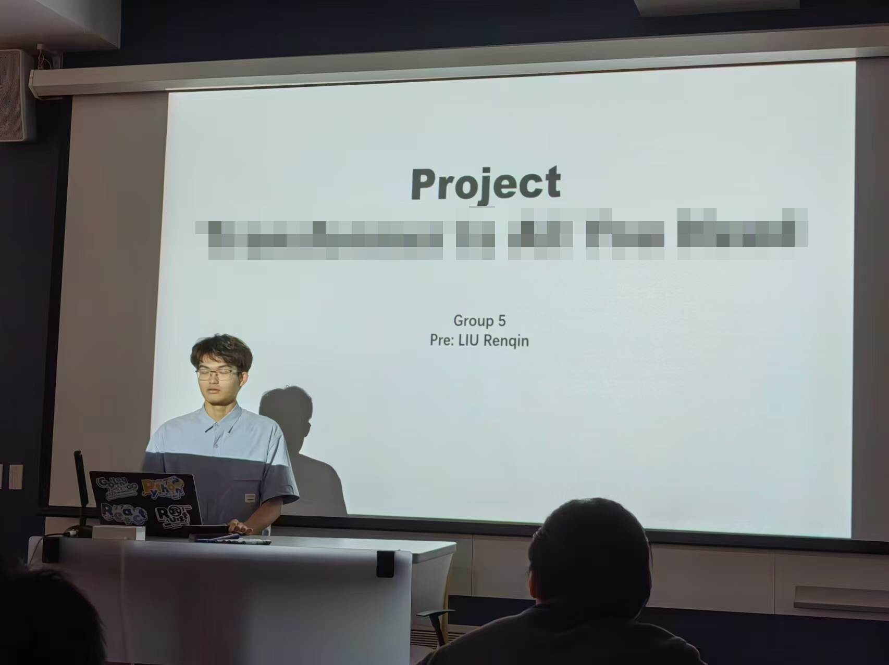

标题打码是因为取的太唐了，这张照片我还闭眼了

### 文化活动

所谓文化活动，就是各种地方玩玩玩。

漫步于Rivers of Steel，追寻昔日钢铁之城的壮丽与辉煌，仿佛听见那锻锤叮当、炉火熊熊的繁忙回响；驻足于安迪·沃霍尔博物馆，徜徉在浓烈的波普艺术氛围中，细细品味那斑斓色彩与先锋思潮碰撞出的灵感火花；夜幕降临，乘坐观光缆车缓缓攀升，于高空之上俯瞰匹兹堡的万家灯火，星光与城光交相辉映，勾勒出一幅令人沉醉的夜色画卷。

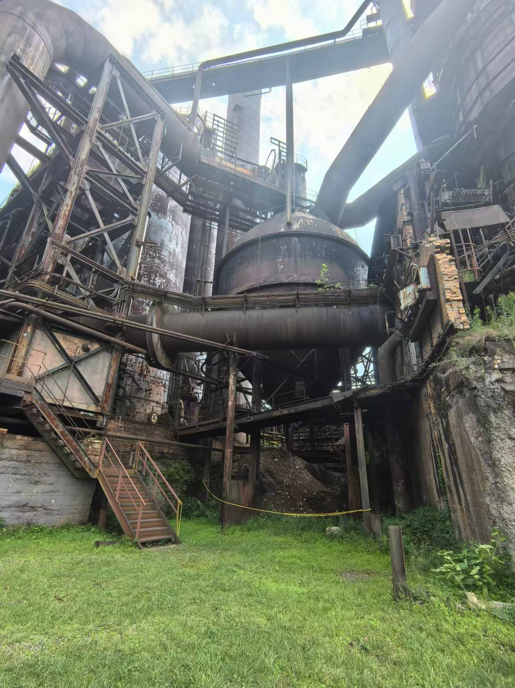

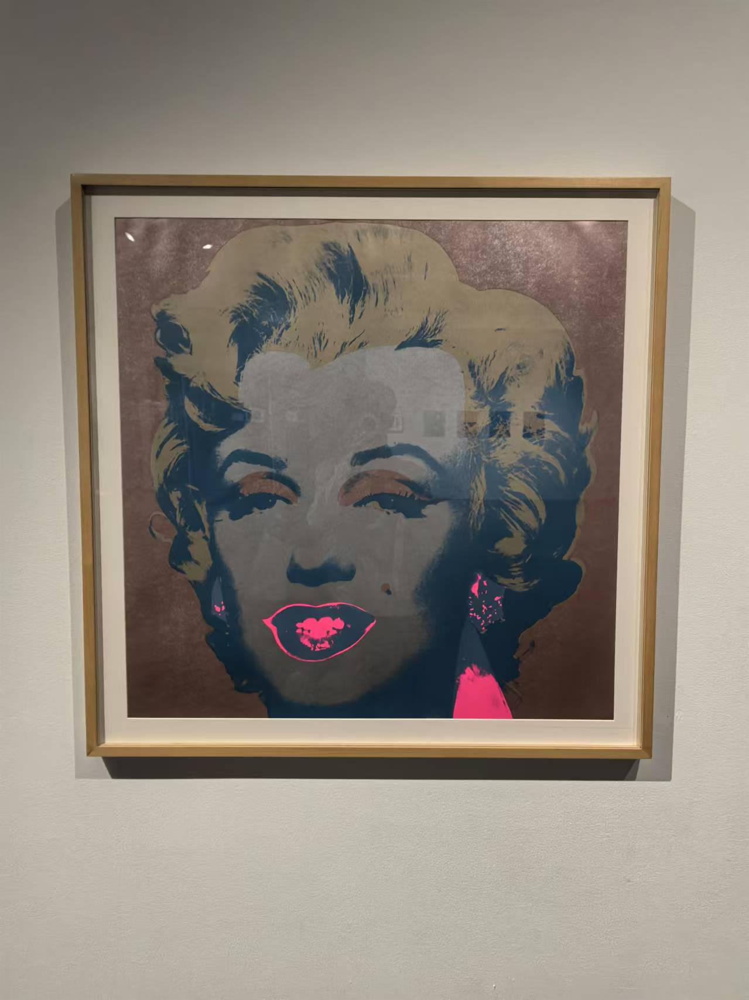

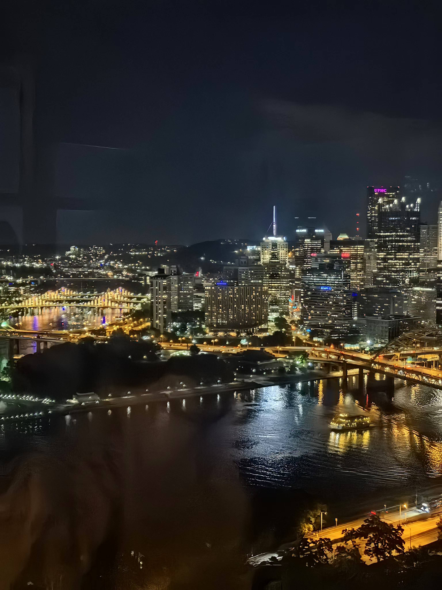

### 尾声

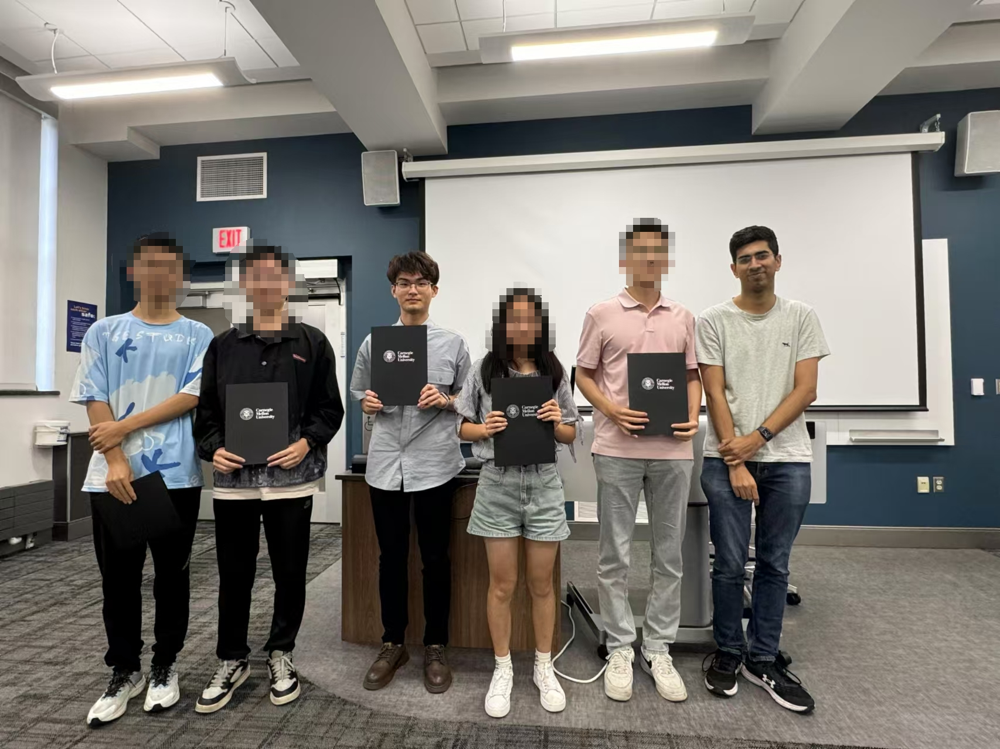

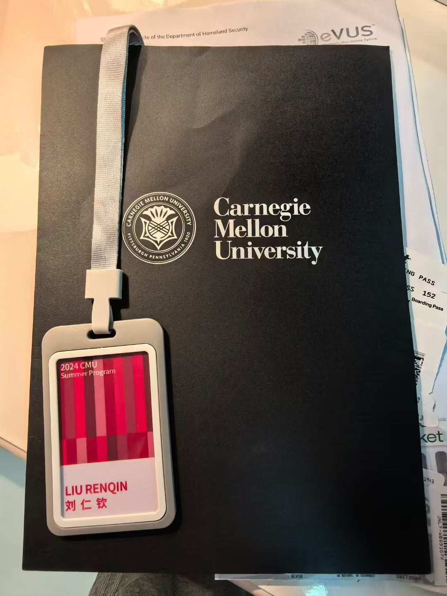

虽然经历一些挫折，但也算是圆满的结束了，我觉得这次项目总体上来说，给我带来的眼界、胆识、人脉上的提升，要更胜于课内那一点传授的知识。

另外就是，和汉莎对线半天，赔偿款还是没有拿到，那边说由于起飞点和目的地都不在欧盟国家，因此不适用欧盟相关赔偿法律，不能赔钱。

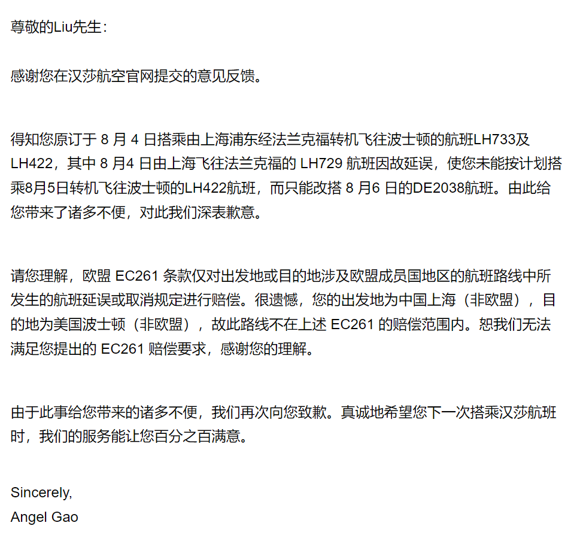

汉莎你等着，我不会放弃的(－＂－)。
