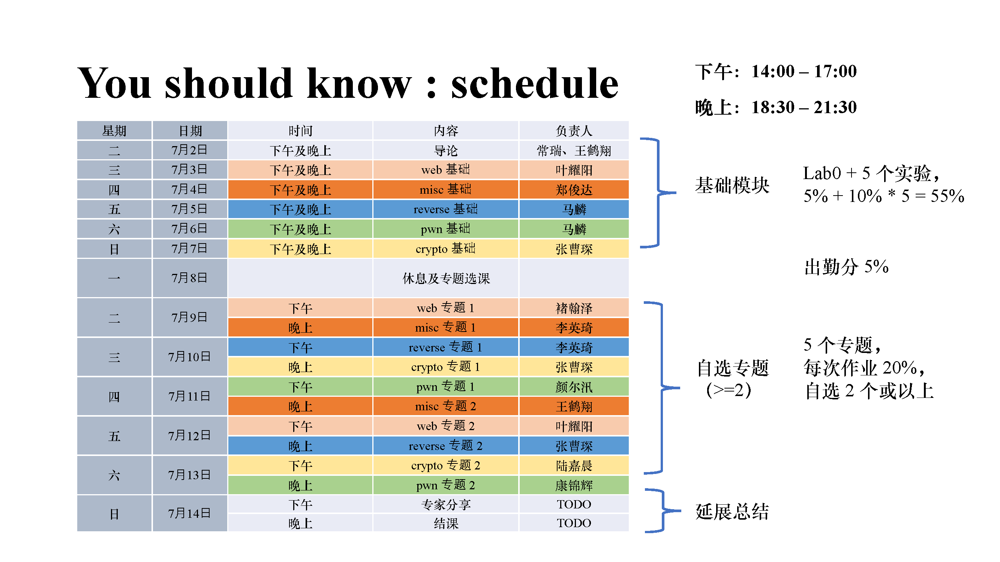
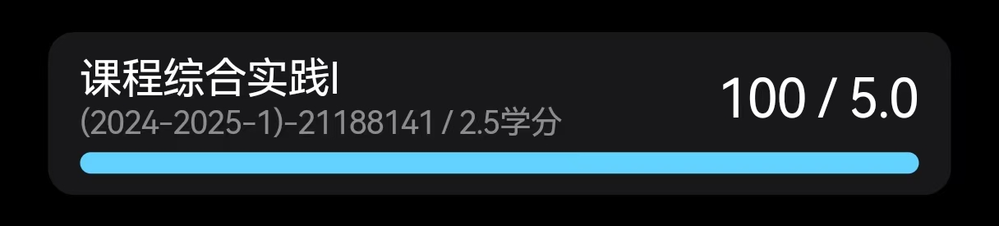

课程主页：[https://courses.zjusec.com/](https://courses.zjusec.com/)

## 课程简介

### 报名

这是一门短学期课程，报名需要提交一份Lab0实验报告或个人简历。提交Lab0的话只需要完成Prerequisite部分以及Misc, Reverse, Pwn, Web, Crypto部分五选一。但无论选择什么，上课之后最终都要把Lab0的五个方向做完，因为Lab0是课程的第一次作业，占5%。

### 授课教师

授课教师基本都是来自AAA的学长们，都非常牛而且人很好。

### 分数占比

考勤：5%
Lab0：5%
Lab1: 10% \* 5 = 50%
Lab2、Lab3: 10% \* 2 \* 2 = 40%

基本上每一个Lab都有Bonus，只能溢出到同一个周的Lab里。

学长们给分都很捞，再加上有Bonus，拿满还是不难的：

### 课程

课程时长共两周，第一周是导论部分，五个方向都需要上并完成相应的Lab1，第二周是专题部分，可以选择两个专题上课并完成这两个方向的Lab2、Lab3。

## 基本内容

课程分为Misc, Reverse, Pwn, Web, Crypto五个方向。

这是一门实操大于理论的课程，做的笔记参考价值不大，并且实验报告不方便公开（如果有人需要可以私聊），所以我想主要分享一些实用工具。

推荐阅读：[https://ctf-wiki.org/](https://ctf-wiki.org/)

### Web

主要内容是DNS、HTTP、SQL注入、PHP反序列化等。有前/后端开发经验的同学可能对DNS或HTTP这部分比较熟悉。

建议安装PHPSTUDY小皮面板、HackBar插件。

### Misc

Misc主要包括编解码、OSINT、区块链、流量分析、内存取证。

推荐安装stegsolve, 101editor, Wireshark。

推荐工具：[cyberchef](https://gchq.github.io/CyberChef/)

### Reverse

就是逆向，各种逆向，从一开始的Linux x86到安卓甚至wasm。学习过汇编语言的同学上手会比较快。

推荐安装IDA Pro或Ghidra。逆向的好几题都是实现了一个复杂的编码算法，如TEA、RC4这种，然后让你从程序恢复出flag。可以试试IDA的findcrypt插件。

### Pwn

主要是缓冲区溢出、shellcode、格式化字符串漏洞。同样是学习过汇编语言的同学上手会比较快。

python的pwntools基本上是必须用的，还有pwndbg。

### Crypto

古典密码、AES、RSA、格密码、ECC。适合数学好的同学。

需要用到sagemath。

## 总结

总的来说，这门课不仅给分捞，上课有意思，还能学到很多有用的东西，真心推荐了。
