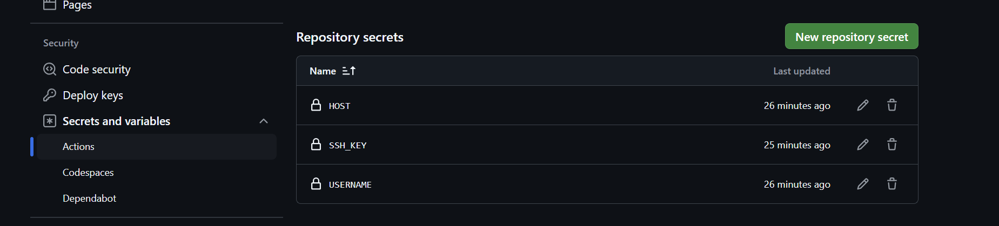

## 前言

最近再用Astro重构我的博客，正好之前写微信小程序后端的时候，学习了GitHub Actions，所以这次把博客的部署工作流迁移到了GitHub Actions上。

::github{repo="cyrus28214/cyrus28214.github.io"}

## 创建GitHub Actions

在项目根目录创建`.github/workflows/astro.yml`文件，并添加以下内容：

```yaml
# Sample workflow for building and deploying an Astro site to GitHub Pages
#
# To get started with Astro see: https://docs.astro.build/en/getting-started/
#
name: Deploy Astro site to Pages

on:
  # Runs on pushes targeting the default branch
  push:
    branches: ["main"]

  # Allows you to run this workflow manually from the Actions tab
  workflow_dispatch:

# Sets permissions of the GITHUB_TOKEN to allow deployment to GitHub Pages
permissions:
  contents: read
  pages: write
  id-token: write

# Allow only one concurrent deployment, skipping runs queued between the run in-progress and latest queued.
# However, do NOT cancel in-progress runs as we want to allow these production deployments to complete.
concurrency:
  group: "pages"
  cancel-in-progress: false

env:
  BUILD_PATH: "." # default value when not using subfolders
  # BUILD_PATH: subfolder

jobs:
  build:
    name: Build
    runs-on: ubuntu-latest
    steps:
      - name: Checkout
        uses: actions/checkout@v4
      - uses: pnpm/action-setup@v4
      - name: Setup Node
        uses: actions/setup-node@v4
        with:
          node-version: "20"
          cache: pnpm
      - name: Setup Pages
        id: pages
        uses: actions/configure-pages@v5
      - name: Install dependencies
        run: pnpm i --frozen-lockfile
      - name: Build
        run: pnpm build
      - name: Upload artifact
        uses: actions/upload-pages-artifact@v3
        with:
          path: dist
      - name: Deploy to VPS
        uses: imajeetyadav/rsync-deployer@2.0.0
        with:
          host: ${{ secrets.HOST }}
          username: ${{ secrets.USERNAME }}
          key: ${{ secrets.SSH_KEY }}
          source_path: dist/
          target_path: /var/www/blog
          delete_option: true
          print_summary: true
          print_statistics: true
          debug: false
```

我这个是从[withastro/action](https://github.com/withastro/action)提供的模版修改的，主要修改的部分就是，不仅部署到GitHub Pages，同时还部署到我自己的VPS服务器上。

部署到VPS的步骤是这一段：

```yaml
- name: Deploy to VPS
  uses: imajeetyadav/rsync-deployer@2.0.0
  with:
    host: ${{ secrets.HOST }}
    username: ${{ secrets.USERNAME }}
    key: ${{ secrets.SSH_KEY }}
    source_path: dist/
    target_path: /var/www/blog
```

将这一段加到`build`步骤后面，然后生成一下SSH密钥对，具体来说：

```bash
ssh-keygen -t ed25519 -C "Blog deploy key" -f ~/.ssh/blog_deploy_key.pem -N ""
```

将公钥添加到VPS的`~/.ssh/authorized_keys`文件中，将私钥添加到GitHub的`SSH_KEY`秘密中。

GitHub网页端添加SSH密钥的位置在Settings -> Secrets and variables -> Actions -> New repository secret:



一共需要添加`HOST`、`USERNAME`、`SSH_KEY`三个秘密，分别填写你的VPS的IP地址、用户名和SSH密钥。

之后每次push代码，都会自动部署到GitHub Pages和VPS上。

## 参考

- [https://github.com/withastro/action](https://github.com/withastro/action)
- [https://docs.github.com/en/actions](https://docs.github.com/en/actions)

