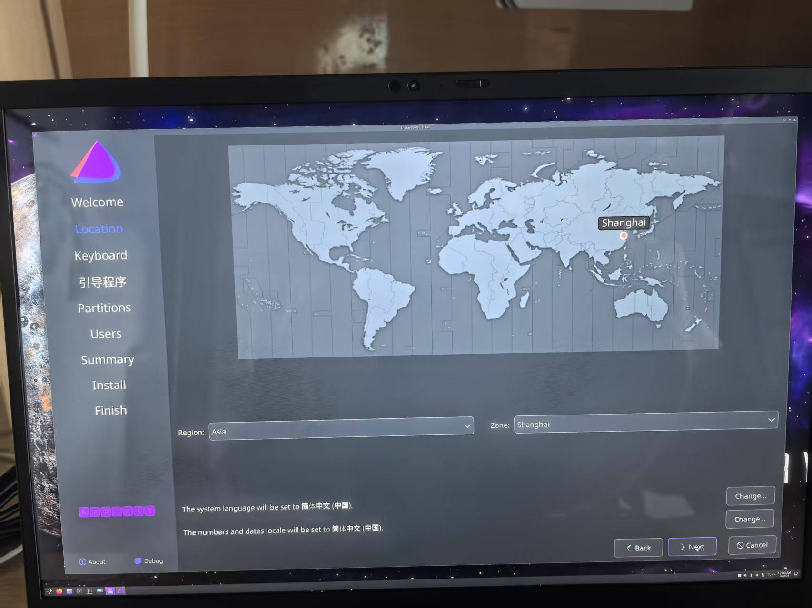

## 背景

一个月前，我在咸鱼购入了一台二手的ThinkPad X1 Carbon，并安装了Linux系统。在这一个月内，我几乎所有的工作都在这台电脑上完成，我的使用感受只有一个：**爽**。

首先说说为什么我要使用Linux，你可以猜一猜下面哪一个描述符合我：

1. 我喜欢折腾，我安装Linux是为了做ricing；
2. 我是FOSS的狂热支持者，我安装Linux是因为支持开源软件且注重隐私；
3. 我是一个实用主义者，安装Linux是为了方便。

答案是**3**。对于1，实际上我更喜欢使用默认配置，我只会做必要的最小化配置。对于2，实际上我并不介意使用专有软件（例：我使用Chrome），但是当专有软件和自由软件差不多好用的时候，我会选择自由软件。

在Linux在做开发的体验实在是比Windows上好很多（除非要为Windows开发软件）。WSL2和虚拟机这两个方案都有各自的问题：WSL的跨文件系统读写性能非常拉胯，而且桌面支持不好；Linux虚拟机在Windows上运行的时候，大多数时候符合我的需求，但是总归还是有性能损失。终于，我准备在物理机上安装Linux了。

## 安装

我安装的是EndeavourOS，这是一个基于Arch Linux的发行版，这个发行版的使用体验基本上和Arch Linux完全一致，区别是在安装上少了一些折腾，以及他们有一个非常活跃非常新手友好的Discord社区。EndeavourOS的安装基本上是开箱即用的，只需要在图形安装程序上做一些配置，然后不停下一步就行了。




我使用的是KDE Plasma桌面环境，EndeavourOS对KDE Plasma做了一定的美化，我并没有做额外的美化，但是还是非常符合我的审美。


KDE Plasma的使用体验非常接近Windows，基本上零学习成本。听说使用WM代替DE能提高工作效率，有机会也想尝试一下。

## 为什么是Arch Linux

都说Arch是发行版中的原神，还有一些关于Arch用户的刻板印象：


但不吹不黑，Arch的确非常符合我的需要。

### 保持最新

首先，Arch Linux可以保证软件保持较新的版本，相对于Ubuntu这种定点发行版，Arch Linux可以滚动更新，因为要作为个人主力机，所以我希望软件可以保持较新的版本。另外，定点发行版在版本更新（如Ubuntu18.04->20.04）的时候很容易出现问题，要么选择放弃更新，要么选择备份数据冒着风险更新。而Arch Linux只要勤快`pacman -Syu`，基本上不会出现问题。网上所谓“滚挂”，至少我目前还没有遇到过。

### 简洁

其次，Arch Linux的理念非常符合我作为一个实用主义者的理念，Arch Wiki上提到：


> Arch Linux 将简洁定义为：避免任何不必要的添加、修改和复杂化的增加。

这让Arch Linux成为一个非常靠近上游的版本，当出现任何安全更新，Arch可以第一时间获取补丁。同时当软件出现问题需要排查的时候，你也不用害怕被发行版的魔改背刺。

### 非意识形态


> Arch Linux 注重实用性，且尽力避免意识形态之争。
> ...
> 仓库中既提供了开源、自由的软件，也提供了闭源软件。

这一点在Arch对`systemd`的态度上体现的淋漓尽致，许多Linux用户排斥`systemd`接管了太多东西，不符合Unix哲学“do one thing and do it well”。但是Arch Linux还是选择了`systemd`，因为`systemd`的确非常实用，很多软件也都是以`systemd`作为默认的启动方式。作为一个实用主义者，我认可Arch的这个理念。

### 非商业化

点名批评某发行版推行的`snap`是什么玩意。

## 使用体验

### 配环境

首先说说让我最感觉爽的一点，就是配开发环境非常方便。

例如在数据库这门课上，用Windows的朋友花了一节课时间安装MySQL（虽然这里面可能有一些他自身的原因），而我只需要在终端输入：

```bash
sudo pacman -S mariadb
```

就好了，出现什么问题的话看一看Arch Wiki，基本上都能解决。

回想起在Windows下配环境的经历，那真是十分折磨，打开浏览器，搜索官网，下载安装包，双击安装包，按照提示一步一步安装。有时还需要重启系统，有时还需要修改环境变量，有时候还需要管理员权限......

而且AUR的软件包实在是太全了，不管什么小众软件都找得到打包。目前我还没有遇到需要手动打包的情况。

### 国产软件

在安装Linux之前，我已经做好了和国产软件搏斗的准备，但是实际效果出乎意料的好。我安装了以下国产软件，几乎没遇到什么问题：微信`wechat-bin`，QQ`linuxqq`，钉钉`dingtalk-bin`，飞书`feishu-bin`，WPS`wps-office`。

使用体验和Windows上几乎一致，估计是因为这几年国家在推行信创吧。

### 续航

Linux系统更加自由，可以进行一些Windows上不能进行的续航调教，使用一些更激进的策略来提高电脑使用时间。这部分我也还在学习，如果有人有兴趣的话，我之后也会单独写个博客分享。

### Windows虚拟机

对于运行Windows虚拟机，Linux上有一个强大的虚拟化方案：qemu+kvm。相比于WSL2使用的Hyper-V，或者VirtualBox、VMware，qemu+kvm的性能更好，而且更加自由。进行一些CPU和显卡直通的配置之后，虚拟机的使用体验十分流畅。

不过目前我还没有遇到哪些需求一定需要在Windows上运行的，现在先配个虚拟机以防万一。


### 安卓模拟器

对于安卓模拟器，由于安卓就是基于Linux的，所以在Linux下使用安卓模拟器非常有优势。Waydroid就是一个基于LXC的安卓模拟器，还可以和桌面环境无缝集成，用过的都说好。参考帖子[Waydroid安装使用记录](https://mill413.github.io/posts/waydroid%E5%AE%89%E8%A3%85%E4%BD%BF%E7%94%A8%E8%AE%B0%E5%BD%95/)


### 科学上网

我使用sing-box作为科学上网工具，在Windows上遇到了不少问题，详见[这篇帖子](/posts/fix-dns-leak/)。

我不使用GUI界面，直接使用命令行版本的sing-box，我写了一个systemd服务，开机自启sing-box，使用体验上就是无感fq的感觉。

## 总结

我其实后悔没有早点切换到Linux作为主力机了......

:::warning

叠甲环节：并不建议所有人都使用Linux作为主力机，虽然我的使用体验十分舒适，但是这是建立在我基本不使用Photoshop等软件、游戏需求较少、有一定计算机知识的基础上。对于其他背景的人来说，使用Linux作为主力机可能会遇到一些问题。

:::