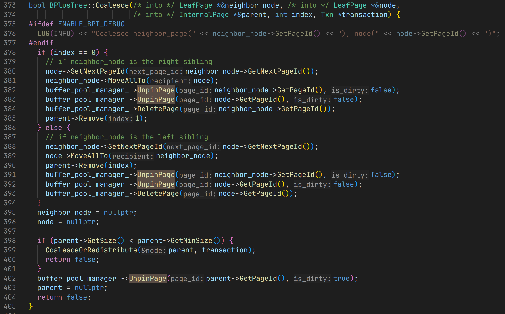

最近在实现MiniSQL（DBMS期末大程，简易SQL数据库）的时候，发现了一个可以提高开发体验同时减少BUG的代码实践——使用RAII的方式管理页面生命周期。

## 背景：缓存池管理器（Buffer Pool Manager）

在数据库管理系统（DBMS）的存储引擎开发中，Buffer Pool Manager (缓冲池管理器) 是一个核心组件。它的职责是从磁盘读取页面到内存缓冲池，并在内存中管理这些页面。应用层的代码如果需要访问页面数据，就必须通过缓冲池管理器。这个过程包含两个基本操作：

1. `FetchPage(page_id)`: 从缓冲池获取一个页面。为了防止这个页面被其他线程意外换出，缓冲池会将其"固定"（pin）住，并增加其 pin count。

2. `UnpinPage(page_id, is_dirty)`: 当代码访问完页面后，必须"解固"（unpin）它，将pin count减一，当pin count为0时，页面可以被换出。如果页面内容被修改过，还需要将其标记为"脏页"（dirty），以便在换出时写回磁盘。

## 手动管理的方法

想象一下在一个迭代器或者一个复杂的查询执行函数中，你可能需要在多个页面之间跳转。这意味着代码中会充斥着大量的 `FetchPage` 和 `UnpinPage` 调用。这种模式极易出错，关键在于程序员需要确保**每一个可能的程序分支**都要配对地调用 `FetchPage` 和 `UnpinPage`。

既不能`FetchPage`后不`UnpinPage`，也不能`FetchPage`之后多次`UnpinPage`（会导致pin count提前归零，甚至为负数）。

- **忘记释放**: 最常见的问题是，在获取页面后，由于复杂的逻辑分支或提前返回，忘记调用 UnpinPage。这会导致页面的 pin count 永远不会归零，该页面也因此永远无法被换出缓冲池，造成事实上的内存泄漏。
- **重复释放**：在错误处理或者复杂的控制流中，可能会意外地对同一个页面调用两次 `UnpinPage`，这会扰乱缓冲池的元数据管理，导致不可预知的行为。
- **异常不安全**：如果在 `FetchPage` 和 `UnpinPage` 之间的代码块中抛出异常，`UnpinPage` 调用将被跳过，同样导致资源泄漏。
- **代码难以维护**：每个获取页面的地方都必须配对一个释放操作，这使得代码冗长，并且极大地增加了代码审查和后期维护的难度。后续修改代码分支逻辑的时候，必须确保每一个可能的执行路径都能正确使用 `UnpinPage`。



以上是DBMS中的B+树模块中手动管理页面生命周期的代码片段，可以体会一下手动管理页面生命周期的痛苦。

## RAII（Resource Acquisition Is Initialization）

幸运的是，现代C++为我们提供了一个强大而优雅的武器来解决这类问题：**RAII (Resource Acquisition Is Initialization)**。

RAII 是一种C++编程范式，它将资源的生命周期与对象的生命周期绑定在一起。具体来说，当一个对象被创建时，它在构造函数中获取资源；当该对象被销毁时（例如离开作用域），它在析构函数中释放资源。

### 最简易的实现

我们可以创建一个名为 `PageGuard` 的类来封装对 `Page` 的获取和释放操作。`PageGuard` 的实例将拥有一个从缓冲池中获取的页面。当 `PageGuard` 对象被创建时，它负责调用 `FetchPage`；当它离开作用域时，其析构函数将自动调用 `UnpinPage`。

```cpp
class PageGuard {
    // 在构造函数中获取资源
    PageGuard(
        BufferPoolManager *buffer_pool_manager,
        page_id_t page_id
    ) : 
        buffer_pool_manager_(buffer_pool_manager),
        page_id_(page_id) 
    {
        page_ = buffer_pool_manager_->FetchPage(page_id);
        // 省略对page_==nullptr的错误处理
    }

    // 在析构函数中释放资源
    ~PageGuard() {
        buffer_pool_manager_->UnpinPage(page_id_, is_dirty_);
    }

    // 脏页标记
    void SetDirty(bool is_dirty) { is_dirty_ = is_dirty; }
    bool IsDirty() { return is_dirty_; }
    
    // 访问器
    Page* GetPage() { return page_; } // 也可以在这个可变访问器中自动设置脏页标记
    const Page* GetPage() const { return page_; }

    private:
        BufferPoolManager *buffer_pool_manager_;
        page_id_t page_id_;
        Page *page_;
        bool is_dirty_{false};
}
```

这是一个最简单的实现，这个实现有很多问题，我们后面会解决。

使用这个`PageGuard`类的方式如下：

```cpp
void SomeFunction(BufferPoolManager *bpm, page_id_t pid) {
    PageGuard page_guard(bpm, pid);
    Page *page = page_guard.GetPage();

    // 使用这个page...，假如修改了就调用page_guard.SetDirty(true)

    // 离开作用域时，page_guard会自动析构，不需要做任何操作
}
```

### 问题一：允许拷贝构造和拷贝赋值

在C++中，如果一个类管理着某种资源（如内存、文件句柄、或者我们这里的"固定的页面"），我们就必须小心处理它的拷贝和移动语义。

我们上面那个版本的`PageGuard`类，编译器会为我们生成默认的**拷贝构造函数**和**拷贝赋值运算符**。这会发生什么？

```cpp
void SomeFunction(BufferPoolManager *bpm, page_id_t pid) {
    PageGuard guard1(bpm, pid);
    PageGuard guard2 = guard1; // 拷贝构造

    // guard1 和 guard2 现在管理着同一个页面
    // 当函数结束时，guard2先析构，调用UnpinPage
    // 然后guard1析构，再次调用UnpinPage
    // 同一个页面被Unpin了两次，这里存在错误
}
```

### 三/五/零法则

"三/五/零法则"（The Rule of Three/Five/Zero）是关于如何正确管理类中资源（如内存、文件句柄、网络连接等）的一系列重要指导原则。

我们先来看看"三法则"：

> 三法则：
> 如果一个类需要显式地声明析构函数、拷贝构造函数或拷贝赋值运算符中的任意一个，那么它很可能需要同时声明这三个函数。


根据"三法则"，我们上面的`PageGuard`类明确定义了析构函数，我们在析构函数中释放了资源，那么我们也需要明确定义拷贝构造函数和拷贝赋值运算符，防止重复释放。

### 禁用拷贝构造和拷贝赋值

我们可以在类中显式地禁用拷贝构造和拷贝赋值。

```cpp
PageGuard(const PageGuard &) = delete;
PageGuard &operator=(const PageGuard &) = delete;
```

这样以来，编译器就不会为我们生成默认的拷贝构造函数和拷贝赋值运算符了，当我们尝试拷贝`PageGuard`对象时，编译器会报错。

```cpp
PageGuard guard1(bpm, pid);
PageGuard guard2 = guard1; // 错误：拷贝构造函数被禁用
```

### 问题二：无法转移所有权

虽然我们禁止了拷贝，避免了重复释放资源的问题，但这也带来了一个新的问题：`PageGuard` 对象现在无法被移动（move）。这意味着一个`PageGuard`的所有权无法从一个作用域转移到另一个。

想象一个函数，它的职责是创建一个新的页面并返回一个对应的`PageGuard`：

```cpp
PageGuard CreateNewPage(BufferPoolManager *bpm) {
    page_id_t new_page_id;
    Page *page = bpm->NewPage(&new_page_id);
    if (page == nullptr) {
        // 创建失败，我们希望返回一个"空"的Guard
        return {}; 
    }
    // ... 对新页面进行一些初始化操作 ...
    // 现在，我们希望返回一个管理这个新页面的Guard
    return PageGuard(bpm, new_page_id); // 错误：无法拷贝或移动
}
```

在现代C++中，当一个函数返回一个对象时，编译器会尝试使用移动构造函数来避免昂贵的拷贝操作（这被称为返回值优化，RVO）。但由于我们没有定义移动构造函数，并且拷贝构造函数已被禁用，上述代码将无法编译通过。我们创建的`PageGuard`对象被困在了它被创建的作用域内，无法转移所有权。

### 五法则

这就引出了"五法则"（The Rule of Five）：

> 五法则：
> 如果一个类需要用户定义的析构函数、拷贝构造函数或拷贝赋值运算符，那么它很可能也需要用户定义的移动构造函数和移动赋值运算符。

五法则是三法则在C++11及以后版本中的扩展。它认识到，除了拷贝语义，我们还必须考虑移动语义。移动操作允许资源（比如我们例子中的页面所有权）从一个对象"转移"到另一个对象，而不是拷贝它。这通常更高效，并且对于不能被拷贝的资源类型（如`std::unique_ptr`，或者我们的`PageGuard`）是必需的。

### 实现移动语义

为了让`PageGuard`支持移动，我们需要实现移动构造函数和移动赋值运算符。当移动发生时，我们需要将资源的所有权从源对象转移到目标对象，并确保源对象不再拥有该资源，防止它在析构时释放资源。

下面是 `PageGuard` 的一个更完整的实现：

```cpp
class PageGuard {
public:
    // 默认构造函数，创建一个空的Guard
    PageGuard() = default;

    // 构造函数，获取页面
    PageGuard(BufferPoolManager *buffer_pool_manager, page_id_t page_id)
        : buffer_pool_manager_(buffer_pool_manager), page_id_(page_id) {
        page_ = buffer_pool_manager_->FetchPage(page_id_);
    }

    // 禁用拷贝构造和拷贝赋值
    PageGuard(const PageGuard &) = delete;
    PageGuard &operator=(const PageGuard &) = delete;

    // 移动构造函数
    PageGuard(PageGuard &&that) noexcept {
        // "窃取"源对象的资源
        buffer_pool_manager_ = that.buffer_pool_manager_;
        page_ = that.page_;
        page_id_ = that.page_id_;
        is_dirty_ = that.is_dirty_;

        // 使源对象失效，防止它析构时释放资源
        that.buffer_pool_manager_ = nullptr;
        that.page_ = nullptr;
        that.page_id_ = INVALID_PAGE_ID;
    }

    // 移动赋值运算符
    PageGuard &operator=(PageGuard &&that) noexcept {
        // 1. 防止自我赋值
        if (this == &that) {
            return *this;
        }
        
        // 2. 释放当前对象可能持有的资源
        if (page_ != nullptr) {
            buffer_pool_manager_->UnpinPage(page_id_, is_dirty_);
        }

        // 3. "窃取"源对象的资源
        buffer_pool_manager_ = that.buffer_pool_manager_;
        page_ = that.page_;
        page_id_ = that.page_id_;
        is_dirty_ = that.is_dirty_;

        // 4. 使源对象失效
        that.buffer_pool_manager_ = nullptr;
        that.page_ = nullptr;
        that.page_id_ = -1;

        return *this;
    }

    // 析构函数
    ~PageGuard() {
        // 只在持有有效页面时才 unpin
        if (page_ != nullptr) {
            buffer_pool_manager_->UnpinPage(page_id_, is_dirty_);
        }
    }

    void SetDirty(bool is_dirty) { is_dirty_ = is_dirty; }
    bool IsDirty() const { return is_dirty_; }
    Page *GetPage() { return page_; }
    const Page *GetPage() const { return page_; }

private:
    BufferPoolManager *buffer_pool_manager_{nullptr};
    page_id_t page_id_{INVALID_PAGE_ID};
    Page *page_{nullptr};
    bool is_dirty_{false};
};
```

**代码解释**：

- **移动构造函数**: `PageGuard(PageGuard &&that)` 接受一个右值引用（`&&`）。它将 `that` 的成员变量"窃取"过来，然后将 `that` 的指针设置为空（或无效状态），这样当 `that` 析构时，就不会发生任何事情。
- **移动赋值运算符**: `operator=(PageGuard &&that)` 类似，但在赋值之前，它必须先正确处理自己已经持有的资源（如果有的话）。然后才执行与移动构造函数类似的资源窃取和源对象失效操作。
- **`noexcept`**: 移动操作通常被标记为 `noexcept`，因为它们不应该抛出异常。这对于STL容器的某些优化至关重要。

通过实现移动语义，我们的 `PageGuard` 现在既安全又灵活。

```cpp
PageGuard CreateNewPageGuard(BufferPoolManager *bpm) {
    page_id_t new_page_id;
    // 省略创建页面
    return PageGuard(bpm, new_page_id); // OK: 移动构造函数被调用
}

void SomeFunction(BufferPoolManager *bpm) {
    PageGuard guard1 = CreateNewPageGuard(bpm); // OK
    if (guard1.GetPage() == nullptr) {
        return; // 页面创建失败
    }

    // guard1 现在拥有页面
    PageGuard guard2 = std::move(guard1); // OK: guard2 接管了页面所有权, guard1 失效

    // guard1 离开作用域时，它的析构函数什么也不做
    // guard2 离开作用域时，它会 unpin 页面
}
```

现在，`PageGuard`的行为已经非常类似于`std::unique_ptr`了：它拥有唯一的资源所有权，不能被拷贝，但可以被移动。

### 问题三：使用的便利性

我们的 `PageGuard` 现在功能完备且安全，但从使用的便利性上来说，还有提升空间。每次需要访问 `Page` 对象时，我们都必须调用 `GetPage()`:

```cpp
PageGuard guard(bpm, page_id);
auto page_data = guard.GetPage()->GetData();
guard.GetPage()->SomeOtherMethod();
```

这有点冗长。C++ 的智能指针（如 `std::unique_ptr` 和 `std::shared_ptr`）通过重载 `operator->` 和 `operator*` 来解决这个问题，让它们用起来就像原始指针一样。我们也可以为 `PageGuard` 做同样的事情。

#### 重载 `->` 和 `*`

通过实现这两个运算符，我们可以直接通过 `PageGuard` 对象访问底层 `Page` 对象的成员。

```cpp
// 在 PageGuard 类中添加:
public:
    Page *operator->() { return page_; }
    const Page *operator->() const { return page_; }

    Page &operator*() { return *page_; }
    const Page &operator*() const { return *page_; }
```

原本的代码：

```cpp
PageGuard guard(bpm, page_id);
auto page_data = guard.GetPage()->GetData();
guard.GetPage()->WLatch(); // WLatch是Page类的一个方法
Page &page_ref = guard.GetPage();
```

添加这些重载后，代码就可以被简化成：

```cpp
// 这样就不用每次调用GetPage()了
PageGuard page(bpm, page_id);
auto page_data = page->GetData(); // 通过 operator->() 访问
page->WLatch();                   // 同样是 operator->()
Page &page_ref = *page;           // 通过 operator*() 获得引用
```

这不仅让代码更简洁，也更符合C++程序员的习惯，降低了 `PageGuard` 的学习和使用成本。

## 总结


:::tip
**扩展阅读：零法则**

“零法则”是现代C++编程中更为推崇的设计理念。它提倡：
优先编写不需要自定义析构函数、拷贝/移动构造函数和拷贝/移动赋值运算符的类。

当一个类只包含基本类型、标准库容器或遵循RAII原则的其他类的成员时，编译器自动生成的特殊成员函数通常就能正确地工作。

虽然我们这里无法使用零法则，但是零法则也是很好的实践理念，值得学习。
:::

通过一步步迭代，我们从一个容易出错的手动管理模式，演进到了一个安全、灵活且易于使用的`PageGuard`。这个过程展示了RAII的强大威力，在C++中进行系统编程，尤其是在涉及底层资源（内存、文件、锁等）管理的场景下，RAII是一种很好的实践，既能减轻使用者的心智负担，又能提高代码的健壮性。
